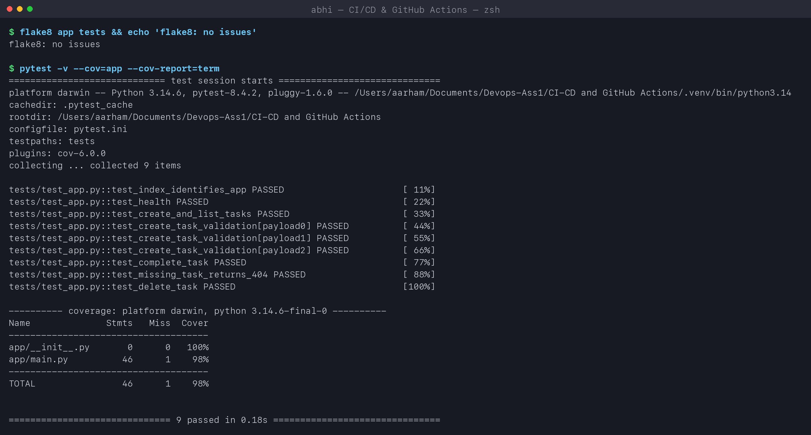
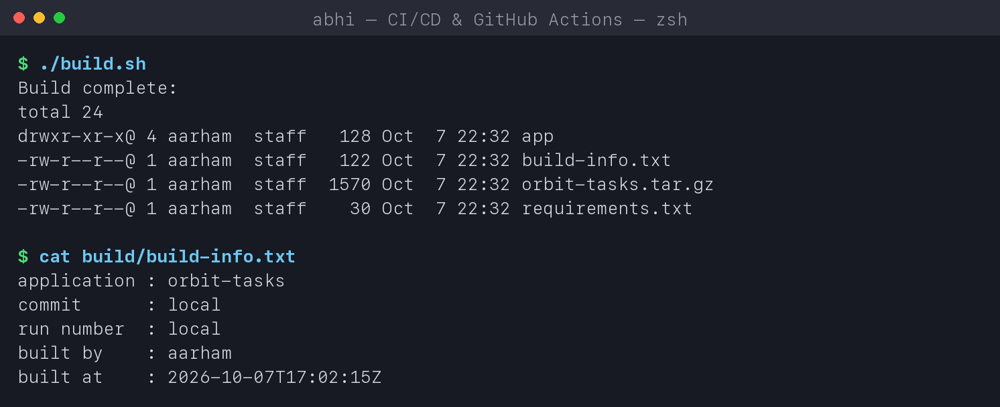
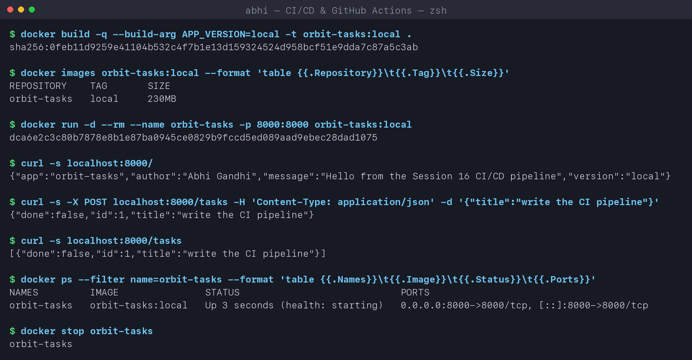
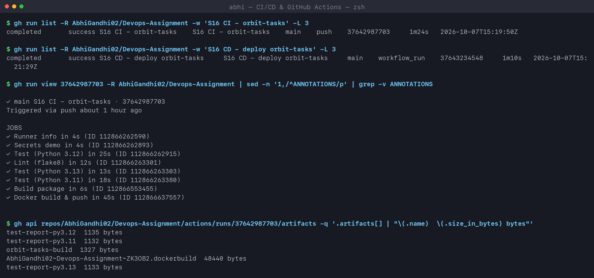
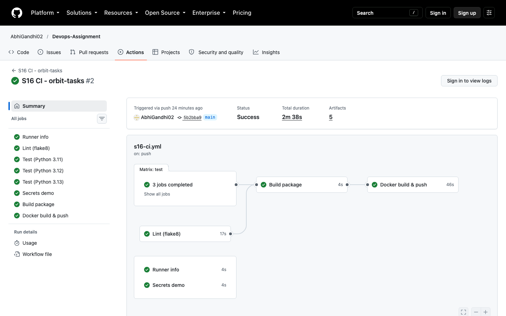
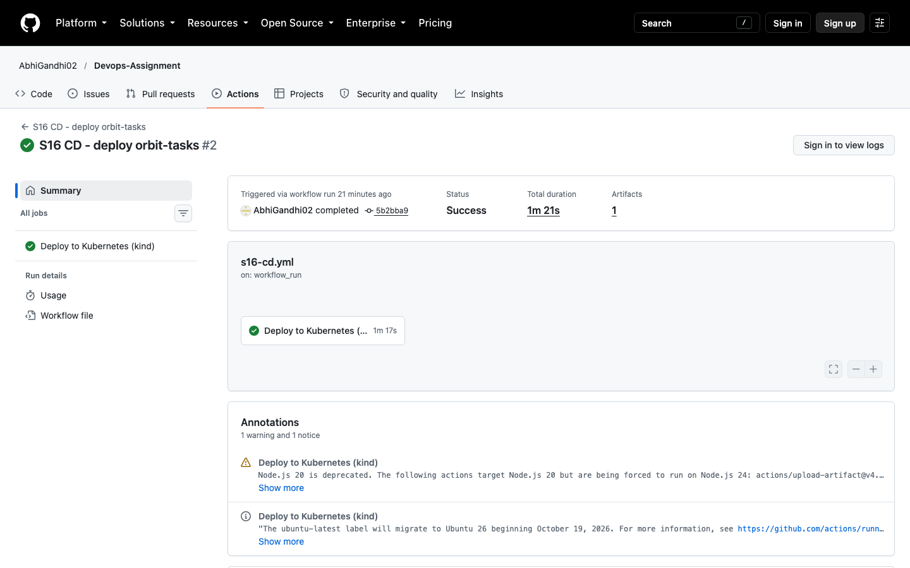

# CI/CD & GitHub Actions - Homework

**Name:** Abhi Gandhi
**Enrollment Number:** 24bcs10397

A complete CI/CD demo project: a small Python API (**orbit-tasks**) that is linted, tested on
three Python versions, built, packaged as a Docker image, pushed to GitHub Container Registry
and then automatically deployed to a Kubernetes cluster and smoke-tested - all by GitHub
Actions on every push to `main`.

| Deliverable | Where |
|---|---|
| Application source code | [app/main.py](app/main.py), tests in [tests/test_app.py](tests/test_app.py) |
| Dockerfile | [Dockerfile](Dockerfile) (multi-stage, non-root) |
| GitHub Actions - CI pipeline | [.github/workflows/s16-ci.yml](../.github/workflows/s16-ci.yml) |
| GitHub Actions - CD pipeline | [.github/workflows/s16-cd.yml](../.github/workflows/s16-cd.yml) |
| Kubernetes manifests | [k8s/](k8s) |
| Successful pipeline runs | [CI run](https://github.com/AbhiGandhi02/Devops-Assignment/actions/workflows/s16-ci.yml) / [CD run](https://github.com/AbhiGandhi02/Devops-Assignment/actions/workflows/s16-cd.yml) + screenshots below |

> GitHub only runs workflows from `.github/workflows/` at the **repository root**, so the two
> workflow files live there; `paths:` filters make them run only when this folder changes.

## 1. CI vs CD

| | Continuous Integration (CI) | Continuous Delivery / Deployment (CD) |
|---|---|---|
| Question it answers | "Is this commit good?" | "Get this good commit running." |
| Runs on | every push and pull request | only after CI succeeds on `main` |
| Steps | lint, unit tests, build, package an artifact/image | pull the artifact, deploy, smoke-test, (promote) |
| Output | a tested, versioned artifact (image tagged with the commit SHA) | the artifact running in an environment |
| Failure means | the developer fixes the code before merging | the release is stopped / rolled back |

*Delivery* = always ready to deploy, a human presses the button. *Deployment* = every green
build is deployed automatically. My CD workflow does continuous **deployment** to a test
cluster.

## 2. The CI/CD pipeline

```text
git push ──► S16 CI ──────────────────────────────────────────────────────────────┐
             ├─ Runner info            (where does the job run?)                  │
             ├─ Secrets demo           (GITHUB_TOKEN, masking)                    │
             ├─ Lint (flake8)  ─┐                                                 │
             ├─ Test py3.11    ─┤ matrix, in parallel                             │
             ├─ Test py3.12    ─┤  └─► artifacts: test-results.xml, coverage.xml  │
             ├─ Test py3.13    ─┘                                                 │
             ├─ Build package   needs: lint + test  └─► artifact: orbit-tasks.tar.gz
             └─ Docker build & push  needs: build                                 │
                  └─► ghcr.io/abhigandhi02/orbit-tasks:<commit-sha> and :latest    │
                                                                                   │
  workflow_run (CI completed with success on main) ◄───────────────────────────────┘
             ▼
           S16 CD
             └─ Deploy to Kubernetes (kind)   environment: kind-staging
                 create cluster -> pull image <sha> from GHCR -> kubectl apply
                 -> rollout status -> smoke test via the Service -> artifact: deploy-report
```

## 3. GitHub Actions concepts - where each one is used

| Concept | Meaning | In my workflows |
|---|---|---|
| **Workflow** | A YAML file in `.github/workflows/` describing an automated process | `s16-ci.yml`, `s16-cd.yml` |
| **Event / trigger** | What starts a workflow | `push` + `pull_request` (with `paths:` filter), `workflow_dispatch` (manual button), `workflow_run` (CD starts when CI finishes) |
| **Job** | A group of steps that runs on one runner; jobs run **in parallel** unless linked with `needs:` | 8 jobs in CI; `build` `needs: [lint, test]`, `docker` `needs: build` |
| **Step** | One command (`run:`) or one reusable action (`uses:`) inside a job | `actions/checkout`, `setup-python`, `pytest`, `./build.sh` |
| **Action** | A reusable step published on GitHub | `actions/checkout@v5`, `docker/build-push-action@v6`, `helm/kind-action@v1` |
| **Runner** | The machine that executes a job | GitHub-hosted `ubuntu-latest`; the `Runner info` job prints its OS, arch and CPUs |
| **Matrix** | Run the same job with different inputs | `python: ["3.11", "3.12", "3.13"]` -> 3 parallel test jobs |
| **Secrets** | Encrypted values injected at runtime, masked in logs | `secrets.GITHUB_TOKEN` logs in to GHCR; `DEMO_API_KEY` shows how a custom secret is read |
| **Permissions** | Least-privilege scopes for `GITHUB_TOKEN` | `contents: read` by default, `packages: write` only for the docker job |
| **Artifacts** | Files saved from a job, downloadable and shareable between jobs | test reports per Python version, `orbit-tasks-build`, `deploy-report` |
| **Environment** | Named deployment target (can have protection rules / its own secrets) | `kind-staging` on the CD job |
| **Cache** | Re-use downloads between runs | `setup-python` `cache: pip` in the lint job |

## 4. The application

[app/main.py](app/main.py) - a Flask task-list API:

| Endpoint | Does |
|---|---|
| `GET /` | app name, author, version (the commit SHA baked in at build time) |
| `GET /health` | liveness/readiness endpoint used by Docker and Kubernetes |
| `GET/POST /tasks`, `PATCH/DELETE /tasks/<id>` | list, create (validated), complete, delete tasks |

### Test and lint locally (the same commands CI runs)

```text
$ flake8 app tests && echo 'flake8: no issues'
flake8: no issues

$ pytest -v --cov=app --cov-report=term
collected 9 items

tests/test_app.py::test_index_identifies_app PASSED                      [ 11%]
tests/test_app.py::test_health PASSED                                    [ 22%]
tests/test_app.py::test_create_and_list_tasks PASSED                     [ 33%]
tests/test_app.py::test_create_task_validation[payload0] PASSED          [ 44%]
tests/test_app.py::test_create_task_validation[payload1] PASSED          [ 55%]
tests/test_app.py::test_create_task_validation[payload2] PASSED          [ 66%]
tests/test_app.py::test_complete_task PASSED                             [ 77%]
tests/test_app.py::test_missing_task_returns_404 PASSED                  [ 88%]
tests/test_app.py::test_delete_task PASSED                               [100%]

Name              Stmts   Miss  Cover
-------------------------------------
app/__init__.py       0      0   100%
app/main.py          46      1    98%
-------------------------------------
TOTAL                46      1    98%

============================== 9 passed in 0.20s ===============================
```



### Build

[build.sh](build.sh) packages the app with build metadata - CI uploads the result as an artifact.

```text
$ ./build.sh
Build complete:
drwxr-xr-x@ 4 aarham  staff   128 Oct  7 22:31 app
-rw-r--r--@ 1 aarham  staff   122 Oct  7 22:31 build-info.txt
-rw-r--r--@ 1 aarham  staff  1572 Oct  7 22:31 orbit-tasks.tar.gz
-rw-r--r--@ 1 aarham  staff    30 Oct  7 22:31 requirements.txt

$ cat build/build-info.txt
application : orbit-tasks
commit      : local
run number  : local
built by    : aarham
built at    : 2026-10-07T17:01:39Z
```

On GitHub the same file contains the real commit SHA, run number and actor from the runner's
`GITHUB_*` environment variables.



### Docker

```text
$ docker build -q --build-arg APP_VERSION=local -t orbit-tasks:local .
$ docker images orbit-tasks:local
REPOSITORY    TAG       SIZE
orbit-tasks   local     230MB

$ docker run -d --rm --name orbit-tasks -p 8000:8000 orbit-tasks:local
$ curl -s localhost:8000/
{"app":"orbit-tasks","author":"Abhi Gandhi","message":"Hello from the Session 16 CI/CD pipeline","version":"local"}

$ curl -s -X POST localhost:8000/tasks -H 'Content-Type: application/json' -d '{"title":"write the CI pipeline"}'
{"done":false,"id":1,"title":"write the CI pipeline"}

$ curl -s localhost:8000/tasks
[{"done":false,"id":1,"title":"write the CI pipeline"}]

$ docker ps --filter name=orbit-tasks
NAMES         IMAGE               STATUS                            PORTS
orbit-tasks   orbit-tasks:local   Up 3 seconds (health: starting)   0.0.0.0:8000->8000/tcp
```

**A bug the local run caught:** my first version started gunicorn with `--workers 2`. The POST
succeeded but the next `GET /tasks` returned `[]` - each worker is a separate **process** with
its own in-memory list, and the GET landed on the other one. Switching to one process with 4
threads fixed it. (The same is true across Kubernetes replicas - a real app would keep state
in a database or Redis, not in memory.)



## 5. Pipeline execution on GitHub

### CI - 8 jobs, all green

```text
$ gh run view <run-id> -R AbhiGandhi02/Devops-Assignment
✓ main S16 CI - orbit-tasks · 37642987703
Triggered via push

JOBS
✓ Runner info in 4s
✓ Secrets demo in 4s
✓ Test (Python 3.12) in 25s
✓ Lint (flake8) in 12s
✓ Test (Python 3.13) in 13s
✓ Test (Python 3.11) in 18s
✓ Build package in 6s
✓ Docker build & push in 45s

$ gh api repos/AbhiGandhi02/Devops-Assignment/actions/runs/37642987703/artifacts
test-report-py3.12  1135 bytes
test-report-py3.11  1132 bytes
orbit-tasks-build  1327 bytes
test-report-py3.13  1133 bytes
```

The first five jobs started at the same time (no `needs:`); `Build package` waited for lint
and all three test jobs; `Docker build & push` waited for build.





### CD - deployed to Kubernetes and smoke-tested

The CD workflow started by itself (`Triggered via workflow run`) as soon as CI finished
successfully, created a kind cluster on the runner, pulled **exactly the image CI pushed**
(tag = commit SHA `5b2bba9...`) and deployed it. From the job log:

```text
Status: Downloaded newer image for ghcr.io/abhigandhi02/orbit-tasks:5b2bba9bc4ee96302998f28d4d575ee82f796a50
deployment.apps/orbit-tasks created
service/orbit-tasks created
Waiting for deployment "orbit-tasks" rollout to finish: 0 of 2 updated replicas are available...
Waiting for deployment "orbit-tasks" rollout to finish: 1 of 2 updated replicas are available...
deployment "orbit-tasks" successfully rolled out
NAME                          READY   UP-TO-DATE   AVAILABLE   IMAGES
deployment.apps/orbit-tasks   2/2     2            2           ghcr.io/abhigandhi02/orbit-tasks:5b2bba9bc4ee96302998f28d4d575ee82f796a50
pod/orbit-tasks-679b66db98-klgjv   1/1     Running   0          3s
pod/orbit-tasks-679b66db98-kxr54   1/1     Running   0          3s

# smoke test through the Service
{"app":"orbit-tasks","author":"Abhi Gandhi","message":"Hello from the Session 16 CI/CD pipeline","version":"5b2bba9bc4ee96302998f28d4d575ee82f796a50"}
{"done":false,"id":1,"title":"deployed by CD"}
[{"done":false,"id":1,"title":"deployed by CD"}]
```

The `version` field returned by the running Pod is the commit SHA - proof that what is running
is exactly the commit that passed CI.



## 6. Secrets - how they are handled

- `GITHUB_TOKEN` is created automatically for each run and expires when the run ends. With
  `permissions: packages: write` it is all that is needed to push to GHCR - no personal
  password is stored anywhere.
- Secrets are passed to steps through `env:` and never echoed; the runner **masks** any
  secret value that appears in a log as `***` (the `Secrets demo` job prints the token on
  purpose to show this).
- Custom secrets (`DEMO_API_KEY`) are added under *Settings -> Secrets and variables ->
  Actions*; pull requests from forks do not receive them.

## 7. Reproduce

```bash
./run-labs.sh                       # lint, test, build, docker build/run + gh run summaries
gh workflow run "S16 CI - orbit-tasks" -R AbhiGandhi02/Devops-Assignment   # manual trigger
```

## Key learnings

- Jobs run in parallel by default; `needs:` turns them into a pipeline.
- A matrix gives cheap confidence across versions (3 Python versions in the time of one).
- Tag images with the **commit SHA**, not only `latest` - CD then deploys exactly what was tested.
- `workflow_run` chains a separate CD workflow after CI without duplicating CI's steps.
- Run the pipeline steps locally before pushing - it caught a real multi-process state bug.
