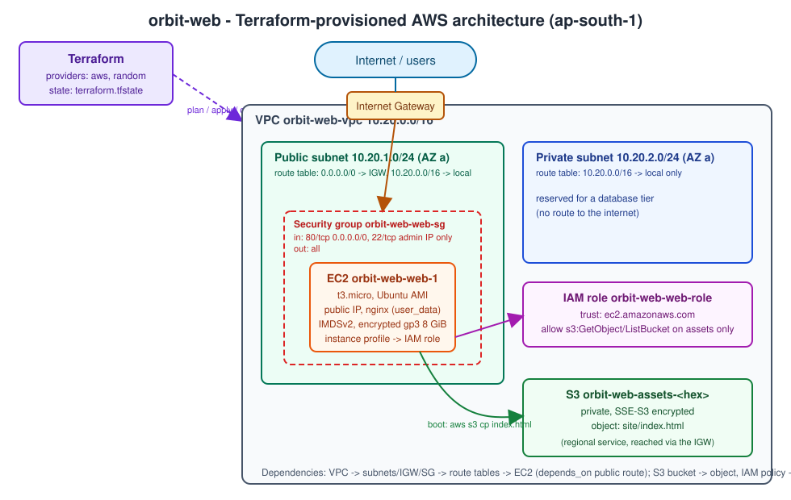
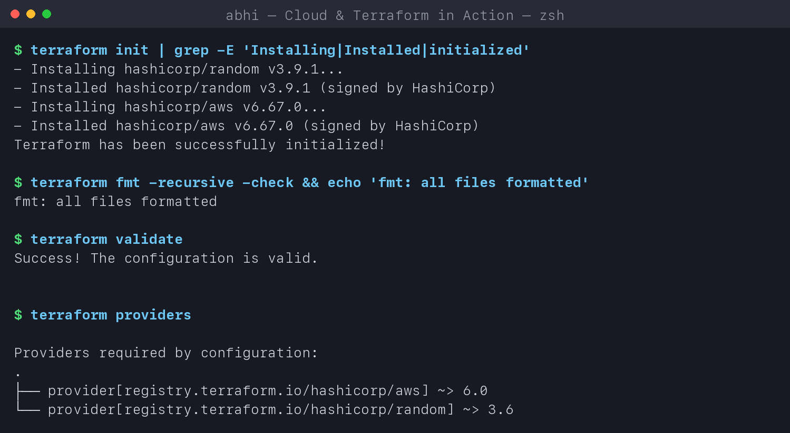
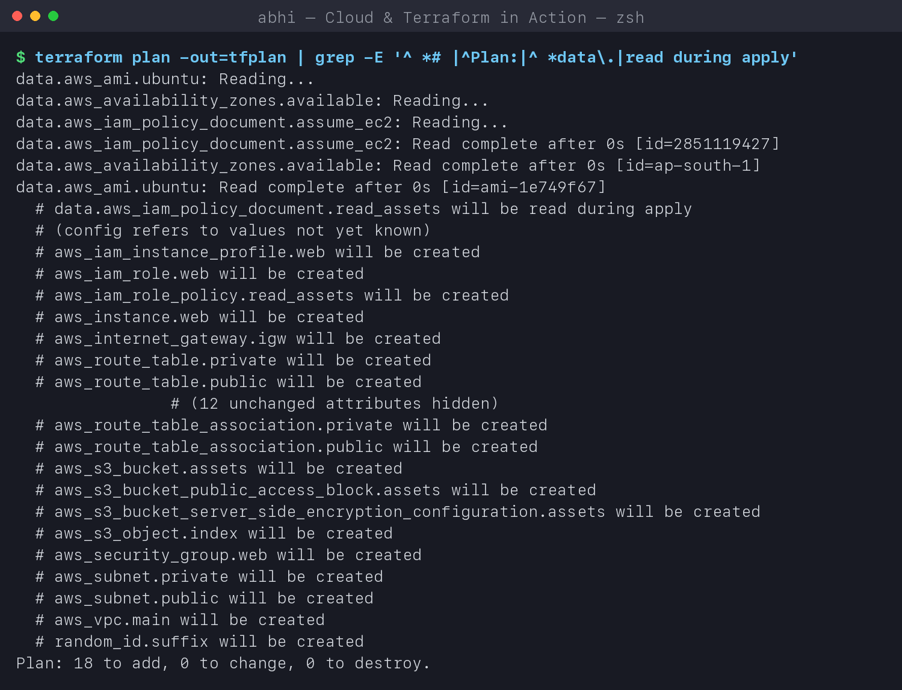
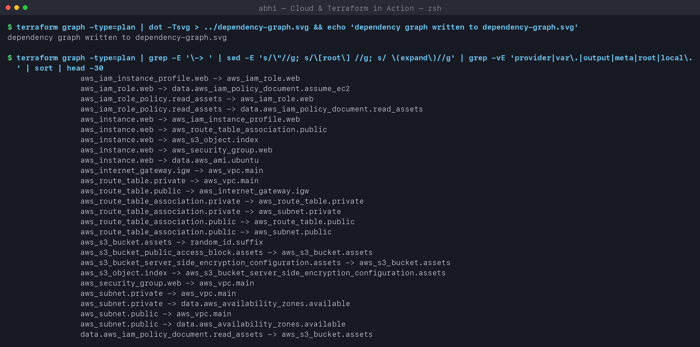
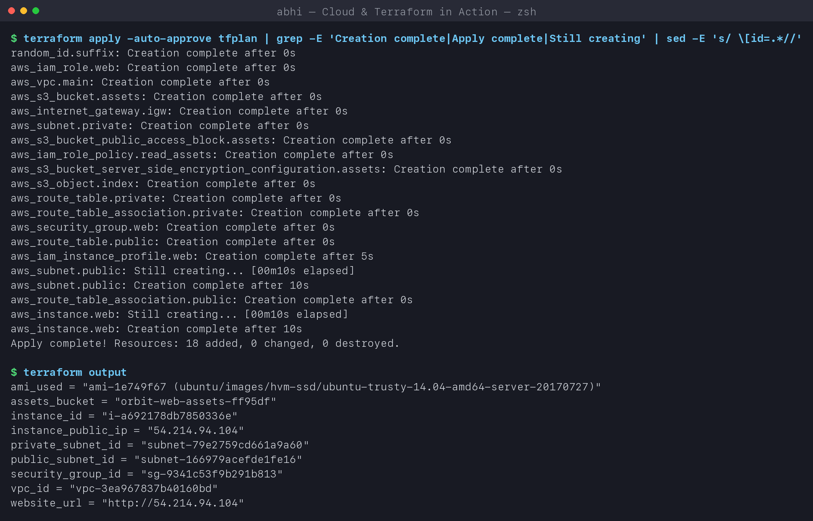
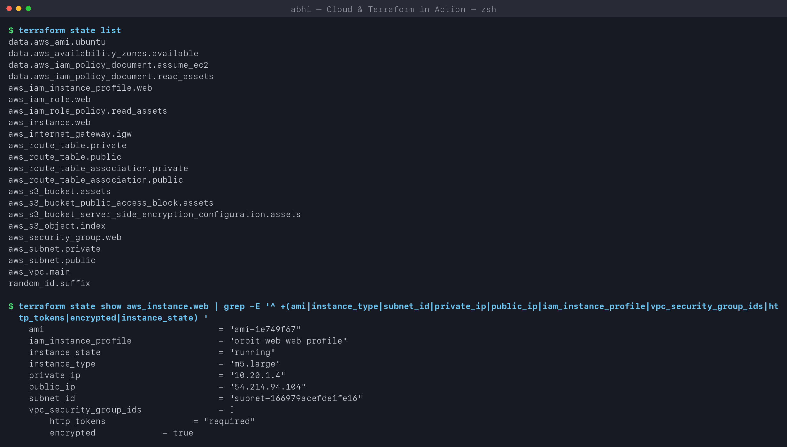
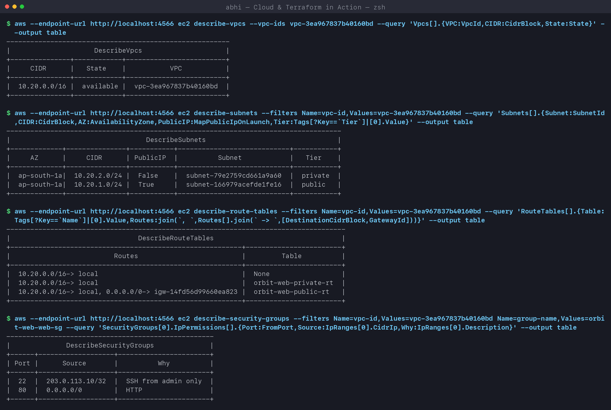
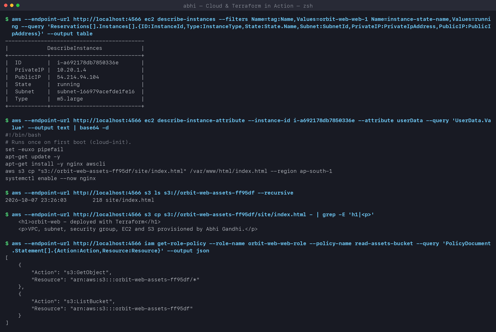
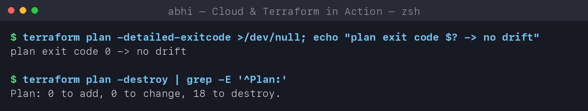
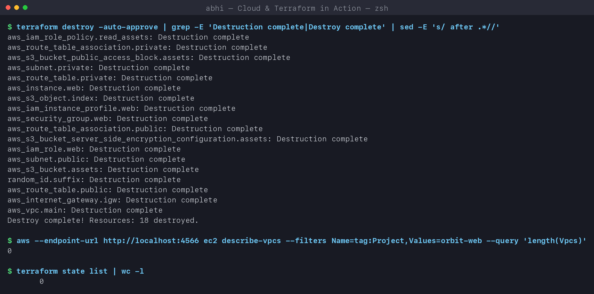

# Cloud & Terraform in Action - Homework

**Name:** Abhi Gandhi
**Enrollment Number:** 24bcs10397

An end-to-end cloud infrastructure project in Terraform: a **VPC** with a public and a private
subnet, an **Internet Gateway** and route tables, a **Security Group**, an **EC2** web server
that pulls its homepage from a private **S3** bucket through a least-privilege **IAM role**.
18 resources, created and destroyed with one command each.

> **Where it ran:** my AWS credentials were not usable, so every command ran against
> **LocalStack 4.12** (an AWS API emulator in Docker on `localhost:4566`). Terraform makes the
> same API calls as against AWS. The defaults in [variables.tf](terraform/variables.tf) are
> for real AWS (Canonical Ubuntu 24.04 on `t3.micro`); [terraform.tfvars](terraform/terraform.tfvars)
> switches to LocalStack. Section 7 lists what an emulator can and cannot prove.

## Architecture



```text
Terraform ──► AWS ap-south-1
              ├── VPC 10.20.0.0/16
              │    ├── Internet Gateway
              │    ├── Public subnet 10.20.1.0/24  ── route 0.0.0.0/0 -> IGW
              │    │     └── Security Group (80 from anywhere, 22 from admin /32)
              │    │           └── EC2 web server (nginx via user_data, IMDSv2, encrypted disk)
              │    └── Private subnet 10.20.2.0/24 ── local route only (future database tier)
              ├── IAM role + instance profile  (s3:GetObject on the assets bucket only)
              └── S3 bucket orbit-web-assets-<hex>  (private, encrypted) ── site/index.html
```

## Project structure

```text
Cloud and Terraform in Action/
├── terraform/
│   ├── versions.tf          # required Terraform + provider versions
│   ├── providers.tf         # AWS provider, LocalStack switch, default_tags
│   ├── variables.tf         # all inputs, with types, defaults and validation
│   ├── network.tf           # VPC, IGW, subnets, route tables, security group
│   ├── storage.tf           # S3 bucket, public-access block, encryption, index.html object
│   ├── iam.tf               # role, least-privilege policy, instance profile
│   ├── compute.tf           # AMI data source + EC2 instance
│   ├── outputs.tf           # IDs, IP, URL
│   ├── user_data.sh.tftpl   # boot script (nginx + copy index.html from S3)
│   ├── index.html.tftpl     # homepage template
│   ├── terraform.tfvars     # my values
│   └── .terraform.lock.hcl
├── architecture.svg         # diagram above
├── dependency-graph.svg     # generated by `terraform graph | dot`
├── screenshots/
└── run-labs.sh              # replays the whole workflow
```

## Terraform concepts used

| Concept | Where |
|---|---|
| **Providers** | `hashicorp/aws ~> 6.0` and `hashicorp/random ~> 3.6`, pinned in `versions.tf` and locked in `.terraform.lock.hcl`; `default_tags` adds Project/Owner/Session/ManagedBy to every resource |
| **Variables** | 12 inputs: CIDRs, instance type (with a `validation` allow-list), AMI owners/pattern, `ssh_cidr`, `use_localstack`; values in `terraform.tfvars` |
| **Resources** | 18 managed resources across network, storage, IAM and compute |
| **Data sources** | `aws_ami` (latest matching image), `aws_availability_zones`, two `aws_iam_policy_document`s (JSON policy written in HCL) |
| **Outputs** | `vpc_id`, subnet IDs, `security_group_id`, `instance_id`, `instance_public_ip`, `assets_bucket`, `website_url`, `ami_used` |
| **Implicit dependencies** | every `aws_vpc.main.id`-style reference: Terraform builds the graph from them |
| **Explicit dependencies** | `aws_instance.web` `depends_on` the public route-table association (the boot script needs internet *before* it runs, but nothing in the instance references the route) |
| **Templates** | `templatefile()` renders the boot script and the homepage with variables |
| **State** | `terraform.tfstate` maps every resource to its real ID (git-ignored; a team would use an S3 backend with locking) |

## Workflow

### 1. terraform init / fmt / validate

```text
$ terraform init | grep -E 'Installing|Installed|initialized'
- Installing hashicorp/random v3.9.1...
- Installed hashicorp/random v3.9.1 (signed by HashiCorp)
- Installing hashicorp/aws v6.67.0...
- Installed hashicorp/aws v6.67.0 (signed by HashiCorp)
Terraform has been successfully initialized!

$ terraform fmt -recursive -check && echo 'fmt: all files formatted'
fmt: all files formatted

$ terraform validate
Success! The configuration is valid.

$ terraform providers
Providers required by configuration:
.
├── provider[registry.terraform.io/hashicorp/aws] ~> 6.0
└── provider[registry.terraform.io/hashicorp/random] ~> 3.6
```



### 2. terraform plan

```text
$ terraform plan -out=tfplan | grep -E '^ *# |^Plan:|^ *data\.|read during apply'
data.aws_ami.ubuntu: Reading...
data.aws_availability_zones.available: Reading...
data.aws_iam_policy_document.assume_ec2: Read complete after 0s [id=2851119427]
data.aws_availability_zones.available: Read complete after 0s [id=ap-south-1]
data.aws_ami.ubuntu: Read complete after 0s [id=ami-1e749f67]
  # data.aws_iam_policy_document.read_assets will be read during apply
  # (config refers to values not yet known)
  # aws_iam_instance_profile.web will be created
  # aws_iam_role.web will be created
  # aws_iam_role_policy.read_assets will be created
  # aws_instance.web will be created
  # aws_internet_gateway.igw will be created
  # aws_route_table.private will be created
  # aws_route_table.public will be created
  # aws_route_table_association.private will be created
  # aws_route_table_association.public will be created
  # aws_s3_bucket.assets will be created
  # aws_s3_bucket_public_access_block.assets will be created
  # aws_s3_bucket_server_side_encryption_configuration.assets will be created
  # aws_s3_object.index will be created
  # aws_security_group.web will be created
  # aws_subnet.private will be created
  # aws_subnet.public will be created
  # aws_vpc.main will be created
  # random_id.suffix will be created
Plan: 18 to add, 0 to change, 0 to destroy.
```

Data sources are read **during plan** (the AMI lookup found `ami-1e749f67`), except
`read_assets`. That policy needs the bucket ARN, which doesn't exist yet, so Terraform
postpones it to apply time.



### 3. Dependencies - the graph Terraform builds

```text
$ terraform graph -type=plan | dot -Tsvg > ../dependency-graph.svg
$ terraform graph -type=plan | grep ' -> ' | ...    (resource edges only)
aws_iam_instance_profile.web -> aws_iam_role.web
aws_iam_role.web -> data.aws_iam_policy_document.assume_ec2
aws_iam_role_policy.read_assets -> data.aws_iam_policy_document.read_assets
aws_instance.web -> aws_iam_instance_profile.web
aws_instance.web -> aws_route_table_association.public      <- the explicit depends_on
aws_instance.web -> aws_s3_object.index
aws_instance.web -> aws_security_group.web
aws_instance.web -> data.aws_ami.ubuntu
aws_internet_gateway.igw -> aws_vpc.main
aws_route_table.public -> aws_internet_gateway.igw
aws_route_table_association.public -> aws_route_table.public
aws_route_table_association.public -> aws_subnet.public
aws_s3_bucket.assets -> random_id.suffix
aws_s3_object.index -> aws_s3_bucket_server_side_encryption_configuration.assets
aws_security_group.web -> aws_vpc.main
aws_subnet.public -> aws_vpc.main
data.aws_iam_policy_document.read_assets -> aws_s3_bucket.assets
...
```

The full graph is in [dependency-graph.svg](dependency-graph.svg). Two chains end at the
instance: VPC -> IGW -> public route table -> association, and random suffix -> bucket ->
encryption -> object. The policy document depends on the bucket because it contains
`aws_s3_bucket.assets.arn`. Nobody wrote that order down, Terraform derived it from the
references.



### 4. terraform apply

```text
$ terraform apply -auto-approve tfplan | grep -E 'Creation complete|Apply complete|Still creating'
random_id.suffix: Creation complete after 0s
aws_iam_role.web: Creation complete after 0s
aws_vpc.main: Creation complete after 0s
aws_s3_bucket.assets: Creation complete after 0s
aws_s3_bucket_server_side_encryption_configuration.assets: Creation complete after 0s
aws_internet_gateway.igw: Creation complete after 0s
aws_s3_bucket_public_access_block.assets: Creation complete after 0s
aws_subnet.private: Creation complete after 0s
aws_iam_role_policy.read_assets: Creation complete after 0s
aws_s3_object.index: Creation complete after 0s
aws_route_table.private: Creation complete after 0s
aws_route_table_association.private: Creation complete after 0s
aws_security_group.web: Creation complete after 0s
aws_route_table.public: Creation complete after 0s
aws_iam_instance_profile.web: Creation complete after 5s
aws_subnet.public: Creation complete after 10s
aws_route_table_association.public: Creation complete after 0s
aws_instance.web: Creation complete after 10s
Apply complete! Resources: 18 added, 0 changed, 0 destroyed.

$ terraform output
ami_used = "ami-1e749f67 (ubuntu/images/hvm-ssd/ubuntu-trusty-14.04-amd64-server-20170727)"
assets_bucket = "orbit-web-assets-ff95df"
instance_id = "i-a692178db7850336e"
instance_public_ip = "54.214.94.104"
private_subnet_id = "subnet-79e2759cd661a9a60"
public_subnet_id = "subnet-166979acefde1fe16"
security_group_id = "sg-9341c53f9b291b813"
vpc_id = "vpc-3ea967837b40160bd"
website_url = "http://54.214.94.104"
```

Independent resources were created **in parallel** (IAM role, VPC and bucket in the first
second). The instance was created last, exactly as the graph says.



### 5. Terraform state

```text
$ terraform state list
data.aws_ami.ubuntu
data.aws_availability_zones.available
data.aws_iam_policy_document.assume_ec2
data.aws_iam_policy_document.read_assets
aws_iam_instance_profile.web
aws_iam_role.web
aws_iam_role_policy.read_assets
aws_instance.web
aws_internet_gateway.igw
aws_route_table.private
aws_route_table.public
aws_route_table_association.private
aws_route_table_association.public
aws_s3_bucket.assets
aws_s3_bucket_public_access_block.assets
aws_s3_bucket_server_side_encryption_configuration.assets
aws_s3_object.index
aws_security_group.web
aws_subnet.private
aws_subnet.public
aws_vpc.main
random_id.suffix

$ terraform state show aws_instance.web | grep -E '(ami|instance_type|subnet_id|private_ip|public_ip|...)'
    ami                                  = "ami-1e749f67"
    iam_instance_profile                 = "orbit-web-web-profile"
    instance_state                       = "running"
    instance_type                        = "m5.large"
    private_ip                           = "10.20.1.4"
    public_ip                            = "54.214.94.104"
    subnet_id                            = "subnet-166979acefde1fe16"
        http_tokens                 = "required"
        encrypted             = true
```

The state is Terraform's memory: every address maps to a real ID. `private_ip 10.20.1.4` is
the first usable host in the public subnet, because AWS reserves .0 to .3 and .255.



### 6. Verifying with the AWS CLI

```text
$ aws ec2 describe-vpcs ...
|  10.20.0.0/16 |  available |  vpc-3ea967837b40160bd  |

$ aws ec2 describe-subnets ...
|     AZ      |     CIDR      | PublicIP  |          Subnet            |   Tier    |
|  ap-south-1a|  10.20.1.0/24 |  True     |  subnet-166979acefde1fe16  |  public   |
|  ap-south-1a|  10.20.2.0/24 |  False    |  subnet-79e2759cd661a9a60  |  private  |

$ aws ec2 describe-route-tables ...
|                          Routes                          |         Table          |
|  10.20.0.0/16-> local                                    |  None                  |
|  10.20.0.0/16-> local                                    |  orbit-web-private-rt  |
|  10.20.0.0/16-> local, 0.0.0.0/0-> igw-...               |  orbit-web-public-rt   |

$ aws ec2 describe-security-groups ...
| Port |      Source       |          Why          |
|  80  |  0.0.0.0/0        |  HTTP                 |
|  22  |  203.0.113.10/32  |  SSH from admin only  |
```

The only difference between the two subnets is the `0.0.0.0/0 -> igw` route. That route is
what makes a subnet "public". The unnamed table is the VPC's **main** route table, which AWS
creates automatically and which my subnets don't use.



```text
$ aws ec2 describe-instances --filters Name=tag:Name,Values=orbit-web-web-1 Name=instance-state-name,Values=running ...
|  ID        |  i-a692178db7850336e       |
|  PrivateIP |  10.20.1.4                 |
|  PublicIP  |  54.214.94.104             |
|  State     |  running                   |
|  Subnet    |  subnet-166979acefde1fe16  |
|  Type      |  m5.large                  |

$ aws ec2 describe-instance-attribute --instance-id i-a692178db7850336e --attribute userData ... | base64 -d
#!/bin/bash
# Runs once on first boot (cloud-init).
set -euxo pipefail
apt-get update -y
apt-get install -y nginx awscli
aws s3 cp "s3://orbit-web-assets-ff95df/site/index.html" /var/www/html/index.html --region ap-south-1
systemctl enable --now nginx

$ aws s3 cp s3://orbit-web-assets-ff95df/site/index.html - | grep -E 'h1|<p>'
    <h1>orbit-web - deployed with Terraform</h1>
    <p>VPC, subnet, security group, EC2 and S3 provisioned by Abhi Gandhi.</p>

$ aws iam get-role-policy --role-name orbit-web-web-role --policy-name read-assets-bucket ...
[
    { "Action": "s3:GetObject",  "Resource": "arn:aws:s3:::orbit-web-assets-ff95df/*" },
    { "Action": "s3:ListBucket", "Resource": "arn:aws:s3:::orbit-web-assets-ff95df" }
]
```

`templatefile()` filled the real bucket name into the boot script. The IAM policy allows
**reading** **this one bucket** only, with no wildcards. That's least privilege.



### 7. Drift check, plan the destroy, terraform destroy

```text
$ terraform plan -detailed-exitcode >/dev/null; echo "plan exit code $? -> no drift"
plan exit code 0 -> no drift

$ terraform plan -destroy | grep -E '^Plan:'
Plan: 0 to add, 0 to change, 18 to destroy.

$ terraform destroy -auto-approve | grep -E 'Destruction complete|Destroy complete'
aws_iam_role_policy.read_assets: Destruction complete
aws_s3_bucket_public_access_block.assets: Destruction complete
...
aws_instance.web: Destruction complete
...
aws_subnet.public: Destruction complete
aws_s3_bucket.assets: Destruction complete
random_id.suffix: Destruction complete
aws_route_table.public: Destruction complete
aws_internet_gateway.igw: Destruction complete
aws_vpc.main: Destruction complete
Destroy complete! Resources: 18 destroyed.

$ aws ec2 describe-vpcs --filters Name=tag:Project,Values=orbit-web --query 'length(Vpcs)'
0
$ terraform state list | wc -l
       0
```

Destroy follows the graph **backwards**: the VPC is deleted last, after everything inside it.





## A real problem I hit: apply that never finished

My first `apply` with `t3.micro` hung for over 10 minutes at `aws_instance.web: Still creating...`.
LocalStack's log showed the cause:

```text
AWS ec2.DescribeInstanceCreditSpecifications => 200
AWS ec2.DescribeInstanceCreditSpecifications => 200
... (hundreds per second)
```

For **burstable** (T-family) instances, the AWS provider reads the CPU-credit setting
(`standard`/`unlimited`) and retries until it gets one. LocalStack answers `200` with an empty
list, so the provider retried forever, and `destroy` hung for the same reason because it
refreshes the instance first. The fix:

1. Stop Terraform, then run `terraform state rm aws_instance.web` so Terraform forgets the stuck
   instance.
2. Terminate it directly with `aws ec2 terminate-instances`, then `terraform destroy` the rest.
3. Keep `t3.micro` as the real-AWS default, but use a non-burstable type (`m5.large`) **only** in
   the LocalStack tfvars. The `validation` block allows it and says why.

Lesson: an emulator is great for testing the Terraform logic for free, but it isn't AWS.

## What LocalStack proves and what it does not

| Proven here | Needs real AWS |
|---|---|
| The code is valid, formatted, and builds an 18-resource dependency graph | Real boot: cloud-init running `user_data`, apt installing nginx |
| Every resource is created/updated/destroyed with the right attributes and references | Opening `website_url` in a browser (LocalStack instances are mock records, not VMs) |
| Network topology: CIDRs, route tables, IGW route, SG rules | Actual packet flow through the SG/IGW, IAM enforcement at runtime |
| State, outputs, drift check, destroy | Billing / Free Tier usage |

To run it on AWS: `aws configure`, then delete the LocalStack block at the bottom of
`terraform.tfvars` and set `ssh_cidr` to your own IP. Then run `terraform init && terraform
apply`, open `website_url`, and `terraform destroy` afterwards.

## Security choices

- SSH only from one `/32` (variable), HTTP open. Egress is open so apt/S3 work.
- No access keys on the instance: an **instance profile** gives temporary credentials for one
  bucket.
- IMDSv2 required (`http_tokens = "required"`) to block SSRF-style metadata theft.
- Root volume encrypted, bucket encrypted (SSE-S3) and all public access blocked.
- Private subnet has no route to the internet.

## Command summary

| Command | Result |
|---|---|
| `terraform init` | providers installed and locked |
| `terraform fmt -check` / `validate` | formatting and static checks pass |
| `terraform plan -out=tfplan` | `18 to add` |
| `terraform graph \| dot -Tsvg` | dependency diagram |
| `terraform apply tfplan` | `18 added`, outputs printed |
| `terraform state list` / `state show` | resource addresses and real IDs |
| `terraform output` | IDs, IP, URL |
| `terraform plan -detailed-exitcode` | `0` = no drift |
| `terraform destroy` | `18 destroyed` |

## Key learnings

- References build the dependency graph automatically. `depends_on` is only for hidden
  dependencies like "needs internet at boot".
- Data sources (AMI lookup, policy documents) keep the code portable and readable.
- A public subnet is just a subnet whose route table has `0.0.0.0/0 -> IGW`.
- Least privilege everywhere: SG rules, one-bucket IAM policy, IMDSv2.
- When `apply` hangs, look at the API calls (here, the LocalStack log). `terraform state rm`
  is the escape hatch for a resource Terraform can't manage.
