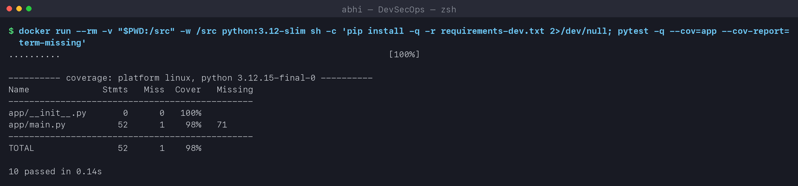
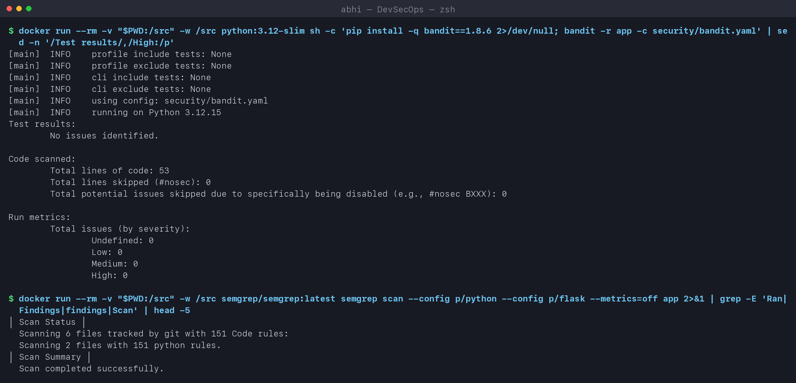
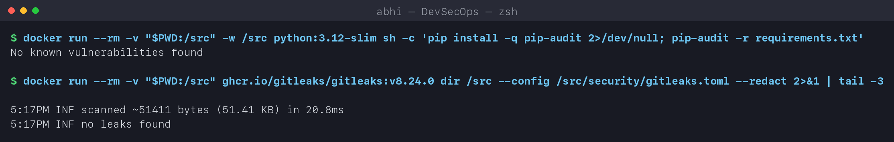
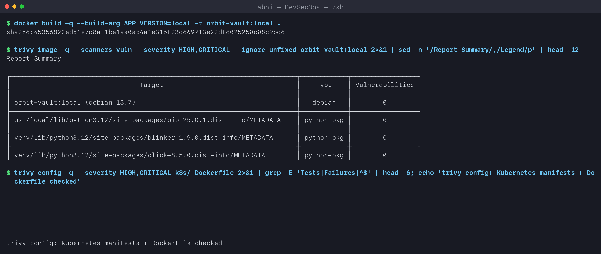
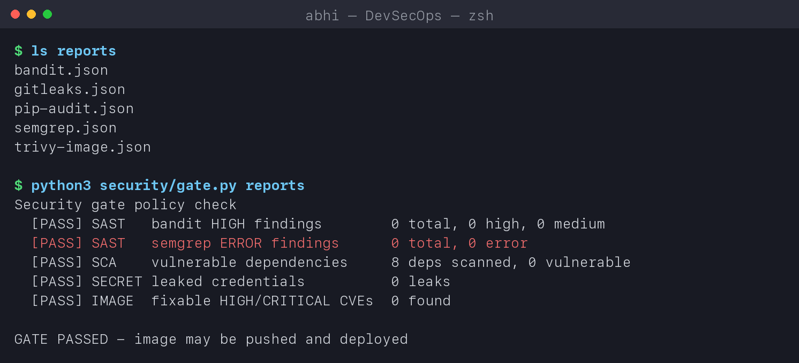
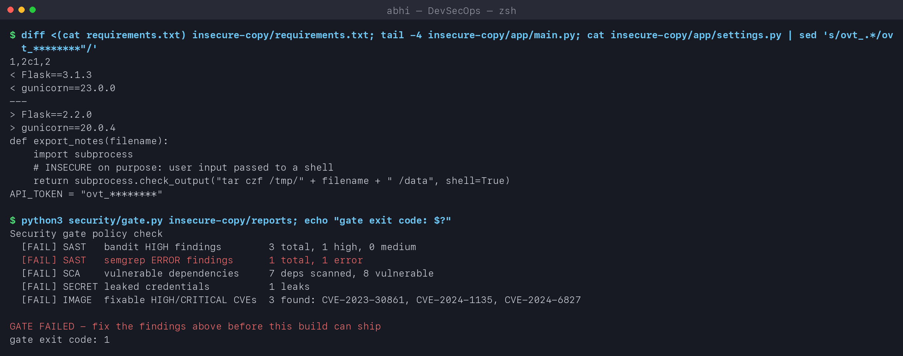
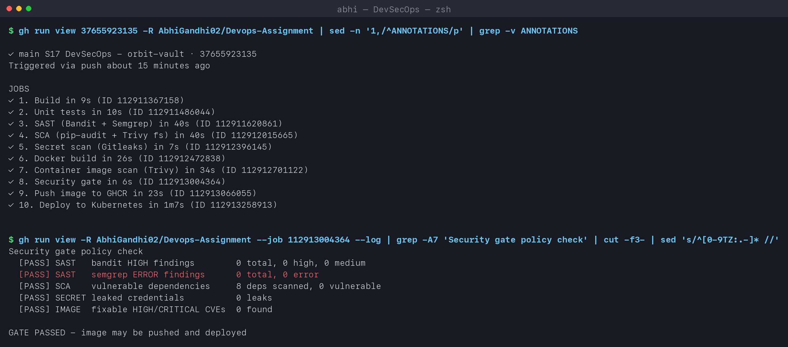
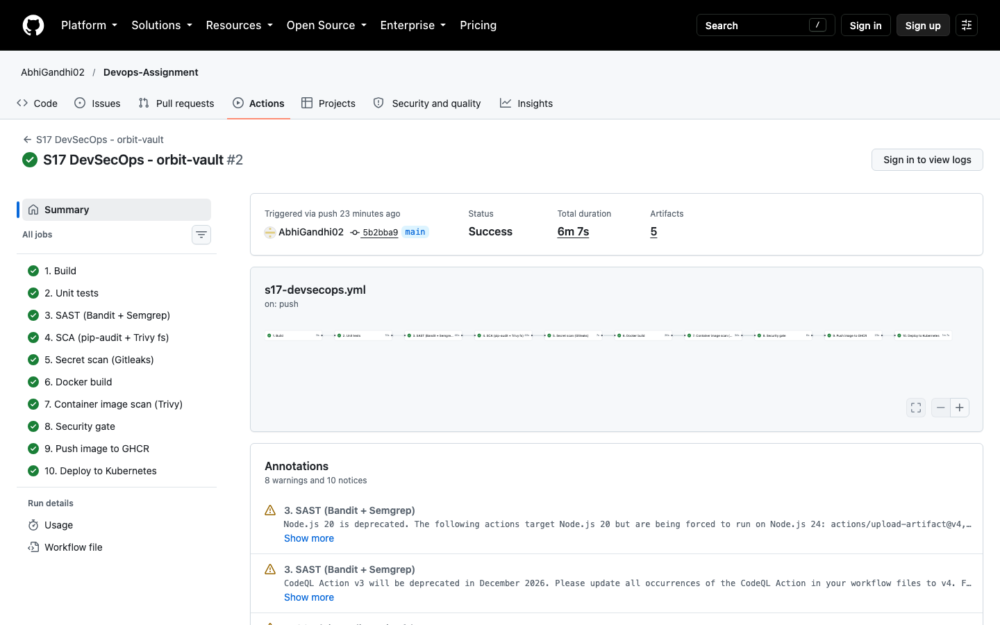

# Complete CI/CD & DevSecOps - Homework

**Name:** Abhi Gandhi
**Enrollment Number:** 24bcs10397

A complete CI/CD + DevSecOps pipeline for **orbit-vault**, a small notes API protected by an
API token. Every commit goes through build, tests and five kinds of security checks, and the
image is pushed and deployed to Kubernetes **only if a security gate passes**.

| Deliverable | Where |
|---|---|
| Application | [app/main.py](app/main.py), tests in [tests/test_app.py](tests/test_app.py) |
| Dockerfile | [Dockerfile](Dockerfile) - multi-stage, OS packages upgraded, runs as UID 10001 |
| GitHub Actions workflow | [.github/workflows/s17-devsecops.yml](../.github/workflows/s17-devsecops.yml) |
| Security tools configuration | [security/](security) - `bandit.yaml`, `gitleaks.toml`, `trivy.yaml`, `.trivyignore`, `gate.py` |
| Kubernetes manifests | [k8s/](k8s) - namespace with Pod Security `restricted`, hardened Deployment, Service |
| Successful pipeline output | [pipeline runs](https://github.com/AbhiGandhi02/Devops-Assignment/actions/workflows/s17-devsecops.yml) + screenshots below |
| Local replay | [run-labs.sh](run-labs.sh) - every security stage locally + a deliberately insecure build |

## 1. The flow

```text
Code ─► 1 Build ─► 2 Unit Test ─► 3 SAST ─► 4 SCA ─► 5 Secret Scan ─► 6 Docker Build
                                                                          │
     10 Deploy to Kubernetes ◄─ 9 Push Image ◄─ 8 SECURITY GATE ◄─ 7 Container Image Scan
```

Every stage is a separate job chained with `needs:`, so the GitHub UI shows exactly the
expected flow (screenshot in section 5). Each scanner saves a JSON report as an artifact; the
gate job downloads all of them and makes one pass/fail decision.

| # | Stage | Tool | What it catches | Config |
|---|---|---|---|---|
| 1 | Build | pip + `compileall` | syntax errors, broken imports, missing deps | - |
| 2 | Unit test | pytest + pytest-cov | broken behaviour; **fails under 90% coverage** | [pytest.ini](pytest.ini) |
| 3 | **SAST** | Bandit, Semgrep (`p/python`, `p/flask`) | insecure code: shell injection, `debug=True`, weak crypto, `eval` | [bandit.yaml](security/bandit.yaml) |
| 4 | **SCA** | pip-audit, Trivy `fs` | dependencies with known CVEs; Dockerfile/K8s misconfigurations | [trivy.yaml](security/trivy.yaml) |
| 5 | **Secret scanning** | Gitleaks (default rules + my `ovt_` token rule) | API keys, tokens, passwords committed to the repo | [gitleaks.toml](security/gitleaks.toml) |
| 6 | Docker build | docker | builds once, saves the image as an artifact | [Dockerfile](Dockerfile) |
| 7 | **Container image scanning** | Trivy `image` | CVEs in OS packages and Python libraries inside the image | [.trivyignore](security/.trivyignore) |
| 8 | **Security gate** | [gate.py](security/gate.py) | enforces the policy below | - |
| 9 | Push | docker -> GHCR | pushes **the exact image that was scanned** (loaded from the artifact, not rebuilt) | - |
| 10 | Deploy | kind + kubectl | deploys into a `restricted` namespace and smoke-tests | [k8s/](k8s) |

### Security gate policy

| Check | Fails the build when |
|---|---|
| SAST - Bandit | any **HIGH** severity finding |
| SAST - Semgrep | any **ERROR** severity finding |
| SCA - pip-audit | **any** dependency with a known vulnerability |
| Secrets - Gitleaks | **any** leak |
| Image - Trivy | any **CRITICAL/HIGH** vulnerability **that has a fix available** |

Unfixable OS CVEs are reported but not blocking (`ignore-unfixed`), otherwise no image could
ever ship; an accepted risk goes into `.trivyignore` with a reason and an expiry date.

## 2. Security built into the app, image and cluster

| Layer | Control |
|---|---|
| App | token from env (`VAULT_API_TOKEN`), never in code; `hmac.compare_digest` (no timing attack); strict input validation (title regex, text length); security headers (`nosniff`, `DENY`, CSP); no debug mode |
| Image | multi-stage build (no pip cache/build tools in final image); `apt-get upgrade`; non-root `USER 10001`; `HEALTHCHECK` |
| Kubernetes | namespace label `pod-security.kubernetes.io/enforce: restricted`; `runAsNonRoot`, `readOnlyRootFilesystem`, `allowPrivilegeEscalation: false`, `capabilities: drop [ALL]`, `seccompProfile: RuntimeDefault`; no service-account token; resource limits; probes |
| Secrets | the API token is **generated inside the deploy job** (`openssl rand`) and stored only as a Kubernetes Secret - nothing secret is in Git |

## 3. Running each stage locally

[run-labs.sh](run-labs.sh) runs the same tools (in containers, so the versions match CI).

### Unit tests

```text
$ docker run --rm -v "$PWD:/src" -w /src python:3.12-slim sh -c 'pip install -q -r requirements-dev.txt; pytest -q --cov=app --cov-report=term-missing'
..........                                                               [100%]
---------- coverage: platform linux, python 3.12.15-final-0 ----------
Name              Stmts   Miss  Cover   Missing
-----------------------------------------------
app/__init__.py       0      0   100%
app/main.py          52      1    98%   71
-----------------------------------------------
TOTAL                52      1    98%
10 passed in 0.14s
```

The tests include security behaviour: requests without a token or with a wrong token get
**401**, an empty server token rejects everyone, `<script>` in a title is rejected, and the
security headers are present. (The one missed line is `app.run()` under `__main__`.)



### SAST

```text
$ bandit -r app -c security/bandit.yaml
Test results:
	No issues identified.
Code scanned:
	Total lines of code: 53
Run metrics:
	Total issues (by severity):
		Undefined: 0
		Low: 0
		Medium: 0
		High: 0

$ semgrep scan --config p/python --config p/flask --metrics=off app
  Scanning 2 files with 151 python rules.
✅ Scan completed successfully.
```



### SCA and secret scanning

```text
$ pip-audit -r requirements.txt
No known vulnerabilities found

$ gitleaks dir /src --config /src/security/gitleaks.toml --redact
INF scanned ~51139 bytes (51.14 KB) in 21.1ms
INF no leaks found
```

**The scanner caught me:** on the first local run Gitleaks reported a leak in a *clean*
tree. It was my own lab script - it contained the fake `ovt_...` token I use for the
insecure demo below, and it matched my custom rule. Had I committed it, the CI gate would
have failed. I changed the script to generate the token at runtime (`openssl rand`) so it
never exists in a file.



### Container image scan

```text
$ trivy image --scanners vuln --severity HIGH,CRITICAL --ignore-unfixed orbit-vault:local
Report Summary
┌──────────────────────────────────────────────────────────────────────┬────────────┬─────────────────┐
│                                 Target                               │    Type    │ Vulnerabilities │
├──────────────────────────────────────────────────────────────────────┼────────────┼─────────────────┤
│ orbit-vault:local (debian 13.7)                                      │   debian   │        0        │
│ usr/local/lib/python3.12/site-packages/pip-25.0.1.dist-info/METADATA │ python-pkg │        0        │
│ venv/lib/python3.12/site-packages/blinker-1.9.0.dist-info/METADATA   │ python-pkg │        0        │
│ venv/lib/python3.12/site-packages/click-8.5.0.dist-info/METADATA     │ python-pkg │        0        │
...
```

`apt-get upgrade` in the Dockerfile is why the Debian layer has 0 fixable HIGH/CRITICAL
CVEs. Trivy also checked the Dockerfile and K8s manifests for misconfigurations.



### Security gate - passing

```text
$ ls reports
bandit.json  gitleaks.json  pip-audit.json  semgrep.json  trivy-image.json

$ python3 security/gate.py reports
Security gate policy check
  [PASS] SAST   bandit HIGH findings        0 total, 0 high, 0 medium
  [PASS] SAST   semgrep ERROR findings      0 total, 0 error
  [PASS] SCA    vulnerable dependencies     8 deps scanned, 0 vulnerable
  [PASS] SECRET leaked credentials          0 leaks
  [PASS] IMAGE  fixable HIGH/CRITICAL CVEs  0 found

GATE PASSED - image may be pushed and deployed
```



## 4. Proving the gate works - a deliberately insecure build

A gate that has only ever said "PASS" proves nothing. The lab copies the app and adds three
classic mistakes:

```text
$ diff requirements.txt insecure-copy/requirements.txt
< Flask==3.1.3
< gunicorn==23.0.0
---
> Flask==2.2.0                  # old versions with published CVEs
> gunicorn==20.0.4

def export_notes(filename):
    import subprocess
    # INSECURE on purpose: user input passed to a shell
    return subprocess.check_output("tar czf /tmp/" + filename + " /data", shell=True)

API_TOKEN = "ovt_********"       # a hard-coded token in app/settings.py

$ python3 security/gate.py insecure-copy/reports; echo "gate exit code: $?"
Security gate policy check
  [FAIL] SAST   bandit HIGH findings        3 total, 1 high, 0 medium
  [FAIL] SAST   semgrep ERROR findings      1 total, 1 error
  [FAIL] SCA    vulnerable dependencies     7 deps scanned, 8 vulnerable
  [FAIL] SECRET leaked credentials          1 leaks
  [FAIL] IMAGE  fixable HIGH/CRITICAL CVEs  3 found: CVE-2023-30861, CVE-2024-1135, CVE-2024-6827

GATE FAILED - fix the findings above before this build can ship
gate exit code: 1
```

Every layer caught its own problem: Bandit (`B602 subprocess with shell=True` = HIGH) and
Semgrep flagged the command injection, pip-audit found 8 advisories in the old Flask and gunicorn
versions, Gitleaks found the token through my custom `ovt_` rule, and Trivy
found the fixable CVEs inside the built image (CVE-2023-30861 is Flask's session-cookie leak,
CVE-2024-1135 and CVE-2024-6827 are gunicorn request-smuggling bugs). Exit code 1 is what makes
GitHub Actions stop the pipeline - push and deploy never run.



## 5. Successful pipeline on GitHub

```text
$ gh run view 37655923135 -R AbhiGandhi02/Devops-Assignment
✓ main S17 DevSecOps - orbit-vault · 37655923135

JOBS
✓ 1. Build in 9s
✓ 2. Unit tests in 10s
✓ 3. SAST (Bandit + Semgrep) in 40s
✓ 4. SCA (pip-audit + Trivy fs) in 40s
✓ 5. Secret scan (Gitleaks) in 7s
✓ 6. Docker build in 26s
✓ 7. Container image scan (Trivy) in 34s
✓ 8. Security gate in 6s
✓ 9. Push image to GHCR in 23s
✓ 10. Deploy to Kubernetes in 1m7s

$ gh run view --job <security-gate-job> --log
Security gate policy check
  [PASS] SAST   bandit HIGH findings        0 total, 0 high, 0 medium
  [PASS] SAST   semgrep ERROR findings      0 total, 0 error
  [PASS] SCA    vulnerable dependencies     8 deps scanned, 0 vulnerable
  [PASS] SECRET leaked credentials          0 leaks
  [PASS] IMAGE  fixable HIGH/CRITICAL CVEs  0 found

GATE PASSED - image may be pushed and deployed
```





### Deploy job output

```text
namespace/orbit-vault created                  # Pod Security: restricted
secret/orbit-vault-token created               # random token, generated in the job
deployment.apps/orbit-vault created
service/orbit-vault created
deployment "orbit-vault" successfully rolled out
deployment.apps/orbit-vault   2/2   ghcr.io/abhigandhi02/orbit-vault:5b2bba9bc4ee96302998f28d4d575ee82f796a50
pod/orbit-vault-684f89895d-5b5zj   1/1     Running   0          3s
pod/orbit-vault-684f89895d-fckqp   1/1     Running   0          3s

# smoke test
{"app":"orbit-vault","author":"Abhi Gandhi","version":"5b2bba9bc4ee96302998f28d4d575ee82f796a50"}
without token -> 401
{"id":1,"text":"shipped by the DevSecOps pipeline","title":"deployed"}
[{"id":1,"text":"shipped by the DevSecOps pipeline","title":"deployed"}]
```

The Pods were admitted into a namespace that **enforces** the `restricted` Pod Security
Standard - any root, privileged or capability-adding container would have been rejected by
the API server. The smoke test proves both that the app works with the token and that it
refuses requests without it.

## 6. Shift-left: where each check belongs

| When | Check | Cost of finding a problem here |
|---|---|---|
| While coding / pre-commit | Gitleaks pre-commit hook, IDE linters | seconds |
| Pull request | tests, SAST, SCA, secret scan | minutes, before merge |
| Build | image scan, gate | before anything is published |
| Deploy | Pod Security admission, signed images, policies | before anything runs |
| Run time | monitoring, runtime security (Falco), periodic re-scans | after users are exposed - most expensive |

## Key learnings

- Each tool has a narrow job - SAST reads **my** code, SCA reads **my dependencies'** CVEs,
  secret scanning reads **everything committed**, image scanning reads **the OS and libraries
  that actually ship**. Skipping one leaves a blind spot the others cannot see.
- A gate needs a written policy (what blocks, what is only reported) or teams start ignoring it.
- Push the **same** image that was scanned - rebuilding after the scan can ship different bytes.
- Test the gate with a known-bad input; a pipeline that is always green proves nothing.
- Keep secrets out of Git entirely: generate or fetch them at deploy time.
