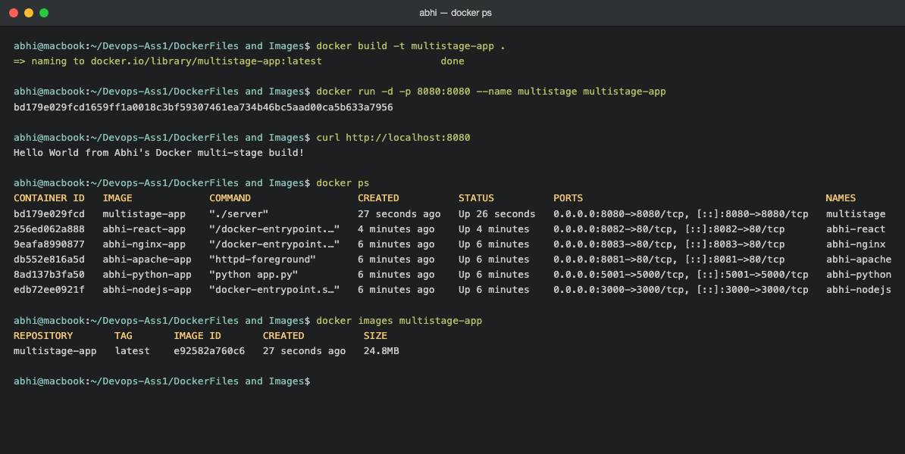
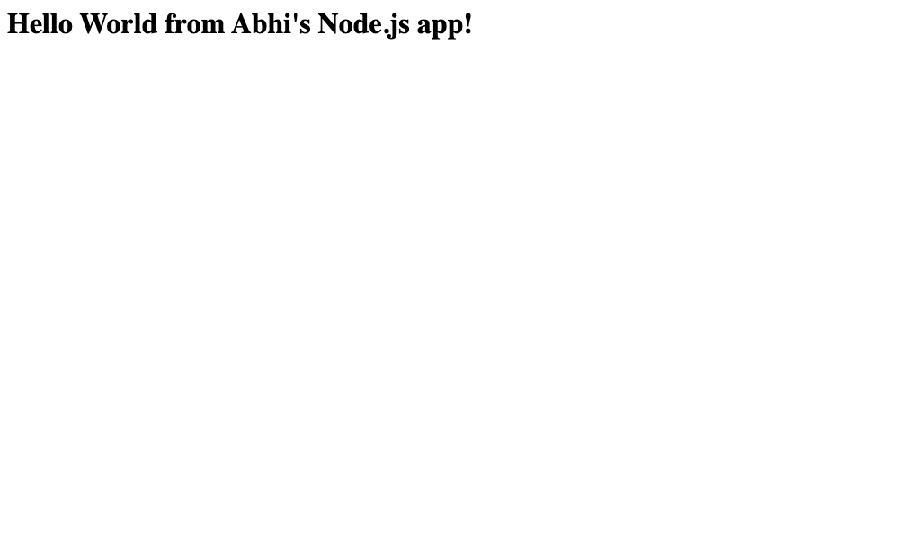
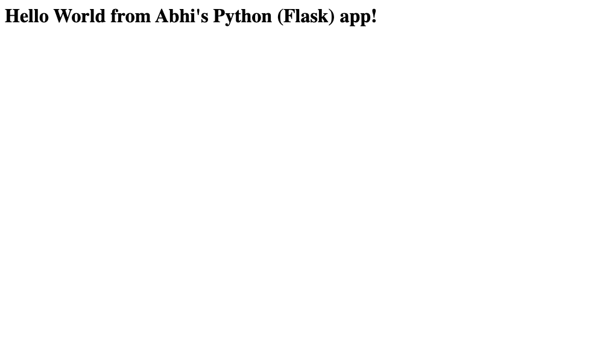
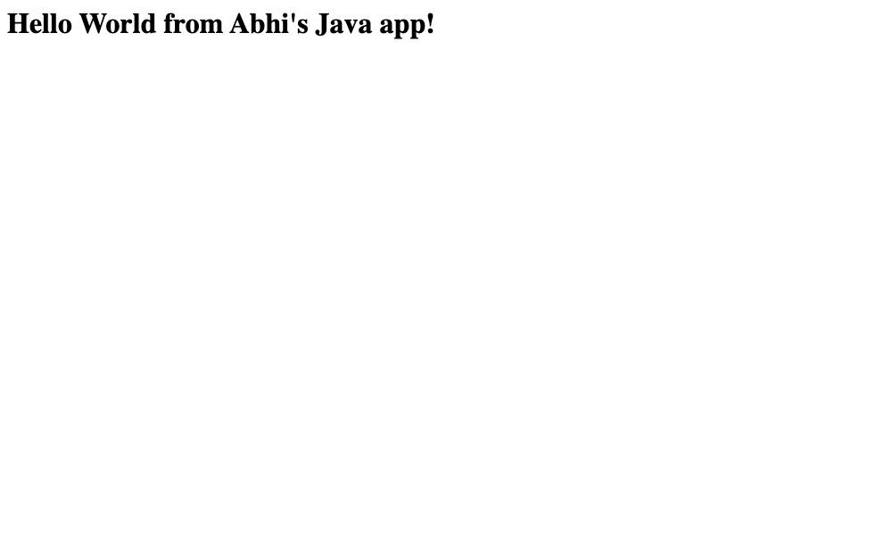

# Docker Multi-Stage Build - Homework

**Name:** Abhi Gandhi
**Enrollment Number:** 24bcs10397

## Task 1: Multi-Stage Dockerfile

A multi-stage build uses more than one `FROM` stage in a single Dockerfile. An early stage
compiles the application, and the final stage copies only the finished binary into a small
base image. This keeps the final image tiny because the build tools (here, the whole Go
toolchain) are left behind.

### The application (main.go)
```go
package main

import (
	"fmt"
	"net/http"
)

const listenAddr = ":8080"

func main() {
	http.HandleFunc("/", func(writer http.ResponseWriter, request *http.Request) {
		fmt.Fprintln(writer, "Hello World from Abhi's Docker multi-stage build!")
	})

	fmt.Println("Server listening on port 8080")
	http.ListenAndServe(listenAddr, nil)
}
```

### The multi-stage Dockerfile
```dockerfile
# ---- Stage 1: Build ----
FROM golang:1.23-alpine AS build
WORKDIR /app
COPY main.go ./
RUN CGO_ENABLED=0 go build -o server main.go

# ---- Stage 2: Run ----
FROM alpine:3.20
WORKDIR /app
COPY --from=build /app/server ./
EXPOSE 8080
CMD ["./server"]
```

### Build and run
```bash
docker build -t multistage-app .
docker run -d -p 8080:8080 --name multistage multistage-app
```

### Verify the application
```bash
$ curl http://localhost:8080
Hello World from Abhi's Docker multi-stage build!
```

### Verify the running container (docker ps)
```bash
$ docker ps
NAMES        IMAGE            STATUS         PORTS
multistage   multistage-app   Up 2 seconds   0.0.0.0:8080->8080/tcp
```
The application is confirmed running on **port 8080**.

### Result of multi-stage build
The final image is only about **25 MB**, because the Go compiler and source code stay in
the build stage and only the compiled binary is copied into the final Alpine image.

## Task 2: Screenshots

Application running successfully in the browser:


`docker ps` showing the running container on port 8080:



## Task 3: Docker Application Deployment

Three different types of applications were deployed using Docker (see the
`Docker Fundamentals` folder for the full code and Dockerfiles):

| Application | Language / Stack | Host port | Output |
|---|---|---|---|
| Node.js | Node.js (http server) | 3000 | Hello World from Abhi's Node.js app! |
| Python | Python (Flask) | 5001 | Hello World from Abhi's Python (Flask) app! |
| Java | Java (HttpServer) | 8080 | Hello World from Abhi's Java app! |

Python is mapped to host port 5001 because macOS AirPlay Receiver already listens on port 5000.

Build and run example (Node.js):
```bash
cd nodejs-app
docker build -t abhi-nodejs-app .
docker run -d -p 3000:3000 abhi-nodejs-app
# open http://localhost:3000
```

Screenshots of all three running applications:




