# Final DevOps Project & Troubleshooting - ReadTrack

**Name:** Abhi Gandhi
**Enrollment Number:** 24bcs10397

For the final project I built **ReadTrack**, a small reading-list tracker (FastAPI + PostgreSQL
backend, Vite/nginx frontend), and took it all the way from my laptop to a monitored,
GitOps-managed Kubernetes cluster:

```text
Application -> Git -> GitHub -> CI pipeline -> Build & Test -> Security scanning -> Docker images
  -> GHCR (SHA tags) -> Kubernetes (kind) -> Helm -> Monitoring (Prometheus/Grafana) -> GitOps (Argo CD)
                         ^
             Terraform: VPC / subnets / IAM / EKS / S3 on LocalStack + the kind cluster itself
```

Everything in this README was really run by me; outputs are trimmed copies of the real terminal
output and the screenshots are rendered from the transcripts of my `run-labs*.sh` scripts.

| Deliverable | Where |
|---|---|
| Application (backend + frontend + DB migration + tests) | [application/](application) |
| Dockerfiles + compose | [docker/](docker) |
| Plain Kubernetes manifests + namespaces + add-ons | [kubernetes/](kubernetes) |
| Helm chart (dev / prod values) | [helm/readtrack/](helm/readtrack) |
| Terraform (AWS on LocalStack, remote state, kind cluster) | [terraform/](terraform) |
| Security configs + policy gate | [security/](security) |
| Prometheus / Grafana values, dashboard, PromQL helper | [monitoring/](monitoring) |
| Argo CD AppProject + Application + GitOps values | [gitops/](gitops) |
| Troubleshooting challenge (broken + fixed overlays, script) | [troubleshooting/](troubleshooting) |
| CI/CD workflow | [.github/workflows/final-project.yml](../.github/workflows/final-project.yml) |
| Green pipeline run | [run #7 - 37674093998](https://github.com/AbhiGandhi02/Devops-Assignment/actions/runs/37674093998) (all 12 jobs green) |
| Lab scripts that produced the screenshots | `run-labs.sh`, `run-labs-k8s.sh`, `run-labs-security.sh`, `run-labs-monitoring.sh`, `run-labs-gitops.sh`, `run-labs-cicd.sh`, `troubleshooting/run-troubleshooting.sh` |
| Screenshots | [screenshots/](screenshots) - 65 images (`k21-01` ... `k21-65`) |

## Contents

1. [Project overview](#1-project-overview)
2. [Architecture](#2-architecture)
3. [Technologies used](#3-technologies-used)
4. [Application setup](#4-application-setup)
5. [Docker setup](#5-docker-setup)
6. [Terraform infrastructure](#6-terraform-infrastructure)
7. [Kubernetes deployment](#7-kubernetes-deployment)
8. [Helm deployment](#8-helm-deployment)
9. [CI/CD pipeline](#9-cicd-pipeline)
10. [DevSecOps implementation](#10-devsecops-implementation)
11. [Monitoring, logs and metrics](#11-monitoring-logs-and-metrics)
12. [GitOps with Argo CD](#12-gitops-with-argo-cd)
13. [Final troubleshooting challenge](#13-final-troubleshooting-challenge)
14. [Screenshots index](#14-screenshots-index)
15. [Limitations](#15-limitations)
16. [Lessons learned](#16-lessons-learned)

---

## 1. Project overview

ReadTrack keeps a personal reading list: books with a status (want to read / reading /
finished), page count and a 1-5 rating, plus statistics (pages read, average rating). It is
deliberately small, but it has the parts a real service has: a REST API, a database with
migrations, a separate frontend, health/readiness endpoints, Prometheus metrics and JSON logs.

| Endpoint | Purpose |
|---|---|
| `GET /health` | liveness - the process answers HTTP |
| `GET /ready` | readiness - runs `SELECT 1` against PostgreSQL, 503 if the DB is unreachable |
| `GET /metrics` | Prometheus metrics (requests, latency histogram, books created/deleted, `readtrack_db_up`) |
| `GET /api/info` | version (= image SHA), environment and welcome message from the ConfigMap |
| `GET /api/books?status=` | list books, optional status filter |
| `GET /api/books/{id}` | one book |
| `POST /api/books` | create (validated with pydantic) |
| `PUT /api/books/{id}` | partial update |
| `DELETE /api/books/{id}` | delete |
| `GET /api/books/stats` | totals by status, pages read, average rating |

**Environments in my cluster**

| Namespace | Deployed by | Host (port 8180) |
|---|---|---|
| `readtrack` | plain manifests, `kubectl apply -k kubernetes/` | `readtrack-k8s.localhost` |
| `readtrack-dev` | `helm upgrade --install` with `values-dev.yaml` | `readtrack-dev.localhost` |
| `readtrack-prod` | **Argo CD** from Git (`values-prod.yaml` + `gitops/values-gitops.yaml`) | `readtrack.localhost` |
| `readtrack-ts` | troubleshooting challenge (8 injected bugs) | `readtrack-ts.localhost` |

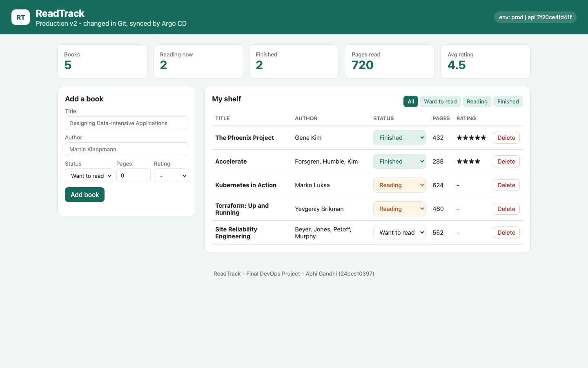

The header shows `env: prod | api 7f20ce4fd41f` - the image tag of the commit that the pipeline
built and Argo CD deployed, and the welcome message comes from Git (see section 12).

## 2. Architecture

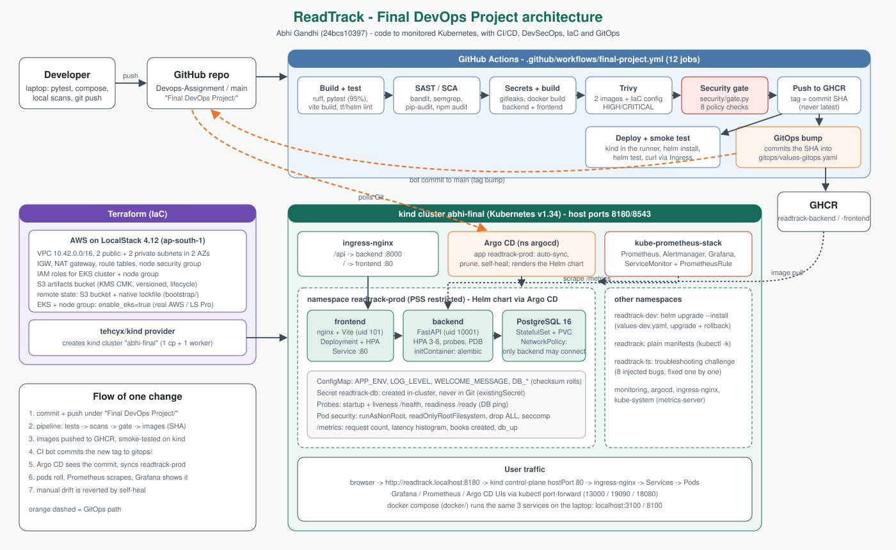

(A PNG copy is in [architecture.png](architecture.png).) The flow of one change:

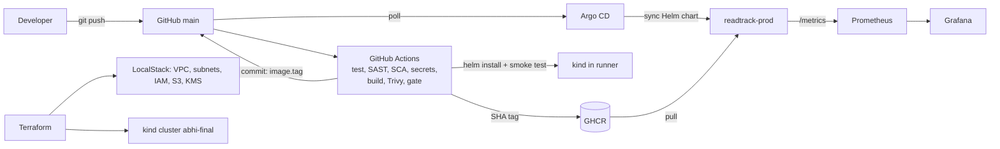
```mermaid
flowchart LR
  dev[Developer] -->|git push| gh[GitHub main]
  gh --> ci[GitHub Actions<br/>test, SAST, SCA, secrets,<br/>build, Trivy, gate]
  ci -->|SHA tag| ghcr[(GHCR)]
  ci -->|helm install + smoke test| kindci[kind in runner]
  ci -->|bot commit: image.tag| gh
  gh -->|poll| argo[Argo CD]
  argo -->|sync Helm chart| prod[readtrack-prod]
  ghcr -->|pull| prod
  prod -->|/metrics| prom[Prometheus] --> graf[Grafana]
  tf[Terraform] --> ls[LocalStack: VPC, subnets, IAM, S3, KMS]
  tf --> kind[kind cluster abhi-final]
```

## 3. Technologies used

| Area | Tools (versions I used) |
|---|---|
| Backend | Python 3.12, FastAPI 0.142, SQLAlchemy 2.1, Alembic 1.20, psycopg 3, prometheus-client |
| Frontend | Vite 7 (vanilla JS), nginx-unprivileged 1.27 |
| Database | PostgreSQL 16 (alpine) |
| Tests / quality | pytest 9, pytest-cov, httpx TestClient, ruff (lint + format) |
| Containers | Docker Desktop, docker compose, multi-stage builds, non-root users |
| IaC | Terraform 1.16 (CI 1.13), hashicorp/aws 6.x, tehcyx/kind 0.11, LocalStack 4.12 community |
| Kubernetes | kind (k8s v1.34), ingress-nginx 1.13.3, metrics-server 0.8, kustomize |
| Packaging | Helm v4.3 (chart `readtrack` 1.0.0 with `helm test`) |
| CI/CD | GitHub Actions, GHCR, helm/kind-action |
| DevSecOps | Bandit, Semgrep, pip-audit, npm audit, Gitleaks 8.24, Trivy 0.75, custom gate |
| Monitoring | kube-prometheus-stack 92.1 (Prometheus, Alertmanager, Grafana), ServiceMonitor, PrometheusRule |
| GitOps | Argo CD v3.5.4 (AppProject, automated sync, prune, self-heal) |

## 4. Application setup

```text
application/
  backend/   app/{main,config,db,models,schemas,metrics}.py, alembic/versions/0001_create_books.py,
             tests/{conftest,test_api,test_migrations}.py, pytest.ini, ruff.toml, requirements*.txt
  frontend/  index.html, src/{main.js,api.js,style.css}, nginx.conf.template, package.json (Vite)
```

Design points:

* All configuration is environment variables (`DATABASE_URL`, `APP_ENV`, `LOG_LEVEL`,
  `WELCOME_MESSAGE`, `APP_VERSION`), so one image works in compose, Kubernetes and tests.
* The schema is owned by **Alembic**. In Kubernetes an initContainer runs `alembic upgrade head`;
  because 2-3 backend replicas start together, `alembic/env.py` takes a PostgreSQL **advisory
  lock** first so only one pod migrates.
* Tests use a fresh **in-memory SQLite** database per test (`conftest.py` overrides the
  `get_db` dependency), never the real PostgreSQL. One extra test runs the Alembic migration up
  and down on a temporary SQLite file.
* Logs are one JSON object per request (method, path, status, ms) so they can be filtered.
* Metrics use the **route template** (`/api/books/{book_id}`) as label, not the raw URL, so
  the label cardinality stays small.

Run locally:

```bash
cd application/backend && python -m venv .venv && . .venv/bin/activate
pip install -r requirements-dev.txt && pytest -v --cov=app
cd ../frontend && npm ci && npm run dev        # proxies /api to localhost:8000
```

```text
$ cd application/backend && pytest -v --cov=app --cov-report=term
tests/test_api.py::test_health PASSED                                    [  9%]
tests/test_api.py::test_ready_checks_database PASSED                     [ 18%]
tests/test_api.py::test_create_and_get_book PASSED                       [ 27%]
...
tests/test_migrations.py::test_alembic_upgrade_and_downgrade PASSED      [100%]
TOTAL               178      9    95%
======================== 11 passed, 1 warning in 0.22s =========================
```

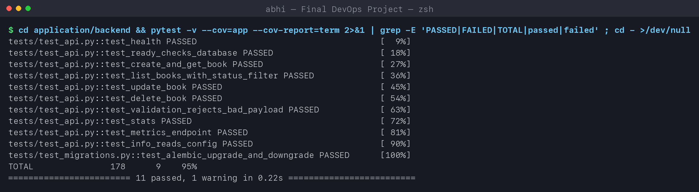
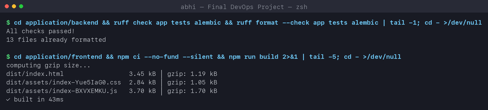

**What I understood:** 11 tests cover all CRUD endpoints, validation errors, stats, metrics,
health/ready and the migration itself, with 95% coverage. The CI fails under 85%.

## 5. Docker setup

| File | Notes |
|---|---|
| [docker/backend.Dockerfile](docker/backend.Dockerfile) | stage 1 builds a venv, stage 2 copies it into `python:3.12-slim`; OS packages upgraded; **pip removed**; runs as **uid 10001**; HEALTHCHECK on `/health` |
| [docker/frontend.Dockerfile](docker/frontend.Dockerfile) | stage 1 `node:22-alpine` runs `npm ci && npm run build`; stage 2 `nginx-unprivileged` (uid 101, port 8080) serves `dist/` and proxies `/api` to `$BACKEND_URL` |
| [docker/docker-compose.yml](docker/docker-compose.yml) | postgres (healthcheck + volume) -> backend (runs `alembic upgrade head` then uvicorn) -> frontend |

Base images come from `public.ecr.aws` where possible, because Docker Hub anonymous pulls were
rate-limited (HTTP 429) earlier in the day.

```text
$ docker compose -f docker/docker-compose.yml up -d --build
 Image readtrack-backend:compose Built
 Image readtrack-frontend:compose Built
 Container readtrack-postgres-1 Healthy
 Container readtrack-backend-1 Started
 Container readtrack-frontend-1 Started
backend-1  | INFO  [alembic.runtime.migration] Running upgrade  -> 0001, create books table

$ curl -s -X PUT localhost:3100/api/books/1 -H 'Content-Type: application/json' -d '{"status":"finished","rating":5}'
{"title":"The Phoenix Project","author":"Gene Kim","status":"finished","pages":432,"rating":5,"id":1,...}
$ curl -s -o /dev/null -w 'DELETE /api/books/2 -> HTTP %{http_code}\n' -X DELETE localhost:3100/api/books/2
DELETE /api/books/2 -> HTTP 204

$ docker run --rm --entrypoint id readtrack-backend:compose; docker run --rm --entrypoint id readtrack-frontend:compose
uid=10001(readtrack) gid=10001(readtrack) groups=10001(readtrack)
uid=101(nginx) gid=101(nginx) groups=101(nginx),101(nginx)
```

(Ports 3000/8000 were already used by other programs on my laptop, so I ran compose with
`FRONTEND_PORT=3100 BACKEND_PORT=8100`; the defaults in the file are 3000/8000.)

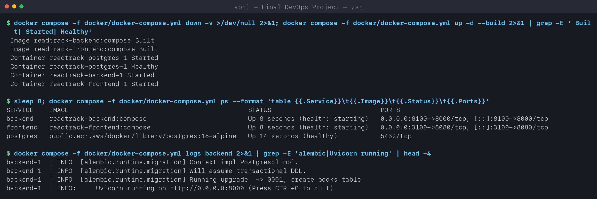
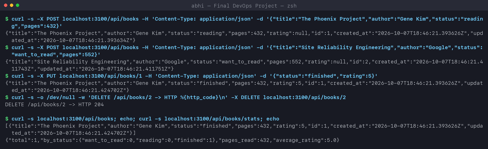
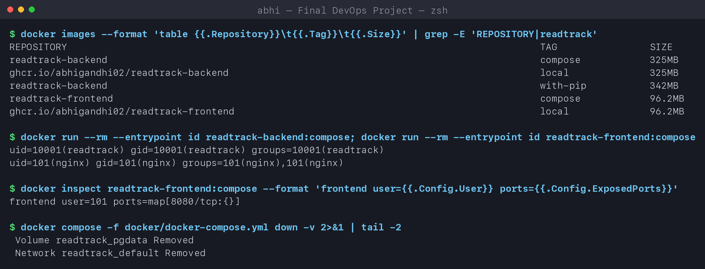

## 6. Terraform infrastructure

My real AWS credentials are not valid, so I pointed the AWS provider at **LocalStack**
(`use_localstack = true`: dummy `test` keys, `skip_*` flags, endpoints on `localhost:4566`).
The same code works on real AWS with `use_localstack = false`.

| Stack | What it creates |
|---|---|
| [terraform/bootstrap](terraform/bootstrap/main.tf) | S3 bucket for **remote state** (versioned, KMS-encrypted, public access blocked) |
| [terraform/](terraform) (main) | VPC `10.42.0.0/16`, **2 public + 2 private subnets in 2 AZs** (with `kubernetes.io/role/elb` tags), IGW, NAT gateway + EIP, route tables, node security group, **IAM roles for EKS cluster and node group**, KMS key + S3 artifacts bucket (versioning, lifecycle), **EKS cluster + managed node group** behind `enable_eks` |
| [terraform/kind-cluster](terraform/kind-cluster/main.tf) | the local Kubernetes cluster `abhi-final` via the `tehcyx/kind` provider (control-plane with `ingress-ready=true` and host ports 8180/8543, plus one worker) |

The main stack uses an `s3` backend with partial config
([backend-localstack.hcl](terraform/backend-localstack.hcl)) and Terraform's native S3
locking (`use_lockfile = true`). No credentials are committed - only
[terraform.tfvars.example](terraform/terraform.tfvars.example).

```text
$ terraform -chdir=terraform init -backend-config=backend-localstack.hcl
Successfully configured the backend "s3"! Terraform will automatically
$ terraform -chdir=terraform plan -out=tfplan
  # aws_eip.nat will be created
  # aws_eks ... (IAM roles, route tables, subnets, KMS, S3, SG rules) ...
  # aws_vpc.main will be created
Plan: 31 to add, 0 to change, 0 to destroy.
$ terraform -chdir=terraform apply tfplan
Apply complete! Resources: 31 added, 0 changed, 0 destroyed.

$ aws --endpoint-url http://localhost:4566 ec2 describe-subnets --filters Name=tag:Project,Values=readtrack ...
|  subnet-89cf11098ddb800a1 |  10.42.0.0/24  |  ap-south-1a |  public   |
|  subnet-9770f148f903e7971 |  10.42.10.0/24 |  ap-south-1a |  private  |
|  subnet-03ac3c99cc97f231e |  10.42.1.0/24  |  ap-south-1b |  public   |
|  subnet-7dbb5647545cb37d5 |  10.42.11.0/24 |  ap-south-1b |  private  |
$ aws --endpoint-url http://localhost:4566 s3 ls s3://readtrack-tfstate-24bcs10397 --recursive
2026-10-08 00:12:13      56782 final-project/terraform.tfstate
```

EKS is a LocalStack **Pro** feature, so on community LocalStack I keep `enable_eks = false`.
`terraform plan -var enable_eks=true` still shows exactly what real AWS would get:

```text
  # aws_eks_cluster.main[0] will be created
      + name                          = "readtrack-dev-eks"
      + version                       = "1.33"
  # aws_eks_node_group.default[0] will be created
      + node_group_name        = "readtrack-dev-ng"
          + desired_size = 2
Plan: 2 to add, 1 to change, 0 to destroy.
```

(The "1 to change" is a LocalStack quirk: it returns the self-referencing security group rule
as `000000000000/sg-...` instead of `sg-...`, so Terraform always sees a diff. On real AWS
this does not happen.)

```text
$ terraform -chdir=terraform destroy -auto-approve
Destroy complete! Resources: 31 destroyed.
$ aws --endpoint-url http://localhost:4566 ec2 describe-vpcs --filters Name=tag:Project,Values=readtrack --query 'length(Vpcs)'
0
```

After the destroy demo I applied the stack again so it is still there.

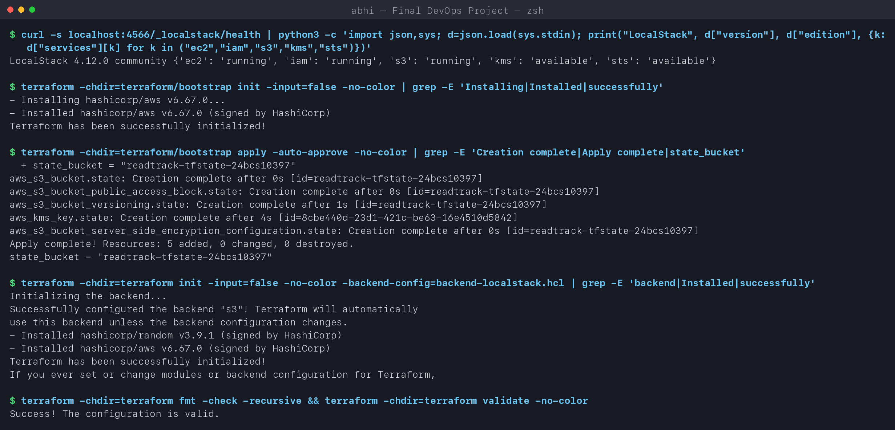
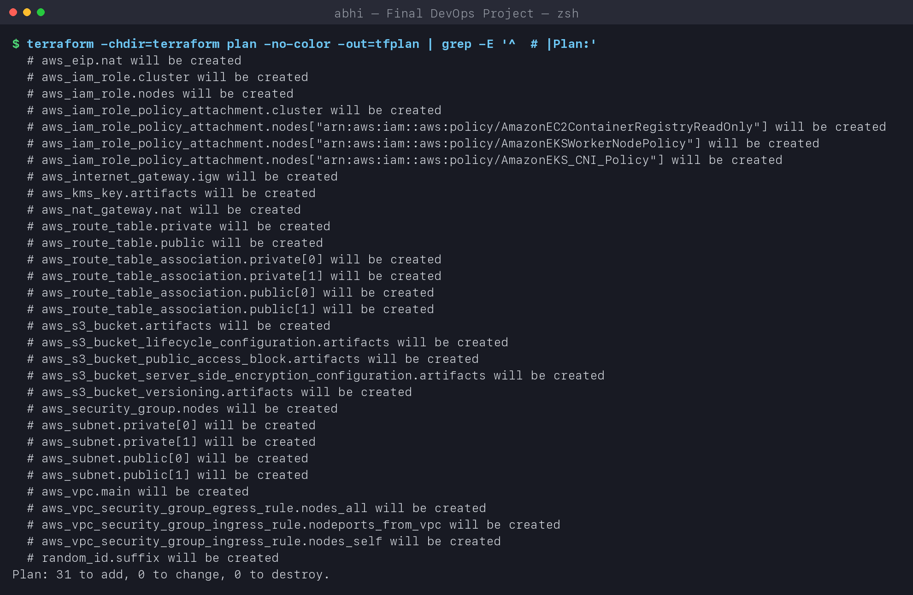
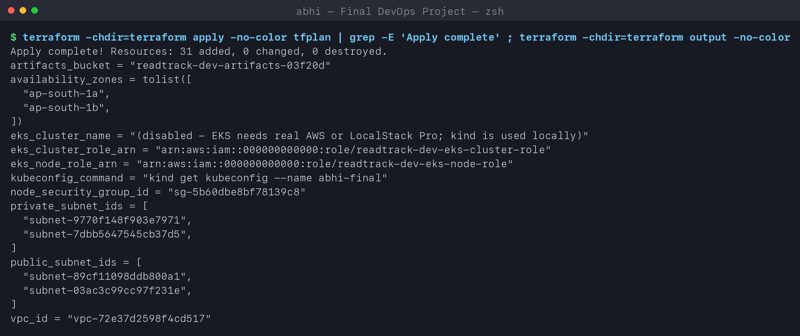
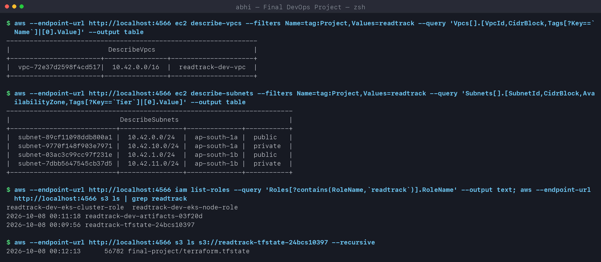
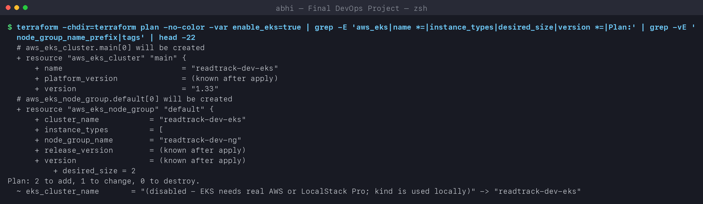
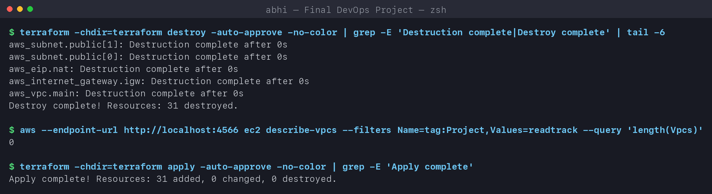
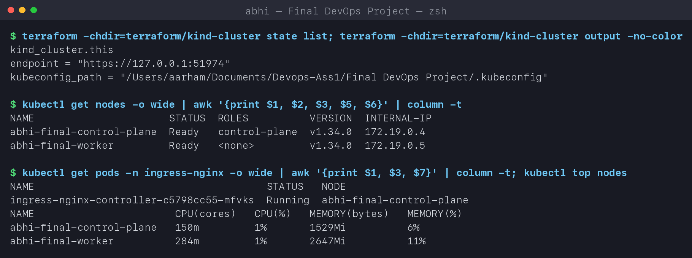

**What I understood:** the kind provider bundles its own kind library - with the newest
`kindest/node:v1.37` image `kubeadm init` failed, with `v1.34.0` it worked. Pinning the node
image by digest in Terraform makes the cluster reproducible.

## 7. Kubernetes deployment

Cluster add-ons ([kubernetes/addons/install-addons.sh](kubernetes/addons/install-addons.sh)):
ingress-nginx (pinned to the `ingress-ready` control-plane - otherwise it lands on the worker,
which has no host port mapping, and every request gets "Empty reply from server"; I hit this)
and metrics-server (with `--kubelet-insecure-tls` for kind).

| Requirement | Where |
|---|---|
| Namespace (+ Pod Security `restricted`) | [kubernetes/namespace.yaml](kubernetes/namespace.yaml) |
| Deployment | [backend.yaml](kubernetes/manifests/backend.yaml), [frontend.yaml](kubernetes/manifests/frontend.yaml) - 2 replicas each |
| Service | ClusterIP for backend (8000), frontend (80), headless for postgres |
| ConfigMap | [configmap.yaml](kubernetes/manifests/configmap.yaml) via `envFrom` |
| Secret | `readtrack-db` created with `kubectl create secret` (never in Git), referenced with `secretKeyRef` |
| Ingress | [ingress.yaml](kubernetes/manifests/ingress.yaml) - `/api` -> backend, `/` -> frontend |
| HPA | [hpa.yaml](kubernetes/manifests/hpa.yaml) - CPU 70%, 2-5 replicas |
| Probes | startup + liveness `/health`, readiness `/ready`; nginx `/healthz`; `pg_isready` for postgres |
| Storage | PostgreSQL **StatefulSet** with `volumeClaimTemplates` (1Gi PVC) |
| Security | non-root, read-only root FS, all capabilities dropped, seccomp, no SA token |

```text
$ kubectl get deploy,sts,svc,ingress,hpa,pvc -n readtrack
deployment.apps/readtrack-backend    2/2     2            2           37m
deployment.apps/readtrack-frontend   2/2     2            2           37m
statefulset.apps/readtrack-postgres   1/1     37m
ingress.networking.k8s.io/readtrack   nginx   readtrack-k8s.localhost   localhost   80      37m
horizontalpodautoscaler.autoscaling/readtrack-backend   Deployment/readtrack-backend   cpu: 19%/70%   2   5   2
persistentvolumeclaim/data-readtrack-postgres-0   Bound    pvc-9f64c015-...   1Gi   RWO   standard

$ kubectl -n readtrack delete pod readtrack-postgres-0 && kubectl -n readtrack wait --for=condition=Ready pod/readtrack-postgres-0
pod/readtrack-postgres-0 condition met
$ curl -s http://readtrack-k8s.localhost:8180/api/books | ...
1 Kubernetes Up and Running - reading          <- data survived the pod restart (PVC)
```

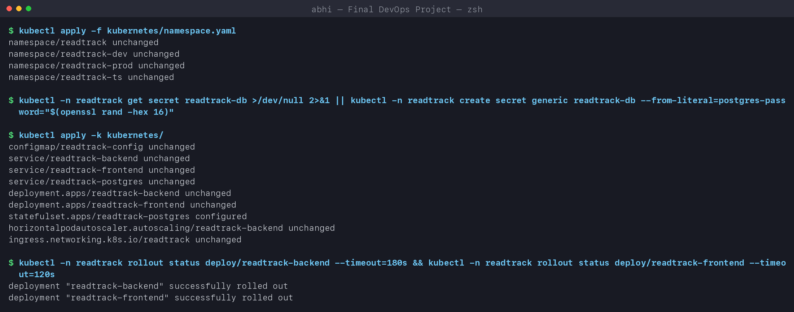
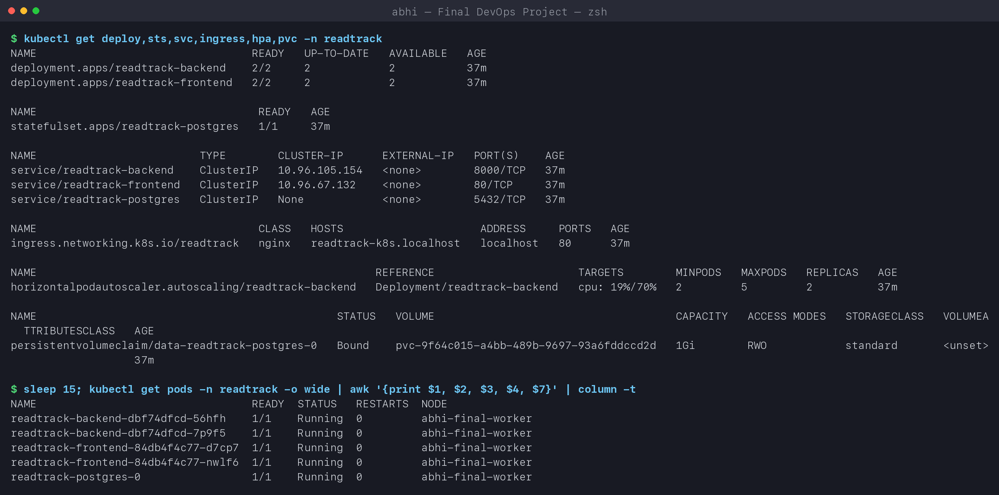
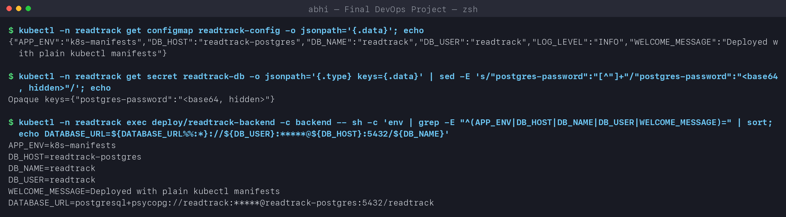
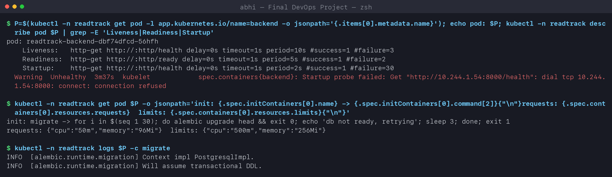
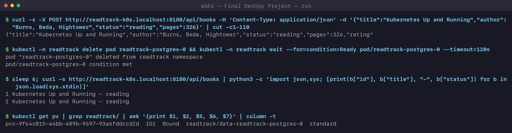

The probes screenshot even shows a real `Startup probe failed ... connection refused` event:
uvicorn needed a moment to bind, and the startup probe (30 x 2s budget) absorbed it instead of
the liveness probe killing the container.

**NetworkPolicy and Pod Security** (Helm chart, namespace `readtrack-dev`):

```text
$ kubectl -n readtrack-dev exec deploy/readtrack-frontend -- sh -c 'nc -zv -w 3 readtrack-postgres 5432 || echo BLOCKED'
nc: readtrack-postgres (10.244.1.70:5432): Operation timed out
frontend -> postgres:5432 BLOCKED
$ kubectl -n readtrack-dev exec deploy/readtrack-backend -c backend -- python -c "...create_connection(('readtrack-postgres', 5432))..."
backend  -> postgres:5432 connected
$ kubectl -n readtrack-dev run root-test --image=busybox:1.36 --restart=Never -- id
Error from server (Forbidden): pods "root-test" is forbidden: violates PodSecurity "restricted:latest": ...
```

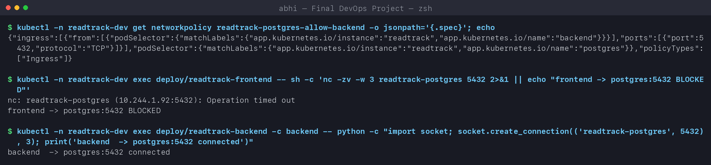
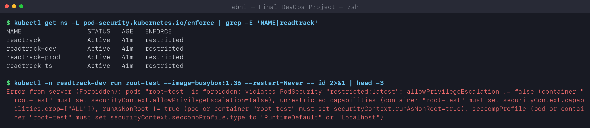

## 8. Helm deployment

Chart: [helm/readtrack](helm/readtrack) - templates for ConfigMap, Secret (optional),
PostgreSQL StatefulSet, backend/frontend Deployments + Services, Ingress, 2 HPAs, 2 PDBs,
NetworkPolicy, ServiceMonitor, PrometheusRule, NOTES.txt and a `helm test` pod.

| Values file | Used for | Differences |
|---|---|---|
| [values.yaml](helm/readtrack/values.yaml) | defaults | 2 replicas, HPA 2-5 on backend |
| [values-dev.yaml](helm/readtrack/values-dev.yaml) | `readtrack-dev` (helm CLI) | DEBUG logs, host `readtrack-dev.localhost`, monitoring on |
| [values-prod.yaml](helm/readtrack/values-prod.yaml) | `readtrack-prod` (Argo CD) | backend HPA 3-8, frontend HPA on, bigger requests, 2Gi PVC |
| [gitops/values-gitops.yaml](gitops/values-gitops.yaml) | layered on prod by Argo CD | image tag (bumped by CI), welcome message, `existingSecret` |

Notable template details: a `checksum/config` annotation rolls the pods whenever the ConfigMap
changes, `replicas` is omitted when an HPA owns the Deployment (so Helm/Argo and the HPA do not
fight), and the Secret is either created from `--set-string database.password` (with
`required`) or taken from `database.existingSecret`.

```text
$ helm upgrade --install readtrack helm/readtrack -n readtrack-dev -f helm/readtrack/values-dev.yaml \
    --set image.tag=060be798b4ca... --set database.existingSecret=readtrack-db --wait
STATUS: deployed
REVISION: 1
$ helm upgrade ... --set image.tag=178914b59c50... --set config.welcomeMessage='Dev - upgraded by helm upgrade'
REVISION: 2
$ curl -s http://readtrack-dev.localhost:8180/api/info
{"version":"178914b59c5055c40345094cf4c0bcb6a336c339","env":"dev","message":"Dev - upgraded by helm upgrade"}
$ helm rollback readtrack 1 -n readtrack-dev --wait && helm history readtrack -n readtrack-dev
1  superseded  Install complete
2  superseded  Upgrade complete
3  deployed    Rollback to 1
$ curl -s http://readtrack-dev.localhost:8180/api/info
{"version":"060be798b4caa5007d7ea4429f31c0304a9a0ce7","env":"dev","message":"Dev environment - deployed with Helm"}
$ helm test readtrack -n readtrack-dev --logs
/health -> {"status":"ok"}
/ready -> {"status":"ready"}
helm test passed
```

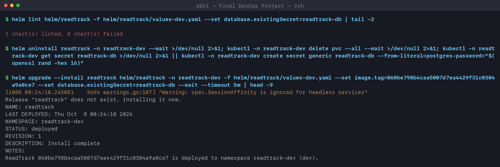
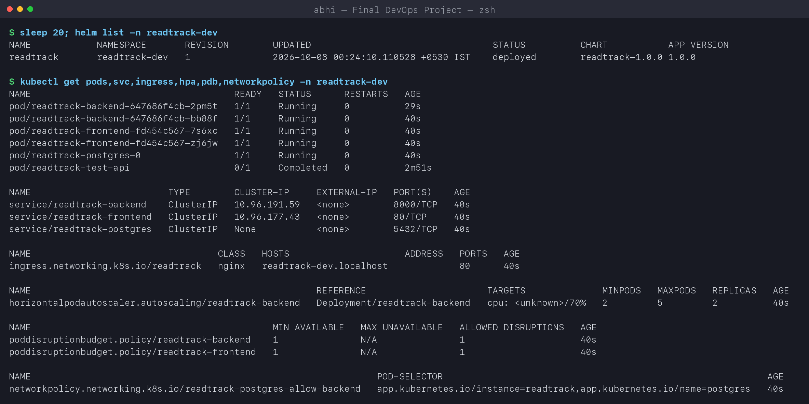
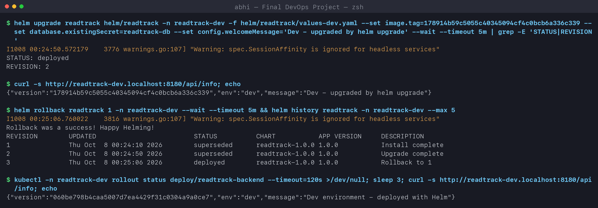
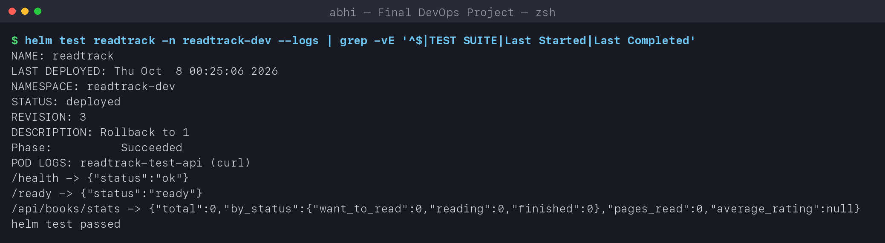
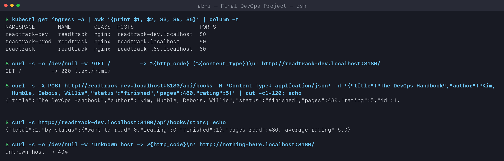

**HPA under load** (`ab -c 40 -t 75` against `/api/books/stats` through the Ingress):

```text
NAME                REFERENCE                      TARGETS              MINPODS   MAXPODS   REPLICAS
readtrack-backend   Deployment/readtrack-backend   cpu: <unknown>/70%   2         5         2
Complete requests:      17720
Failed requests:        0
readtrack-backend   Deployment/readtrack-backend   cpu: 901%/70%        2         5         5
  Normal   SuccessfulRescale   New size: 5; reason: cpu resource utilization (percentage of request) above target
```

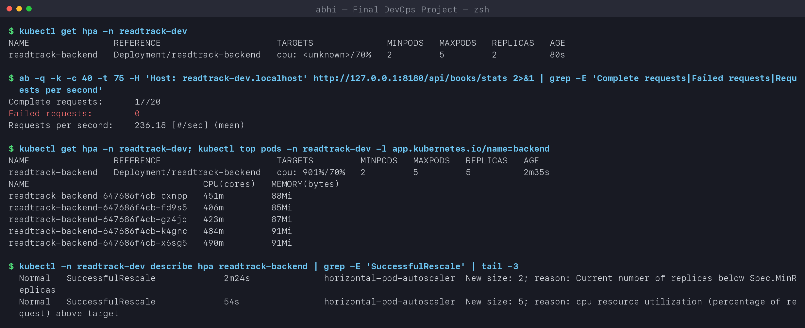

## 9. CI/CD pipeline

Workflow: [.github/workflows/final-project.yml](../.github/workflows/final-project.yml). It runs
on push to `main` (only when files in `Final DevOps Project/` or the workflow change; screenshots,
docs and the `gitops/` folder are excluded), on PRs and manually.

| # | Job | What it does |
|---|---|---|
| 1 | Backend lint + pytest | `ruff check`, `ruff format --check`, pytest with coverage >= 85% (fails the build) |
| 2 | Frontend build | `npm ci && npm run build` |
| 3 | Terraform + Helm validate | `terraform fmt -check`, `init -backend=false`, `validate` for all 3 stacks; `helm lint` dev+prod; render chart and kustomize |
| 4 | SAST | Bandit (JSON + SARIF uploaded to code scanning) + Semgrep `p/python`, `p/dockerfile` |
| 5 | SCA | pip-audit + npm audit |
| 6 | Secret scan | Gitleaks 8.24 over the project tree |
| 7 | Docker build | both images tagged with `${{ github.sha }}`, `id` check, saved as an artifact |
| 8 | Trivy | image scan of both images + `trivy config` (Dockerfiles, K8s, Helm, Terraform) |
| 9 | Security gate | [security/gate.py](security/gate.py) over all reports |
| 10 | Push to GHCR | pushes **the exact images that were scanned**, SHA tags only |
| 11 | Deploy + smoke test | kind in the runner, ingress-nginx, pull from GHCR, `helm upgrade --install`, `helm test`, CRUD calls through the Ingress |
| 12 | GitOps bump | commits the new SHA into `gitops/values-gitops.yaml` (Argo CD deploys it) |

```text
$ gh run view 37674093998 -R AbhiGandhi02/Devops-Assignment
JOBS
✓ 3. Terraform + Helm validate in 1m14s
✓ 1. Backend lint + pytest in 19s
✓ 2. Frontend build (Vite) in 11s
✓ 4. SAST (Bandit + Semgrep) in 37s
✓ 5. SCA (pip-audit + npm audit) in 28s
✓ 6. Secret scan (Gitleaks) in 9s
✓ 7. Docker build (backend + frontend) in 46s
✓ 8. Trivy (images + IaC) in 1m8s
✓ 9. Security gate in 10s
✓ 10. Push images to GHCR in 31s
✓ 11. Deploy to Kubernetes (Helm on kind) + smoke test in 2m9s
✓ 12. GitOps - bump image tag for Argo CD in 13s
```

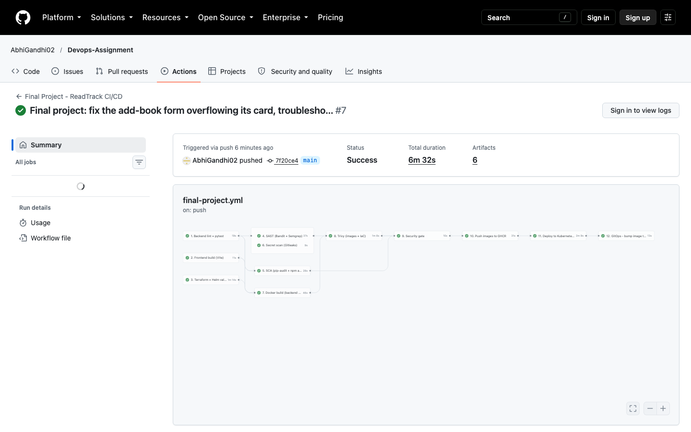
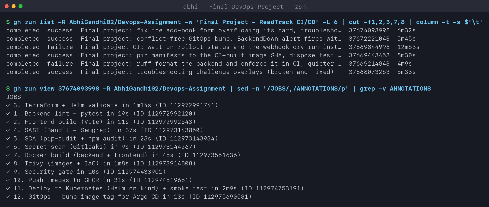
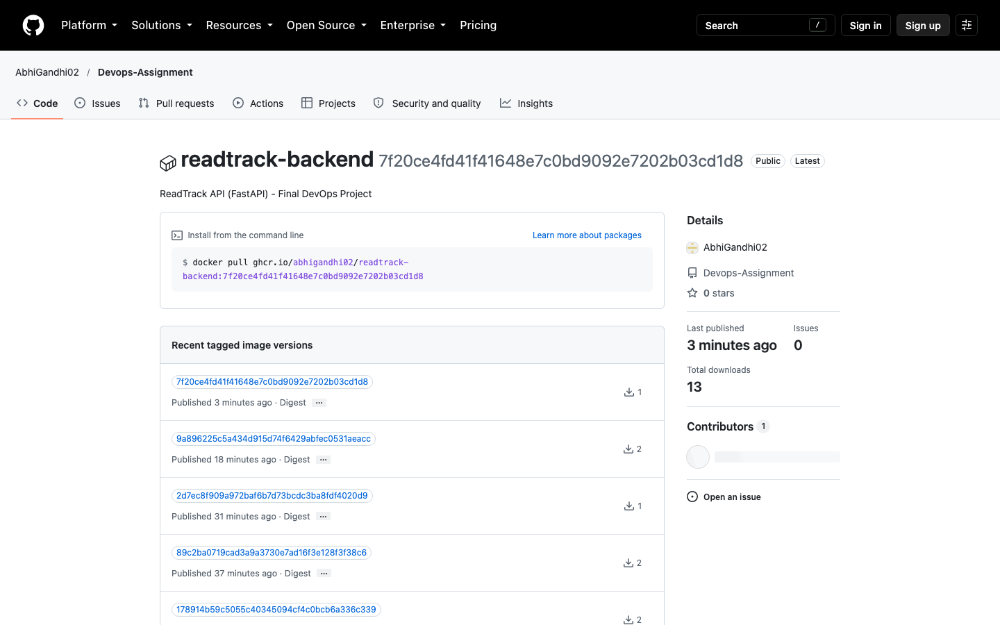

**Live demo of "commit a change -> pipeline -> deployment updates":** the UI form had a
layout bug (the rating select overflowed its card). I fixed the CSS in commit `7f20ce4` and
only pushed. The pipeline went green, pushed `readtrack-frontend:7f20ce4...` to GHCR, the bot
committed `7eaea8f Final project GitOps: deploy readtrack 7f20ce4 to prod`, and Argo CD rolled
out prod - without me running any kubectl/helm command:

```text
$ git log --oneline -3 -- application/frontend/src/style.css gitops/values-gitops.yaml
7eaea8f Final project GitOps: deploy readtrack 7f20ce4 to prod
7f20ce4 Final project: fix the add-book form overflowing its card, troubleshooting and GitOps lab scripts
6d4d298 Final project GitOps: deploy readtrack 9a89622 to prod
$ kubectl -n readtrack-prod get deploy -o custom-columns=NAME:.metadata.name,READY:.status.readyReplicas,IMAGE:...
readtrack-backend    3       ghcr.io/abhigandhi02/readtrack-backend:7f20ce4fd41f41648e7c0bd9092e7202b03cd1d8
readtrack-frontend   2       ghcr.io/abhigandhi02/readtrack-frontend:7f20ce4fd41f41648e7c0bd9092e7202b03cd1d8
```

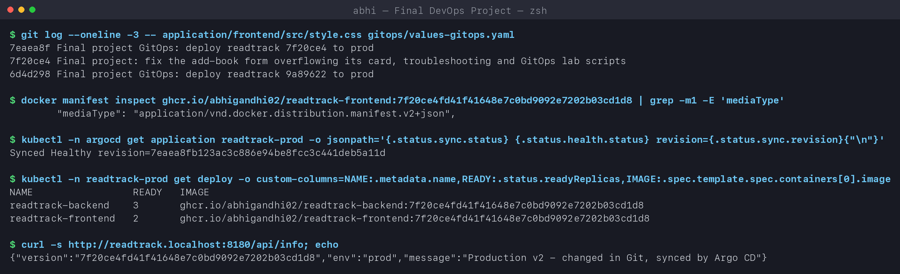
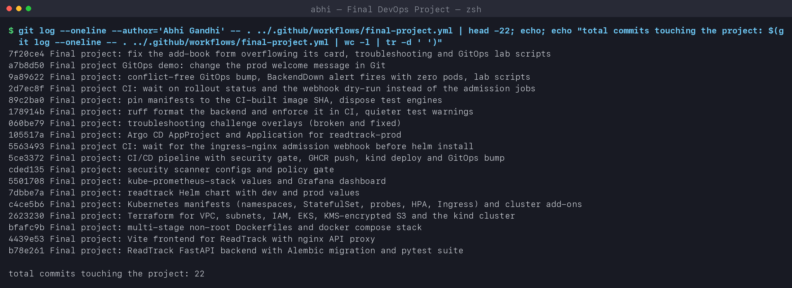

**Pipeline problems I hit and fixed (real failed runs in the history):**

| Run | Failure | Fix |
|---|---|---|
| #1 | `helm install` failed: `failed calling webhook "validate.nginx.ingress.kubernetes.io"` - the controller was "Available" before its admission webhook answered | wait until a server-side dry-run Ingress is accepted |
| #3 | `jobs.batch "ingress-nginx-admission-patch" not found` - I waited on the admission Jobs, which delete themselves | wait on `rollout status` + the dry-run loop instead |
| #8 | Security gate: `postgres-url-with-password@README.md` - my own README described the gitleaks demo with an example connection URL whose password part was the placeholder `<random>`, and my custom rule matched it as a password | reworded the README; the gate did exactly its job, even on documentation |
| #5 | GitOps bump: two runs bumped the same line at the same time, `git pull --rebase` conflicted | the job now has its own `concurrency` group, always resets to the newest `origin/main` before editing, and never moves the tag backwards (`git merge-base --is-ancestor`) |

## 10. DevSecOps implementation

| Type | Tool | Result on the final code |
|---|---|---|
| SAST | Bandit | no issues (224 lines scanned) |
| SAST | Semgrep (158 rules) | 0 findings |
| SCA | pip-audit | no known vulnerabilities (27 packages) |
| SCA | npm audit | 0 vulnerabilities |
| Secrets | Gitleaks (default rules + my PostgreSQL-URL rule) | no leaks |
| Container | Trivy image (backend debian 13.7, frontend alpine 3.21.3) | 0 fixable HIGH/CRITICAL |
| IaC | Trivy config (Dockerfiles, K8s, Helm, Terraform) | 0 HIGH/CRITICAL (1 documented accepted risk) |
| Gate | [security/gate.py](security/gate.py) | 8/8 checks PASS |

**The scans found real problems on the way, and I fixed them instead of ignoring them:**

1. **Trivy, backend image:** 4 HIGH CVEs - `urllib3` CVE-2026-97687 / CVE-2026-97689,
   `msgpack` GHSA-6v7p-g79w-8964 and `setuptools` CVE-2025-47273. They were not my
   dependencies: they are vendored **inside pip** (`pip/_vendor/vendor.txt`), which was in the
   image twice (base image + venv). pip is not needed at runtime, so the Dockerfile now
   uninstalls it -> 0 findings and a smaller image (342 MB -> 325 MB).
2. **Semgrep:** `avoid-sqlalchemy-text` (ERROR) on the advisory-lock SQL in `alembic/env.py`,
   which used an f-string. Now it is `text("SELECT pg_advisory_lock(:id)")` with a bound parameter.
3. **Gitleaks (first local scan):** a `private-key` in `terraform/kind-cluster/terraform.tfstate`.
   The kind provider stores the cluster admin client key in state - exactly why `*.tfstate`
   is git-ignored. The file was never committed; the gitleaks path allowlist now documents it.
4. **Trivy IaC:** `KSV-0014` (postgres without read-only root FS) -> fixed with `/tmp` and
   `/var/run/postgresql` emptyDirs; `AWS-0164` (public subnets auto-assign public IPs) -> set
   to `false` (nothing there needs an automatic public IP); `AWS-0132` (S3 without
   customer-managed key) -> KMS CMK with rotation on both buckets; `AWS-0104` (node SG egress
   to 0.0.0.0/0) -> **accepted risk** with an inline `#trivy:ignore:AWS-0104` and the reason
   (nodes must pull images and reach the EKS API through the NAT). The CI log shows Trivy
   honouring it: `Ignore finding rule="aws-ec2-no-public-egress-sgr" range="terraform/network.tf:128"`.

```text
$ python3 security/gate.py reports      (with the old image that still had pip inside)
  [PASS] SAST    bandit HIGH findings             0 total (0 high, 0 medium, 0 low)
  ...
  [FAIL] IMAGE   backend fixable HIGH/CRITICAL CVEs 4 found: CVE-2025-47273, CVE-2026-97687, CVE-2026-97689, GHSA-6v7p-g79w-8964
GATE FAILED (1 of 8 checks failed) - fix the findings before shipping
gate exit code: 1
```

**Trivy explanation (M6):** Trivy scanned both images (OS packages of Debian 13.7 / Alpine
3.21.3 and every Python package in the venv) for HIGH and CRITICAL CVEs that have a fix.
The final images are clean; the earlier backend image failed because of the pip-vendored
`urllib3` CVE-2026-97689 (unbounded memory allocation while parsing chunked responses - a
denial of service), which is why removing unused tooling from runtime images matters.

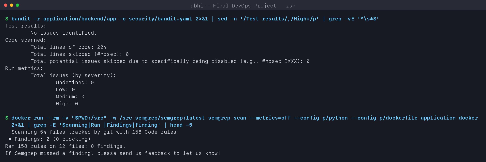
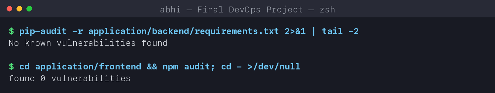
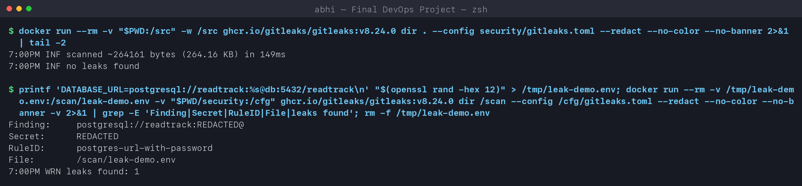
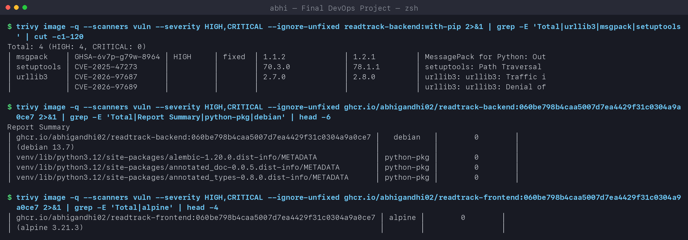
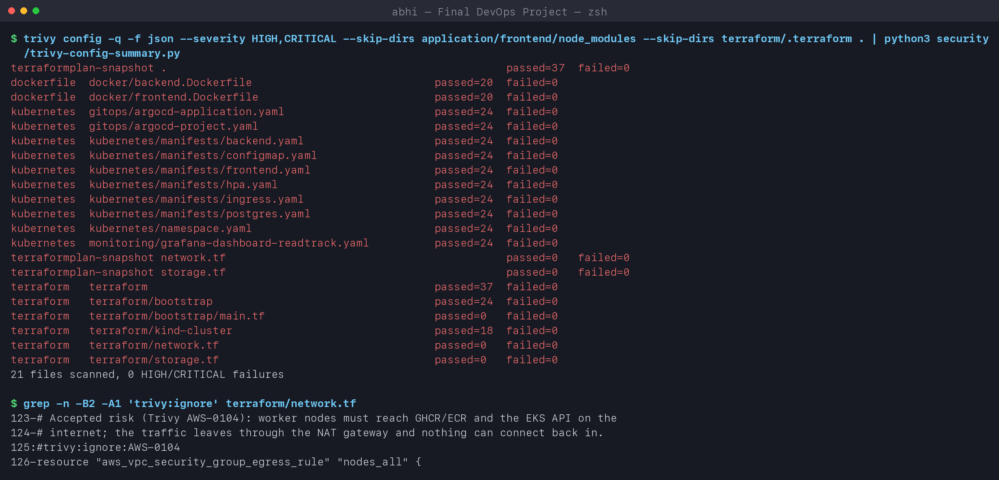
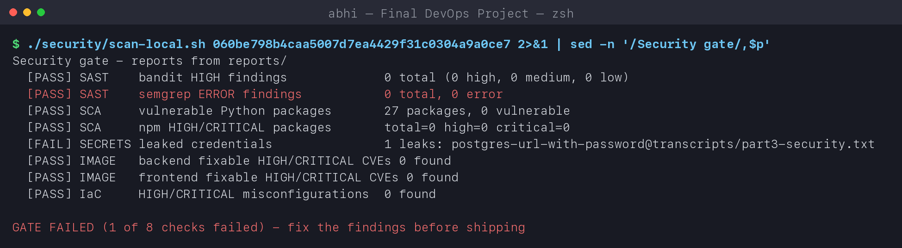
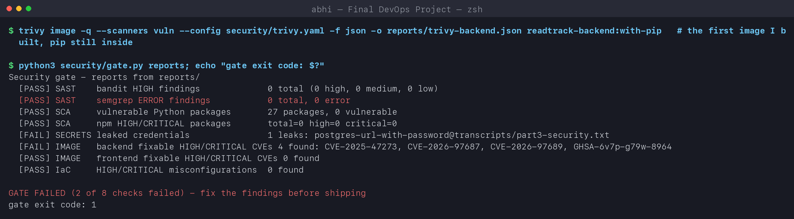
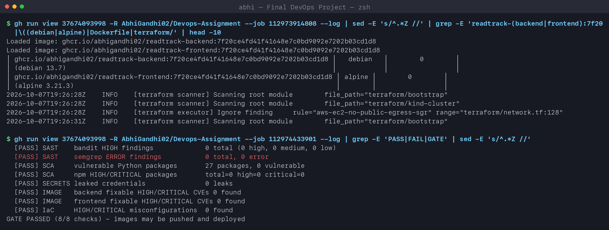

The secrets screenshot also shows my custom rule working: a PostgreSQL URL with a randomly
generated inline password in a temp file is reported as `postgres-url-with-password` (generated at runtime - I never
commit a fake secret, gitleaks would rightly flag it).

## 11. Monitoring, logs and metrics

Install: [monitoring/install.sh](monitoring/install.sh) -> kube-prometheus-stack with
[trimmed values](monitoring/kube-prometheus-stack-values.yaml) (no etcd/scheduler/controller
scraping on kind, 2d retention, 2Gi PVC). The Grafana admin password is generated into a
Secret at install time, not stored in Git.

* **ServiceMonitor** (Helm template) scrapes `/metrics` of every backend pod, labelled
  `release: monitoring` so Prometheus selects it from any namespace.
* **PrometheusRule** with 4 alerts: `ReadTrackBackendDown`, `ReadTrackHighErrorRate` (>5% 5xx),
  `ReadTrackSlowRequests` (p95 > 500ms), `ReadTrackDatabaseUnreachable` (`readtrack_db_up == 0`).
* **Grafana dashboard** as a ConfigMap with `grafana_dashboard: "1"`
  ([grafana-dashboard-readtrack.yaml](monitoring/grafana-dashboard-readtrack.yaml)), loaded by the
  sidecar: pods up, req/s, 5xx rate, p95, books created, DB reachable, req/s by route,
  p50/p95/p99, status codes, CPU vs HPA replicas, memory, restarts; `namespace` variable.

```text
$ curl -s localhost:18000/metrics | grep '^readtrack_'
readtrack_http_requests_total{method="GET",path="/api/books/stats",status="200"} 5278.0
readtrack_http_request_duration_seconds_sum{method="GET",path="/api/books/stats"} 1188.59...
readtrack_db_up 1.0
$ python3 monitoring/promq.py http://localhost:19090 'sum by (path) (rate(readtrack_http_requests_total{namespace="readtrack-dev"}[5m]))'
path=/api/books                               27.631
```

**Alert demo:** I scaled the dev backend to 0 and the alert fired; scaling back resolved it.

```text
$ kubectl -n readtrack-dev scale deploy readtrack-backend --replicas=0 && sleep 100
ReadTrackBackendDown  firing - No ReadTrack backend pod is being scraped in readtrack-dev
$ kubectl -n readtrack-dev scale deploy readtrack-backend --replicas=2 ...
ReadTrack alerts firing/pending: 0
```

My first version of this rule was `sum(up{...}) == 0` and it **never fired**: with zero pods
there are no targets at all, `sum()` returns an empty result, and empty is not `== 0`. The
fixed expression is `(sum(up{...}) or vector(0)) == 0`.

**Logs:** the backend writes one JSON line per request, so `kubectl logs` is already
filterable:

```text
[pod/readtrack-backend-647686f4cb-sqlhn/backend] {"ts": "2026-10-07 19:07:25,145", "level": "INFO", "msg": "request", "method": "GET", "path": "/api/books/42", "status": 404, "ms": 21.3}
requests by status in the logs: {200: 3, 404: 1}
```

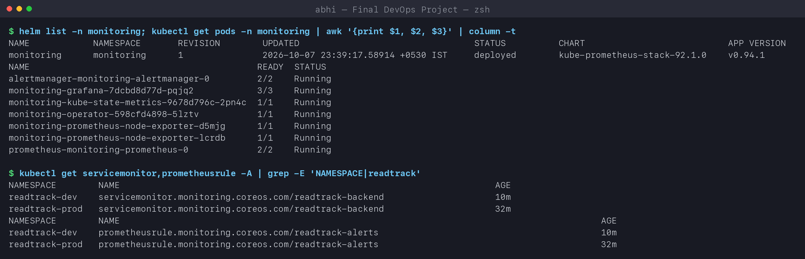
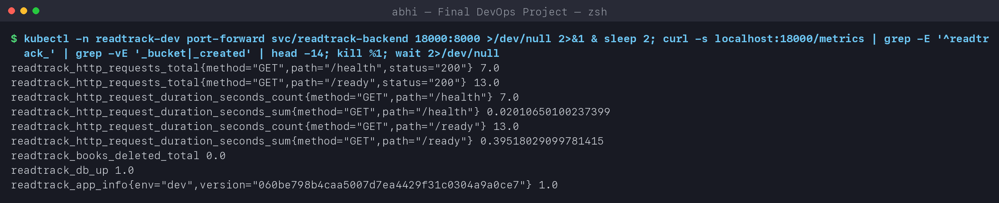
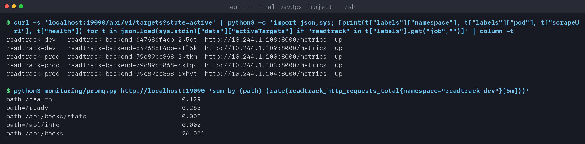
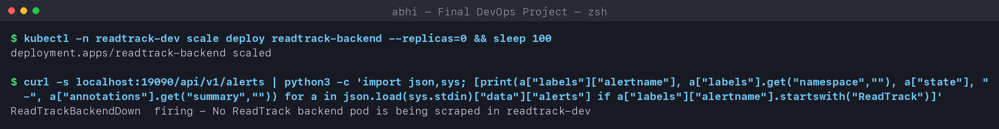
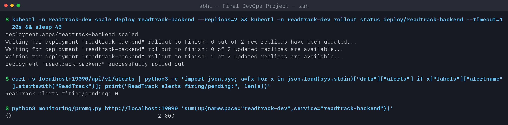
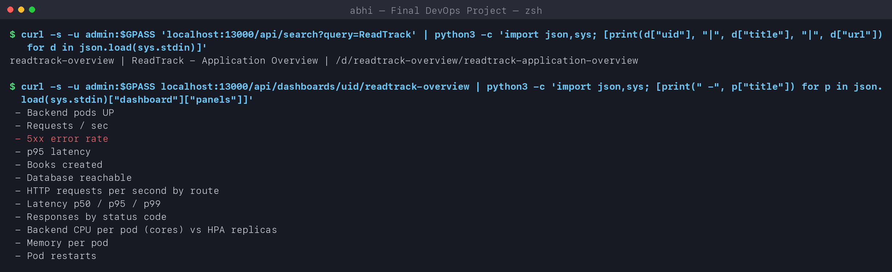
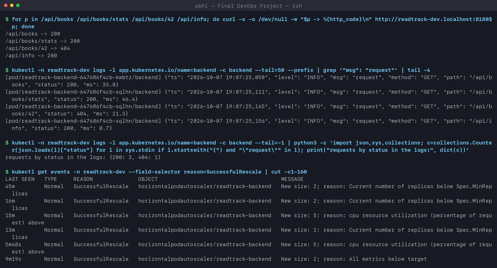
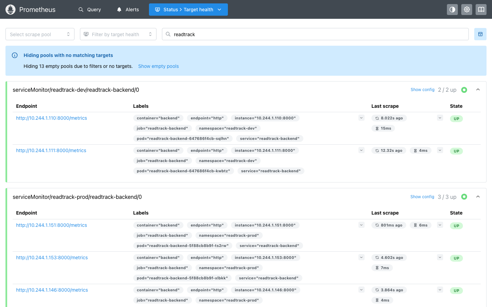
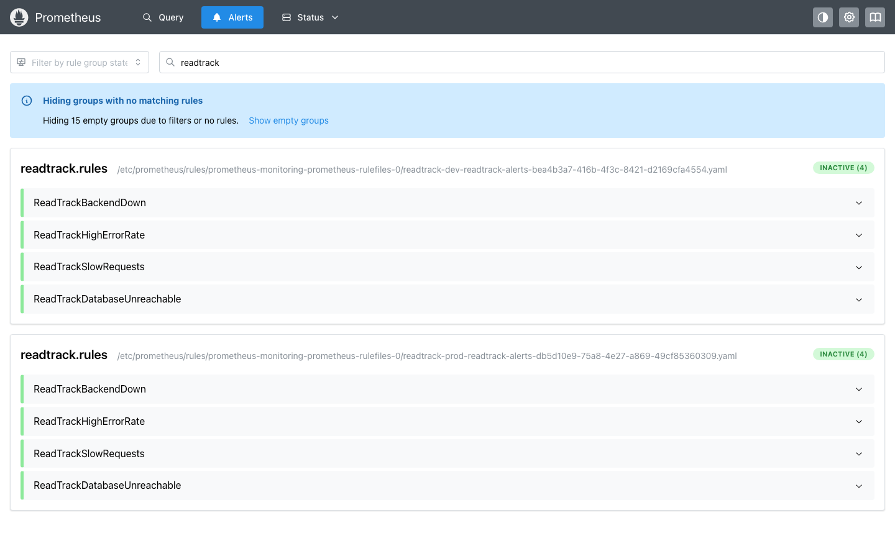
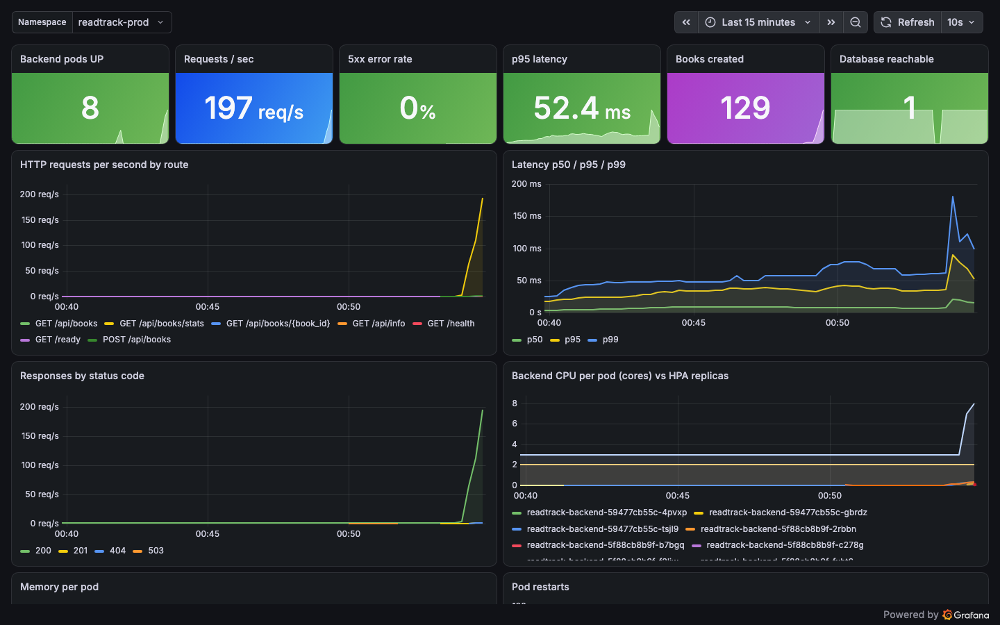

The Grafana screenshot is `readtrack-prod` under load: ~197 req/s, p95 52 ms, 0% 5xx and the
backend HPA at 8 replicas (the prod maximum).

## 12. GitOps with Argo CD

* [gitops/argocd-project.yaml](gitops/argocd-project.yaml) - AppProject `readtrack`: only this
  repo, only `readtrack-*` namespaces, no cluster-scoped objects except Namespace.
* [gitops/argocd-application.yaml](gitops/argocd-application.yaml) - Application
  `readtrack-prod`: path `Final DevOps Project/helm/readtrack` on `main`, value files
  `values-prod.yaml` + `../../gitops/values-gitops.yaml`, `automated: {prune: true, selfHeal: true}`,
  `CreateNamespace` with the PSS label, retry with backoff.
* The DB Secret in `readtrack-prod` is created out-of-band (`existingSecret`); in a real team
  I would use Sealed Secrets or External Secrets so it can live in Git encrypted.

**A Git change synced to the cluster:**

```text
$ curl -s http://readtrack.localhost:8180/api/info
{"version":"89c2ba07...","env":"prod","message":"Production - managed by Argo CD"}
$ git diff -- gitops/values-gitops.yaml
-  welcomeMessage: "Production - managed by Argo CD"
+  welcomeMessage: "Production v2 - changed in Git, synced by Argo CD"
$ git commit ... && git push origin main
a7b8d50 Final project GitOps demo: change the prod welcome message in Git
Argo CD applied commit a7b8d50 after ~15s
$ curl -s http://readtrack.localhost:8180/api/info
{"version":"89c2ba07...","env":"prod","message":"Production v2 - changed in Git, synced by Argo CD"}
```

**Self-heal:** I deleted the backend Service and the Ingress and edited the ConfigMap by hand:

```text
$ kubectl -n readtrack-prod delete service readtrack-backend; kubectl -n readtrack-prod patch configmap readtrack-config -p '{"data":{"LOG_LEVEL":"DEBUG"}}'; kubectl -n readtrack-prod delete ingress readtrack
OutOfSync
(25 s later)
Synced Healthy
service/readtrack-backend
LOG_LEVEL=INFO
readtrack   nginx   readtrack.localhost   localhost   80      21s
app via ingress -> 200
```

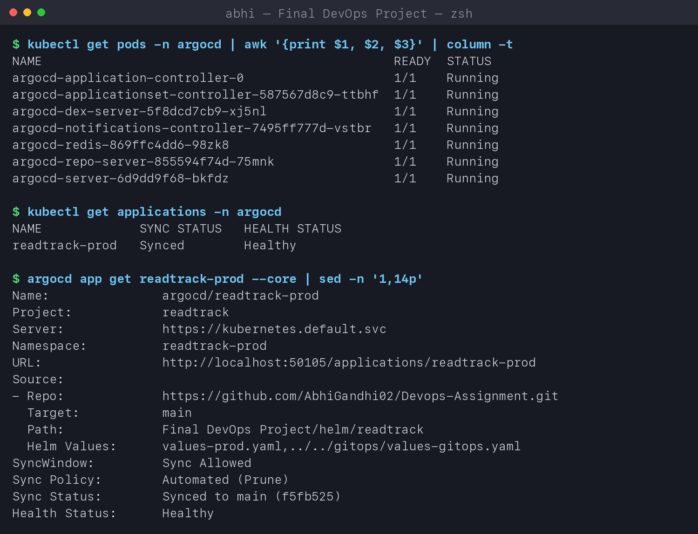
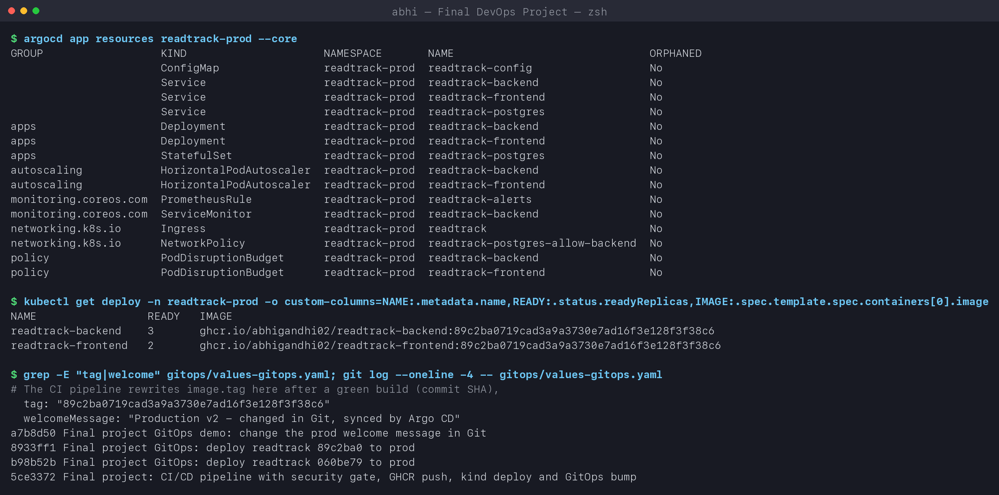
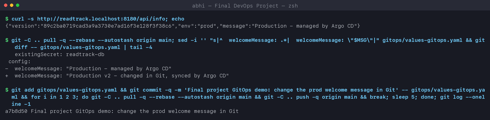
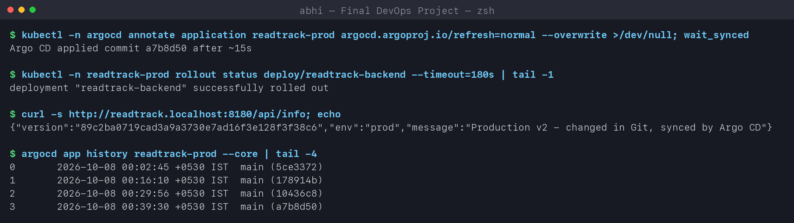
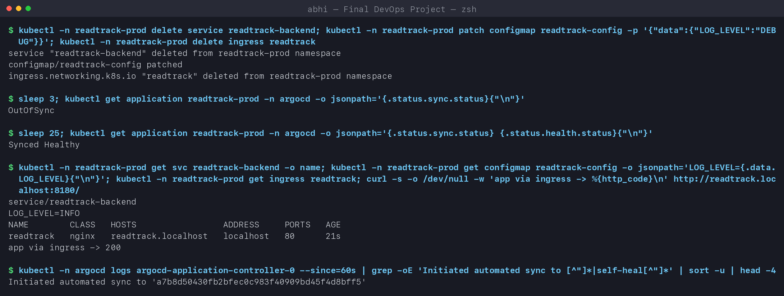
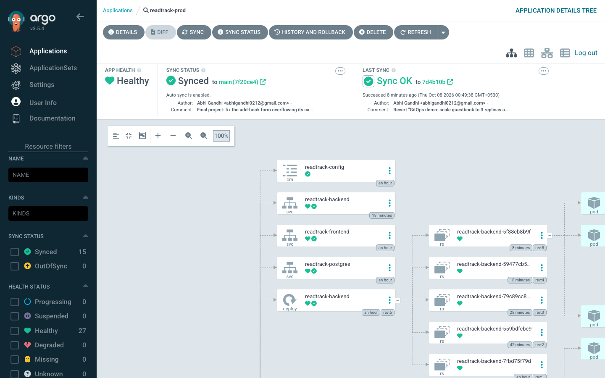

One GitOps problem I solved: with `ServerSideApply=true` the app stayed `OutOfSync` forever on
the PostgreSQL StatefulSet, because the API server adds defaults inside `volumeClaimTemplates`
(`apiVersion`, `kind`, `volumeMode`, `status`) that the rendered chart does not have. With the
default client-side apply Argo CD normalises these and the app became `Synced Healthy`.

## 13. Final troubleshooting challenge

I deployed the normal manifests into `readtrack-ts` through a kustomize overlay that injects
**8 bugs at once** ([troubleshooting/broken/kustomization.yaml](troubleshooting/broken/kustomization.yaml));
[troubleshooting/fixed](troubleshooting/fixed/kustomization.yaml) is the correct state. The whole
session is scripted in [troubleshooting/run-troubleshooting.sh](troubleshooting/run-troubleshooting.sh).

```text
$ kubectl get pods,pvc,hpa -n readtrack-ts
pod/readtrack-backend-5576646b5b-fkxzj    0/1     Init:ErrImagePull   0          46s
pod/readtrack-frontend-84db4f4c77-trsgq   1/1     Running             0          46s
pod/readtrack-postgres-0                  0/1     Pending             0          46s
persistentvolumeclaim/data-readtrack-postgres-0   Pending    fast-ssd
horizontalpodautoscaler.autoscaling/readtrack-backend   cpu: <unknown>/70%
GET /           -> 503
GET /api/info   -> 503
```

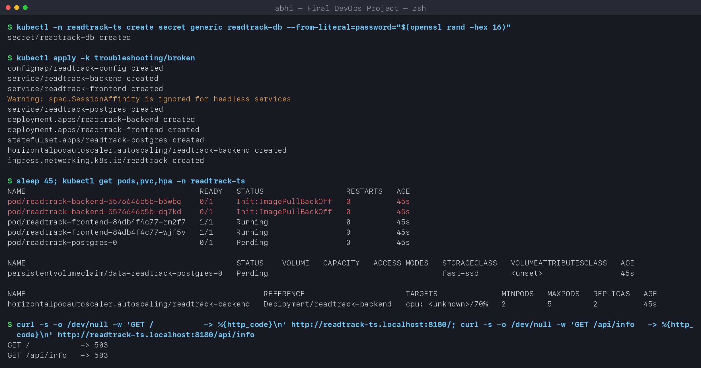

| # | Symptom | Investigation | Root cause | Fix | Verified by |
|---|---|---|---|---|---|
| 1 | postgres `Pending`, PVC `Pending` | `describe pod`: *unbound immediate PersistentVolumeClaims*; `describe pvc`: `storageclass "fast-ssd" not found`; `get storageclass` | StorageClass that does not exist in the cluster | volumeClaimTemplates are immutable -> delete StatefulSet + PVC, re-apply without the class (default `standard`) | PVC `Bound` |
| 2 | postgres `CreateContainerConfigError` | `describe pod`: *couldn't find key postgres-password in Secret readtrack-ts/readtrack-db*; secret keys = `{"password"}` | Secret created with the wrong key name | recreate the Secret with key `postgres-password`, delete the pod | pod `1/1 Running` |
| 3 | backend `Init:ErrImagePull` / `ImagePullBackOff` | events: `failed to resolve reference ...:v1.0-relase: not found`; `docker manifest inspect` confirms | typo in the image tag | `kubectl set image` for the `migrate` initContainer **and** the container to the SHA tag | new pod `Running` |
| 4 | backend `Running` but `0/1`, Service has no endpoints | `describe pod`: `Readiness probe failed: HTTP probe failed with statuscode: 404` on `/readyz`; app log shows `"path": "/readyz", "status": 404`; `/ready` returns 200 | readiness probe points at a path the API does not have | patch probe path to `/ready` | endpoints filled |
| 5 | `wget http://readtrack-backend:8000` -> `Connection refused` although endpoints exist | Service `targetPort 8080`, endpoints on `:8080`, container listens on `8000` | Service targetPort mismatch | `targetPort: http` (named port) | endpoints now `:8000` |
| 6 | `GET /api/info` -> 503 | `describe ingress`: `readtrack-api:8000 (<error: services "readtrack-api" not found>)`; ingress-nginx log upstream `[readtrack-ts-readtrack-api-8000]` | Ingress `/api` backend points to a non-existent Service | patch backend name to `readtrack-backend` | `/api/info` JSON |
| 7 | `GET /` -> 503 | `get endpoints readtrack-frontend` = `<none>`; Service selector `front-end`, pods labelled `frontend` | Service selector does not match pod labels | patch the selector | endpoints + `GET / -> 200` |
| 8 | HPA `cpu: <unknown>/70%` | events: `missing request for cpu in container backend`; container resources `{}` | HPA percentage needs CPU **requests** | `kubectl set resources` (50m / 96Mi requests) | HPA `cpu: 11%/70%` |

Final check - the live state equals the fixed overlay:

```text
$ curl -s http://readtrack-ts.localhost:8180/api/books/stats
{"total":1,"by_status":{"want_to_read":0,"reading":0,"finished":1},"pages_read":376,"average_rating":5.0}
$ kubectl diff -k troubleshooting/fixed >/dev/null && echo 'live state == troubleshooting/fixed (no diff)'
live state == troubleshooting/fixed (no diff)
```

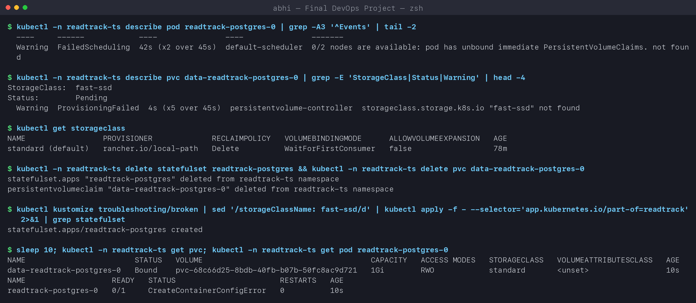
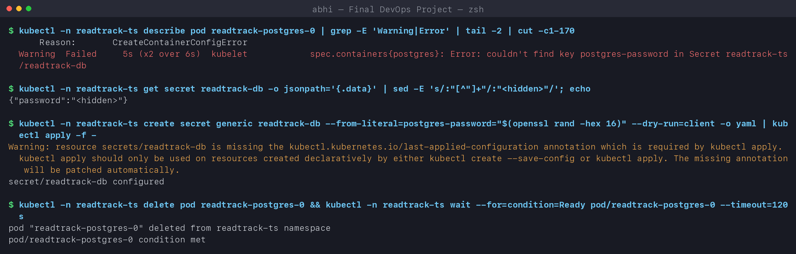
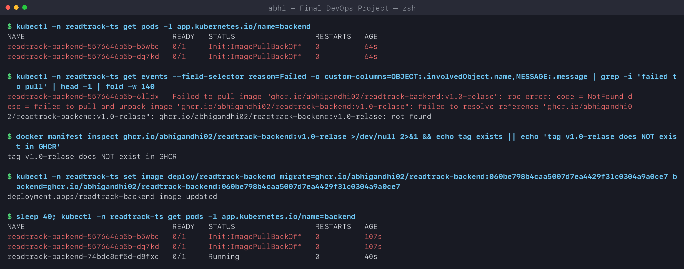
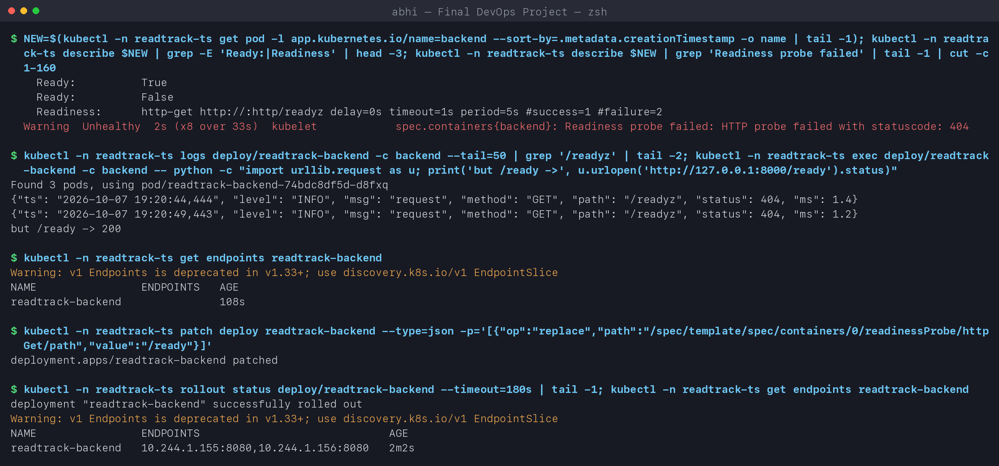
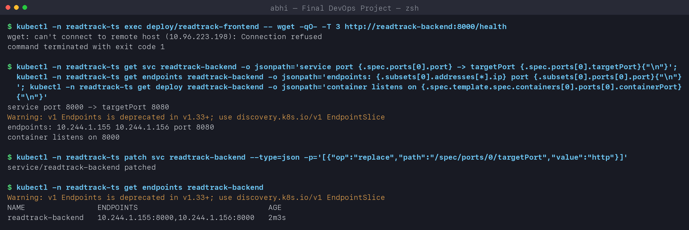
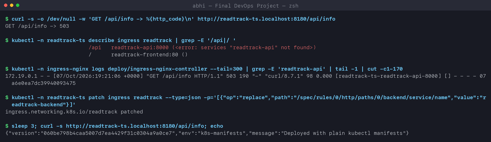
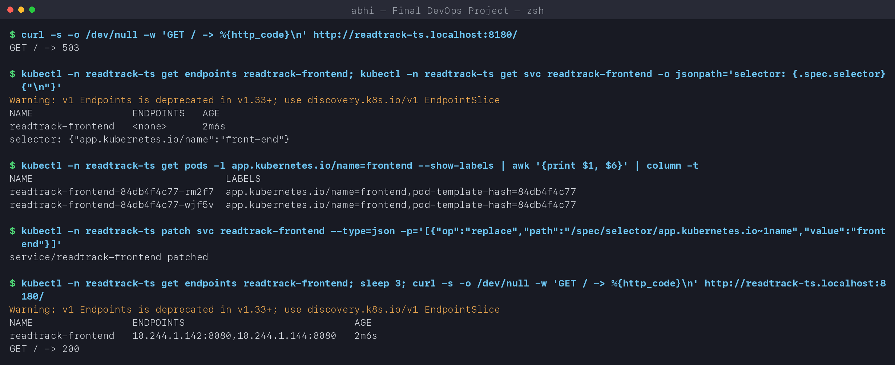
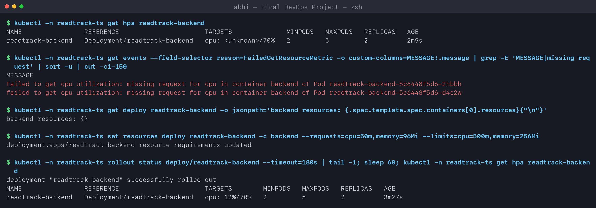
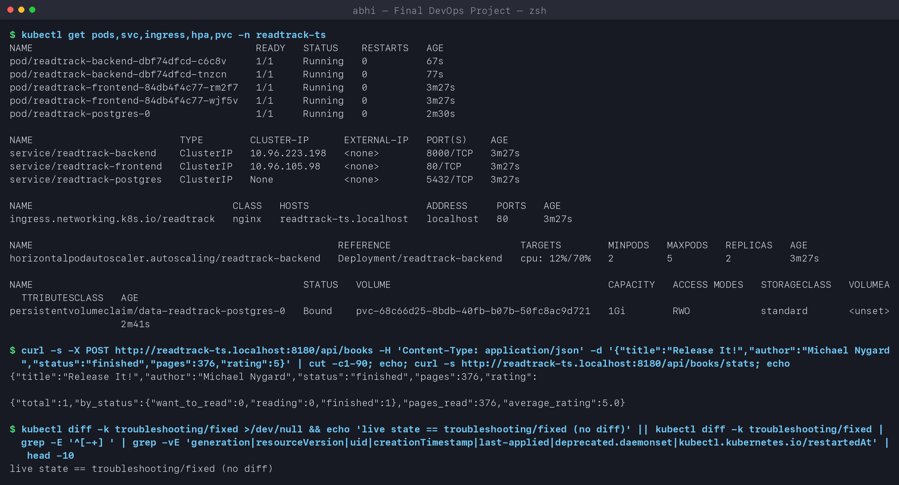

**What I understood:** the bugs hide behind each other. The backend could not even show its
probe bug until the image and the database were fixed, and the targetPort bug was invisible as
long as the readiness probe kept the endpoints empty. Working from the bottom up (storage ->
config -> image -> pod health -> Service -> Ingress -> autoscaling) and checking
`describe`/events/endpoints at each layer was much faster than guessing. Besides these 8, the
real problems from the earlier sections (ingress controller on the wrong node, kind provider vs
node image, webhook race in CI, GitOps bump conflict, OutOfSync StatefulSet, the alert that
could never fire) were troubleshooting too.

## 14. Screenshots index

| Range | Topic |
|---|---|
| k21-01 - 05 | tests, lint, frontend build, compose, non-root images |
| k21-06 - 12 | Terraform: bootstrap, plan, apply, LocalStack resources, EKS plan, destroy, kind cluster |
| k21-13 - 25 | Kubernetes manifests, ConfigMap/Secret, probes, storage, Helm install/upgrade/rollback/test, Ingress, HPA, NetworkPolicy, Pod Security |
| k21-26 - 32 | SAST, SCA, secrets, Trivy before/after, IaC scan, gate pass/fail |
| k21-33 - 39 | monitoring stack, metrics, targets, alert firing/resolved, Grafana API, logs |
| k21-40 - 44 | Argo CD app, resources, Git change synced, self-heal |
| k21-45 - 54 | troubleshooting challenge (8 issues) |
| k21-55 - 61 | browser: app UI, Prometheus targets + rules, Grafana, Argo CD, GitHub Actions run, GHCR package |
| k21-62 - 65 | pipeline jobs, commit-to-prod chain, git history, Trivy + gate from the CI log |

## 15. Limitations

* **LocalStack instead of real AWS.** My AWS credentials are invalid, so the AWS resources were
  created on LocalStack 4.12 community. VPC/subnets/IGW/NAT/SG/IAM/S3/KMS really exist there;
  EKS needs LocalStack Pro or real AWS, so it is behind `enable_eks` and only shown in
  `terraform plan`. The Kubernetes part runs on **kind** (also created by Terraform) instead of EKS,
  and there is no AWS Console screenshot - the AWS CLI against LocalStack is shown instead.
* Ingress hosts use `*.localhost` on host port 8180 (8088/8448 belong to another cluster on my
  laptop); compose used ports 3100/8100 for the same reason.
* Secrets for the app namespaces are created with `kubectl create secret`; Sealed Secrets /
  External Secrets would be the next step for a fully Git-driven setup.
* Alertmanager has no receiver (e-mail/Slack) configured; alerts are visible in Prometheus.
* The CI pipeline deploys to a throw-away kind cluster in the runner; the persistent "prod" is
  my local kind cluster updated by Argo CD.

## 16. Lessons learned

1. **Scan results are only useful if you read them.** The HIGH CVEs were in pip's vendored
   libraries, not in my requirements - removing a tool from the runtime image fixed more than
   any version bump would have.
2. **Readiness and liveness answer different questions.** `/health` must not touch the DB
   (otherwise a DB outage restarts every pod), `/ready` must (so traffic stops when the DB is down).
3. **Small details break automation:** an admission webhook that is a few seconds late, a
   self-deleting Job, two pipeline runs editing the same line, a selector typo. Every one of them
   was found by reading the actual error, not by retrying.
4. **GitOps changes the deployment habit.** After Argo CD was in place, I stopped running
   `helm upgrade` for prod; a commit is the deployment, and manual changes are reverted.
5. **Metrics need care too:** using route templates as labels kept cardinality low, and an
   alert on `sum(up)` silently never fires when there are no targets at all.
6. **IaC is reproducible only when everything is pinned** - provider versions, the kind node
   image digest, image SHAs instead of `latest`.
7. **Keep secrets out of Git by design:** `existingSecret` in the chart, generated passwords in
   CI and install scripts, git-ignored state and kubeconfig files, and a secret scanner as a
   safety net that actually caught the kind admin key in my working tree.
