# Helm - Homework

**Name:** Abhi Gandhi
**Enrollment Number:** 24bcs10397

Helm is the package manager for Kubernetes. Instead of applying many YAML files by hand,
you install one **chart** and Helm tracks it as a **release** with numbered **revisions**.

| Term | Meaning | In this homework |
|---|---|---|
| **Chart** | A package of templated Kubernetes manifests | `orbit-chart`, `notes-chart`, `podinfo/podinfo` |
| **Values** | Settings that fill the templates (`values.yaml`, `-f file`, `--set`) | image tag, replicas, environment |
| **Release** | One installed copy of a chart in a namespace | `orbit`, `web`, `notes` |
| **Revision** | A numbered version of a release; every install/upgrade/rollback adds one | 1 -> 2 -> 3 (failed) -> 4 (rollback) |
| **Repository** | An HTTP server hosting packaged charts | `podinfo`, `ingress-nginx` |

Everything ran on my local `abhi-devops` kind cluster with **Helm v4.3.0**. Every output below
is from my terminal, and [run-labs.sh](run-labs.sh) replays all of it.

## Folder structure

```text
Helm/
├── 01-helm-commands/
│   └── orbit-chart/          # generated with `helm create` (Task 1 and Task 2)
├── 03-mini-project/
│   └── notes-chart/          # Notes app chart (Task 3)
│       ├── Chart.yaml
│       ├── values.yaml       # development defaults
│       ├── values-prod.yaml  # production overrides
│       └── templates/
│           ├── _helpers.tpl  # shared labels
│           ├── configmap.yaml
│           ├── deployment.yaml
│           ├── service.yaml
│           └── NOTES.txt
├── screenshots/
├── run-labs.sh
└── README.md
```

## Task 1: Helm commands

| Command | What it does | Section |
|---|---|---|
| `helm create` | Generates a new chart skeleton | 1.1 |
| `helm lint` | Checks a chart for errors and bad practice | 1.1 |
| `helm template` | Renders the templates locally without touching the cluster | 1.1 |
| `helm install` | Installs a chart as a new release (revision 1) | 1.2 |
| `helm list` | Lists releases in a namespace | 1.2 |
| `helm status` | Shows the state and resources of one release | 1.2 |
| `helm get` | Shows the values / manifest / notes / metadata stored for a release | 1.3 |
| `helm repo` | Adds, updates and lists chart repositories | 1.4 |
| `helm search` | Searches added repos (`repo`) or Artifact Hub (`hub`) | 1.4 |
| `helm upgrade` | Applies new values or a new chart version (new revision) | Task 2 |
| `helm history` | Lists every revision of a release | Task 2 |
| `helm rollback` | Re-deploys an earlier revision as a new revision | Task 2 |
| `helm uninstall` | Deletes a release and all its resources | 1.6 |

### 1.1 helm create, lint and template

```text
$ helm version --short
v4.3.0+gbec5b06

$ helm create 01-helm-commands/orbit-chart
Creating 01-helm-commands/orbit-chart

$ find 01-helm-commands/orbit-chart -type f | sort
01-helm-commands/orbit-chart/.helmignore
01-helm-commands/orbit-chart/Chart.yaml
01-helm-commands/orbit-chart/templates/NOTES.txt
01-helm-commands/orbit-chart/templates/_helpers.tpl
01-helm-commands/orbit-chart/templates/deployment.yaml
01-helm-commands/orbit-chart/templates/hpa.yaml
01-helm-commands/orbit-chart/templates/httproute.yaml
01-helm-commands/orbit-chart/templates/ingress.yaml
01-helm-commands/orbit-chart/templates/service.yaml
01-helm-commands/orbit-chart/templates/serviceaccount.yaml
01-helm-commands/orbit-chart/templates/tests/test-connection.yaml
01-helm-commands/orbit-chart/values.yaml

$ helm lint 01-helm-commands/orbit-chart
==> Linting 01-helm-commands/orbit-chart
[INFO] Chart.yaml: icon is recommended

1 chart(s) linted, 0 chart(s) failed

$ helm template orbit 01-helm-commands/orbit-chart --set replicaCount=2 | grep -E '^kind:|replicas:|image:'
kind: ServiceAccount
kind: Service
kind: Deployment
  replicas: 2
          image: "nginx:1.16.0"
kind: Pod
      image: busybox
```

**What I understood:** `helm create` gives a working nginx chart. `Chart.yaml` holds the
metadata, `values.yaml` the defaults, and `templates/` the Go-templated manifests.
`_helpers.tpl` contains named templates for names and labels and renders nothing on its own.
`hpa.yaml`, `ingress.yaml` and `httproute.yaml` are wrapped in `{{- if .Values.x.enabled }}`,
so they don't appear in the render. `helm template` is the fastest way to check what will
really be applied. `--set replicaCount=2` shows up immediately as `replicas: 2`. The image
tag defaults to the chart's `appVersion` (1.16.0) when `image.tag` is empty.

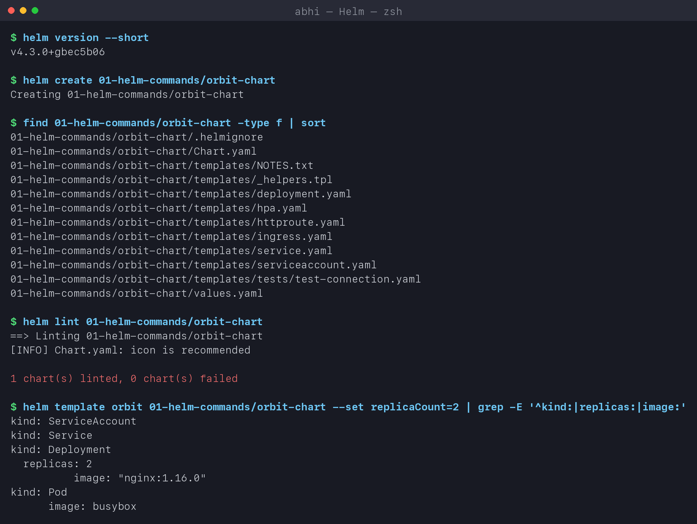

### 1.2 helm install, list and status

```text
$ helm install orbit 01-helm-commands/orbit-chart -n helm-lab --set image.tag=1.26-alpine --wait --timeout 3m
NAME: orbit
LAST DEPLOYED: Wed Oct  7 22:12:07 2026
NAMESPACE: helm-lab
STATUS: deployed
REVISION: 1
DESCRIPTION: Install complete

$ helm list -n helm-lab
NAME    NAMESPACE   REVISION   UPDATED                                STATUS     CHART               APP VERSION
orbit   helm-lab    1          2026-10-07 22:12:07.626632 +0530 IST   deployed   orbit-chart-0.1.0   1.16.0

$ kubectl get deploy,svc,pods -n helm-lab -l app.kubernetes.io/instance=orbit
NAME                                READY   UP-TO-DATE   AVAILABLE   AGE
deployment.apps/orbit-orbit-chart   1/1     1            1           2s

NAME                        TYPE        CLUSTER-IP    EXTERNAL-IP   PORT(S)   AGE
service/orbit-orbit-chart   ClusterIP   10.96.52.18   <none>        80/TCP    2s

NAME                                     READY   STATUS    RESTARTS   AGE
pod/orbit-orbit-chart-64f4f764c7-ffvp4   1/1     Running   0          2s
```

**What I understood:** resource names are `<release>-<chart>` (`orbit-orbit-chart`), so
the same chart can be installed many times under different release names without clashes.
`--wait` makes Helm wait until the Deployment is actually ready instead of returning as soon
as the YAML is accepted. Every object carries `app.kubernetes.io/instance=orbit`, which is
how I selected exactly this release's resources.

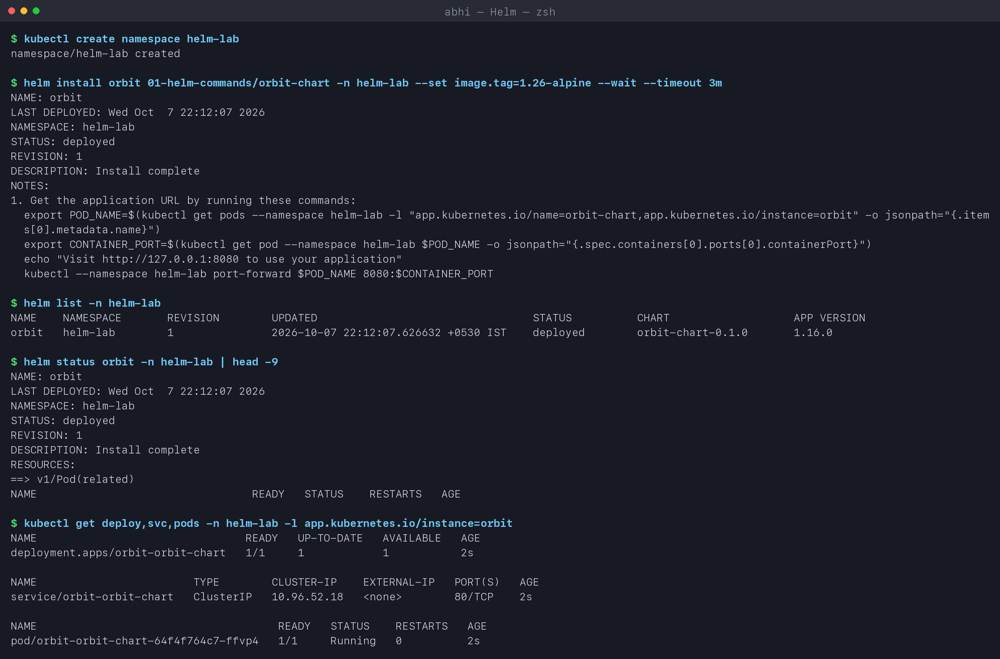

### 1.3 helm get

```text
$ helm get values orbit -n helm-lab
USER-SUPPLIED VALUES:
image:
  tag: 1.26-alpine

$ helm get values orbit -n helm-lab --all | head -12
COMPUTED VALUES:
affinity: {}
autoscaling:
  enabled: false
  maxReplicas: 100
  ...

$ helm get manifest orbit -n helm-lab | grep -E '^# Source|^kind:'
# Source: orbit-chart/templates/serviceaccount.yaml
kind: ServiceAccount
# Source: orbit-chart/templates/service.yaml
kind: Service
# Source: orbit-chart/templates/deployment.yaml
kind: Deployment

$ helm get metadata orbit -n helm-lab
NAME: orbit
CHART: orbit-chart
VERSION: 0.1.0
APP_VERSION: 1.16.0
NAMESPACE: helm-lab
REVISION: 1
STATUS: deployed
DEPLOYED_AT: 2026-10-07T22:12:07+05:30
APPLY_METHOD: server-side apply
```

**What I understood:** Helm stores every revision (values + rendered manifest) as a Secret
in the release's namespace. That stored copy is what `helm get` reads and what `rollback`
re-applies. `get values` shows only what *I* overrode, and `--all` merges in the chart
defaults. `APPLY_METHOD: server-side apply` is new in Helm 4. Helm now applies resources
the same way `kubectl apply --server-side` does.

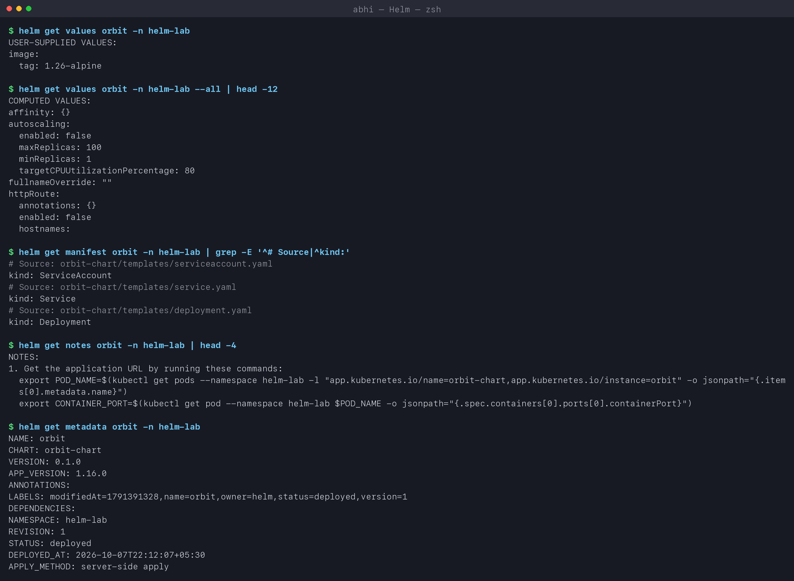

### 1.4 helm repo and helm search

```text
$ helm repo add podinfo https://stefanprodan.github.io/podinfo
"podinfo" has been added to your repositories

$ helm repo add ingress-nginx https://kubernetes.github.io/ingress-nginx
"ingress-nginx" has been added to your repositories

$ helm repo update
Hang tight while we grab the latest from your chart repositories...
...Successfully got an update from the "podinfo" chart repository
...Successfully got an update from the "ingress-nginx" chart repository
Update Complete. ⎈Happy Helming!⎈

$ helm repo list
NAME            URL
podinfo         https://stefanprodan.github.io/podinfo
ingress-nginx   https://kubernetes.github.io/ingress-nginx

$ helm search repo podinfo
NAME              CHART VERSION   APP VERSION   DESCRIPTION
podinfo/podinfo   6.15.0          6.15.0        Podinfo Helm chart for Kubernetes

$ helm search repo ingress-nginx --versions | head -4
NAME                          CHART VERSION   APP VERSION   DESCRIPTION
ingress-nginx/ingress-nginx   4.15.1          1.15.1        Ingress controller for Kubernetes using NGINX a...
ingress-nginx/ingress-nginx   4.15.0          1.15.0        Ingress controller for Kubernetes using NGINX a...
ingress-nginx/ingress-nginx   4.14.5          1.14.5        Ingress controller for Kubernetes using NGINX a...

$ helm search hub prometheus --max-col-width 60 | head -5
URL                                                            CHART VERSION   APP VERSION   DESCRIPTION
https://artifacthub.io/packages/helm/prometheus-community...   29.36.0         v3.15.0       Prometheus is a monitoring system and time series database.
...
```

**What I understood:** `search repo` only looks in repos I've added (it uses the local
index downloaded by `repo update`). `search hub` asks Artifact Hub, the public catalogue of
all charts. **Chart version** and **app version** are separate things. The chart can change
(templates, defaults) while the app stays the same, and vice versa.

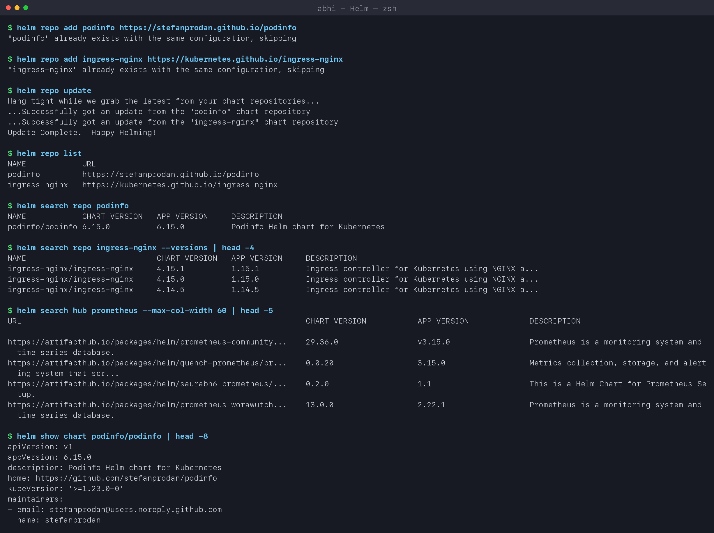

### 1.5 Installing a chart from a repository

```text
$ helm install web podinfo/podinfo -n helm-lab --set replicaCount=2 --set ui.message='Hello from Abhi via Helm' --wait --timeout 3m
NAME: web
NAMESPACE: helm-lab
STATUS: deployed
REVISION: 1

$ kubectl get pods -n helm-lab -l app.kubernetes.io/name=web-podinfo
NAME                           READY   STATUS    RESTARTS   AGE
web-podinfo-77d9cd479b-fz6r5   1/1     Running   0          67s
web-podinfo-77d9cd479b-hthx9   1/1     Running   0          67s

$ curl -s localhost:9898 | grep -E 'hostname|version|message'     # via kubectl port-forward
  "hostname": "web-podinfo-77d9cd479b-fz6r5",
  "version": "6.15.0",
  "message": "Hello from Abhi via Helm",

$ helm uninstall web -n helm-lab
release "web" uninstalled
```

I never saw podinfo's YAML. Two `--set` flags were enough to configure a third-party app,
and my message came back from the running Pod. This is how tools like ingress-nginx,
Prometheus and Argo CD are normally installed.

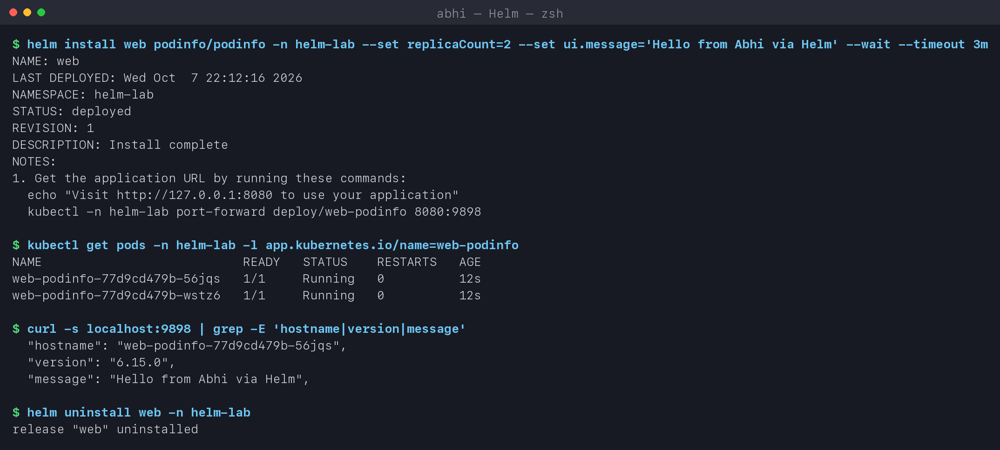

### 1.6 helm uninstall

Shown at the end of Task 2 below: `helm uninstall orbit` deleted the Deployment, Service,
ServiceAccount and all stored revisions in one command.

## Task 2: Helm rollback workflow

```text
Install (rev 1) -> Upgrade (rev 2) -> Verify -> Upgrade again with a bad image (rev 3, failed)
                -> Verify -> Rollback to rev 2 (creates rev 4) -> Verify
```

### 2.1 Install (revision 1)

Section 1.2 above: `nginx:1.26-alpine`, 1 replica.

### 2.2 Upgrade and verify (revision 2)

```text
$ helm upgrade orbit 01-helm-commands/orbit-chart -n helm-lab --set image.tag=1.27-alpine --set replicaCount=3 --wait --timeout 3m
Release "orbit" has been upgraded. Happy Helming!
STATUS: deployed
REVISION: 2

$ helm history orbit -n helm-lab
REVISION   UPDATED                    STATUS       CHART               APP VERSION   DESCRIPTION
1          Wed Oct  7 22:12:07 2026   superseded   orbit-chart-0.1.0   1.16.0        Install complete
2          Wed Oct  7 22:12:32 2026   deployed     orbit-chart-0.1.0   1.16.0        Upgrade complete

$ kubectl get deploy orbit-orbit-chart -n helm-lab -o jsonpath='{.spec.replicas} replicas, image {.spec.template.spec.containers[0].image}'
3 replicas, image nginx:1.27-alpine

$ helm get values orbit -n helm-lab --revision 2
USER-SUPPLIED VALUES:
image:
  tag: 1.27-alpine
replicaCount: 3
```

Verified: 3 replicas on `1.27-alpine`, and revision 1 is now `superseded`.

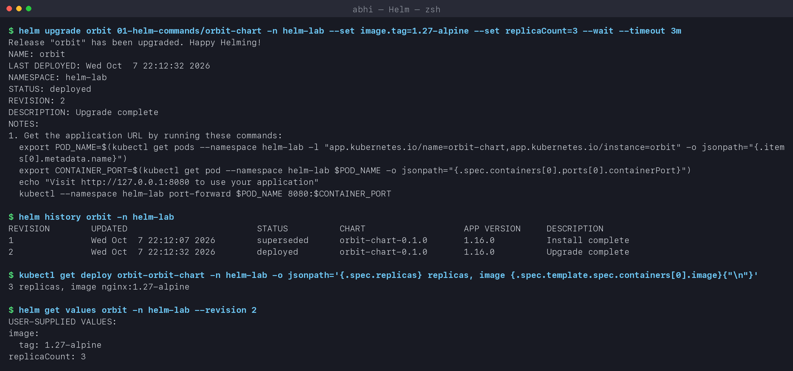

### 2.3 Upgrade again with a bad image and verify (revision 3)

```text
$ helm upgrade orbit 01-helm-commands/orbit-chart -n helm-lab --reuse-values --set image.tag=1.99-does-not-exist --wait --timeout 60s
level=WARN msg="upgrade failed" name=orbit error="resource Deployment/helm-lab/orbit-orbit-chart not ready. status: InProgress, message: Updated: 1/3\ncontext deadline exceeded"
Error: UPGRADE FAILED: resource Deployment/helm-lab/orbit-orbit-chart not ready. status: InProgress, message: Updated: 1/3
context deadline exceeded

$ helm history orbit -n helm-lab
REVISION   UPDATED                    STATUS       CHART               DESCRIPTION
1          Wed Oct  7 22:12:07 2026   superseded   orbit-chart-0.1.0   Install complete
2          Wed Oct  7 22:12:32 2026   deployed     orbit-chart-0.1.0   Upgrade complete
3          Wed Oct  7 22:12:35 2026   failed       orbit-chart-0.1.0   Upgrade "orbit" failed: resource Deployment/helm-lab/orbit-orbit-chart not ready. ...

$ kubectl get pods -n helm-lab -l app.kubernetes.io/instance=orbit
NAME                                 READY   STATUS              RESTARTS   AGE
orbit-orbit-chart-77f956bf5f-wck6f   0/1     ContainerCreating   0          60s
orbit-orbit-chart-7bb7f95d48-7lkrc   1/1     Running             0          63s
orbit-orbit-chart-7bb7f95d48-85t27   1/1     Running             0          61s
orbit-orbit-chart-7bb7f95d48-k92gc   1/1     Running             0          62s
```

**What I observed:**
- `--reuse-values` kept `replicaCount: 3` from revision 2 and only changed the tag.
- Because of `--wait --timeout 60s`, Helm marked revision 3 `failed` once the new Pod never
  became ready. Without `--wait` Helm would have reported success, since the YAML itself was
  valid.
- The 3 old Pods kept running. The Deployment's rolling update never removes old Pods while
  new ones aren't ready, so users weren't affected. The broken Pod was still stuck trying to
  pull the image.

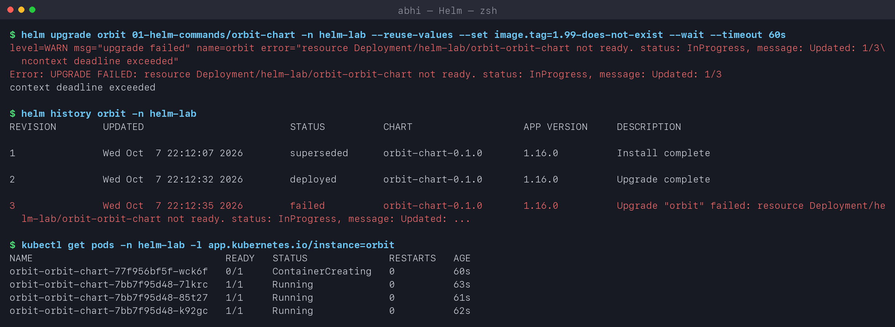

### 2.4 Rollback and verify (revision 4)

```text
$ helm rollback orbit 2 -n helm-lab --wait --timeout 3m
Rollback was a success! Happy Helming!

$ helm history orbit -n helm-lab
REVISION   UPDATED                    STATUS       CHART               DESCRIPTION
1          Wed Oct  7 22:12:07 2026   superseded   orbit-chart-0.1.0   Install complete
2          Wed Oct  7 22:12:32 2026   superseded   orbit-chart-0.1.0   Upgrade complete
3          Wed Oct  7 22:12:35 2026   failed       orbit-chart-0.1.0   Upgrade "orbit" failed: ...
4          Wed Oct  7 22:13:35 2026   deployed     orbit-chart-0.1.0   Rollback to 2

$ kubectl get pods -n helm-lab -l app.kubernetes.io/instance=orbit
NAME                                 READY   STATUS        RESTARTS   AGE
orbit-orbit-chart-77f956bf5f-wck6f   0/1     Terminating   0          60s
orbit-orbit-chart-7bb7f95d48-7lkrc   1/1     Running       0          63s
orbit-orbit-chart-7bb7f95d48-85t27   1/1     Running       0          61s
orbit-orbit-chart-7bb7f95d48-k92gc   1/1     Running       0          62s

$ kubectl get deploy orbit-orbit-chart -n helm-lab -o jsonpath='...'
3 replicas, image nginx:1.27-alpine
```

**What I understood:** a rollback **doesn't rewind history**. It creates a new revision
(4) with the contents of revision 2, and the failed revision 3 stays in the history for the
audit trail. The broken Pod was terminated and the healthy ReplicaSet (`7bb7f95d48`) became
current again, so the image is back to `nginx:1.27-alpine`.

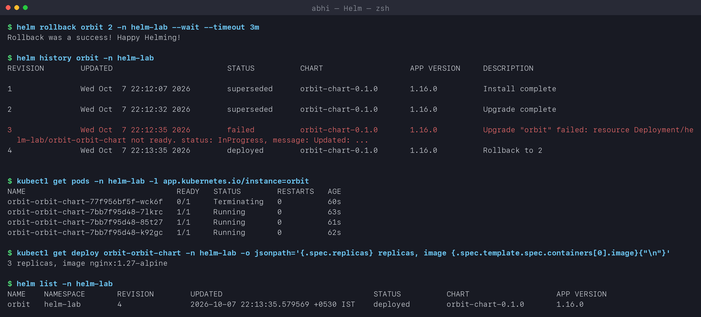

### 2.5 helm uninstall

```text
$ helm uninstall orbit -n helm-lab
release "orbit" uninstalled

$ helm list -n helm-lab
NAME   NAMESPACE   REVISION   UPDATED   STATUS   CHART   APP VERSION

$ kubectl get all -n helm-lab
NAME                                     READY   STATUS        RESTARTS   AGE
pod/orbit-orbit-chart-7bb7f95d48-7lkrc   1/1     Terminating   0          63s
...
```

All the release's objects and its stored revisions are gone. The Pods were already
`Terminating`.

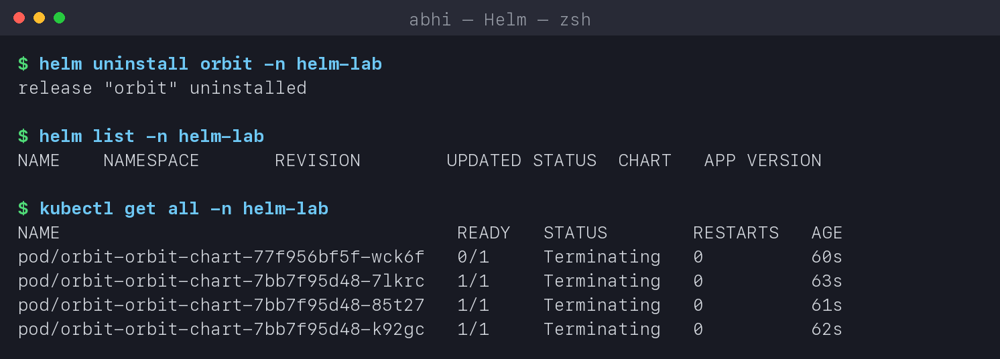

## Task 3: Mini project - Notes app chart

[notes-chart](03-mini-project/notes-chart) packages a Notes web app (nginx serving a page
generated from a ConfigMap). It's my own chart, written by hand:

| File | Purpose |
|---|---|
| [Chart.yaml](03-mini-project/notes-chart/Chart.yaml) | name, chart version 0.1.0, appVersion 1.0 |
| [values.yaml](03-mini-project/notes-chart/values.yaml) | development defaults: 1 replica, `nginx:1.26-alpine`, NodePort 30090 |
| [values-prod.yaml](03-mini-project/notes-chart/values-prod.yaml) | production overrides only: 3 replicas, `1.27-alpine`, bigger resources |
| [_helpers.tpl](03-mini-project/notes-chart/templates/_helpers.tpl) | `notes.labels` / `notes.selectorLabels` named templates |
| [configmap.yaml](03-mini-project/notes-chart/templates/configmap.yaml) | `APP_NAME`, `ENVIRONMENT` and an `index.html` rendered from values |
| [deployment.yaml](03-mini-project/notes-chart/templates/deployment.yaml) | `envFrom` the ConfigMap, mounts `index.html`, readiness probe, `checksum/config` annotation |
| [service.yaml](03-mini-project/notes-chart/templates/service.yaml) | NodePort only if `service.type` is NodePort (`if` block) |
| [NOTES.txt](03-mini-project/notes-chart/templates/NOTES.txt) | how to reach the app, printed after install/upgrade |

Template features used: `{{ .Values.* }}`, `{{ .Release.Name }}`, `{{ .Release.Revision }}`,
`include` + `nindent`, `toYaml`, `quote`, `if`/`and`/`eq`, and
`sha256sum` of the rendered ConfigMap. That last one makes the Pods roll whenever the config
changes, because otherwise a ConfigMap change alone doesn't restart Pods.

### 3.1 Lint, install (development) and verify

```text
$ helm lint 03-mini-project/notes-chart -f 03-mini-project/notes-chart/values-prod.yaml
==> Linting 03-mini-project/notes-chart
[INFO] Chart.yaml: icon is recommended

1 chart(s) linted, 0 chart(s) failed

$ helm install notes 03-mini-project/notes-chart -n helm-lab --wait --timeout 3m
NAME: notes
NAMESPACE: helm-lab
STATUS: deployed
REVISION: 1
NOTES:
notes-app (development) deployed as release "notes", revision 1.

Try it:
  kubectl port-forward -n helm-lab svc/notes-svc 8090:80
  curl http://localhost:8090

$ kubectl get deploy,svc,cm -n helm-lab -l app.kubernetes.io/instance=notes
NAME                           READY   UP-TO-DATE   AVAILABLE   AGE
deployment.apps/notes-deploy   1/1     1            1           1s

NAME                TYPE       CLUSTER-IP      EXTERNAL-IP   PORT(S)        AGE
service/notes-svc   NodePort   10.96.184.239   <none>        80:30090/TCP   1s

NAME                     DATA   AGE
configmap/notes-config   3      1s

$ curl http://localhost:8090      # through kubectl port-forward svc/notes-svc
Welcome to the Notes app
app=notes-app env=development release=notes revision=1 image=nginx:1.26-alpine
```

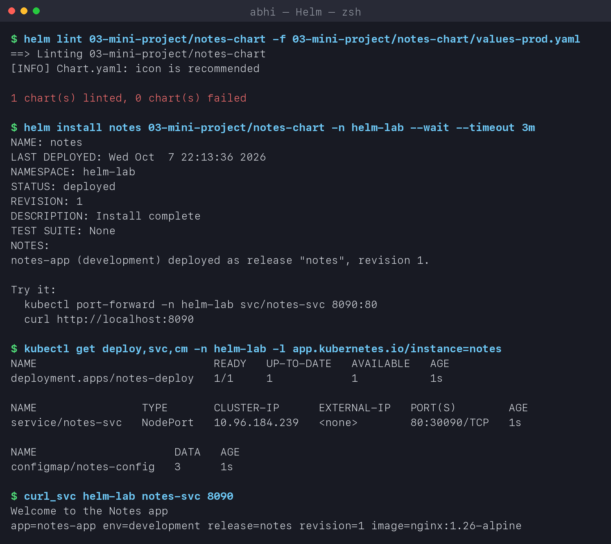

### 3.2 Upgrade to production values (revision 2)

```text
$ helm upgrade notes 03-mini-project/notes-chart -n helm-lab -f 03-mini-project/notes-chart/values-prod.yaml --wait --timeout 3m
Release "notes" has been upgraded. Happy Helming!
STATUS: deployed
REVISION: 2
NOTES:
notes-app (production) deployed as release "notes", revision 2.

$ kubectl get pods -n helm-lab -l app=notes
NAME                            READY   STATUS        RESTARTS   AGE
notes-deploy-6b7fd45cd-g7k2z    1/1     Terminating   0          7s
notes-deploy-6b7fd45cd-qvtb9    1/1     Terminating   0          3s
notes-deploy-79998c6968-dmvr7   1/1     Running       0          3s
notes-deploy-79998c6968-ppsld   1/1     Running       0          2s
notes-deploy-79998c6968-vz9d8   1/1     Running       0          1s

$ curl http://localhost:8091
Notes app - production
app=notes-app env=production release=notes revision=2 image=nginx:1.27-alpine

$ kubectl exec -n helm-lab deploy/notes-deploy -- printenv APP_NAME ENVIRONMENT
notes-app
production
```

**What I understood:** `values-prod.yaml` only contains the keys that differ, and Helm deep-merges
it over `values.yaml`. That's why `service.nodePort` and `app.name` still come from the
defaults. One chart, two environments, no copy-pasted YAML. The page, the environment variables
and the replica count all changed in one command.

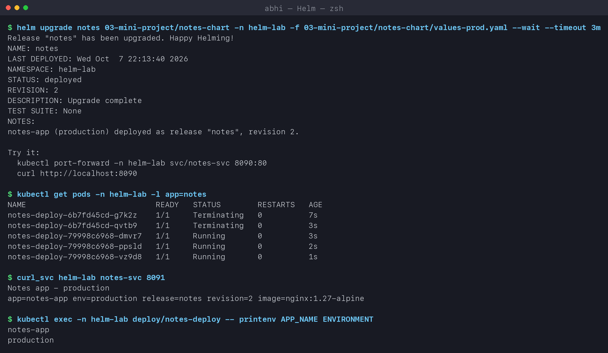

### 3.3 Bad upgrade (revision 3) and rollback (revision 4)

```text
$ helm upgrade notes 03-mini-project/notes-chart -n helm-lab -f 03-mini-project/notes-chart/values-prod.yaml --set app.message='Notes app - BROKEN release' --set image.tag=no-such-tag --wait --timeout 60s
Error: UPGRADE FAILED: resource Deployment/helm-lab/notes-deploy not ready. status: InProgress, message: Updated: 1/3
context deadline exceeded

$ helm rollback notes 2 -n helm-lab --wait --timeout 3m
Rollback was a success! Happy Helming!

$ helm history notes -n helm-lab
REVISION   UPDATED                    STATUS       CHART               APP VERSION   DESCRIPTION
1          Wed Oct  7 22:13:36 2026   superseded   notes-chart-0.1.0   1.0           Install complete
2          Wed Oct  7 22:13:40 2026   superseded   notes-chart-0.1.0   1.0           Upgrade complete
3          Wed Oct  7 22:13:46 2026   failed       notes-chart-0.1.0   1.0           Upgrade "notes" failed: ...
4          Wed Oct  7 22:14:47 2026   deployed     notes-chart-0.1.0   1.0           Rollback to 2

$ curl http://localhost:8092     # immediately after the rollback
Notes app - production
app=notes-app env=production release=notes revision=2 image=nginx:1.27-alpine

$ helm uninstall notes -n helm-lab
release "notes" uninstalled
```

**A lesson from my first attempt:** in an earlier run, the curl right after the rollback
still returned `Notes app - BROKEN release`. The failed revision 3 had already updated the
**ConfigMap** before the Deployment timed out, and the old, healthy Pods mount that
ConfigMap as a volume. So a "failed" release had still partly changed what users saw. After
the rollback, the kubelet re-syncs mounted ConfigMaps lazily (up to about a minute), so the
old page was still served for a short time. The final run above happened to re-sync in time.
In production I'd avoid this with immutable, hash-named ConfigMaps or `helm upgrade
--rollback-on-failure` (called `--atomic` in Helm 3).

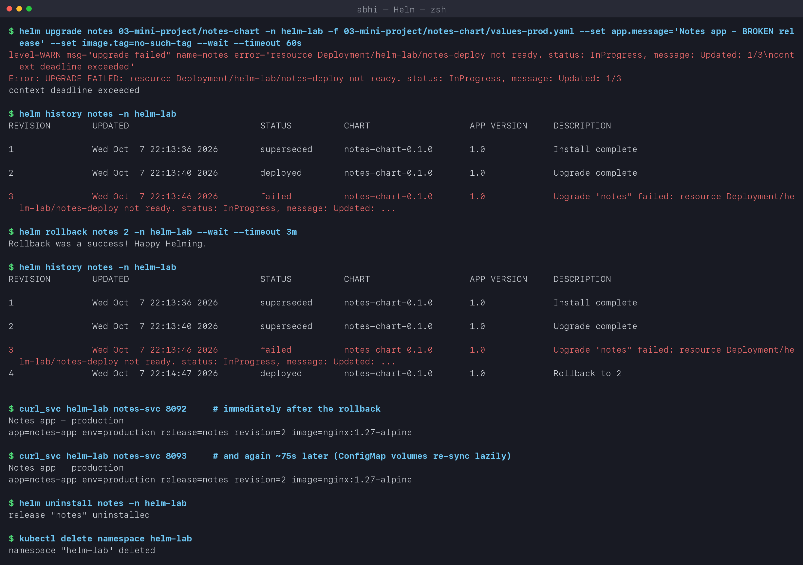

## Key learnings

- A chart is a template plus defaults, a release is an installed instance, and every change
  is a numbered revision stored in the cluster.
- Always use `--wait` (with `--timeout`). Without it Helm only checks that the YAML was
  accepted, not that the app works.
- `helm rollback N` creates a **new** revision. History is never rewritten, and failed
  revisions stay visible.
- Keep environment differences in small override files (`values-prod.yaml`) instead of
  copying charts.
- Check with `helm lint` and `helm template` before touching the cluster.
- ConfigMap changes don't restart Pods on their own. A `checksum/config` annotation fixes
  that.
