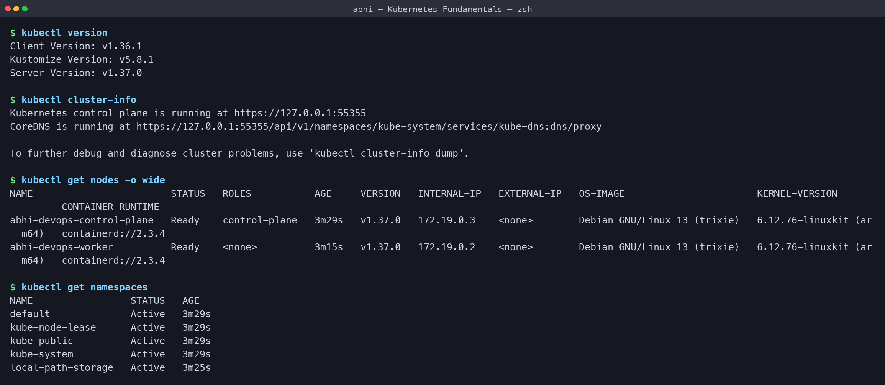
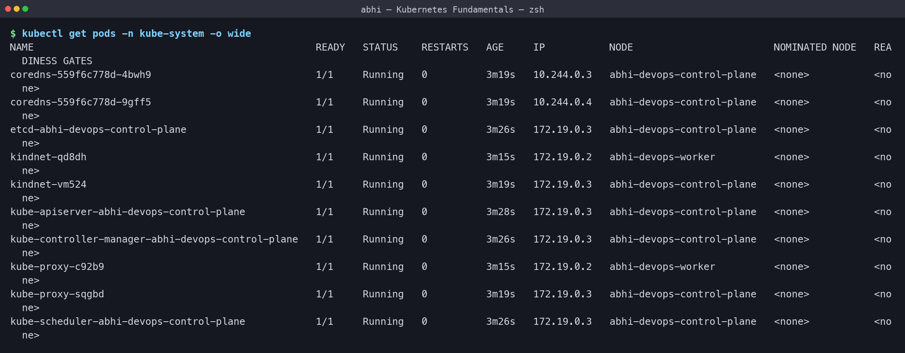
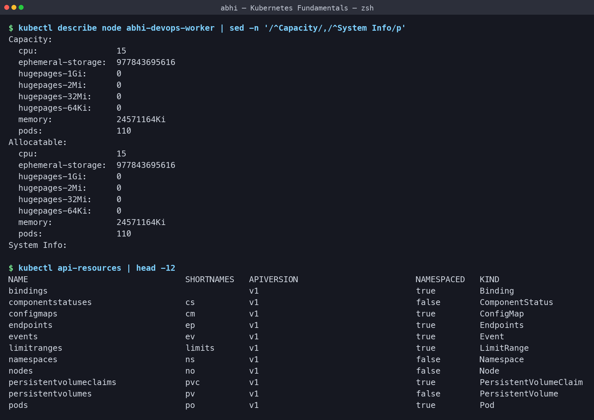
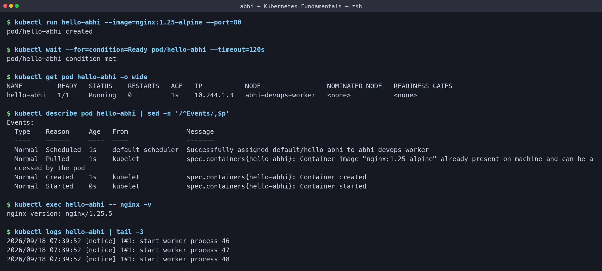
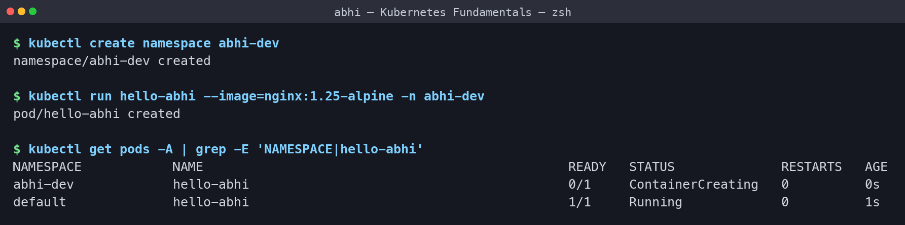
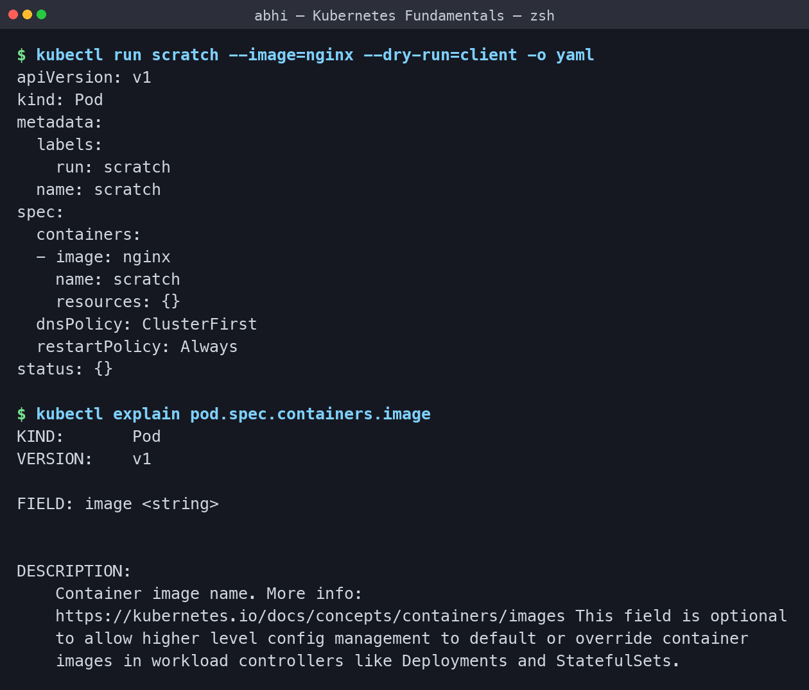
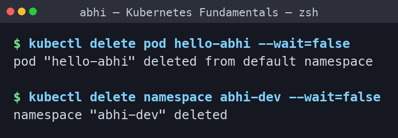

# Kubernetes Fundamentals - Homework

**Name:** Abhi Gandhi
**Enrollment Number:** 24bcs10397

Practice of the Kubernetes basics on a local **2-node cluster** (1 control-plane + 1 worker)
created with **kind** (Kubernetes in Docker). Minikube behaves the same way. Every output
below is copied from my terminal.

Cluster config: [kind-cluster.yaml](kind-cluster.yaml) - the cluster is named `abhi-devops`,
so the two node containers come out as `abhi-devops-control-plane` and `abhi-devops-worker`.

```bash
kind create cluster --config kind-cluster.yaml
./run-labs.sh          # replays every command in this README
```

## Task 1: Kubernetes architecture

| Component | Runs on | Job |
|---|---|---|
| `kube-apiserver` | Control plane | The only entry point - `kubectl` and every other component talks to it |
| `etcd` | Control plane | Key-value database holding the entire cluster state |
| `kube-scheduler` | Control plane | Decides which node a new Pod lands on |
| `kube-controller-manager` | Control plane | Control loops that drive actual state towards desired state |
| `kubelet` | Every node | Agent that starts and watches its node's containers |
| `kube-proxy` | Every node | Programs the network rules that make Services work |
| `containerd` | Every node | The container runtime that actually runs containers |
| `CoreDNS` | Add-on | DNS for Services and Pods inside the cluster |

Kubernetes is **declarative**: I write the desired state as YAML, and the controllers keep
working until reality matches it. I never tell it *how*, only *what*.

## Task 2: Cluster information

```text
$ kubectl version
Client Version: v1.36.1
Kustomize Version: v5.8.1
Server Version: v1.37.0

$ kubectl cluster-info
Kubernetes control plane is running at https://127.0.0.1:55355
CoreDNS is running at https://127.0.0.1:55355/api/v1/namespaces/kube-system/services/kube-dns:dns/proxy

To further debug and diagnose cluster problems, use 'kubectl cluster-info dump'.

$ kubectl get nodes -o wide
NAME                        STATUS   ROLES           AGE     VERSION   INTERNAL-IP   EXTERNAL-IP   OS-IMAGE                       KERNEL-VERSION             CONTAINER-RUNTIME
abhi-devops-control-plane   Ready    control-plane   3m29s   v1.37.0   172.19.0.3    <none>        Debian GNU/Linux 13 (trixie)   6.12.76-linuxkit (arm64)   containerd://2.3.4
abhi-devops-worker          Ready    <none>          3m15s   v1.37.0   172.19.0.2    <none>        Debian GNU/Linux 13 (trixie)   6.12.76-linuxkit (arm64)   containerd://2.3.4

$ kubectl get namespaces
NAME                 STATUS   AGE
default              Active   3m29s
kube-node-lease      Active   3m29s
kube-public          Active   3m29s
kube-system          Active   3m29s
local-path-storage   Active   3m25s
```

**What I understood:** the API server is on v1.37.0 and both nodes report `Ready`. The
control-plane node runs the cluster's own components and the worker node runs my
applications. The four namespaces that always exist are `default` (where my objects go),
`kube-system` (cluster components), `kube-public` and `kube-node-lease` (node heartbeats);
`local-path-storage` is kind's own storage provisioner. My client is v1.36.1 against a
v1.37.0 server, which is inside the supported one-minor-version skew.



## Task 3: The architecture components are just Pods

```text
$ kubectl get pods -n kube-system -o wide
NAME                                                READY   STATUS    RESTARTS   AGE     IP           NODE                        NOMINATED NODE   READINESS GATES
coredns-559f6c778d-4bwh9                            1/1     Running   0          3m19s   10.244.0.3   abhi-devops-control-plane   <none>           <none>
coredns-559f6c778d-9gff5                            1/1     Running   0          3m19s   10.244.0.4   abhi-devops-control-plane   <none>           <none>
etcd-abhi-devops-control-plane                      1/1     Running   0          3m26s   172.19.0.3   abhi-devops-control-plane   <none>           <none>
kindnet-qd8dh                                       1/1     Running   0          3m15s   172.19.0.2   abhi-devops-worker          <none>           <none>
kindnet-vm524                                       1/1     Running   0          3m19s   172.19.0.3   abhi-devops-control-plane   <none>           <none>
kube-apiserver-abhi-devops-control-plane            1/1     Running   0          3m28s   172.19.0.3   abhi-devops-control-plane   <none>           <none>
kube-controller-manager-abhi-devops-control-plane   1/1     Running   0          3m26s   172.19.0.3   abhi-devops-control-plane   <none>           <none>
kube-proxy-c92b9                                    1/1     Running   0          3m15s   172.19.0.2   abhi-devops-worker          <none>           <none>
kube-proxy-sqgbd                                    1/1     Running   0          3m19s   172.19.0.3   abhi-devops-control-plane   <none>           <none>
kube-scheduler-abhi-devops-control-plane            1/1     Running   0          3m26s   172.19.0.3   abhi-devops-control-plane   <none>           <none>
```

**What I understood:** every component from the Task 1 table is visible here as a real Pod.
`etcd`, `kube-apiserver`, `kube-controller-manager` and `kube-scheduler` all sit on the
control-plane node, while `kube-proxy` and `kindnet` (the CNI plugin) run **once per node** -
that is the DaemonSet pattern. `coredns` runs with 2 replicas for availability. The
components that are part of the node itself use the node IP (`172.19.0.x`); `coredns` is an
ordinary workload so it gets a Pod IP (`10.244.0.x`).



## Task 4: Node capacity and the API resource list

```text
$ kubectl describe node abhi-devops-worker | sed -n '/^Capacity/,/^System Info/p'
Capacity:
  cpu:                15
  ephemeral-storage:  977843695616
  hugepages-1Gi:      0
  hugepages-2Mi:      0
  hugepages-32Mi:     0
  hugepages-64Ki:     0
  memory:             24571164Ki
  pods:               110
Allocatable:
  cpu:                15
  ephemeral-storage:  977843695616
  hugepages-1Gi:      0
  hugepages-2Mi:      0
  hugepages-32Mi:     0
  hugepages-64Ki:     0
  memory:             24571164Ki
  pods:               110
System Info:

$ kubectl api-resources | head -12
NAME                                SHORTNAMES   APIVERSION                        NAMESPACED   KIND
bindings                                         v1                                true         Binding
componentstatuses                   cs           v1                                false        ComponentStatus
configmaps                          cm           v1                                true         ConfigMap
endpoints                           ep           v1                                true         Endpoints
events                              ev           v1                                true         Event
limitranges                         limits       v1                                true         LimitRange
namespaces                          ns           v1                                false        Namespace
nodes                               no           v1                                false        Node
persistentvolumeclaims              pvc          v1                                true         PersistentVolumeClaim
persistentvolumes                   pv           v1                                false        PersistentVolume
pods                                po           v1                                true         Pod
```

**What I understood:** `Capacity` is everything the node physically has, `Allocatable` is
what the scheduler is actually allowed to hand out to Pods - a Pod whose `requests` do not
fit in `Allocatable` stays `Pending`. The hard ceiling of **110 Pods per node** is a kubelet
default, not a memory limit. `kubectl api-resources` is the map of everything the cluster
understands, with the short names I use daily (`po`, `cm`, `ns`, `pvc`) and whether the
object is namespaced.



## Task 5: My first Pod

```text
$ kubectl run hello-abhi --image=nginx:1.25-alpine --port=80
pod/hello-abhi created

$ kubectl wait --for=condition=Ready pod/hello-abhi --timeout=120s
pod/hello-abhi condition met

$ kubectl get pod hello-abhi -o wide
NAME         READY   STATUS    RESTARTS   AGE   IP           NODE                 NOMINATED NODE   READINESS GATES
hello-abhi   1/1     Running   0          1s    10.244.1.3   abhi-devops-worker   <none>           <none>

$ kubectl describe pod hello-abhi | sed -n '/^Events/,$p'
Events:
  Type    Reason     Age   From               Message
  ----    ------     ----  ----               -------
  Normal  Scheduled  1s    default-scheduler  Successfully assigned default/hello-abhi to abhi-devops-worker
  Normal  Pulled     1s    kubelet            spec.containers{hello-abhi}: Container image "nginx:1.25-alpine" already present on machine and can be accessed by the pod
  Normal  Created    1s    kubelet            spec.containers{hello-abhi}: Container created
  Normal  Started    0s    kubelet            spec.containers{hello-abhi}: Container started

$ kubectl exec hello-abhi -- nginx -v
nginx version: nginx/1.25.5

$ kubectl logs hello-abhi | tail -3
2026/09/18 07:39:52 [notice] 1#1: start worker process 46
2026/09/18 07:39:52 [notice] 1#1: start worker process 47
2026/09/18 07:39:52 [notice] 1#1: start worker process 48
```

**What I understood:** the `Events` block is the life story of a Pod in order -
**Scheduled** (the scheduler picked `abhi-devops-worker`) -> **Pulled** (the kubelet asked
containerd for the image; on this run it was already cached from an earlier pull, otherwise
it shows `Pulling` first) -> **Created** -> **Started**. The Pod got its own cluster-internal
IP `10.244.1.3` from the Pod network. `kubectl exec` runs a command inside the container and
`kubectl logs` reads its stdout - those two plus `describe` are what I reach for first when
something is broken.



## Task 6: Namespaces

```text
$ kubectl create namespace abhi-dev
namespace/abhi-dev created

$ kubectl run hello-abhi --image=nginx:1.25-alpine -n abhi-dev
pod/hello-abhi created

$ kubectl get pods -A | grep -E 'NAMESPACE|hello-abhi'
NAMESPACE            NAME                                                READY   STATUS              RESTARTS   AGE
abhi-dev             hello-abhi                                          0/1     ContainerCreating   0          0s
default              hello-abhi                                          1/1     Running             0          1s
```

**What I understood:** namespaces are virtual clusters inside one cluster, used to keep
teams or environments apart. `-n abhi-dev` targets one namespace and `-A` lists every
namespace at once. Both Pods here are called `hello-abhi` and they coexist happily, because
a name only has to be unique **within** its namespace.



## Task 7: Generating YAML and reading the docs from the CLI

```text
$ kubectl run scratch --image=nginx --dry-run=client -o yaml
apiVersion: v1
kind: Pod
metadata:
  labels:
    run: scratch
  name: scratch
spec:
  containers:
  - image: nginx
    name: scratch
    resources: {}
  dnsPolicy: ClusterFirst
  restartPolicy: Always
status: {}

$ kubectl explain pod.spec.containers.image
KIND:       Pod
VERSION:    v1

FIELD: image <string>


DESCRIPTION:
    Container image name. More info:
    https://kubernetes.io/docs/concepts/containers/images This field is optional
    to allow higher level config management to default or override container
    images in workload controllers like Deployments and StatefulSets.
    
```

**What I understood:** `--dry-run=client -o yaml` builds the manifest and prints it without
sending anything to the cluster, which is the fastest way to get a correct skeleton instead
of writing YAML from memory. `kubectl explain` is the full field reference built into the
CLI, so I can check a field without opening the docs.



## Task 8: Clean up

```text
$ kubectl delete pod hello-abhi --wait=false
pod "hello-abhi" deleted from default namespace

$ kubectl delete namespace abhi-dev --wait=false
namespace "abhi-dev" deleted
```

Deleting a namespace deletes everything inside it, which is the quickest way to clear a
whole experiment.



## kubectl cheat sheet

| Command | Purpose |
|---|---|
| `kubectl get <type> [-o wide] [-n ns] [-A]` | List objects |
| `kubectl describe <type> <name>` | Details and events - first stop when debugging |
| `kubectl logs <pod> [-f] [--previous]` | Container logs (`--previous` for a crashed one) |
| `kubectl exec -it <pod> -- sh` | Shell inside a running container |
| `kubectl apply -f file.yaml` | Create or update from a manifest (declarative) |
| `kubectl delete -f file.yaml` | Delete whatever that manifest created |
| `kubectl run` / `kubectl create` | Quick imperative creation |
| `kubectl explain <type.field>` | Built-in field documentation |
| `kubectl config get-contexts` | Which cluster am I actually talking to |
