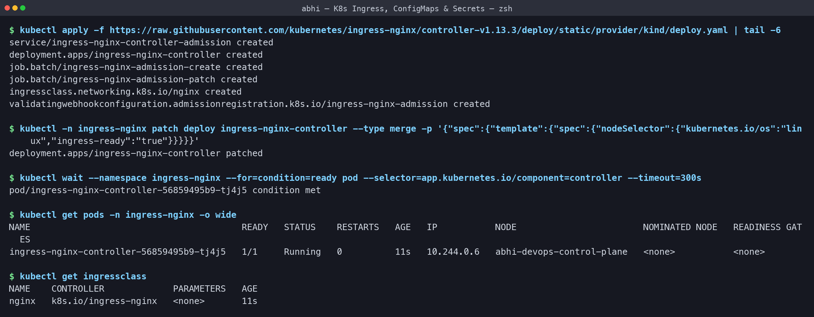
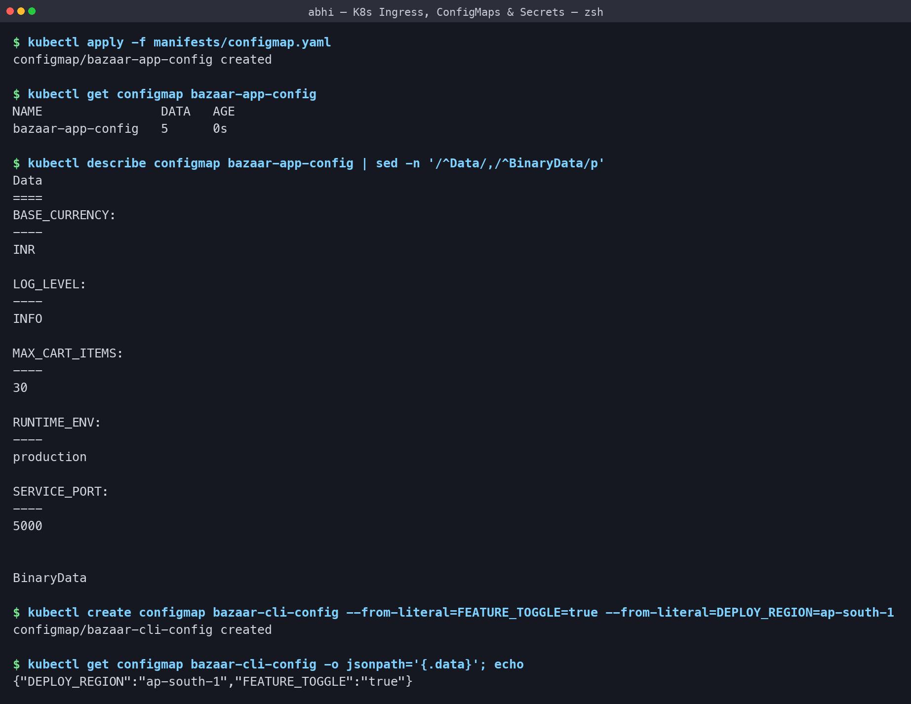
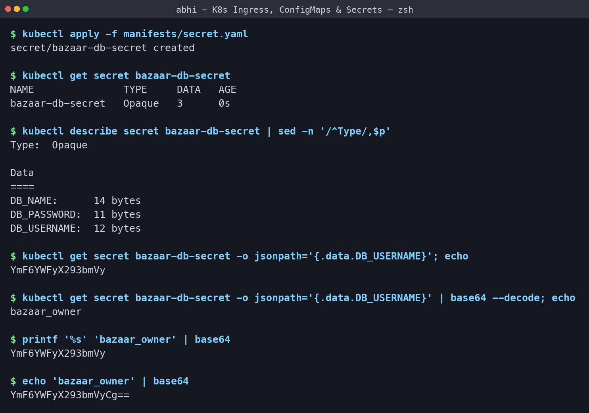
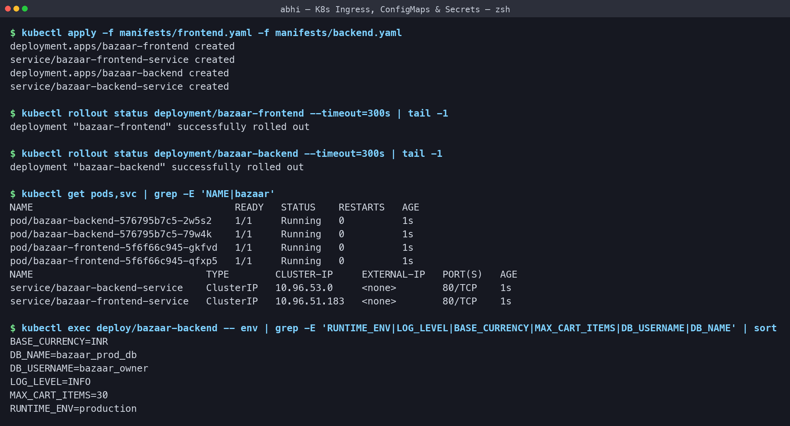
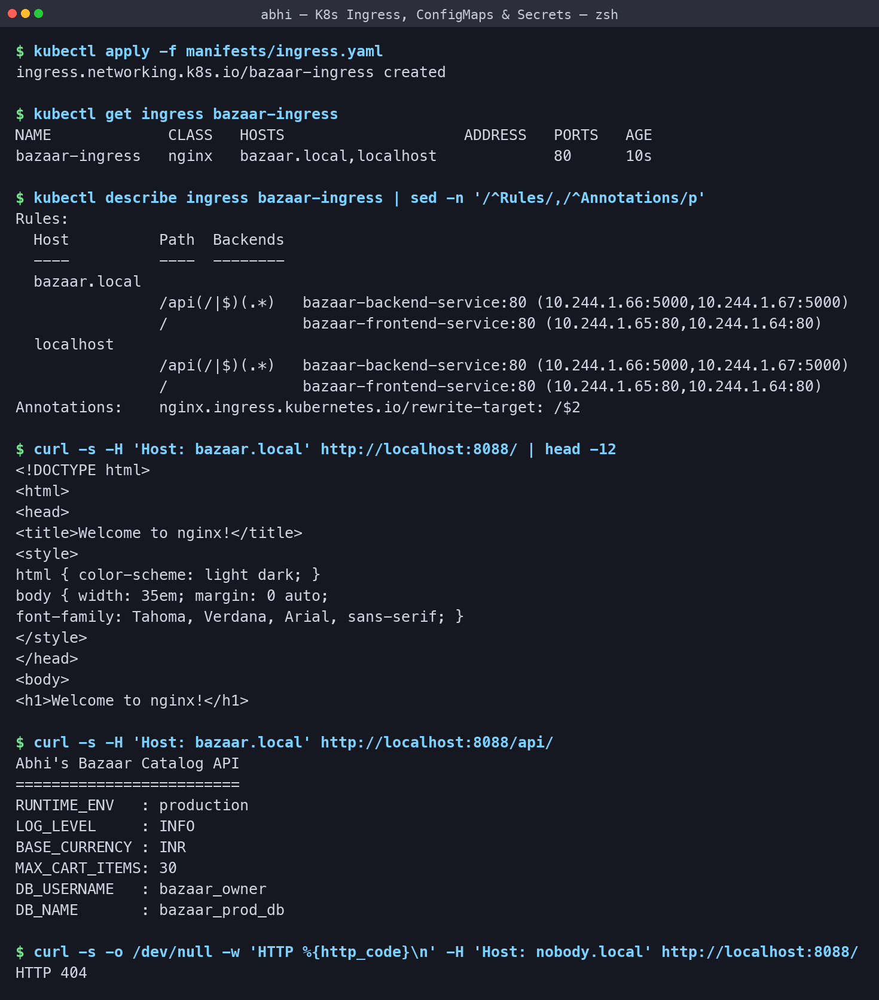
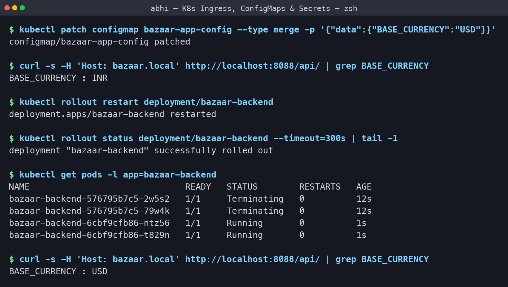
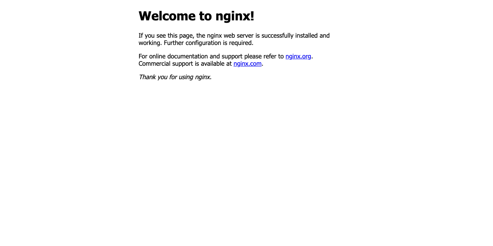

# Kubernetes Ingress, ConfigMaps & Secrets - Homework

**Name:** Abhi Gandhi
**Enrollment Number:** 24bcs10397

A small two-tier app ("Abhi's Bazaar") deployed on my local `abhi-devops` kind cluster,
configured entirely from a ConfigMap and a Secret, and exposed through a single NGINX
Ingress. Manifests are in [manifests/](manifests) and every output below is copied from my
terminal.

```bash
./run-labs.sh          # replays every command in this README
```

| Object | Purpose |
|---|---|
| **ConfigMap** | Non-sensitive configuration as key-value pairs, kept out of the image |
| **Secret** | Sensitive values (passwords, tokens, TLS keys), stored base64-encoded |
| **Ingress** | HTTP/HTTPS routing rules (host + path) from one entry point to many Services |
| **Ingress Controller** | The actual reverse proxy (NGINX here) that reads Ingress objects and enforces them |

What gets built:

```text
                     Host: bazaar.local
 curl / browser ───────────► NGINX Ingress Controller  (localhost:8088)
                                     │
                    path /           │           path /api/...
                    ▼                                ▼
       bazaar-frontend-service            bazaar-backend-service   (both ClusterIP)
                    ▼                                ▼
          2 × Nginx Pods                    2 × Python API Pods
                                             ▲                ▲
                                        ConfigMap           Secret
                                    bazaar-app-config   bazaar-db-secret
```

## Task 1: Install the Ingress controller

An Ingress object on its own does nothing - it is just data until a controller reads it. My
kind cluster publishes the control-plane node's port 80 on `localhost:8088`
(see [kind-cluster.yaml](../Kubernetes%20Fundamentals/kind-cluster.yaml)), so the controller
has to run on **that** node - the one labelled `ingress-ready=true`. That is what the
`nodeSelector` patch below is for.

```text
$ kubectl apply -f https://raw.githubusercontent.com/kubernetes/ingress-nginx/controller-v1.13.3/deploy/static/provider/kind/deploy.yaml | tail -6
service/ingress-nginx-controller-admission created
deployment.apps/ingress-nginx-controller created
job.batch/ingress-nginx-admission-create created
job.batch/ingress-nginx-admission-patch created
ingressclass.networking.k8s.io/nginx created
validatingwebhookconfiguration.admissionregistration.k8s.io/ingress-nginx-admission created

$ kubectl -n ingress-nginx patch deploy ingress-nginx-controller --type merge -p '{"spec":{"template":{"spec":{"nodeSelector":{"kubernetes.io/os":"linux","ingress-ready":"true"}}}}}'
deployment.apps/ingress-nginx-controller patched

$ kubectl wait --namespace ingress-nginx --for=condition=ready pod --selector=app.kubernetes.io/component=controller --timeout=300s
pod/ingress-nginx-controller-56859495b9-tj4j5 condition met

$ kubectl get pods -n ingress-nginx -o wide
NAME                                        READY   STATUS    RESTARTS   AGE   IP           NODE                        NOMINATED NODE   READINESS GATES
ingress-nginx-controller-56859495b9-tj4j5   1/1     Running   0          11s   10.244.0.6   abhi-devops-control-plane   <none>           <none>

$ kubectl get ingressclass
NAME    CONTROLLER             PARAMETERS   AGE
nginx   k8s.io/ingress-nginx   <none>       11s
```

**What I understood:** the controller is an ordinary Deployment living in its own
`ingress-nginx` namespace, and after the patch it is scheduled on
`abhi-devops-control-plane` as required. The `IngressClass` named `nginx` is the link
between my Ingress object and this controller - an Ingress that names a class with no
controller behind it is silently ignored.



## Task 2: ConfigMap

[manifests/configmap.yaml](manifests/configmap.yaml)

```text
$ kubectl apply -f manifests/configmap.yaml
configmap/bazaar-app-config created

$ kubectl get configmap bazaar-app-config
NAME                DATA   AGE
bazaar-app-config   5      0s

$ kubectl describe configmap bazaar-app-config | sed -n '/^Data/,/^BinaryData/p'
Data
====
BASE_CURRENCY:
----
INR

LOG_LEVEL:
----
INFO

MAX_CART_ITEMS:
----
30

RUNTIME_ENV:
----
production

SERVICE_PORT:
----
5000


BinaryData

$ kubectl create configmap bazaar-cli-config --from-literal=FEATURE_TOGGLE=true --from-literal=DEPLOY_REGION=ap-south-1
configmap/bazaar-cli-config created

$ kubectl get configmap bazaar-cli-config -o jsonpath='{.data}'; echo
{"DEPLOY_REGION":"ap-south-1","FEATURE_TOGGLE":"true"}
```

**What I understood:** a ConfigMap is plain, readable text - `describe` shows every value in
full, which is exactly why it must never hold a password. It can be written as YAML or
created straight from the CLI with `--from-literal` (or `--from-file` for a whole config
file). The same container image can then run in dev and in production with nothing changed
but the ConfigMap, so a configuration change needs no image rebuild.



## Task 3: Secret, and the base64 trap

[manifests/secret.yaml](manifests/secret.yaml)

```text
$ kubectl apply -f manifests/secret.yaml
secret/bazaar-db-secret created

$ kubectl get secret bazaar-db-secret
NAME               TYPE     DATA   AGE
bazaar-db-secret   Opaque   3      0s

$ kubectl describe secret bazaar-db-secret | sed -n '/^Type/,$p'
Type:  Opaque

Data
====
DB_NAME:      14 bytes
DB_PASSWORD:  11 bytes
DB_USERNAME:  12 bytes

$ kubectl get secret bazaar-db-secret -o jsonpath='{.data.DB_USERNAME}'; echo
YmF6YWFyX293bmVy

$ kubectl get secret bazaar-db-secret -o jsonpath='{.data.DB_USERNAME}' | base64 --decode; echo
bazaar_owner

$ printf '%s' 'bazaar_owner' | base64
YmF6YWFyX293bmVy

$ echo 'bazaar_owner' | base64
YmF6YWFyX293bmVyCg==
```

**What I understood:**

- `kubectl describe secret` deliberately prints only the **size** of each value
  (`DB_USERNAME: 12 bytes`), never the value itself - so a `describe` in a shared terminal
  is safe.
- Values under `data:` are **base64-encoded, not encrypted**. Anyone allowed to read the
  Secret can decode it in one command, as I did. Real protection comes from RBAC, encryption
  at rest for etcd, and keeping Secret YAML out of Git (Sealed Secrets or an external vault).
- **The trap:** `printf '%s' 'bazaar_owner' | base64` gives `YmF6YWFyX293bmVy`, but
  `echo 'bazaar_owner' | base64` gives `YmF6YWFyX293bmVyCg==`. That extra `Cg==` is an
  encoded newline, and it ends up *inside* the password - producing authentication failures
  that are nearly impossible to spot, because everything looks right. Use `printf '%s'`
  (or `echo -n`), or better still use `stringData:` and let Kubernetes do the encoding.



## Task 4: Deploy the apps and inject the configuration

[manifests/frontend.yaml](manifests/frontend.yaml),
[manifests/backend.yaml](manifests/backend.yaml)

The backend deliberately uses **both** injection styles:

```yaml
envFrom:
  - configMapRef:
      name: bazaar-app-config       # every key becomes an environment variable
env:
  - name: DB_USERNAME
    valueFrom:
      secretKeyRef:                 # one specific key out of the Secret
        name: bazaar-db-secret
        key: DB_USERNAME
```

```text
$ kubectl apply -f manifests/frontend.yaml -f manifests/backend.yaml
deployment.apps/bazaar-frontend created
service/bazaar-frontend-service created
deployment.apps/bazaar-backend created
service/bazaar-backend-service created

$ kubectl rollout status deployment/bazaar-frontend --timeout=300s | tail -1
deployment "bazaar-frontend" successfully rolled out

$ kubectl rollout status deployment/bazaar-backend --timeout=300s | tail -1
deployment "bazaar-backend" successfully rolled out

$ kubectl get pods,svc | grep -E 'NAME|bazaar'
NAME                                   READY   STATUS    RESTARTS   AGE
pod/bazaar-backend-576795b7c5-2w5s2    1/1     Running   0          1s
pod/bazaar-backend-576795b7c5-79w4k    1/1     Running   0          1s
pod/bazaar-frontend-5f6f66c945-gkfvd   1/1     Running   0          1s
pod/bazaar-frontend-5f6f66c945-qfxp5   1/1     Running   0          1s
NAME                              TYPE        CLUSTER-IP     EXTERNAL-IP   PORT(S)   AGE
service/bazaar-backend-service    ClusterIP   10.96.53.0     <none>        80/TCP    1s
service/bazaar-frontend-service   ClusterIP   10.96.51.183   <none>        80/TCP    1s

$ kubectl exec deploy/bazaar-backend -- env | grep -E 'RUNTIME_ENV|LOG_LEVEL|BASE_CURRENCY|MAX_CART_ITEMS|DB_USERNAME|DB_NAME' | sort
BASE_CURRENCY=INR
DB_NAME=bazaar_prod_db
DB_USERNAME=bazaar_owner
LOG_LEVEL=INFO
MAX_CART_ITEMS=30
RUNTIME_ENV=production
```

**What I understood:** inside the container, the ConfigMap keys and the **already-decoded**
Secret values are just ordinary environment variables - `DB_USERNAME=bazaar_owner`, not the
base64 string. The application code needs no Kubernetes awareness at all, which is what
makes this pattern portable. `envFrom` is convenient for a whole config block, while
`secretKeyRef` is better for secrets because it names exactly which key is being exposed.



## Task 5: Ingress routing

[manifests/ingress.yaml](manifests/ingress.yaml) - host `bazaar.local`, with
`/api(/|$)(.*)` going to the backend using `rewrite-target: /$2`, and `/` going to the
frontend.

Rather than editing `/etc/hosts`, I sent the `Host` header with `curl`, which is what the
controller actually routes on. I also declared a second identical rule for host `localhost`
purely so the same pages open directly in a browser at `http://localhost:8088`.

```text
$ kubectl apply -f manifests/ingress.yaml
ingress.networking.k8s.io/bazaar-ingress created

$ kubectl get ingress bazaar-ingress
NAME             CLASS   HOSTS                    ADDRESS   PORTS   AGE
bazaar-ingress   nginx   bazaar.local,localhost             80      10s

$ kubectl describe ingress bazaar-ingress | sed -n '/^Rules/,/^Annotations/p'
Rules:
  Host          Path  Backends
  ----          ----  --------
  bazaar.local  
                /api(/|$)(.*)   bazaar-backend-service:80 (10.244.1.66:5000,10.244.1.67:5000)
                /               bazaar-frontend-service:80 (10.244.1.65:80,10.244.1.64:80)
  localhost     
                /api(/|$)(.*)   bazaar-backend-service:80 (10.244.1.66:5000,10.244.1.67:5000)
                /               bazaar-frontend-service:80 (10.244.1.65:80,10.244.1.64:80)
Annotations:    nginx.ingress.kubernetes.io/rewrite-target: /$2

$ curl -s -H 'Host: bazaar.local' http://localhost:8088/ | head -12
<!DOCTYPE html>
<html>
<head>
<title>Welcome to nginx!</title>
<style>
html { color-scheme: light dark; }
body { width: 35em; margin: 0 auto;
font-family: Tahoma, Verdana, Arial, sans-serif; }
</style>
</head>
<body>
<h1>Welcome to nginx!</h1>

$ curl -s -H 'Host: bazaar.local' http://localhost:8088/api/
Abhi's Bazaar Catalog API
=========================
RUNTIME_ENV   : production
LOG_LEVEL     : INFO
BASE_CURRENCY : INR
MAX_CART_ITEMS: 30
DB_USERNAME   : bazaar_owner
DB_NAME       : bazaar_prod_db

$ curl -s -o /dev/null -w 'HTTP %{http_code}\n' -H 'Host: nobody.local' http://localhost:8088/
HTTP 404
```

**What I understood:**

- **One entry point, two Services.** `/` returned the Nginx frontend page and `/api/`
  returned my Python API. Both Services stay plain `ClusterIP`, so nothing but the Ingress
  is exposed.
- `describe ingress` resolves each rule down to the **actual Pod IPs and ports**
  (`10.244.1.58:5000`), which makes it obvious whether a rule is wired to anything.
- The backend response proves the whole chain end to end: `RUNTIME_ENV: production` and
  `BASE_CURRENCY: INR` came from the **ConfigMap**, and `DB_USERNAME: bazaar_owner` from the
  **Secret** - delivered through Ingress -> Service -> Pod -> environment.
- `rewrite-target: /$2` strips the `/api` prefix, so the backend sees `/` rather than
  `/api/`. Without it the app would have to know its own mount path.
- A request with an unknown host (`nobody.local`) got a `404` from the controller's default
  backend, because no rule matched. Routing really is host-based, not just path-based.



## Task 6: Changing a ConfigMap needs a restart

```text
$ kubectl patch configmap bazaar-app-config --type merge -p '{"data":{"BASE_CURRENCY":"USD"}}'
configmap/bazaar-app-config patched

$ curl -s -H 'Host: bazaar.local' http://localhost:8088/api/ | grep BASE_CURRENCY
BASE_CURRENCY : INR

$ kubectl rollout restart deployment/bazaar-backend
deployment.apps/bazaar-backend restarted

$ kubectl rollout status deployment/bazaar-backend --timeout=300s | tail -1
deployment "bazaar-backend" successfully rolled out

$ kubectl get pods -l app=bazaar-backend
NAME                              READY   STATUS        RESTARTS   AGE
bazaar-backend-576795b7c5-2w5s2   1/1     Terminating   0          12s
bazaar-backend-576795b7c5-79w4k   1/1     Terminating   0          12s
bazaar-backend-6cbf9cfb86-ntz56   1/1     Running       0          1s
bazaar-backend-6cbf9cfb86-t829n   1/1     Running       0          1s

$ curl -s -H 'Host: bazaar.local' http://localhost:8088/api/ | grep BASE_CURRENCY
BASE_CURRENCY : USD
```

**What I understood:** I changed `BASE_CURRENCY` to `USD` in the ConfigMap and the API kept
answering `INR`. Environment variables are read **once, at process start**, so an env-injected
ConfigMap change only lands after `kubectl rollout restart`. (A ConfigMap mounted as a
*volume* is refreshed automatically instead, which is the reason to prefer volumes for
config that changes often.)

One extra thing this taught me: `rollout status` reported success while the old Pods were
still `Terminating`, and they were still in the Ingress controller's upstream list - so a
`curl` issued immediately was still answered by an old Pod with the stale value. I had to
wait for the old Pods to finish draining before the new value appeared reliably.



## Task 7: The same thing in a browser

Because of the extra `localhost` rule in my Ingress, both routes open directly in a browser
with no `/etc/hosts` change.

**`http://localhost:8088/` - the frontend through the Ingress**



**`http://localhost:8088/api/` - the backend, showing the ConfigMap and Secret values**


**What I understood:** the same single entry point on port 8088 served two completely
different applications depending only on the path, and the values printed on the `/api/`
page are the live contents of my ConfigMap and Secret. Compared with giving every Service
its own LoadBalancer, an Ingress needs one external address and adds host/path routing plus
TLS termination in one place.

## Clean up

```bash
kubectl delete -f manifests/
kubectl delete configmap bazaar-cli-config
kubectl delete -f https://raw.githubusercontent.com/kubernetes/ingress-nginx/controller-v1.13.3/deploy/static/provider/kind/deploy.yaml

# and to remove the whole cluster used by all four Kubernetes sections
kind delete cluster --name abhi-devops
```
