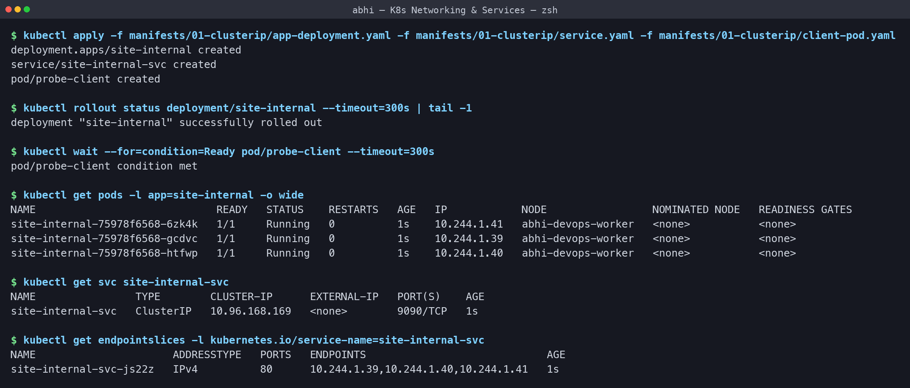
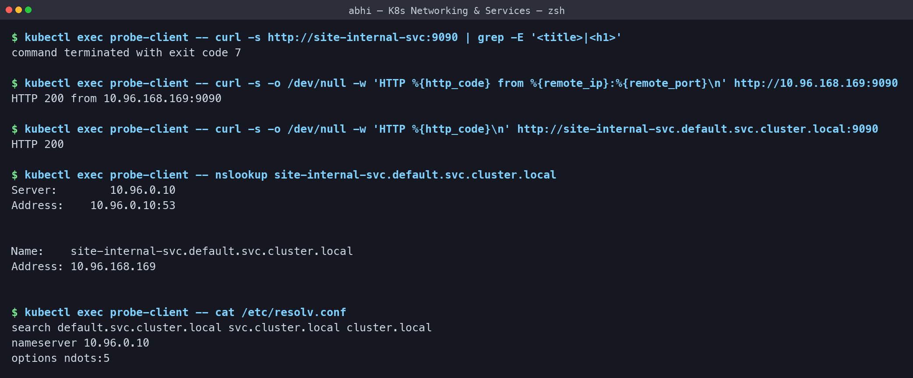
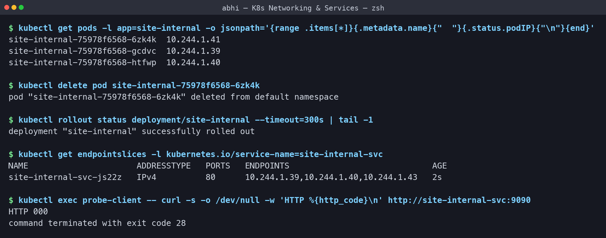
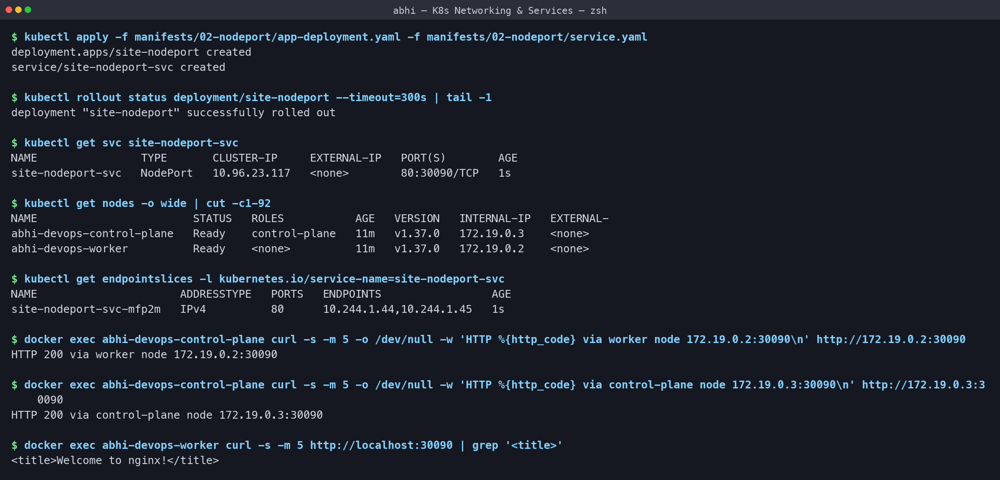
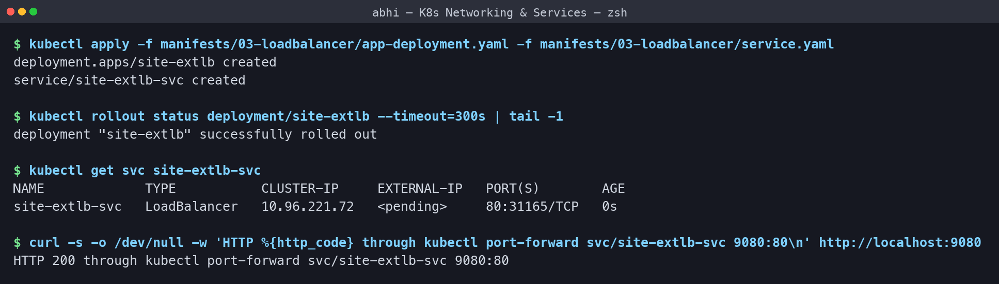
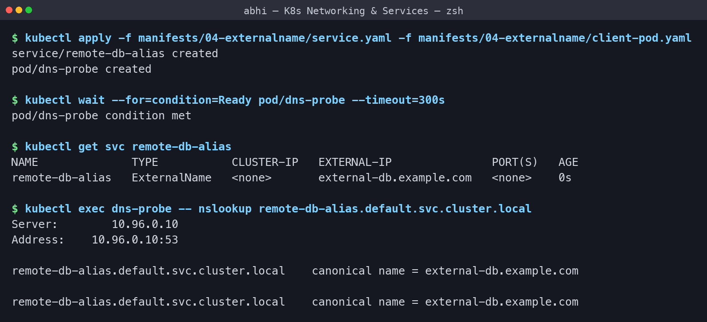
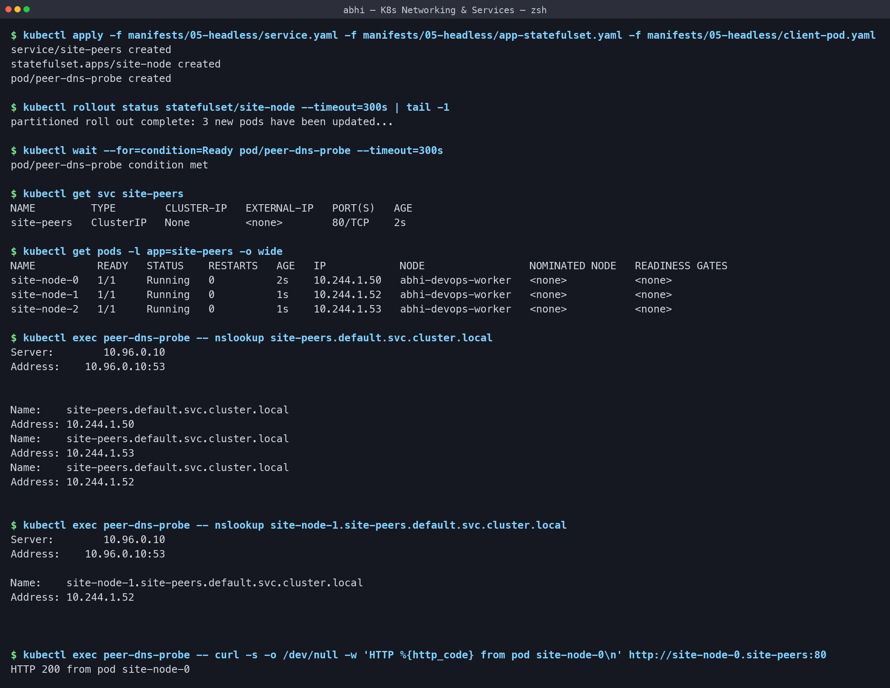
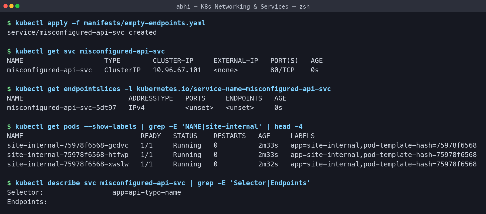
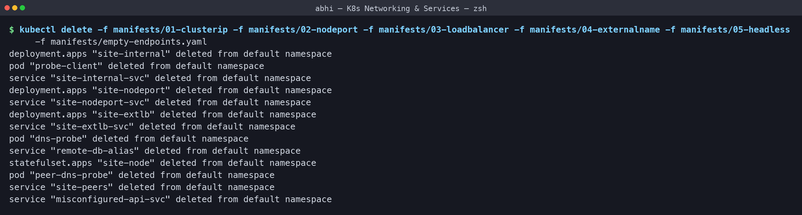

# Kubernetes Networking & Services - Homework

**Name:** Abhi Gandhi
**Enrollment Number:** 24bcs10397

All five Service types plus an endpoint-troubleshooting drill, run on my local 2-node
`abhi-devops` kind cluster. Manifests are in [manifests/](manifests) and every output below
is copied from my terminal.

```bash
./run-labs.sh          # replays every command in this README
```

## Why Services exist at all

Pods are disposable. Every time one is re-created it gets a **new IP**, so nothing can ever
be pointed at a Pod IP. A Service puts a **stable name and virtual IP** in front of every
Pod matching its label selector, and load balances across them.

| Type | Reachable from | How it works | Typical use |
|---|---|---|---|
| **ClusterIP** (default) | Inside the cluster only | Virtual IP + DNS name | Service-to-service calls, databases |
| **NodePort** | Outside, via `<NodeIP>:30000-32767` | Opens the same port on every node | Demos, on-prem with no load balancer |
| **LoadBalancer** | Internet | Cloud provider provisions a real load balancer | Production entry point on cloud |
| **ExternalName** | Inside the cluster | DNS `CNAME` to an external host, no proxying | Giving an outside DB/API an in-cluster name |
| **Headless** (`clusterIP: None`) | Inside the cluster | DNS returns the **Pod IPs** directly | StatefulSets, databases, peer discovery |

The three port fields that always confuse me: `port` is the Service's own port,
`targetPort` is the container's port, and `nodePort` is the port opened on the nodes. In my
ClusterIP manifest I deliberately made them different (`9090 -> 80`) so the mapping is
visible.

## Task 1: ClusterIP

[manifests/01-clusterip](manifests/01-clusterip) - 3 Nginx Pods, a Service mapping
`9090 -> 80`, and a `probe-client` Pod to test from inside the cluster.

```text
$ kubectl apply -f manifests/01-clusterip/app-deployment.yaml -f manifests/01-clusterip/service.yaml -f manifests/01-clusterip/client-pod.yaml
deployment.apps/site-internal created
service/site-internal-svc created
pod/probe-client created

$ kubectl rollout status deployment/site-internal --timeout=300s | tail -1
deployment "site-internal" successfully rolled out

$ kubectl wait --for=condition=Ready pod/probe-client --timeout=300s
pod/probe-client condition met

$ kubectl get pods -l app=site-internal -o wide
NAME                             READY   STATUS    RESTARTS   AGE   IP            NODE                 NOMINATED NODE   READINESS GATES
site-internal-75978f6568-6zk4k   1/1     Running   0          1s    10.244.1.41   abhi-devops-worker   <none>           <none>
site-internal-75978f6568-gcdvc   1/1     Running   0          1s    10.244.1.39   abhi-devops-worker   <none>           <none>
site-internal-75978f6568-htfwp   1/1     Running   0          1s    10.244.1.40   abhi-devops-worker   <none>           <none>

$ kubectl get svc site-internal-svc
NAME                TYPE        CLUSTER-IP      EXTERNAL-IP   PORT(S)    AGE
site-internal-svc   ClusterIP   10.96.168.169   <none>        9090/TCP   1s

$ kubectl get endpointslices -l kubernetes.io/service-name=site-internal-svc
NAME                      ADDRESSTYPE   PORTS   ENDPOINTS                             AGE
site-internal-svc-js22z   IPv4          80      10.244.1.39,10.244.1.40,10.244.1.41   1s
```

**What I understood:** the Service was given the virtual IP `10.96.168.169`, and its
EndpointSlice lists exactly the three Pod IPs on port **80** - the `targetPort`, not the
Service port. `EXTERNAL-IP` is `<none>`, so this is internal-only. Note that the
EndpointSlice is a separate object maintained by a controller, not something I declared.



### Reaching it three different ways, and the DNS behind it

```text
$ kubectl exec probe-client -- curl -s http://site-internal-svc:9090 | grep -E '<title>|<h1>'
command terminated with exit code 7

$ kubectl exec probe-client -- curl -s -o /dev/null -w 'HTTP %{http_code} from %{remote_ip}:%{remote_port}\n' http://10.96.168.169:9090
HTTP 200 from 10.96.168.169:9090

$ kubectl exec probe-client -- curl -s -o /dev/null -w 'HTTP %{http_code}\n' http://site-internal-svc.default.svc.cluster.local:9090
HTTP 200

$ kubectl exec probe-client -- nslookup site-internal-svc.default.svc.cluster.local
Server:		10.96.0.10
Address:	10.96.0.10:53


Name:	site-internal-svc.default.svc.cluster.local
Address: 10.96.168.169


$ kubectl exec probe-client -- cat /etc/resolv.conf
search default.svc.cluster.local svc.cluster.local cluster.local
nameserver 10.96.0.10
options ndots:5
```

**What I understood:**

- The same Service answered by **short name**, by raw **ClusterIP**, and by full
  **FQDN** `site-internal-svc.default.svc.cluster.local` - all `HTTP 200`.
- The short name only works because of the `search default.svc.cluster.local
  svc.cluster.local cluster.local` line in the Pod's `/etc/resolv.conf`. The nameserver
  `10.96.0.10` is CoreDNS.
- The FQDN format is `<service>.<namespace>.svc.cluster.local`. To call a Service in a
  *different* namespace I need at least `<service>.<namespace>`, because the search list
  only covers my own namespace.
- `options ndots:5` means any name with fewer than 5 dots gets the search suffixes tried
  first - which is why a short name resolves but also why a typo can produce surprising
  lookups.



### Proof that the Service follows the Pods

```text
$ kubectl get pods -l app=site-internal -o jsonpath='{range .items[*]}{.metadata.name}{"  "}{.status.podIP}{"\n"}{end}'
site-internal-75978f6568-6zk4k  10.244.1.41
site-internal-75978f6568-gcdvc  10.244.1.39
site-internal-75978f6568-htfwp  10.244.1.40

$ kubectl delete pod site-internal-75978f6568-6zk4k
pod "site-internal-75978f6568-6zk4k" deleted from default namespace

$ kubectl rollout status deployment/site-internal --timeout=300s | tail -1
deployment "site-internal" successfully rolled out

$ kubectl get endpointslices -l kubernetes.io/service-name=site-internal-svc
NAME                      ADDRESSTYPE   PORTS   ENDPOINTS                             AGE
site-internal-svc-js22z   IPv4          80      10.244.1.39,10.244.1.40,10.244.1.43   2s

$ kubectl exec probe-client -- curl -s -o /dev/null -w 'HTTP %{http_code}\n' http://site-internal-svc:9090
HTTP 000
command terminated with exit code 28
```

**What I understood:** I deleted the Pod holding `10.244.1.41`. The Deployment replaced it,
and the EndpointSlice **updated itself** - `.41` was swapped for the new `.43` with no
action from me. The client kept calling the exact same name and still got `HTTP 200`. This
single experiment is the whole reason Services exist.



## Task 2: NodePort

[manifests/02-nodeport](manifests/02-nodeport) - `port: 80`, `targetPort: 80`,
`nodePort: 30090`.

```text
$ kubectl apply -f manifests/02-nodeport/app-deployment.yaml -f manifests/02-nodeport/service.yaml
deployment.apps/site-nodeport created
service/site-nodeport-svc created

$ kubectl rollout status deployment/site-nodeport --timeout=300s | tail -1
deployment "site-nodeport" successfully rolled out

$ kubectl get svc site-nodeport-svc
NAME                TYPE       CLUSTER-IP     EXTERNAL-IP   PORT(S)        AGE
site-nodeport-svc   NodePort   10.96.23.117   <none>        80:30090/TCP   1s

$ kubectl get nodes -o wide | cut -c1-92
NAME                        STATUS   ROLES           AGE   VERSION   INTERNAL-IP   EXTERNAL-
abhi-devops-control-plane   Ready    control-plane   11m   v1.37.0   172.19.0.3    <none>   
abhi-devops-worker          Ready    <none>          11m   v1.37.0   172.19.0.2    <none>   

$ kubectl get endpointslices -l kubernetes.io/service-name=site-nodeport-svc
NAME                      ADDRESSTYPE   PORTS   ENDPOINTS                 AGE
site-nodeport-svc-mfp2m   IPv4          80      10.244.1.44,10.244.1.45   1s

$ docker exec abhi-devops-control-plane curl -s -m 5 -o /dev/null -w 'HTTP %{http_code} via worker node 172.19.0.2:30090\n' http://172.19.0.2:30090
HTTP 200 via worker node 172.19.0.2:30090

$ docker exec abhi-devops-control-plane curl -s -m 5 -o /dev/null -w 'HTTP %{http_code} via control-plane node 172.19.0.3:30090\n' http://172.19.0.3:30090
HTTP 200 via control-plane node 172.19.0.3:30090

$ docker exec abhi-devops-worker curl -s -m 5 http://localhost:30090 | grep '<title>'
<title>Welcome to nginx!</title>
```

**What I understood:**

- `80:30090/TCP` means port 30090 is opened on **every node**. Both node IPs answered
  `HTTP 200`, including the **control-plane node where no application Pod is running** -
  `kube-proxy` forwarded that traffic across to a Pod on the worker.
- A NodePort Service still has its own ClusterIP. The types stack:
  LoadBalancer ⊃ NodePort ⊃ ClusterIP.
- I had to add a short wait before curling. On my first attempt the Service was 1 second old
  and both node IPs returned `HTTP 000`, because `kube-proxy` had not programmed the rule
  yet. Checking that the EndpointSlice is populated first is the reliable way to know the
  Service is really ready - a lesson that applies to CI pipelines too.
- kind nodes are Docker containers, so their `172.19.0.x` IPs only exist inside the Docker
  network - that is why I ran `curl` from *inside* the node containers with `docker exec`.
  On Minikube the equivalent would be `curl $(minikube ip):30090`.



## Task 3: LoadBalancer

[manifests/03-loadbalancer](manifests/03-loadbalancer)

```text
$ kubectl apply -f manifests/03-loadbalancer/app-deployment.yaml -f manifests/03-loadbalancer/service.yaml
deployment.apps/site-extlb created
service/site-extlb-svc created

$ kubectl rollout status deployment/site-extlb --timeout=300s | tail -1
deployment "site-extlb" successfully rolled out

$ kubectl get svc site-extlb-svc
NAME             TYPE           CLUSTER-IP     EXTERNAL-IP   PORT(S)        AGE
site-extlb-svc   LoadBalancer   10.96.221.72   <pending>     80:31165/TCP   0s

$ curl -s -o /dev/null -w 'HTTP %{http_code} through kubectl port-forward svc/site-extlb-svc 9080:80\n' http://localhost:9080
HTTP 200 through kubectl port-forward svc/site-extlb-svc 9080:80
```

**What I understood:**

- `EXTERNAL-IP` sits at `<pending>` forever on a local cluster, because there is no cloud
  controller to go and create a load balancer. On AWS/GCP/Azure a public IP or hostname
  would appear there. Locally `minikube tunnel`, MetalLB or `cloud-provider-kind` can fill
  that role.
- The Service is still perfectly usable: it was also given a NodePort (`80:31165`) and a
  ClusterIP, and `kubectl port-forward` returned `HTTP 200`.
- Each LoadBalancer Service is a separate billable cloud resource, which is why production
  puts **one** LoadBalancer in front of an Ingress controller and routes to many ClusterIP
  Services behind it - exactly what I build in the next section.



## Task 4: ExternalName

[manifests/04-externalname](manifests/04-externalname)

```text
$ kubectl apply -f manifests/04-externalname/service.yaml -f manifests/04-externalname/client-pod.yaml
service/remote-db-alias created
pod/dns-probe created

$ kubectl wait --for=condition=Ready pod/dns-probe --timeout=300s
pod/dns-probe condition met

$ kubectl get svc remote-db-alias
NAME              TYPE           CLUSTER-IP   EXTERNAL-IP               PORT(S)   AGE
remote-db-alias   ExternalName   <none>       external-db.example.com   <none>    0s

$ kubectl exec dns-probe -- nslookup remote-db-alias.default.svc.cluster.local
Server:		10.96.0.10
Address:	10.96.0.10:53

remote-db-alias.default.svc.cluster.local	canonical name = external-db.example.com

remote-db-alias.default.svc.cluster.local	canonical name = external-db.example.com
```

**What I understood:** no ClusterIP, no selector, no Pods and no proxying at all. CoreDNS
simply answers with a `CNAME` -
`canonical name = external-db.example.com`. The application can keep using the in-cluster
name `remote-db-alias`, and if the external database ever moves I edit one Service instead
of redeploying the app. Because it is pure DNS, it cannot do port remapping or TLS.



## Task 5: Headless Service + StatefulSet

[manifests/05-headless](manifests/05-headless)

```text
$ kubectl apply -f manifests/05-headless/service.yaml -f manifests/05-headless/app-statefulset.yaml -f manifests/05-headless/client-pod.yaml
service/site-peers created
statefulset.apps/site-node created
pod/peer-dns-probe created

$ kubectl rollout status statefulset/site-node --timeout=300s | tail -1
partitioned roll out complete: 3 new pods have been updated...

$ kubectl wait --for=condition=Ready pod/peer-dns-probe --timeout=300s
pod/peer-dns-probe condition met

$ kubectl get svc site-peers
NAME         TYPE        CLUSTER-IP   EXTERNAL-IP   PORT(S)   AGE
site-peers   ClusterIP   None         <none>        80/TCP    2s

$ kubectl get pods -l app=site-peers -o wide
NAME          READY   STATUS    RESTARTS   AGE   IP            NODE                 NOMINATED NODE   READINESS GATES
site-node-0   1/1     Running   0          2s    10.244.1.50   abhi-devops-worker   <none>           <none>
site-node-1   1/1     Running   0          1s    10.244.1.52   abhi-devops-worker   <none>           <none>
site-node-2   1/1     Running   0          1s    10.244.1.53   abhi-devops-worker   <none>           <none>

$ kubectl exec peer-dns-probe -- nslookup site-peers.default.svc.cluster.local
Server:		10.96.0.10
Address:	10.96.0.10:53


Name:	site-peers.default.svc.cluster.local
Address: 10.244.1.50
Name:	site-peers.default.svc.cluster.local
Address: 10.244.1.53
Name:	site-peers.default.svc.cluster.local
Address: 10.244.1.52


$ kubectl exec peer-dns-probe -- nslookup site-node-1.site-peers.default.svc.cluster.local
Server:		10.96.0.10
Address:	10.96.0.10:53

Name:	site-node-1.site-peers.default.svc.cluster.local
Address: 10.244.1.52


$ kubectl exec peer-dns-probe -- curl -s -o /dev/null -w 'HTTP %{http_code} from pod site-node-0\n' http://site-node-0.site-peers:80
HTTP 200 from pod site-node-0
```

**What I understood:**

- With `clusterIP: None` the `CLUSTER-IP` column literally reads `None`. There is no virtual
  IP and no load balancing - DNS for the Service name returned **all three Pod IPs**
  (`10.244.1.50`, `.52`, `.53`) and the client picks one itself.
- StatefulSet Pods get **stable, ordered names** (`site-node-0`, `-1`, `-2`) instead of
  random suffixes, and each Pod gets its own DNS record in the form
  `<pod>.<service>.<namespace>.svc.cluster.local`. `site-node-1` resolved to precisely its
  own IP `10.244.1.52`.
- That per-Pod addressing is what clustered systems need: a MySQL replica, a Kafka broker or
  a MongoDB member has to talk to **one specific peer**, not to a random one behind a load
  balancer.



## Task 6: Troubleshooting - a Service with empty endpoints

[manifests/empty-endpoints.yaml](manifests/empty-endpoints.yaml) carries the selector
`app: api-typo-name`, which matches nothing.

```text
$ kubectl apply -f manifests/empty-endpoints.yaml
service/misconfigured-api-svc created

$ kubectl get svc misconfigured-api-svc
NAME                    TYPE        CLUSTER-IP     EXTERNAL-IP   PORT(S)   AGE
misconfigured-api-svc   ClusterIP   10.96.67.101   <none>        80/TCP    0s

$ kubectl get endpointslices -l kubernetes.io/service-name=misconfigured-api-svc
NAME                          ADDRESSTYPE   PORTS     ENDPOINTS   AGE
misconfigured-api-svc-5dt97   IPv4          <unset>   <unset>     0s

$ kubectl get pods --show-labels | grep -E 'NAME|site-internal' | head -4
NAME                             READY   STATUS    RESTARTS   AGE     LABELS
site-internal-75978f6568-gcdvc   1/1     Running   0          2m33s   app=site-internal,pod-template-hash=75978f6568
site-internal-75978f6568-htfwp   1/1     Running   0          2m33s   app=site-internal,pod-template-hash=75978f6568
site-internal-75978f6568-xwslw   1/1     Running   0          2m32s   app=site-internal,pod-template-hash=75978f6568

$ kubectl describe svc misconfigured-api-svc | grep -E 'Selector|Endpoints'
Selector:                 app=api-typo-name
Endpoints:                
```

**What I understood:** the Service was created with **no error at all** - it even got a
ClusterIP. But its EndpointSlice shows `<unset>` and `describe` shows an empty `Endpoints:`
line, so every request to it would hang or be refused. The `--show-labels` output proves
why: the real Pods are labelled `app=site-internal`, nothing carries `app=api-typo-name`.
Kubernetes never validates that a selector matches something.

My checklist when a Service does not respond:

1. `kubectl get endpointslices` - is the endpoint list empty?
2. `kubectl get pods --show-labels` - does the Service `selector` match the Pod labels **exactly**?
3. Does `targetPort` match the port the container actually listens on?
4. Are the Pods `Ready`? Pods failing a readiness probe are pulled out of the endpoints.
5. Is CoreDNS healthy: `kubectl get pods -n kube-system -l k8s-app=kube-dns`



## Clean up

```text
$ kubectl delete -f manifests/01-clusterip -f manifests/02-nodeport -f manifests/03-loadbalancer -f manifests/04-externalname -f manifests/05-headless -f manifests/empty-endpoints.yaml
deployment.apps "site-internal" deleted from default namespace
pod "probe-client" deleted from default namespace
service "site-internal-svc" deleted from default namespace
deployment.apps "site-nodeport" deleted from default namespace
service "site-nodeport-svc" deleted from default namespace
deployment.apps "site-extlb" deleted from default namespace
service "site-extlb-svc" deleted from default namespace
pod "dns-probe" deleted from default namespace
service "remote-db-alias" deleted from default namespace
statefulset.apps "site-node" deleted from default namespace
pod "peer-dns-probe" deleted from default namespace
service "site-peers" deleted from default namespace
service "misconfigured-api-svc" deleted from default namespace
```


