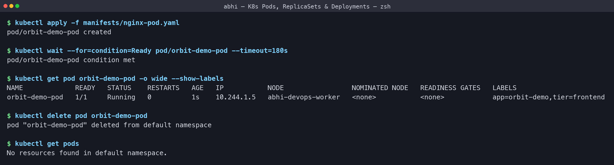
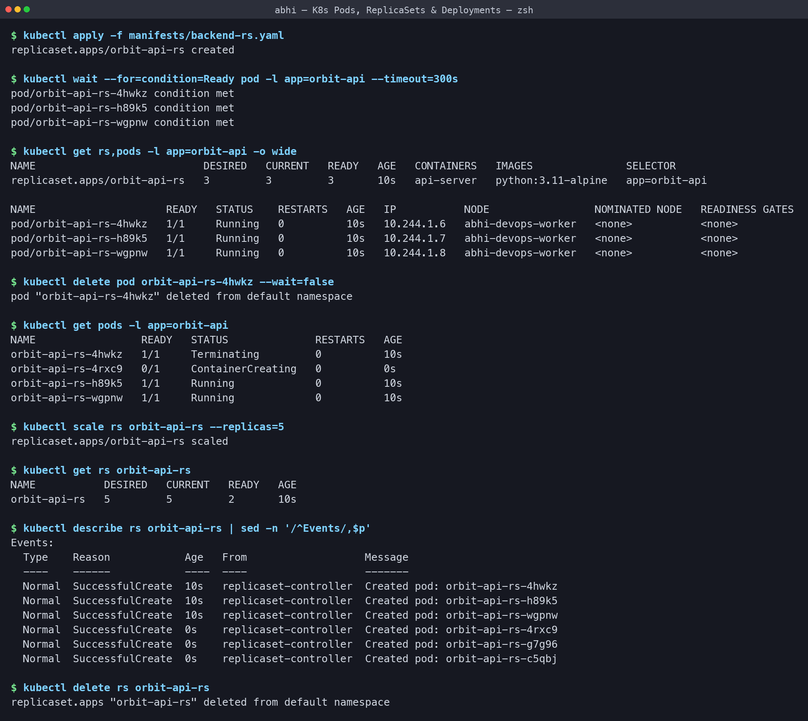
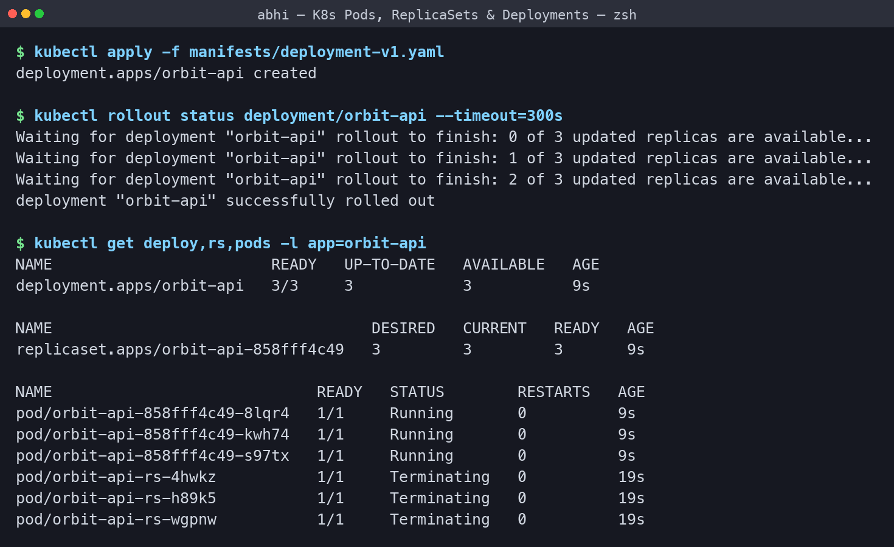
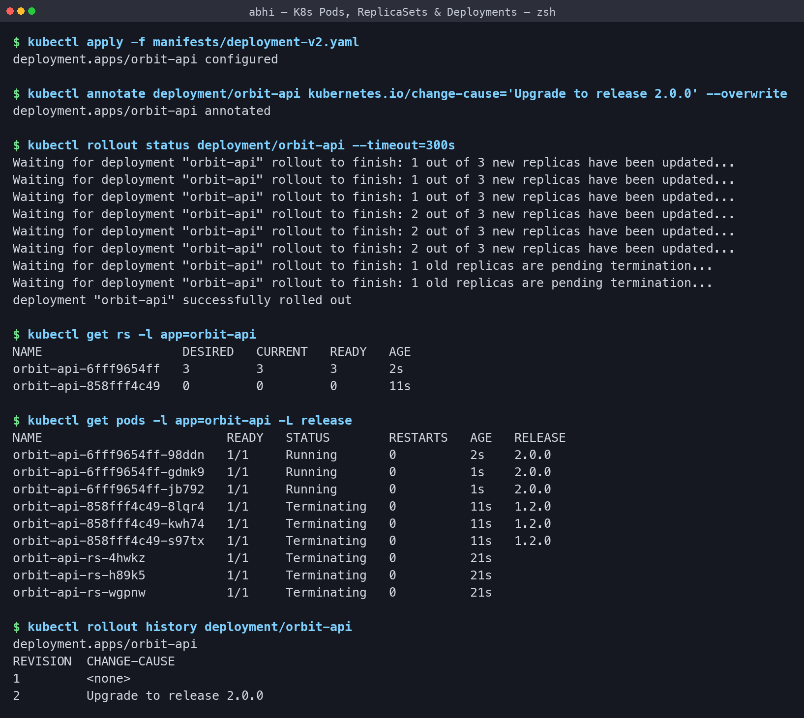
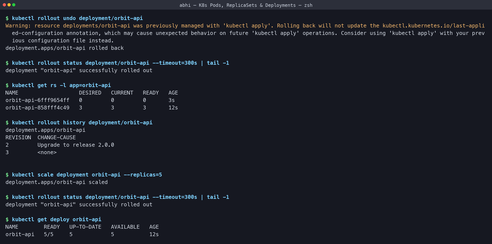
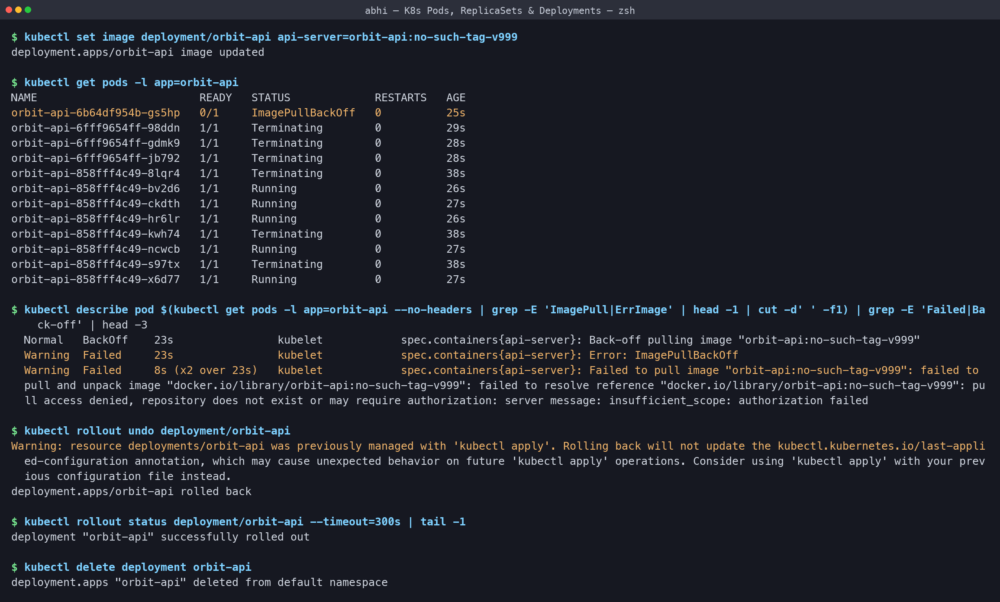
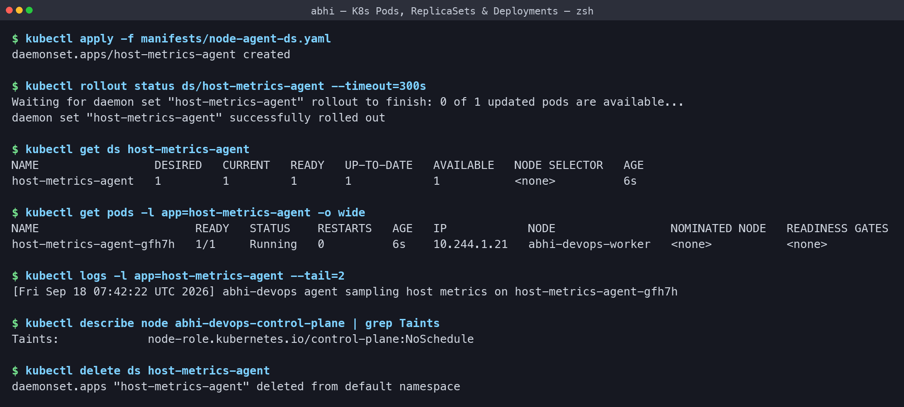

# Kubernetes Pods, ReplicaSets & Deployments - Homework

**Name:** Abhi Gandhi
**Enrollment Number:** 24bcs10397

Practice of the four core workload objects on my local 2-node `abhi-devops` kind cluster.
All manifests I wrote are in [manifests/](manifests) and every output below is copied from
my terminal.

```bash
./run-labs.sh          # replays every command in this README
```

| Object | What it adds over the one above it |
|---|---|
| **Pod** | Smallest unit: one or more containers sharing an IP and volumes. If it dies, nothing brings it back |
| **ReplicaSet** | Keeps N copies alive at all times - self-healing and scaling |
| **Deployment** | Manages ReplicaSets, which buys rolling updates, revision history and rollback |
| **DaemonSet** | Exactly one Pod on every eligible node - no `replicas` field at all |

## Task 1: A bare Pod is not protected

[manifests/nginx-pod.yaml](manifests/nginx-pod.yaml)

```text
$ kubectl apply -f manifests/nginx-pod.yaml
pod/orbit-demo-pod created

$ kubectl wait --for=condition=Ready pod/orbit-demo-pod --timeout=180s
pod/orbit-demo-pod condition met

$ kubectl get pod orbit-demo-pod -o wide --show-labels
NAME             READY   STATUS    RESTARTS   AGE   IP           NODE                 NOMINATED NODE   READINESS GATES   LABELS
orbit-demo-pod   1/1     Running   0          1s    10.244.1.5   abhi-devops-worker   <none>           <none>            app=orbit-demo,tier=frontend

$ kubectl delete pod orbit-demo-pod
pod "orbit-demo-pod" deleted from default namespace

$ kubectl get pods
No resources found in default namespace.
```

**What I understood:** nothing is watching a bare Pod. After `kubectl delete pod` the
namespace was completely empty - **No resources found** - and nobody re-created it. This is
exactly why Pods are almost never created directly in production. The `--show-labels`
column matters too: labels are the only handle controllers have on a Pod.



## Task 2: ReplicaSet - self-healing and scaling

[manifests/backend-rs.yaml](manifests/backend-rs.yaml) asks for `replicas: 3` with the
selector `app=orbit-api`.

```text
$ kubectl apply -f manifests/backend-rs.yaml
replicaset.apps/orbit-api-rs created

$ kubectl wait --for=condition=Ready pod -l app=orbit-api --timeout=300s
pod/orbit-api-rs-4hwkz condition met
pod/orbit-api-rs-h89k5 condition met
pod/orbit-api-rs-wgpnw condition met

$ kubectl get rs,pods -l app=orbit-api -o wide
NAME                           DESIRED   CURRENT   READY   AGE   CONTAINERS   IMAGES               SELECTOR
replicaset.apps/orbit-api-rs   3         3         3       10s   api-server   python:3.11-alpine   app=orbit-api

NAME                     READY   STATUS    RESTARTS   AGE   IP           NODE                 NOMINATED NODE   READINESS GATES
pod/orbit-api-rs-4hwkz   1/1     Running   0          10s   10.244.1.6   abhi-devops-worker   <none>           <none>
pod/orbit-api-rs-h89k5   1/1     Running   0          10s   10.244.1.7   abhi-devops-worker   <none>           <none>
pod/orbit-api-rs-wgpnw   1/1     Running   0          10s   10.244.1.8   abhi-devops-worker   <none>           <none>

$ kubectl delete pod orbit-api-rs-4hwkz --wait=false
pod "orbit-api-rs-4hwkz" deleted from default namespace

$ kubectl get pods -l app=orbit-api
NAME                 READY   STATUS              RESTARTS   AGE
orbit-api-rs-4hwkz   1/1     Terminating         0          10s
orbit-api-rs-4rxc9   0/1     ContainerCreating   0          0s
orbit-api-rs-h89k5   1/1     Running             0          10s
orbit-api-rs-wgpnw   1/1     Running             0          10s

$ kubectl scale rs orbit-api-rs --replicas=5
replicaset.apps/orbit-api-rs scaled

$ kubectl get rs orbit-api-rs
NAME           DESIRED   CURRENT   READY   AGE
orbit-api-rs   5         5         2       10s

$ kubectl describe rs orbit-api-rs | sed -n '/^Events/,$p'
Events:
  Type    Reason            Age   From                   Message
  ----    ------            ----  ----                   -------
  Normal  SuccessfulCreate  10s   replicaset-controller  Created pod: orbit-api-rs-4hwkz
  Normal  SuccessfulCreate  10s   replicaset-controller  Created pod: orbit-api-rs-h89k5
  Normal  SuccessfulCreate  10s   replicaset-controller  Created pod: orbit-api-rs-wgpnw
  Normal  SuccessfulCreate  0s    replicaset-controller  Created pod: orbit-api-rs-4rxc9
  Normal  SuccessfulCreate  0s    replicaset-controller  Created pod: orbit-api-rs-g7g96
  Normal  SuccessfulCreate  0s    replicaset-controller  Created pod: orbit-api-rs-c5qbj

$ kubectl delete rs orbit-api-rs
replicaset.apps "orbit-api-rs" deleted from default namespace
```

**What I understood:**

- I deleted the Pod `orbit-api-rs-4hwkz`, and the replacement `orbit-api-rs-4rxc9` was
  already `ContainerCreating` in the same second while the old one was still `Terminating`.
  The ReplicaSet never lets the count sit below 3. That is self-healing with no action from
  me.
- The ReplicaSet finds its Pods **only** through the label selector `app=orbit-api`, which
  is why every Pod name is the ReplicaSet name plus a random 5-character suffix.
- `kubectl scale --replicas=5` added two more Pods. In the `get rs` output right after,
  `DESIRED 5 / CURRENT 5 / READY 2` shows the gap between "the object has been updated" and
  "the containers are actually up" - the new Pods were still starting.
- The `Events` list records every single `SuccessfulCreate` from the replicaset-controller,
  so the history of the object is auditable.
- What a ReplicaSet **cannot** do is a controlled image change. That is the Deployment's job.



## Task 3: Deployment - revision 1

[manifests/deployment-v1.yaml](manifests/deployment-v1.yaml)

```text
$ kubectl apply -f manifests/deployment-v1.yaml
deployment.apps/orbit-api created

$ kubectl rollout status deployment/orbit-api --timeout=300s
Waiting for deployment "orbit-api" rollout to finish: 0 of 3 updated replicas are available...
Waiting for deployment "orbit-api" rollout to finish: 1 of 3 updated replicas are available...
Waiting for deployment "orbit-api" rollout to finish: 2 of 3 updated replicas are available...
deployment "orbit-api" successfully rolled out

$ kubectl get deploy,rs,pods -l app=orbit-api
NAME                        READY   UP-TO-DATE   AVAILABLE   AGE
deployment.apps/orbit-api   3/3     3            3           9s

NAME                                   DESIRED   CURRENT   READY   AGE
replicaset.apps/orbit-api-858fff4c49   3         3         3       9s

NAME                             READY   STATUS        RESTARTS   AGE
pod/orbit-api-858fff4c49-8lqr4   1/1     Running       0          9s
pod/orbit-api-858fff4c49-kwh74   1/1     Running       0          9s
pod/orbit-api-858fff4c49-s97tx   1/1     Running       0          9s
pod/orbit-api-rs-4hwkz           1/1     Terminating   0          19s
pod/orbit-api-rs-h89k5           1/1     Terminating   0          19s
pod/orbit-api-rs-wgpnw           1/1     Terminating   0          19s
```

**What I understood:** the ownership chain is **Deployment -> ReplicaSet -> Pods**, and the
Pod names spell it out: `orbit-api` + the ReplicaSet's pod-template hash `858fff4c49` + a
random suffix. I never created that ReplicaSet myself; the Deployment did. The three
`orbit-api-rs-*` Pods still shown as `Terminating` are leftovers from Task 2 - they carry
the same `app=orbit-api` label so they still match my `-l` filter, but they have no owner
any more and disappear seconds later.



## Task 4: Rolling update to revision 2

[manifests/deployment-v2.yaml](manifests/deployment-v2.yaml) - same app, `release: "2.0.0"`,
and `maxUnavailable` tightened from `1` to `0`.

```text
$ kubectl apply -f manifests/deployment-v2.yaml
deployment.apps/orbit-api configured

$ kubectl annotate deployment/orbit-api kubernetes.io/change-cause='Upgrade to release 2.0.0' --overwrite
deployment.apps/orbit-api annotated

$ kubectl rollout status deployment/orbit-api --timeout=300s
Waiting for deployment "orbit-api" rollout to finish: 1 out of 3 new replicas have been updated...
Waiting for deployment "orbit-api" rollout to finish: 1 out of 3 new replicas have been updated...
Waiting for deployment "orbit-api" rollout to finish: 1 out of 3 new replicas have been updated...
Waiting for deployment "orbit-api" rollout to finish: 2 out of 3 new replicas have been updated...
Waiting for deployment "orbit-api" rollout to finish: 2 out of 3 new replicas have been updated...
Waiting for deployment "orbit-api" rollout to finish: 2 out of 3 new replicas have been updated...
Waiting for deployment "orbit-api" rollout to finish: 1 old replicas are pending termination...
Waiting for deployment "orbit-api" rollout to finish: 1 old replicas are pending termination...
deployment "orbit-api" successfully rolled out

$ kubectl get rs -l app=orbit-api
NAME                   DESIRED   CURRENT   READY   AGE
orbit-api-6fff9654ff   3         3         3       2s
orbit-api-858fff4c49   0         0         0       11s

$ kubectl get pods -l app=orbit-api -L release
NAME                         READY   STATUS        RESTARTS   AGE   RELEASE
orbit-api-6fff9654ff-98ddn   1/1     Running       0          2s    2.0.0
orbit-api-6fff9654ff-gdmk9   1/1     Running       0          1s    2.0.0
orbit-api-6fff9654ff-jb792   1/1     Running       0          1s    2.0.0
orbit-api-858fff4c49-8lqr4   1/1     Terminating   0          11s   1.2.0
orbit-api-858fff4c49-kwh74   1/1     Terminating   0          11s   1.2.0
orbit-api-858fff4c49-s97tx   1/1     Terminating   0          11s   1.2.0
orbit-api-rs-4hwkz           1/1     Terminating   0          21s   
orbit-api-rs-h89k5           1/1     Terminating   0          21s   
orbit-api-rs-wgpnw           1/1     Terminating   0          21s   

$ kubectl rollout history deployment/orbit-api
deployment.apps/orbit-api 
REVISION  CHANGE-CAUSE
1         <none>
2         Upgrade to release 2.0.0
```

**What I understood:**

- Applying v2 did not touch the old ReplicaSet's Pods directly. It created a **brand new
  ReplicaSet** `6fff9654ff` and scaled it up while scaling `858fff4c49` down to 0.
  `rollout status` narrates it one replica at a time.
- With `maxSurge: 1` and `maxUnavailable: 0`, a new Pod has to be `Ready` **before** an old
  one is removed, so the app never drops below full capacity - zero-downtime deployment.
- The `-L release` column is the proof: the new Pods are labelled `2.0.0` and the
  `Terminating` ones `1.2.0`, side by side during the switch.
- The old ReplicaSet is **kept at 0 replicas**, not deleted. That retained object is what
  makes rollback instant.
- The `kubernetes.io/change-cause` annotation is what fills the `CHANGE-CAUSE` column in
  `rollout history` - without it the reason for a release is lost.



## Task 5: Rollback and scaling

```text
$ kubectl rollout undo deployment/orbit-api
Warning: resource deployments/orbit-api was previously managed with 'kubectl apply'. Rolling back will not update the kubectl.kubernetes.io/last-applied-configuration annotation, which may cause unexpected behavior on future 'kubectl apply' operations. Consider using 'kubectl apply' with your previous configuration file instead.
deployment.apps/orbit-api rolled back

$ kubectl rollout status deployment/orbit-api --timeout=300s | tail -1
deployment "orbit-api" successfully rolled out

$ kubectl get rs -l app=orbit-api
NAME                   DESIRED   CURRENT   READY   AGE
orbit-api-6fff9654ff   0         0         0       3s
orbit-api-858fff4c49   3         3         3       12s

$ kubectl rollout history deployment/orbit-api
deployment.apps/orbit-api 
REVISION  CHANGE-CAUSE
2         Upgrade to release 2.0.0
3         <none>


$ kubectl scale deployment orbit-api --replicas=5
deployment.apps/orbit-api scaled

$ kubectl rollout status deployment/orbit-api --timeout=300s | tail -1
deployment "orbit-api" successfully rolled out

$ kubectl get deploy orbit-api
NAME        READY   UP-TO-DATE   AVAILABLE   AGE
orbit-api   5/5     5            5           12s
```

**What I understood:**

- `kubectl rollout undo` did not rebuild anything. It simply scaled `858fff4c49` back to 3
  and `6fff9654ff` down to 0, which is why a rollback is near-instant.
- After the undo, the old revision 1 reappears as **revision 3** - a rollback is recorded as
  a new revision rather than erasing history, so `rollout history` stays a true log.
- The warning about `last-applied-configuration` is worth reading: `rollout undo` changes the
  live object without updating the annotation that `kubectl apply` compares against, so the
  cleaner habit in a real project is to re-apply the previous manifest from Git instead.
- Scaling to 5 replicas is a change to the ReplicaSet size only. It does not create a new
  revision, because the Pod template did not change.



## Task 6: Troubleshooting a broken image

I pushed a tag that does not exist on purpose, to see what a failed release looks like.

```text
$ kubectl set image deployment/orbit-api api-server=orbit-api:no-such-tag-v999
deployment.apps/orbit-api image updated

$ kubectl get pods -l app=orbit-api
NAME                         READY   STATUS             RESTARTS   AGE
orbit-api-6b64df954b-gs5hp   0/1     ImagePullBackOff   0          25s
orbit-api-6fff9654ff-98ddn   1/1     Terminating        0          29s
orbit-api-6fff9654ff-gdmk9   1/1     Terminating        0          28s
orbit-api-6fff9654ff-jb792   1/1     Terminating        0          28s
orbit-api-858fff4c49-8lqr4   1/1     Terminating        0          38s
orbit-api-858fff4c49-bv2d6   1/1     Running            0          26s
orbit-api-858fff4c49-ckdth   1/1     Running            0          27s
orbit-api-858fff4c49-hr6lr   1/1     Running            0          26s
orbit-api-858fff4c49-kwh74   1/1     Terminating        0          38s
orbit-api-858fff4c49-ncwcb   1/1     Running            0          27s
orbit-api-858fff4c49-s97tx   1/1     Terminating        0          38s
orbit-api-858fff4c49-x6d77   1/1     Running            0          27s

$ kubectl describe pod $(kubectl get pods -l app=orbit-api --no-headers | grep -E 'ImagePull|ErrImage' | head -1 | cut -d' ' -f1) | grep -E 'Failed|Back-off' | head -3
  Normal   BackOff    23s                kubelet            spec.containers{api-server}: Back-off pulling image "orbit-api:no-such-tag-v999"
  Warning  Failed     23s                kubelet            spec.containers{api-server}: Error: ImagePullBackOff
  Warning  Failed     8s (x2 over 23s)   kubelet            spec.containers{api-server}: Failed to pull image "orbit-api:no-such-tag-v999": failed to pull and unpack image "docker.io/library/orbit-api:no-such-tag-v999": failed to resolve reference "docker.io/library/orbit-api:no-such-tag-v999": pull access denied, repository does not exist or may require authorization: server message: insufficient_scope: authorization failed

$ kubectl rollout undo deployment/orbit-api
Warning: resource deployments/orbit-api was previously managed with 'kubectl apply'. Rolling back will not update the kubectl.kubernetes.io/last-applied-configuration annotation, which may cause unexpected behavior on future 'kubectl apply' operations. Consider using 'kubectl apply' with your previous configuration file instead.
deployment.apps/orbit-api rolled back

$ kubectl rollout status deployment/orbit-api --timeout=300s | tail -1
deployment "orbit-api" successfully rolled out

$ kubectl delete deployment orbit-api
deployment.apps "orbit-api" deleted from default namespace
```

**What I understood:**

- The new Pod went straight to `ImagePullBackOff`, and `kubectl describe pod` gave the exact
  reason: `pull access denied, repository does not exist`. The Events are where the real
  error message lives - `get pods` only gives the symptom.
- The rolling update **protected the application**. Because the new Pod never became
  `Ready`, and `maxUnavailable: 0` forbids removing a healthy Pod before that, the five old
  `858fff4c49` Pods kept serving. A bad image caused a stalled release, not an outage.
- `kubectl rollout undo` cleared it immediately.

My debugging order: `kubectl get pods` -> `kubectl describe pod` (read the Events) ->
`kubectl logs` (add `--previous` when it is a `CrashLoopBackOff`).



## Task 7: DaemonSet

[manifests/node-agent-ds.yaml](manifests/node-agent-ds.yaml)

```text
$ kubectl apply -f manifests/node-agent-ds.yaml
daemonset.apps/host-metrics-agent created

$ kubectl rollout status ds/host-metrics-agent --timeout=300s
Waiting for daemon set "host-metrics-agent" rollout to finish: 0 of 1 updated pods are available...
daemon set "host-metrics-agent" successfully rolled out

$ kubectl get ds host-metrics-agent
NAME                 DESIRED   CURRENT   READY   UP-TO-DATE   AVAILABLE   NODE SELECTOR   AGE
host-metrics-agent   1         1         1       1            1           <none>          6s

$ kubectl get pods -l app=host-metrics-agent -o wide
NAME                       READY   STATUS    RESTARTS   AGE   IP            NODE                 NOMINATED NODE   READINESS GATES
host-metrics-agent-gfh7h   1/1     Running   0          6s    10.244.1.21   abhi-devops-worker   <none>           <none>

$ kubectl logs -l app=host-metrics-agent --tail=2
[Fri Sep 18 07:42:22 UTC 2026] abhi-devops agent sampling host metrics on host-metrics-agent-gfh7h

$ kubectl describe node abhi-devops-control-plane | grep Taints
Taints:             node-role.kubernetes.io/control-plane:NoSchedule

$ kubectl delete ds host-metrics-agent
daemonset.apps "host-metrics-agent" deleted from default namespace
```

**What I understood:** there is no `replicas` field - the Pod count follows the **node**
count. `DESIRED` is 1 on my 2-node cluster because the control-plane node carries the taint
`node-role.kubernetes.io/control-plane:NoSchedule` and this DaemonSet declares no
toleration for it, so only the worker node is eligible. Adding a toleration would make it 2.
The log line confirms the agent is really running on the worker. This is the pattern for log
collectors, monitoring agents and CNI plugins - and indeed `kube-proxy` and `kindnet` from
the Fundamentals section are DaemonSets themselves.



## Pod status cheat sheet

| Status | Meaning | First thing to check |
|---|---|---|
| `Pending` | Accepted but not scheduled | `describe pod`: not enough CPU/memory, taints, unbound PVC |
| `ContainerCreating` | Pulling the image or mounting volumes | Wait, then `describe pod` |
| `ImagePullBackOff` / `ErrImagePull` | Wrong image name/tag, or no registry access | Image name, tag, pull secret |
| `CrashLoopBackOff` | Container starts and keeps dying | `kubectl logs --previous` |
| `Running` but `0/1 READY` | Readiness probe failing | Probe path/port, app logs |
| `Completed` | Exited with code 0 | Normal for Jobs |
| `Terminating` | Shutting down (30s grace period by default) | - |
