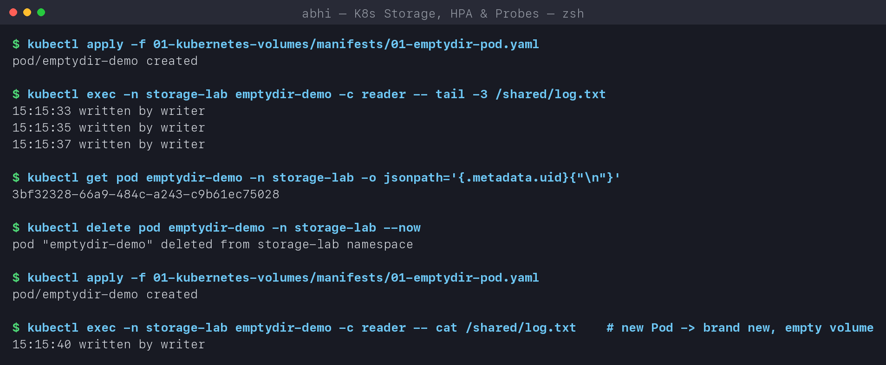
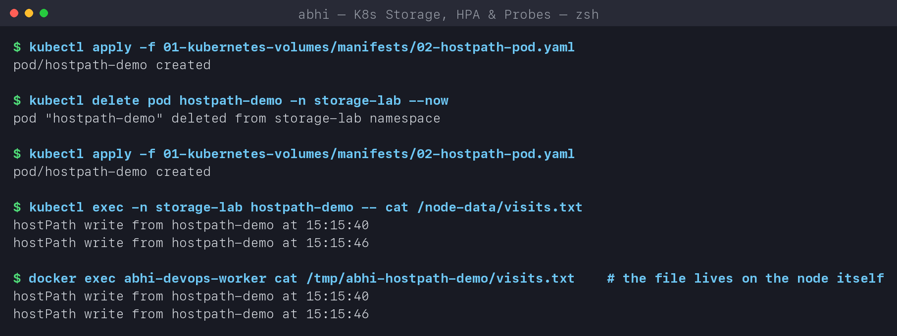
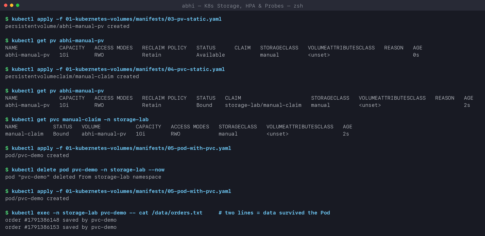
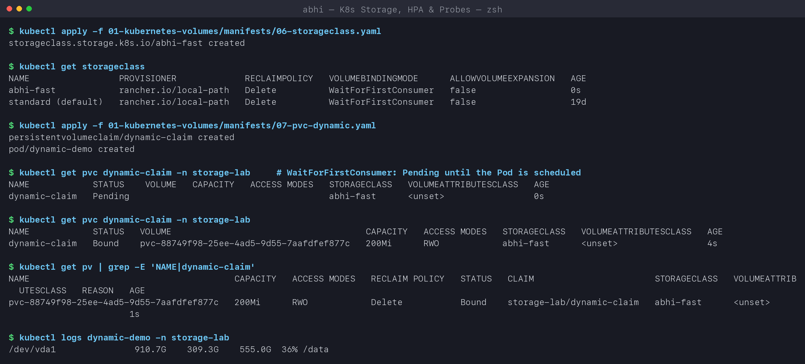
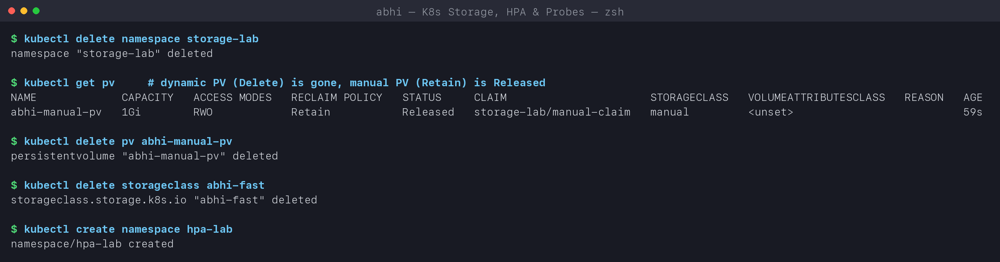

# Kubernetes Volumes

**Name:** Abhi Gandhi
**Enrollment Number:** 24bcs10397

What I learned about storage in Kubernetes, with a practical example for every type. All
manifests are in [manifests/](manifests) and the outputs are from my `abhi-devops` kind
cluster (replayed by [../run-labs.sh](../run-labs.sh)).

## Why Pods need volumes at all

A container's filesystem is **ephemeral**: when the container restarts or the Pod is
replaced, everything it wrote is gone. Volumes solve two problems:

1. **Sharing** files between the containers of one Pod.
2. **Keeping** data after the container or the Pod dies.

```text
          lifetime of the data
 container fs  <  emptyDir  <  hostPath  <  PersistentVolume
 (container)      (Pod)        (node)       (independent of Pods and nodes)
```

| Type | Data lives as long as... | Shared between | Typical use |
|---|---|---|---|
| `emptyDir` | the Pod | containers of the same Pod | scratch space, caches, sidecar hand-off |
| `hostPath` | the node's disk | Pods scheduled on the same node | node agents reading `/var/log`, labs |
| `PersistentVolume` + `PersistentVolumeClaim` | the PV (independent of any Pod) | whoever claims it (per access mode) | databases, uploads, anything stateful |
| `StorageClass` | - (a template, not a volume) | - | creates PVs on demand (dynamic provisioning) |

## 1. emptyDir

[manifests/01-emptydir-pod.yaml](manifests/01-emptydir-pod.yaml) - a `writer` container
appends a line every 2 seconds to `/cache/log.txt`; a `reader` container mounts the **same**
volume at a different path, `/shared`.

```text
$ kubectl exec -n storage-lab emptydir-demo -c reader -- tail -3 /shared/log.txt
15:15:33 written by writer
15:15:35 written by writer
15:15:37 written by writer

$ kubectl delete pod emptydir-demo -n storage-lab --now
pod "emptydir-demo" deleted from storage-lab namespace

$ kubectl apply -f 01-kubernetes-volumes/manifests/01-emptydir-pod.yaml
pod/emptydir-demo created

$ kubectl exec -n storage-lab emptydir-demo -c reader -- cat /shared/log.txt    # new Pod -> brand new, empty volume
15:15:40 written by writer
```

**What I understood:** the reader sees what the writer wrote, so the two containers really
share one directory. After deleting and recreating the Pod only one fresh line is there -
the old history is gone, because an `emptyDir` is created empty when the Pod is scheduled
and deleted with it. (It does survive a *container* restart inside the same Pod.)
`sizeLimit: 50Mi` makes the kubelet evict the Pod if the volume grows past 50Mi, and
`emptyDir.medium: Memory` would back it with RAM (tmpfs) instead of the node disk.



## 2. hostPath

[manifests/02-hostpath-pod.yaml](manifests/02-hostpath-pod.yaml) mounts
`/tmp/abhi-hostpath-demo` from the node. `nodeName` pins it to the worker so both runs land on
the same node.

```text
$ kubectl exec -n storage-lab hostpath-demo -- cat /node-data/visits.txt
hostPath write from hostpath-demo at 15:15:40
hostPath write from hostpath-demo at 15:15:46

$ docker exec abhi-devops-worker cat /tmp/abhi-hostpath-demo/visits.txt    # the file lives on the node itself
hostPath write from hostpath-demo at 15:15:40
hostPath write from hostpath-demo at 15:15:46
```

**What I understood:** two lines from two different Pods - the data outlived the first Pod.
Because my kind nodes are Docker containers, I could read the same file directly on the node
with `docker exec`. The catch: the data is tied to **one node**. If the Pod were scheduled on
another node it would see an empty directory. hostPath also gives a Pod access to the node's
filesystem, which is a security risk, so it is blocked by the `restricted` Pod Security
Standard and is used mainly by system DaemonSets (log collectors, CNI plugins).



## 3. PersistentVolume and PersistentVolumeClaim (static provisioning)

The two objects split the job between two roles:

| | PersistentVolume (PV) | PersistentVolumeClaim (PVC) |
|---|---|---|
| Who creates it | cluster admin (or a provisioner) | developer / the app |
| Scope | cluster-wide | namespaced |
| Describes | a real piece of storage (size, access mode, backend) | a **request**: "I need 500Mi, RWO" |
| Analogy | a parking spot | a parking ticket |

[03-pv-static.yaml](manifests/03-pv-static.yaml) creates a 1Gi PV with
`storageClassName: manual` and `Retain`; [04-pvc-static.yaml](manifests/04-pvc-static.yaml)
asks for 500Mi of class `manual`.

```text
$ kubectl get pv abhi-manual-pv
NAME             CAPACITY   ACCESS MODES   RECLAIM POLICY   STATUS      CLAIM   STORAGECLASS   ...
abhi-manual-pv   1Gi        RWO            Retain           Available           manual

$ kubectl apply -f 01-kubernetes-volumes/manifests/04-pvc-static.yaml
persistentvolumeclaim/manual-claim created

$ kubectl get pv abhi-manual-pv
NAME             CAPACITY   ACCESS MODES   RECLAIM POLICY   STATUS   CLAIM                      STORAGECLASS
abhi-manual-pv   1Gi        RWO            Retain           Bound    storage-lab/manual-claim   manual

$ kubectl get pvc manual-claim -n storage-lab
NAME           STATUS   VOLUME           CAPACITY   ACCESS MODES   STORAGECLASS
manual-claim   Bound    abhi-manual-pv   1Gi        RWO            manual

$ kubectl exec -n storage-lab pvc-demo -- cat /data/orders.txt     # two lines = data survived the Pod
order #1791386148 saved by pvc-demo
order #1791386153 saved by pvc-demo
```

**What I understood:**
- The PV went `Available` -> `Bound` the moment a matching claim appeared. Binding is
  one-to-one: no other PVC can use this PV now.
- I asked for **500Mi** but the claim shows **1Gi** - a PVC gets the whole PV it is bound to,
  the request is a *minimum*.
- The Pod only mentions `claimName: manual-claim`; it has no idea where the storage is. That
  indirection is the point - the same Pod YAML works on kind, EKS or GKE.
- Two lines in `orders.txt` from two Pods = the data survived Pod deletion.

Access modes: `ReadWriteOnce` (one node), `ReadOnlyMany`, `ReadWriteMany` (many nodes - needs
NFS/EFS-like storage), `ReadWriteOncePod` (exactly one Pod).



## 4. StorageClass and dynamic provisioning

Creating PVs by hand does not scale. A **StorageClass** names a *provisioner* that creates
PVs automatically whenever a PVC asks for that class.

[06-storageclass.yaml](manifests/06-storageclass.yaml) defines `abhi-fast` (kind's
`rancher.io/local-path` provisioner); [07-pvc-dynamic.yaml](manifests/07-pvc-dynamic.yaml)
claims 200Mi from it - and **no PV exists beforehand**.

```text
$ kubectl get storageclass
NAME                 PROVISIONER             RECLAIMPOLICY   VOLUMEBINDINGMODE      ALLOWVOLUMEEXPANSION   AGE
abhi-fast            rancher.io/local-path   Delete          WaitForFirstConsumer   false                  0s
standard (default)   rancher.io/local-path   Delete          WaitForFirstConsumer   false                  19d

$ kubectl get pvc dynamic-claim -n storage-lab     # WaitForFirstConsumer: Pending until the Pod is scheduled
NAME            STATUS    VOLUME   CAPACITY   ACCESS MODES   STORAGECLASS
dynamic-claim   Pending                                      abhi-fast

$ kubectl get pvc dynamic-claim -n storage-lab
NAME            STATUS   VOLUME                                     CAPACITY   ACCESS MODES   STORAGECLASS
dynamic-claim   Bound    pvc-88749f98-25ee-4ad5-9d55-7aafdfef877c   200Mi      RWO            abhi-fast

$ kubectl get pv | grep -E 'NAME|dynamic-claim'
NAME                                       CAPACITY   ACCESS MODES   RECLAIM POLICY   STATUS   CLAIM
pvc-88749f98-25ee-4ad5-9d55-7aafdfef877c   200Mi      RWO            Delete           Bound    storage-lab/dynamic-claim

$ kubectl logs dynamic-demo -n storage-lab
/dev/vda1               910.7G    309.3G    555.0G  36% /data
```

**What I understood:**
- The PV named `pvc-88749f98-...` was **created by the provisioner** - I never wrote it.
- `WaitForFirstConsumer` kept the claim `Pending` until the Pod was scheduled, so the volume
  is created on the node where the Pod actually runs. `Immediate` would create it straight
  away, possibly in the wrong zone.
- `df` shows the whole node disk, not 200Mi: local-path is a directory on the node and does
  not enforce size. Cloud provisioners (EBS, GCE PD, Azure Disk) create a disk of exactly
  the requested size.
- A PVC with **no** `storageClassName` uses the class marked `(default)` - `standard` here.
  That is how the mini project's PVC gets its volume.

On AWS the same idea looks like:

```yaml
apiVersion: storage.k8s.io/v1
kind: StorageClass
metadata:
  name: gp3
provisioner: ebs.csi.aws.com
parameters:
  type: gp3
  encrypted: "true"
volumeBindingMode: WaitForFirstConsumer
allowVolumeExpansion: true
```



## 5. Reclaim policy - what happens when the claim is deleted

```text
$ kubectl delete namespace storage-lab
namespace "storage-lab" deleted

$ kubectl get pv     # dynamic PV (Delete) is gone, manual PV (Retain) is Released
NAME             CAPACITY   ACCESS MODES   RECLAIM POLICY   STATUS     CLAIM                      STORAGECLASS
abhi-manual-pv   1Gi        RWO            Retain           Released   storage-lab/manual-claim   manual
```

| Policy | When the PVC is deleted | Use for |
|---|---|---|
| `Delete` (default for dynamic) | PV **and** the underlying disk are deleted | disposable / reproducible data |
| `Retain` | PV becomes `Released`; data is kept until an admin cleans it up | anything you cannot afford to lose |

Deleting the namespace deleted both claims: the dynamic PV vanished with its data, while the
`Retain` PV stayed behind as `Released` - it will not bind to a new claim until an admin
deals with it.



## Summary

```text
Pod --uses--> PVC --binds to--> PV --backed by--> real storage (disk / EBS / NFS)
                 \                ^
                  \-- class X ----| StorageClass X's provisioner creates the PV on demand
```

- `emptyDir`: per-Pod scratch space, dies with the Pod.
- `hostPath`: node's disk, survives the Pod but is stuck on one node and is a security risk.
- `PV`: a piece of storage in the cluster; `PVC`: a request for it. Pods only know the PVC.
- `StorageClass`: the recipe for creating PVs automatically = **dynamic provisioning**.
- Reclaim policy decides whether data survives deletion of the claim.
