# Kubernetes Storage, HPA & Probes - Homework

**Name:** Abhi Gandhi
**Enrollment Number:** 24bcs10397

Session 13 on my local 2-node `abhi-devops` kind cluster. Every output below is copied from
my terminal and every command is replayed by [run-labs.sh](run-labs.sh).

```bash
./run-labs.sh          # replays every command in this README
```

| Task | Folder |
|---|---|
| 1. Kubernetes volumes (emptyDir, hostPath, PV, PVC, StorageClass, dynamic provisioning) | [01-kubernetes-volumes/README.md](01-kubernetes-volumes/README.md) |
| 2. HPA hands-on | [02-hpa/](02-hpa) - [hpa.yml](02-hpa/hpa.yml), [deployment.yaml](02-hpa/deployment.yaml), [load-generator.yaml](02-hpa/load-generator.yaml), [load_generator.sh](02-hpa/load_generator.sh) |
| 3. Mini project - production-ready web app (PVC + HPA + probes) | [03-mini-project/](03-mini-project) |

## Task 0: metrics-server

The HPA and `kubectl top` both read CPU/memory from the **Metrics API**, which is served by
metrics-server. kind does not ship it, so I installed it first. kind's kubelets use
self-signed certificates, so it needs `--kubelet-insecure-tls` (fine for a lab, never for
production).

```text
$ kubectl apply -f https://github.com/kubernetes-sigs/metrics-server/releases/download/v0.8.0/components.yaml | tail -3
service/metrics-server created
deployment.apps/metrics-server created
apiservice.apiregistration.k8s.io/v1beta1.metrics.k8s.io created

$ kubectl patch deployment metrics-server -n kube-system --type=json -p '[{"op":"add","path":"/spec/template/spec/containers/0/args/-","value":"--kubelet-insecure-tls"}]'
deployment.apps/metrics-server patched

$ kubectl top nodes
NAME                        CPU(cores)   CPU(%)   MEMORY(bytes)   MEMORY(%)
abhi-devops-control-plane   122m         0%       1462Mi          6%
abhi-devops-worker          136m         0%       599Mi           2%
```

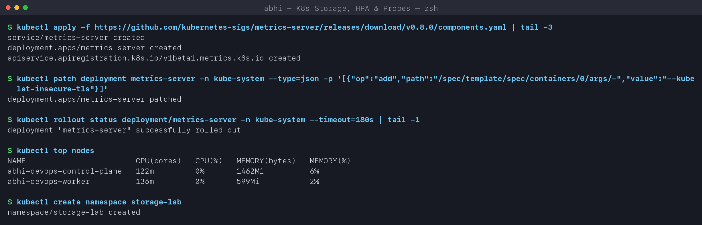

## Task 1: Kubernetes volumes

Documented with hands-on examples in **[01-kubernetes-volumes/README.md](01-kubernetes-volumes/README.md)**:
emptyDir, hostPath, PersistentVolume, PersistentVolumeClaim, StorageClass, dynamic
provisioning and reclaim policies.

## Task 2: HPA hands-on

### How the HPA decides

```text
desiredReplicas = ceil( currentReplicas * currentUtilization / targetUtilization )
utilization     = actual CPU usage / CPU *request*
```

So a CPU **request** is mandatory - without it the HPA shows `<unknown>`. My
[deployment.yaml](02-hpa/deployment.yaml) requests `50m`, and [hpa.yml](02-hpa/hpa.yml)
targets 50% of that (25m per Pod) with 1-6 replicas. I shortened the scale-down
stabilization window from the default 300s to 60s so the lab can show scale-down too.

### 1-3. Deploy, configure and verify the HPA

```text
$ kubectl apply -f 02-hpa/deployment.yaml
deployment.apps/orbit-web created
service/orbit-web created

$ kubectl apply -f 02-hpa/hpa.yml
horizontalpodautoscaler.autoscaling/orbit-web-hpa created

$ kubectl get hpa -n hpa-lab
NAME            REFERENCE              TARGETS       MINPODS   MAXPODS   REPLICAS   AGE
orbit-web-hpa   Deployment/orbit-web   cpu: 0%/50%   1         6         1          45s

$ kubectl top pods -n hpa-lab
NAME                        CPU(cores)   MEMORY(bytes)
orbit-web-8f49c54d7-q2prc   0m           11Mi
```

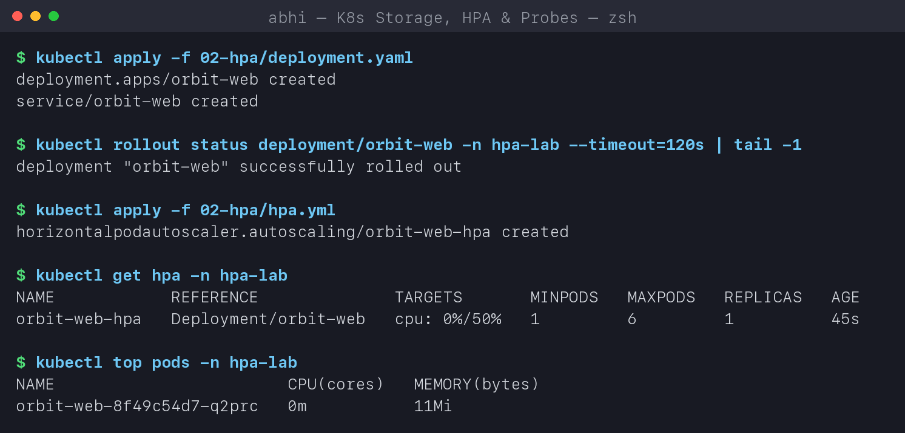

### 4-7. Load generator, CPU utilization and Pod scaling

[load_generator.sh](02-hpa/load_generator.sh) applies
[load-generator.yaml](02-hpa/load-generator.yaml): 3 busybox Pods calling the Service in a
tight `wget` loop from inside the cluster.

```text
$ ./02-hpa/load_generator.sh start 3
deployment.apps/load-generator created
deployment.apps/load-generator scaled
Load running. Watch it with: kubectl get hpa -n hpa-lab -w

$ cat /tmp/hpa-watch.txt     # kubectl get hpa -w, ~2.5 minutes under load
NAME            REFERENCE              TARGETS         MINPODS   MAXPODS   REPLICAS   AGE
orbit-web-hpa   Deployment/orbit-web   cpu: 0%/50%     1         6         1          46s
orbit-web-hpa   Deployment/orbit-web   cpu: 310%/50%   1         6         1          75s
orbit-web-hpa   Deployment/orbit-web   cpu: 374%/50%   1         6         5          90s
orbit-web-hpa   Deployment/orbit-web   cpu: 191%/50%   1         6         6          105s
orbit-web-hpa   Deployment/orbit-web   cpu: 91%/50%    1         6         6          2m
orbit-web-hpa   Deployment/orbit-web   cpu: 87%/50%    1         6         6          2m15s
orbit-web-hpa   Deployment/orbit-web   cpu: 84%/50%    1         6         6          2m30s
orbit-web-hpa   Deployment/orbit-web   cpu: 81%/50%    1         6         6          2m45s
orbit-web-hpa   Deployment/orbit-web   cpu: 86%/50%    1         6         6          3m

$ kubectl top pods -n hpa-lab -l app=orbit-web
NAME                        CPU(cores)   MEMORY(bytes)
orbit-web-8f49c54d7-6fnnk   43m          12Mi
orbit-web-8f49c54d7-8jbcf   43m          12Mi
orbit-web-8f49c54d7-dnr5j   43m          12Mi
orbit-web-8f49c54d7-dx6rj   43m          12Mi
orbit-web-8f49c54d7-q2prc   44m          12Mi
orbit-web-8f49c54d7-x6x2z   43m          11Mi

$ kubectl get pods -n hpa-lab -l app=orbit-web
NAME                        READY   STATUS    RESTARTS   AGE
orbit-web-8f49c54d7-6fnnk   1/1     Running   0          106s
orbit-web-8f49c54d7-8jbcf   1/1     Running   0          2m1s
orbit-web-8f49c54d7-dnr5j   1/1     Running   0          2m1s
orbit-web-8f49c54d7-dx6rj   1/1     Running   0          2m1s
orbit-web-8f49c54d7-q2prc   1/1     Running   0          3m16s
orbit-web-8f49c54d7-x6x2z   1/1     Running   0          2m1s
```

**What I observed:**
- At 310% the single Pod was using ~155m against a 50m request (the 200m limit capped it).
  The formula gives `ceil(1 * 374 / 50) = 8`, but the scale-up policy allows at most +4
  Pods per 15s, so it went **1 -> 5**, then **5 -> 6** - and stopped at `maxReplicas`.
- With 6 Pods sharing the load, each one uses ~43m = 86% of the request. That is still above
  the 50% target, but the HPA cannot go past 6 - see `ScalingLimited: TooManyReplicas` below.
  In production that is the signal to raise `maxReplicas` or give the app more CPU.
- `kubectl top` confirms the load is spread evenly: kube-proxy balances the Service traffic
  across all 6 Pods.

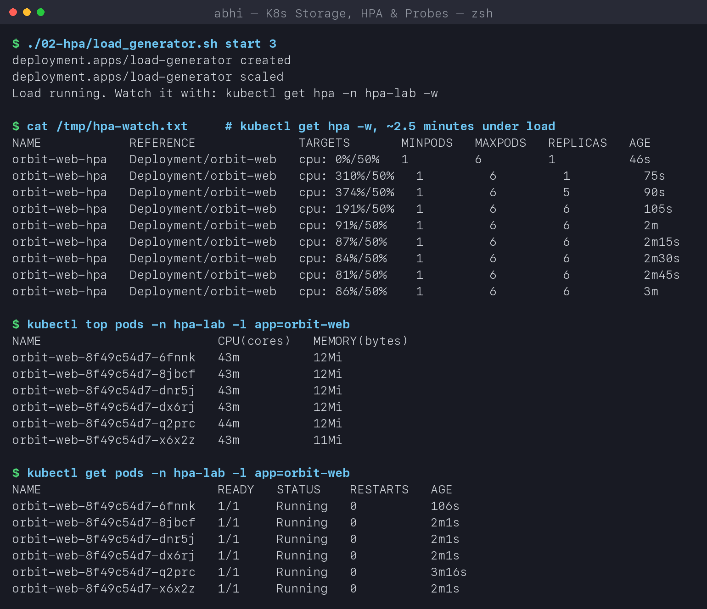

### `kubectl describe hpa`

```text
$ kubectl describe hpa orbit-web-hpa -n hpa-lab | sed -n '/^Metrics/,$p'
Metrics:                                               ( current / target )
  resource cpu on pods  (as a percentage of request):  86% (43m) / 50%
Min replicas:                                          1
Max replicas:                                          6
Behavior:
  Scale Up:
    Stabilization Window: 0 seconds
    Select Policy: Max
    Policies:
      - Type: Pods     Value: 4    Period: 15 seconds
      - Type: Percent  Value: 100  Period: 15 seconds
  Scale Down:
    Stabilization Window: 60 seconds
    Select Policy: Max
    Policies:
      - Type: Percent  Value: 100  Period: 15 seconds
Deployment pods:       6 current / 6 desired
Conditions:
  Type            Status  Reason            Message
  ----            ------  ------            -------
  AbleToScale     True    ReadyForNewScale  recommended size matches current size
  ScalingActive   True    ValidMetricFound  the HPA was able to successfully calculate a replica count from cpu resource utilization (percentage of request)
  ScalingLimited  True    TooManyReplicas   the desired replica count is more than the maximum replica count
Events:
  Type     Reason                        Age                   From                       Message
  ----     ------                        ----                  ----                       -------
  Warning  FailedGetResourceMetric       3m1s (x2 over 3m16s)  horizontal-pod-autoscaler  failed to get cpu utilization: unable to get metrics for resource cpu: no metrics returned from resource metrics API
  Normal   SuccessfulRescale             2m1s                  horizontal-pod-autoscaler  New size: 5; reason: cpu resource utilization (percentage of request) above target
  Normal   SuccessfulRescale             106s                  horizontal-pod-autoscaler  New size: 6; reason: cpu resource utilization (percentage of request) above target
```

**What I understood:** the two `FailedGetResourceMetric` warnings at the start are normal -
metrics-server scrapes every ~15s, so a brand-new Pod has no sample yet. The `Behavior`
block shows the default scale-up policy (+4 Pods or +100% per 15s, whichever is bigger) that
explains the 1 -> 5 -> 6 jump.

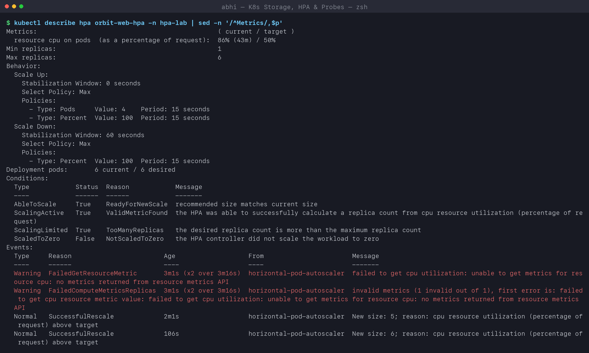

### Scale down after the load stops

```text
$ ./02-hpa/load_generator.sh stop
deployment.apps "load-generator" deleted from hpa-lab namespace

$ cat /tmp/hpa-down.txt     # load stopped -> replicas fall back after the 60s stabilization window
NAME            REFERENCE              TARGETS        MINPODS   MAXPODS   REPLICAS   AGE
orbit-web-hpa   Deployment/orbit-web   cpu: 86%/50%   1         6         6          3m16s
orbit-web-hpa   Deployment/orbit-web   cpu: 82%/50%   1         6         6          3m45s
orbit-web-hpa   Deployment/orbit-web   cpu: 12%/50%   1         6         6          4m16s
orbit-web-hpa   Deployment/orbit-web   cpu: 0%/50%    1         6         6          4m31s
orbit-web-hpa   Deployment/orbit-web   cpu: 0%/50%    1         6         6          5m1s
orbit-web-hpa   Deployment/orbit-web   cpu: 0%/50%    1         6         2          5m16s
orbit-web-hpa   Deployment/orbit-web   cpu: 0%/50%    1         6         1          5m31s

$ kubectl get pods -n hpa-lab -l app=orbit-web
NAME                        READY   STATUS    RESTARTS   AGE
orbit-web-8f49c54d7-q2prc   1/1     Running   0          5m46s
```

**What I understood:** CPU dropped to 0% almost immediately, but the replicas stayed at 6
for about a minute. That is the **stabilization window**: the HPA uses the *highest*
recommendation of the last 60s before scaling down, so a short dip in traffic does not
cause Pods to be killed and re-created (flapping). Scale-up has no window by default -
reacting fast to load matters more than reacting fast to quiet.

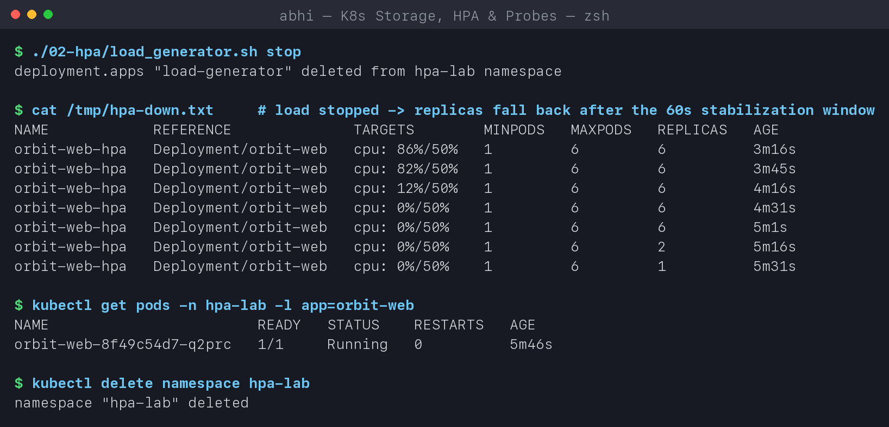

## Task 3: Mini project - production-ready web app

Three cloud-native pillars in one app ([03-mini-project/](03-mini-project)):

```text
                 [ Service: web-service :80 ]
                    |                 |
                    v                 v
          [ Pod: web-app ]     [ Pod: web-app ]  ...up to 5
           startup / readiness / liveness probes
           cpu request 100m  ------------------>  [ HPA web-app-hpa: 2-5 Pods @ 50% CPU ]
           /data                                         ^ metrics-server
             |
             v
     [ PVC web-data 500Mi RWO ] -> StorageClass "standard" (local-path) -> node disk
```

| File | What it adds |
|---|---|
| [namespace.yaml](03-mini-project/namespace.yaml) | `production-webapp` namespace |
| [pvc.yaml](03-mini-project/pvc.yaml) | 500Mi RWO claim, dynamically provisioned by the default class |
| [deployment.yaml](03-mini-project/deployment.yaml) | 2 replicas, `/data` mounted from the PVC, all three probes, requests/limits |
| [service.yaml](03-mini-project/service.yaml) | ClusterIP on port 80 |
| [hpa.yaml](03-mini-project/hpa.yaml) | 2-5 replicas at 50% CPU |

### Deploy

```text
$ kubectl apply -f 03-mini-project/pvc.yaml
persistentvolumeclaim/web-data created

$ kubectl get pvc -n production-webapp
NAME       STATUS    VOLUME   CAPACITY   ACCESS MODES   STORAGECLASS   VOLUMEATTRIBUTESCLASS   AGE
web-data   Pending                                      standard       <unset>                 0s

$ kubectl apply -f 03-mini-project/deployment.yaml -f 03-mini-project/service.yaml -f 03-mini-project/hpa.yaml
deployment.apps/web-app created
service/web-service created
horizontalpodautoscaler.autoscaling/web-app-hpa created

$ kubectl get pvc,pods,svc -n production-webapp -o wide
NAME                             STATUS   VOLUME                                     CAPACITY   ACCESS MODES   STORAGECLASS
persistentvolumeclaim/web-data   Bound    pvc-7487f493-dfe0-4710-b8fd-af98eff5bbac   500Mi      RWO            standard

NAME                         READY   STATUS    RESTARTS   AGE   IP             NODE
pod/web-app-d48b68c5-5b77g   1/1     Running   0          6s    10.244.1.117   abhi-devops-worker
pod/web-app-d48b68c5-5jrpf   1/1     Running   0          6s    10.244.1.116   abhi-devops-worker

NAME                  TYPE        CLUSTER-IP      EXTERNAL-IP   PORT(S)   AGE   SELECTOR
service/web-service   ClusterIP   10.96.228.124   <none>        80/TCP    6s    app=web-app

$ kubectl get hpa -n production-webapp
NAME          REFERENCE            TARGETS       MINPODS   MAXPODS   REPLICAS   AGE
web-app-hpa   Deployment/web-app   cpu: 1%/50%   2         5         2          46s
```

The PVC was `Pending` (WaitForFirstConsumer) until the first Pod was scheduled, then the
default `standard` class provisioned a 500Mi volume and it became `Bound`.

**Note:** two replicas share one `ReadWriteOnce` volume. That works because RWO means "one
**node**", and local-path pins the PV (and so every Pod using it) to the worker node. On a
multi-node cloud cluster replicas on different nodes would need `ReadWriteMany` storage
(EFS/NFS), or a StatefulSet with one volume per Pod.

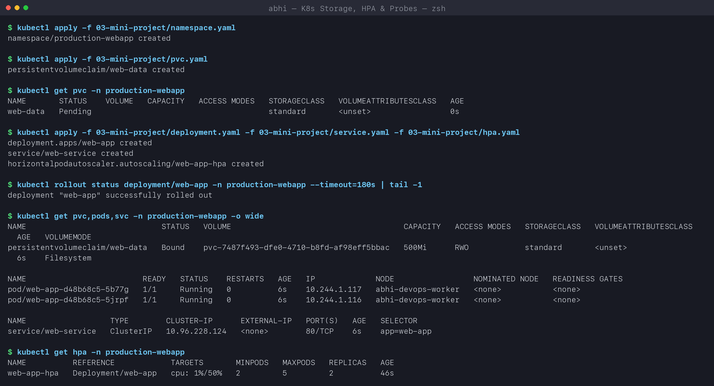

### Verification 1 - storage persistence

```text
$ kubectl exec -n production-webapp web-app-d48b68c5-5b77g -- sh -c 'echo "Student: Abhi Gandhi (24bcs10397)" > /data/student.txt'

$ kubectl exec -n production-webapp web-app-d48b68c5-5b77g -- cat /data/student.txt
Student: Abhi Gandhi (24bcs10397)

$ kubectl delete pod -n production-webapp web-app-d48b68c5-5b77g
pod "web-app-d48b68c5-5b77g" deleted from production-webapp namespace

$ kubectl get pods -n production-webapp -l app=web-app
NAME                     READY   STATUS    RESTARTS   AGE
web-app-d48b68c5-5jrpf   1/1     Running   0          49s
web-app-d48b68c5-q88l8   1/1     Running   0          3s

$ kubectl exec -n production-webapp web-app-d48b68c5-q88l8 -- cat /data/student.txt     # read from the NEW Pod
Student: Abhi Gandhi (24bcs10397)
```

The Pod that wrote the file is gone, the ReplicaSet created a replacement, and the
replacement (`q88l8`, 3 seconds old) reads the same file - the data lives on the
PersistentVolume, not in the Pod.

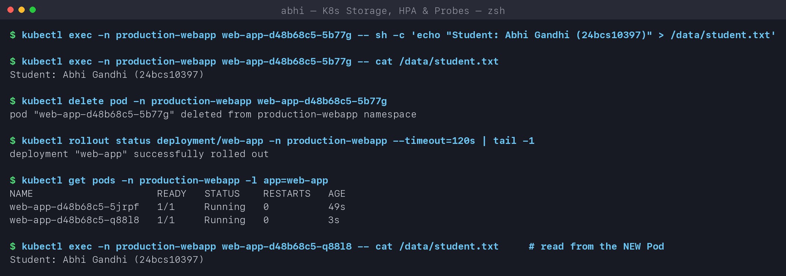

### Verification 2 - Service and probes

```text
$ curl -s http://localhost:8089 | grep -o '<title>.*</title>'      # through kubectl port-forward svc/web-service 8089:80
<title>Welcome to nginx!</title>

$ kubectl describe pod -n production-webapp web-app-d48b68c5-q88l8 | grep -E 'Liveness|Readiness|Startup'
    Liveness:     http-get http://:80/ delay=0s timeout=2s period=5s #success=1 #failure=3
    Readiness:    http-get http://:80/ delay=0s timeout=2s period=5s #success=1 #failure=2
    Startup:      http-get http://:80/ delay=0s timeout=1s period=2s #success=1 #failure=30

$ kubectl get endpointslices -n production-webapp -l kubernetes.io/service-name=web-service -o jsonpath='...'
web-app-d48b68c5-5jrpf  10.244.1.116  ready=true
web-app-d48b68c5-q88l8  10.244.1.118  ready=true
```

| Probe | Question it answers | On failure |
|---|---|---|
| **startupProbe** | Has the app finished starting? (here: up to 30 x 2s = 60s) | container restarted; liveness/readiness are paused until it passes |
| **readinessProbe** | Can this Pod take traffic right now? | Pod removed from the Service endpoints - **not** restarted |
| **livenessProbe** | Is the process still healthy? | container restarted by the kubelet |

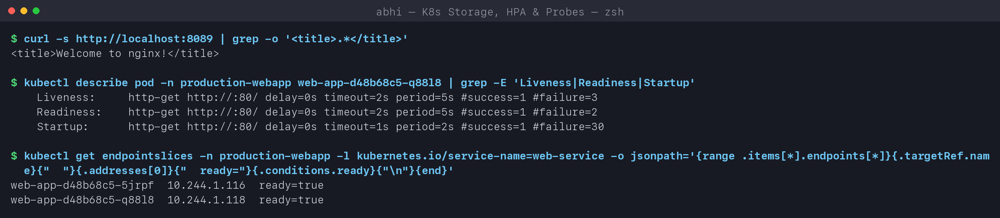

### Verification 3 - HPA elastic scaling

```text
$ kubectl run load-generator -n production-webapp --image=busybox:1.36 --restart=Never -- /bin/sh -c 'while true; do wget -q -O- http://web-service >/dev/null; done'
pod/load-generator created
$ kubectl run load-generator-2 ...   (same command)
pod/load-generator-2 created

$ cat /tmp/mini-hpa.txt     # kubectl get hpa -w
NAME          REFERENCE            TARGETS        MINPODS   MAXPODS   REPLICAS   AGE
web-app-hpa   Deployment/web-app   cpu: 1%/50%    2         5         2          53s
web-app-hpa   Deployment/web-app   cpu: 31%/50%   2         5         2          75s
web-app-hpa   Deployment/web-app   cpu: 80%/50%   2         5         2          90s
web-app-hpa   Deployment/web-app   cpu: 81%/50%   2         5         4          105s
web-app-hpa   Deployment/web-app   cpu: 49%/50%   2         5         4          2m
web-app-hpa   Deployment/web-app   cpu: 42%/50%   2         5         4          2m15s
web-app-hpa   Deployment/web-app   cpu: 41%/50%   2         5         4          3m

$ kubectl get pods -n production-webapp -l app=web-app
NAME                     READY   STATUS    RESTARTS   AGE
web-app-d48b68c5-5jrpf   1/1     Running   0          3m23s
web-app-d48b68c5-8v49w   1/1     Running   0          113s
web-app-d48b68c5-q88l8   1/1     Running   0          2m37s
web-app-d48b68c5-q9j2x   1/1     Running   0          113s
```

At 81% the HPA computed `ceil(2 * 81 / 50) = 4` and scaled to 4. With 4 Pods utilization
settled at ~41% - **below** the 50% target, so it stopped there. Unlike Task 2 it never hit
`maxReplicas`: this is the HPA finding the right size on its own.

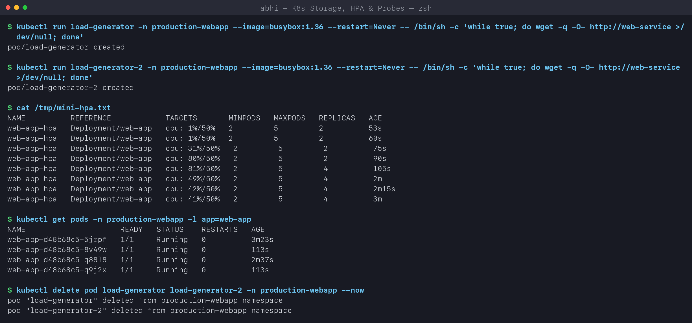

### Bonus - readiness gating

I broke the readiness probe path (`/does-not-exist`) with a patch:

```text
$ kubectl get pods -n production-webapp -l app=web-app
NAME                       READY   STATUS    RESTARTS   AGE
web-app-7f774cffc4-4hxdr   0/1     Running   0          40s
web-app-7f774cffc4-56cc2   0/1     Running   0          40s
web-app-d48b68c5-5jrpf     1/1     Running   0          4m6s
web-app-d48b68c5-q88l8     1/1     Running   0          3m20s
web-app-d48b68c5-q9j2x     1/1     Running   0          2m36s

$ kubectl get endpointslices ... (addresses + ready condition)
web-app-d48b68c5-5jrpf  10.244.1.116  ready=true
web-app-d48b68c5-q88l8  10.244.1.118  ready=true
web-app-d48b68c5-q9j2x  10.244.1.122  ready=true
web-app-7f774cffc4-56cc2  10.244.1.123  ready=false
web-app-7f774cffc4-4hxdr  10.244.1.124  ready=false

$ kubectl rollout undo deployment/web-app -n production-webapp
deployment.apps/web-app rolled back
```

**What I observed:** the new Pods are `Running` but `0/1` ready, and the EndpointSlice marks
them `ready=false`, so the Service sends them **no traffic**. The rollout also stalled: it
will not remove old Pods while new ones never become ready, so users kept being served by the
3 healthy old Pods the whole time. A readiness probe is what makes a bad rollout harmless.
`rollout undo` brought back 4 ready endpoints.

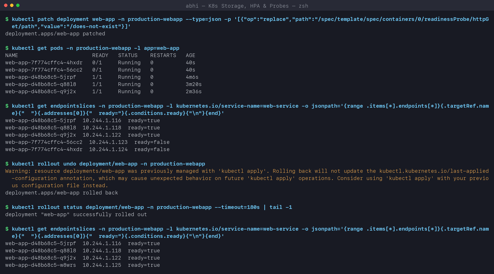

```text
$ kubectl delete namespace production-webapp
namespace "production-webapp" deleted
$ kubectl get pv
No resources found
```

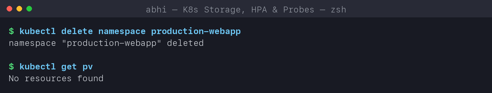

## Troubleshooting notes

| Symptom | Check | Usual cause |
|---|---|---|
| PVC stuck `Pending` | `kubectl describe pvc` | no default StorageClass, or `WaitForFirstConsumer` with no Pod yet (normal) |
| HPA `TARGETS <unknown>` | `kubectl top pods` | metrics-server missing, or the container has no `resources.requests.cpu` |
| HPA never scales down | `describe hpa` -> Behavior | stabilization window (300s by default) |
| Pods `Running` but `0/1` | `describe pod` -> Events `Readiness probe failed` | wrong probe path or port |
| Restart count keeps rising | `describe pod` -> `Liveness probe failed` | liveness too aggressive or the app really hangs; consider a startupProbe |
