# Kubernetes Troubleshooting - Homework

**Name:** Abhi Gandhi
**Enrollment Number:** 24bcs10397

Hands-on troubleshooting on my local `abhi-devops` kind cluster. Every broken scenario was
**actually broken**, investigated with kubectl, fixed and verified. The outputs below are copied
from my terminal and [run-labs.sh](run-labs.sh) replays all of it.

The method I followed for every issue - **don't guess**:

```text
GET -> DESCRIBE -> EVENTS -> LOGS -> EXEC -> find root cause -> FIX -> VERIFY
```

## Folder structure

```text
Kubernetes Troubleshooting/
├── 01-commands/app.yaml                 # healthy app used to practise the commands
├── 02-issues/
│   ├── 01-crashloopbackoff/   broken.yaml  fixed.yaml
│   ├── 02-imagepullbackoff/   broken.yaml  fixed.yaml
│   ├── 03-errimagepull/       broken.yaml  fixed.yaml
│   ├── 04-pending/            broken.yaml  fixed.yaml
│   ├── 05-containercreating/  broken.yaml  fixed.yaml
│   ├── 06-service-connectivity/ app.yaml client.yaml broken-service.yaml fixed-service.yaml
│   ├── 07-dns/                broken.yaml  fixed.yaml
│   ├── 08-pod-networking/     broken.yaml  fixed.yaml
│   ├── 09-configuration/      broken.yaml  fixed.yaml
│   └── 10-oomkilled/          broken.yaml  fixed.yaml   (bonus)
├── 03-mini-project/           deployment.yaml service.yaml service-broken.yaml broken-pod.yaml fixed-pod.yaml
├── screenshots/
└── run-labs.sh
```

Every `broken.yaml` starts with a `# BUG:` comment and every `fixed.yaml` with a `# FIX:` comment.

---

## Task 1: Kubernetes troubleshooting commands

| Command | What it tells me | When I reach for it |
|---|---|---|
| `kubectl get` | Current state in one line per object (STATUS, READY, RESTARTS) | Always first |
| `kubectl get -o wide` | Adds Pod IP, node, nominated node | Networking / scheduling questions |
| `kubectl describe` | Full spec + status + **Events** for one object | Pod not Running, Service with no endpoints |
| `kubectl logs` (`--previous`, `-c`, `--tail`) | What the container printed to stdout/stderr | App crashes, wrong config, errors |
| `kubectl exec` | Run a command inside a running container | Test from the Pod's point of view: DNS, curl, files |
| `kubectl events` | Cluster events, filterable by type/object | What happened in which order |
| `kubectl explain` | Built-in API docs for any field | Writing or reviewing YAML |
| `kubectl top` | Live CPU/memory from metrics-server | OOMKills, throttling, HPA |
| `kubectl debug` | Attach a throwaway debug container with tools | Image has no shell or tools |

### 1.1 kubectl get and -o wide

```text
$ kubectl get pods -n troubleshoot
NAME                          READY   STATUS    RESTARTS   AGE
orbit-shop-7d8b9fcbf5-dskqw   1/1     Running   0          1s
orbit-shop-7d8b9fcbf5-r57f2   1/1     Running   0          1s

$ kubectl get pods -n troubleshoot -o wide
NAME                          READY   STATUS    RESTARTS   AGE   IP             NODE                 NOMINATED NODE   READINESS GATES
orbit-shop-7d8b9fcbf5-dskqw   1/1     Running   0          1s    10.244.1.128   abhi-devops-worker   <none>           <none>
orbit-shop-7d8b9fcbf5-r57f2   1/1     Running   0          1s    10.244.1.127   abhi-devops-worker   <none>           <none>

$ kubectl get deploy,rs,svc,endpointslices -n troubleshoot
NAME                         READY   UP-TO-DATE   AVAILABLE   AGE
deployment.apps/orbit-shop   2/2     2            2           1s

NAME                                    DESIRED   CURRENT   READY   AGE
replicaset.apps/orbit-shop-7d8b9fcbf5   2         2         2       1s

NAME                 TYPE        CLUSTER-IP      EXTERNAL-IP   PORT(S)   AGE
service/orbit-shop   ClusterIP   10.96.204.217   <none>        80/TCP    1s

NAME                                              ADDRESSTYPE   PORTS   ENDPOINTS                   AGE
endpointslice.discovery.k8s.io/orbit-shop-pftk5   IPv4          80      10.244.1.127,10.244.1.128   1s

$ kubectl get pods -n troubleshoot --show-labels
NAME                          READY   STATUS    RESTARTS   AGE   LABELS
orbit-shop-7d8b9fcbf5-dskqw   1/1     Running   0          1s    app=orbit-shop,pod-template-hash=7d8b9fcbf5
orbit-shop-7d8b9fcbf5-r57f2   1/1     Running   0          1s    app=orbit-shop,pod-template-hash=7d8b9fcbf5
```

The EndpointSlice lists exactly the two Pod IPs from `-o wide` - that is the first thing I
compare when a Service misbehaves.

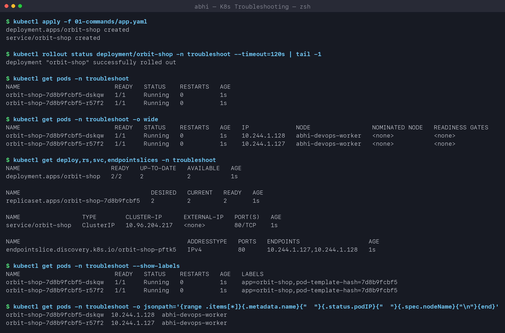

### 1.2 kubectl describe

```text
$ kubectl describe pod orbit-shop-7d8b9fcbf5-dskqw -n troubleshoot   (trimmed)
Name:             orbit-shop-7d8b9fcbf5-dskqw
Namespace:        troubleshoot
Node:             abhi-devops-worker/172.19.0.2
Status:           Running
IP:               10.244.1.128
Containers:
  web:
    Image:          nginx:1.27-alpine
    State:          Running
    Ready:          True
    Restart Count:  0
    Limits:    cpu: 100m   memory: 64Mi
    Requests:  cpu: 20m    memory: 32Mi

$ kubectl describe svc orbit-shop -n troubleshoot
Selector:                 app=orbit-shop
Type:                     ClusterIP
IP:                       10.96.204.217
Port:                     <unset>  80/TCP
TargetPort:               80/TCP
Endpoints:                10.244.1.127:80,10.244.1.128:80
```

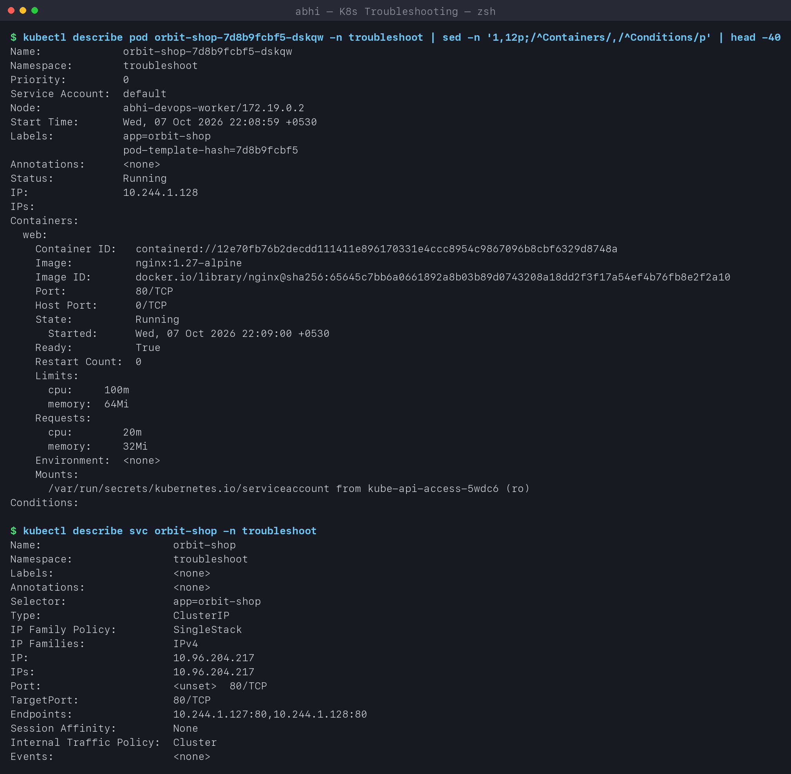

### 1.3 kubectl logs and kubectl exec

```text
$ kubectl logs orbit-shop-7d8b9fcbf5-dskqw -n troubleshoot --tail=4
2026/10/07 16:39:00 [notice] 1#1: start worker process 48
::1 - - [07/Oct/2026:16:39:00 +0000] "GET / HTTP/1.1" 200 615 "-" "Wget" "-"
::1 - - [07/Oct/2026:16:39:00 +0000] "GET /missing-page HTTP/1.1" 404 153 "-" "Wget" "-"
2026/10/07 16:39:00 [error] 35#35: *2 open() "/usr/share/nginx/html/missing-page" failed (2: No such file or directory) ...

$ kubectl logs deploy/orbit-shop -n troubleshoot --tail=2 --timestamps
Found 2 pods, using pod/orbit-shop-7d8b9fcbf5-dskqw
2026-10-07T16:39:00.534051842Z ::1 - - [07/Oct/2026:16:39:00 +0000] "GET /missing-page HTTP/1.1" 404 153 "-" "Wget" "-"

$ kubectl exec -n troubleshoot orbit-shop-7d8b9fcbf5-dskqw -- cat /etc/resolv.conf
search troubleshoot.svc.cluster.local svc.cluster.local cluster.local
nameserver 10.96.0.10
options ndots:5

$ kubectl exec -n troubleshoot orbit-shop-7d8b9fcbf5-dskqw -- sh -c 'hostname; nginx -v; ls /usr/share/nginx/html'
orbit-shop-7d8b9fcbf5-dskqw
nginx version: nginx/1.27.5
50x.html
index.html

$ kubectl exec -n troubleshoot orbit-shop-7d8b9fcbf5-dskqw -- wget -qO- http://orbit-shop.troubleshoot.svc.cluster.local | grep -o '<title>.*</title>'
<title>Welcome to nginx!</title>
```

I generated one good and one bad request with `exec`, and both show up in `logs` - the 404
even comes with nginx's own explanation. `resolv.conf` shows where DNS goes (CoreDNS at
10.96.0.10) and the search domains that let a Pod use short Service names.

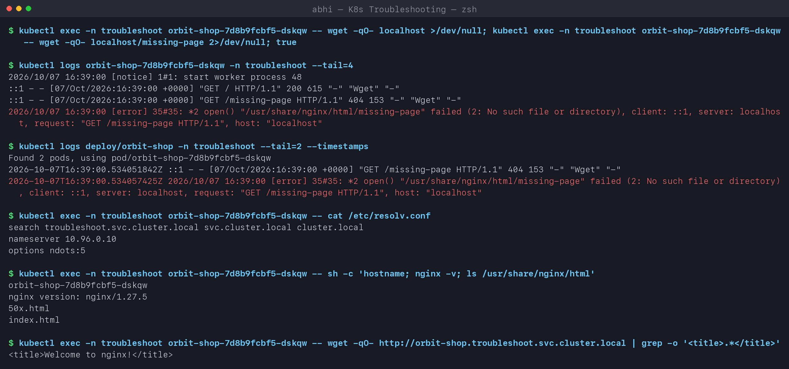

### 1.4 kubectl events, explain and top

```text
$ kubectl events -n troubleshoot --types=Normal | tail -6
1s   Normal   SuccessfulCreate    ReplicaSet/orbit-shop-7d8b9fcbf5   Created pod: orbit-shop-7d8b9fcbf5-dskqw
1s   Normal   ScalingReplicaSet   Deployment/orbit-shop              Scaled up replica set orbit-shop-7d8b9fcbf5 from 0 to 2
0s   Normal   Pulled              Pod/orbit-shop-7d8b9fcbf5-dskqw    Container image "nginx:1.27-alpine" already present on machine ...
0s   Normal   Created             Pod/orbit-shop-7d8b9fcbf5-dskqw    Container created
0s   Normal   Started             Pod/orbit-shop-7d8b9fcbf5-dskqw    Container started

$ kubectl explain deployment.spec.strategy.rollingUpdate.maxSurge
FIELD: maxSurge <IntOrString>
DESCRIPTION:
    The maximum number of pods that can be scheduled above the desired number of
    pods. Value can be an absolute number (ex: 5) or a percentage of desired
    pods (ex: 10%). This can not be 0 if MaxUnavailable is 0. ... Defaults to 25%.

$ kubectl top nodes
NAME                        CPU(cores)   CPU(%)   MEMORY(bytes)   MEMORY(%)
abhi-devops-control-plane   136m         0%       1522Mi          6%
abhi-devops-worker          43m          0%       737Mi           3%

$ kubectl top pods -n troubleshoot
NAME                          CPU(cores)   MEMORY(bytes)
orbit-shop-7d8b9fcbf5-drqvw   0m           11Mi
orbit-shop-7d8b9fcbf5-nknf2   3m           11Mi
```

`kubectl events` reads like a story: Deployment -> ReplicaSet -> Pod -> image -> container.
`top` needs metrics-server (installed in the Storage/HPA section); right after a Pod starts it
answers `metrics not available yet` until the first ~15s scrape - I hit exactly that on my
first run.

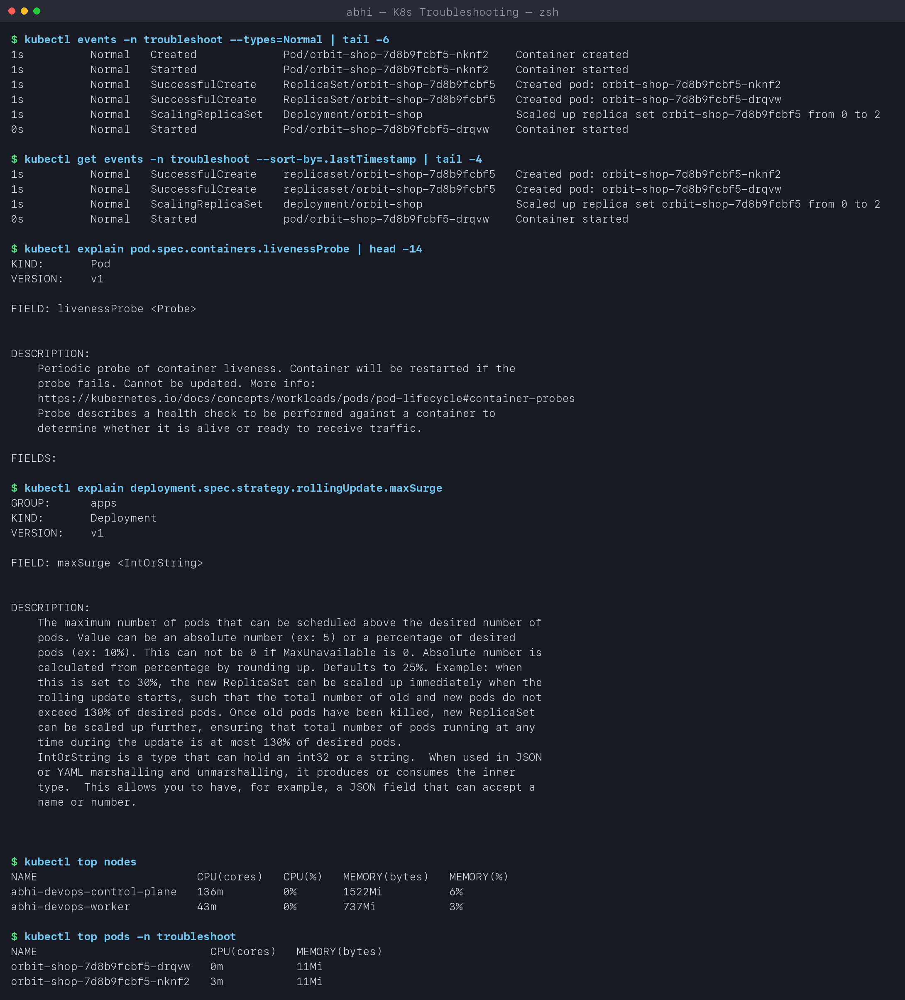

---

## Task 2: Troubleshooting common issues

Summary of all scenarios:

| # | Status I saw | Command that revealed the cause | Root cause | Fix |
|---|---|---|---|---|
| 1 | `CrashLoopBackOff` | `kubectl logs` | app exits 1 - `DATABASE_URL` env var missing | add the env var |
| 2 | `ImagePullBackOff` | `kubectl events --for pod/...` | typo in tag `1.27-alpne` | correct tag |
| 3 | `ErrImagePull` | `kubectl describe pod` | registry hostname does not resolve | use a real registry/image |
| 4 | `Pending` | `describe pod` -> FailedScheduling | requests 32 CPU / 64Gi - no node fits | right-size requests |
| 5 | `ContainerCreating` | `describe pod` -> FailedMount | mounted ConfigMap does not exist | create the ConfigMap |
| 6 | Service unreachable | `get endpointslices`, compare selector & port | selector typo + wrong targetPort | fix both in the Service |
| 7 | DNS `NXDOMAIN` | `nslookup` from a Pod | wrong Service name and namespace in the URL | use `<svc>.<ns>.svc.cluster.local` |
| 8 | Pod networking - connection refused | `nc`, `kubectl debug ... ss -lntp` | app bound to `127.0.0.1` only | bind `0.0.0.0` |
| 9 | `CreateContainerConfigError` | `describe pod` | ConfigMap key `log_level` vs `LOG_LEVEL` | use the exact key |
| 10 | `OOMKilled` (bonus) | `get pod -o jsonpath` exit code 137 | 150Mi needed, 32Mi limit | raise the memory limit |

Pod specs are immutable for most fields, so for Pod fixes I used
`kubectl replace --force -f fixed.yaml` (delete + recreate in one step).

### Issue 1: CrashLoopBackOff

**Problem:** `payments-api` keeps restarting.

```text
$ kubectl get pod payments-api -n troubleshoot
NAME           READY   STATUS             RESTARTS      AGE
payments-api   0/1     CrashLoopBackOff   5 (66s ago)   3m49s

$ kubectl describe pod payments-api -n troubleshoot | grep -E 'State:|Reason:|Exit Code:|Restart Count:|Back-off'
    State:          Waiting
      Reason:       CrashLoopBackOff
    Last State:     Terminated
      Reason:       Error
      Exit Code:    1
    Restart Count:  5
  Warning  BackOff    1s (x7 over 3m47s)   kubelet   Back-off restarting failed container api in pod payments-api_troubleshoot(...)

$ kubectl logs payments-api -n troubleshoot
FATAL: DATABASE_URL environment variable is missing
```

**Investigation:** `describe` says the *container* exits with code 1 (an application error,
not Kubernetes) and the kubelet is backing off between restarts (10s, 20s, 40s ... up to 5
minutes - that is the "BackOff" in the name). `logs` gives the exact reason.
**Root cause:** the app requires `DATABASE_URL` and the Pod spec does not set it.
**Fix:** [fixed.yaml](02-issues/01-crashloopbackoff/fixed.yaml) adds the `env` entry.

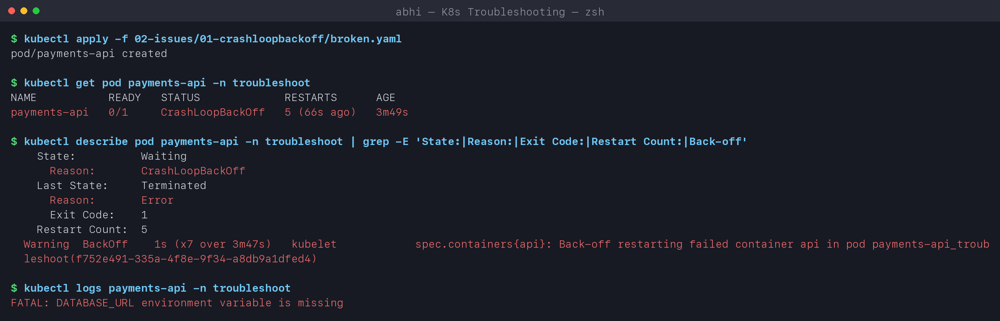

```text
$ kubectl replace --force -f 02-issues/01-crashloopbackoff/fixed.yaml
pod "payments-api" deleted from troubleshoot namespace
pod/payments-api replaced

$ kubectl get pod payments-api -n troubleshoot
NAME           READY   STATUS    RESTARTS   AGE
payments-api   1/1     Running   0          1s

$ kubectl logs payments-api -n troubleshoot
payments-api connected to postgres://payments-db.troubleshoot.svc.cluster.local:5432/payments
```

**Verified:** Running, 0 restarts, the app logs a successful start.
Lesson: on my first run `logs --previous` failed because the previous container had already
been cleaned up mid-restart; plain `kubectl logs` shows the last attempt while the Pod is in
back-off.

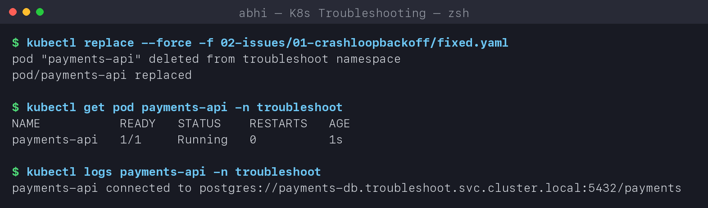

### Issue 2: ImagePullBackOff

```text
$ kubectl get pod catalog-web -n troubleshoot
NAME          READY   STATUS             RESTARTS   AGE
catalog-web   0/1     ImagePullBackOff   0          40s

$ kubectl events -n troubleshoot --for pod/catalog-web | tail -4
29s                 Warning   Failed      Pod/catalog-web   Error: ErrImagePull
28s                 Normal    BackOff     Pod/catalog-web   Back-off pulling image "nginx:1.27-alpne"
28s                 Warning   Failed      Pod/catalog-web   Error: ImagePullBackOff
14s (x2 over 39s)   Normal    Pulling     Pod/catalog-web   Pulling image "nginx:1.27-alpne"

$ kubectl replace --force -f 02-issues/02-imagepullbackoff/fixed.yaml
pod/catalog-web replaced

$ kubectl get pod catalog-web -n troubleshoot -o custom-columns=NAME:.metadata.name,STATUS:.status.phase,IMAGE:.spec.containers[0].image
NAME          STATUS    IMAGE
catalog-web   Running   nginx:1.27-alpine
```

**Root cause:** typo in the tag (`alpne`). The events show the cycle: one pull fails
(`ErrImagePull`), then the kubelet waits with growing delays (`ImagePullBackOff`) and retries.
**Fix / verify:** correct tag -> Running.

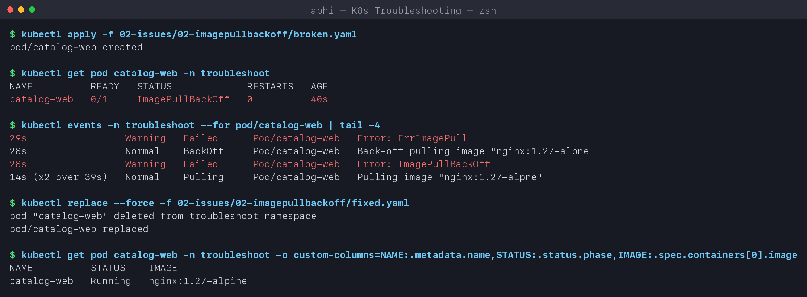

### Issue 3: ErrImagePull

```text
$ kubectl get pod search-api -n troubleshoot
NAME         READY   STATUS         RESTARTS   AGE
search-api   0/1     ErrImagePull   0          12s

$ kubectl describe pod search-api -n troubleshoot | grep -E 'Failed' | head -2
  Warning  Failed  10s  kubelet  Failed to pull image "registry.abhi-devops.invalid/search-api:1.0.0": ...
     dial tcp: lookup registry.abhi-devops.invalid on 192.168.65.254:53: no such host
  Warning  Failed  10s  kubelet  Error: ErrImagePull

$ kubectl replace --force -f 02-issues/03-errimagepull/fixed.yaml
pod/search-api replaced

$ kubectl get pod search-api -n troubleshoot
NAME         READY   STATUS    RESTARTS   AGE
search-api   1/1     Running   0          16s

$ kubectl logs search-api -n troubleshoot
2026/10/07 16:41:12 [INFO] server is listening on :5678
```

**ErrImagePull vs ImagePullBackOff:** `ErrImagePull` is the **first failed attempt**;
`ImagePullBackOff` is the state **between retries**. Same family of causes; the message tells
which: `no such host` (registry name / DNS), `not found` (repo or tag), `unauthorized`
(private registry needs `imagePullSecrets`), `429 Too Many Requests` (rate limit - see the mini
project).

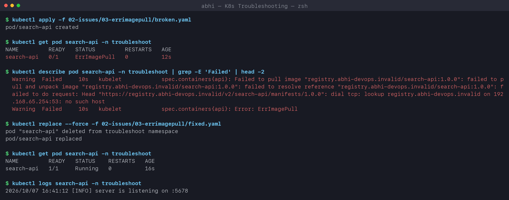

### Issue 4: Pending

```text
$ kubectl get pod report-worker -n troubleshoot -o wide
NAME            READY   STATUS    RESTARTS   AGE   IP       NODE     NOMINATED NODE   READINESS GATES
report-worker   0/1     Pending   0          8s    <none>   <none>   <none>           <none>

$ kubectl describe pod report-worker -n troubleshoot | sed -n '/^Events/,$p'
  Warning  FailedScheduling  8s  default-scheduler  0/2 nodes are available: 1 Insufficient cpu, 1 Insufficient memory,
           1 node(s) had untolerated taint(s). preemption: 0/2 nodes are available: 2 Preemption is not helpful for scheduling.

$ kubectl describe nodes | grep -A6 'Allocated resources' | grep -E 'cpu|memory'
  cpu                1050m (7%)  0 (0%)
  memory             380Mi (1%)  340Mi (1%)
  cpu                640m (4%)   1600m (10%)
  memory             826Mi (3%)  1152Mi (4%)

$ kubectl replace --force -f 02-issues/04-pending/fixed.yaml
pod/report-worker replaced

$ kubectl get pod report-worker -n troubleshoot -o wide
NAME            READY   STATUS    RESTARTS   AGE   IP             NODE                 NOMINATED NODE   READINESS GATES
report-worker   1/1     Running   0          0s    10.244.1.144   abhi-devops-worker   <none>           <none>
```

**Investigation:** no IP and no node = the scheduler never placed it. The scheduler's message
explains each node: the worker lacks CPU and memory for a 32-CPU / 64Gi request, and the
control-plane is tainted. **Root cause:** requests larger than any node. **Fix:** realistic
requests (50m / 32Mi). Other common Pending causes: unbound PVC, `nodeSelector`/affinity that
matches no node, taints without tolerations.

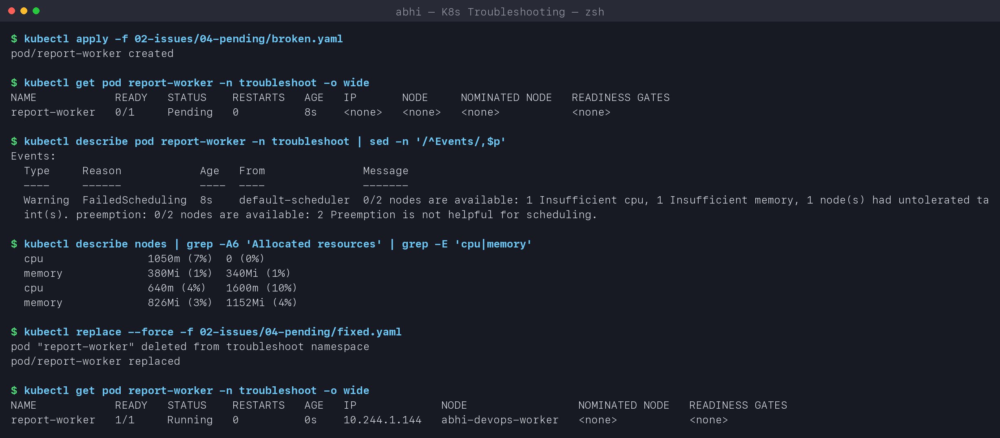

### Issue 5: ContainerCreating

```text
$ kubectl get pod inventory-web -n troubleshoot
NAME            READY   STATUS              RESTARTS   AGE
inventory-web   0/1     ContainerCreating   0          21s

$ kubectl describe pod inventory-web -n troubleshoot | sed -n '/^Events/,$p' | tail -3
  Normal   Scheduled    21s               default-scheduler  Successfully assigned troubleshoot/inventory-web to abhi-devops-worker
  Warning  FailedMount  5s (x6 over 20s)  kubelet            MountVolume.SetUp failed for volume "site" : configmap "inventory-site" not found

$ kubectl get configmap inventory-site -n troubleshoot
Error from server (NotFound): configmaps "inventory-site" not found

$ kubectl apply -f 02-issues/05-containercreating/fixed.yaml
configmap/inventory-site created

$ kubectl get pod inventory-web -n troubleshoot
NAME            READY   STATUS    RESTARTS   AGE
inventory-web   1/1     Running   0          33s

$ kubectl exec inventory-web -n troubleshoot -- wget -qO- localhost
inventory-web is up
```

**Root cause:** the Pod *was* scheduled, but the kubelet cannot mount a volume that refers to a
missing ConfigMap. **Fix:** create the ConfigMap. Note the AGE: 33s - the **same Pod** started
by itself because the kubelet keeps retrying the mount; nothing had to be recreated.

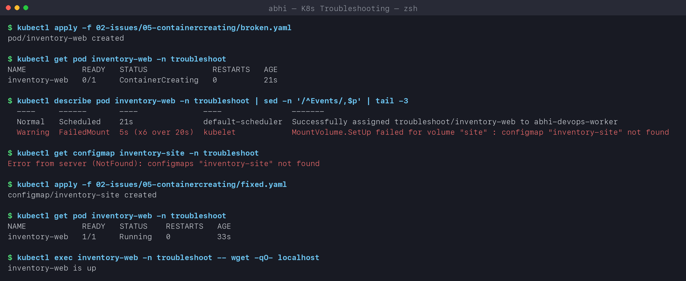

### Issue 6: Service connectivity

```text
$ kubectl exec netshoot -n troubleshoot -- curl -s -m 3 orders-api || echo 'curl failed: exit' $?
command terminated with exit code 7
curl failed: exit 7

$ kubectl get endpointslices -n troubleshoot -l kubernetes.io/service-name=orders-api
NAME               ADDRESSTYPE   PORTS     ENDPOINTS   AGE
orders-api-8fmmw   IPv4          <unset>   <unset>     104s

$ kubectl get svc orders-api -n troubleshoot -o jsonpath='selector={.spec.selector}  targetPort={.spec.ports[0].targetPort}'
selector={"app":"order-api"}  targetPort=8080

$ kubectl get pods -n troubleshoot -l app=orders-api --show-labels
NAME                         READY   STATUS    RESTARTS   AGE    LABELS
orders-api-969d44585-dm6pc   1/1     Running   0          104s   app=orders-api,pod-template-hash=969d44585
orders-api-969d44585-z9jdg   1/1     Running   0          104s   app=orders-api,pod-template-hash=969d44585

$ kubectl get pods -n troubleshoot -l app=orders-api -o jsonpath='{.items[0].spec.containers[0].ports[0].containerPort}'
5678
```

**Investigation:** the Pods are healthy, but the Service has **no endpoints**. Comparing the
Service with the Pods shows two bugs: selector `app=order-api` vs label `app=orders-api`, and
`targetPort 8080` vs `containerPort 5678`. (The first bug alone empties the endpoints; the
second would make every connection fail once the first is fixed.)

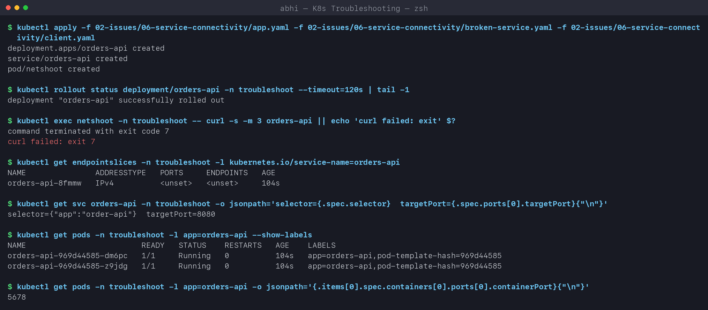

```text
$ kubectl apply -f 02-issues/06-service-connectivity/fixed-service.yaml
service/orders-api configured

$ kubectl get endpointslices -n troubleshoot -l kubernetes.io/service-name=orders-api
NAME               ADDRESSTYPE   PORTS   ENDPOINTS                   AGE
orders-api-8fmmw   IPv4          5678    10.244.1.147,10.244.1.146   108s

$ kubectl exec netshoot -n troubleshoot -- curl -s -m 3 orders-api
orders-api ok
```

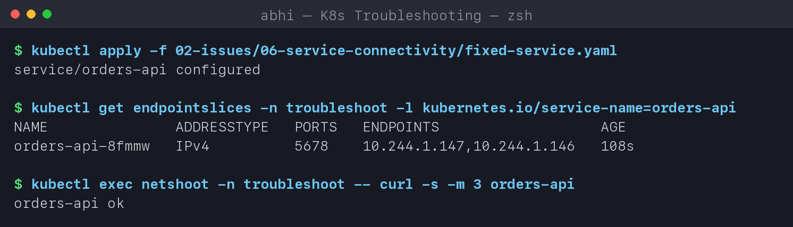

### Issue 7: DNS

```text
$ kubectl logs checkout-client -n troubleshoot --tail=2
16:43:52 calling http://orders.default.svc.cluster.local
request failed

$ kubectl exec netshoot -n troubleshoot -- nslookup orders.default.svc.cluster.local
Server:		10.96.0.10
Address:	10.96.0.10#53

** server can't find orders.default.svc.cluster.local: NXDOMAIN

$ kubectl get svc -A | grep -E 'NAMESPACE|orders'
NAMESPACE       NAME         TYPE        CLUSTER-IP     EXTERNAL-IP   PORT(S)   AGE
troubleshoot    orders-api   ClusterIP   10.96.37.141   <none>        80/TCP    2m4s

$ kubectl exec netshoot -n troubleshoot -- nslookup orders-api.troubleshoot.svc.cluster.local
Name:	orders-api.troubleshoot.svc.cluster.local
Address: 10.96.37.141

$ kubectl get pods -n kube-system -l k8s-app=kube-dns
NAME                       READY   STATUS    RESTARTS       AGE
coredns-559f6c778d-4bwh9   1/1     Running   8 (101m ago)   19d
coredns-559f6c778d-9gff5   1/1     Running   8 (101m ago)   19d
```

**Investigation:** the DNS server answered (`NXDOMAIN` is an answer, not a timeout), so CoreDNS
works - confirmed by the healthy CoreDNS Pods and by the correct name resolving. The *name*
is wrong: the Service is `orders-api` in namespace `troubleshoot`, not `orders` in `default`.
**Fix:** use the real FQDN `orders-api.troubleshoot.svc.cluster.local`.

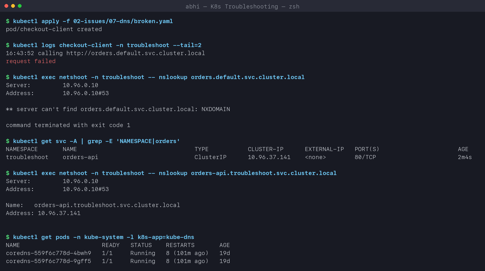

```text
$ kubectl replace --force -f 02-issues/07-dns/fixed.yaml
pod/checkout-client replaced

$ kubectl logs checkout-client -n troubleshoot --tail=2
16:44:33 calling http://orders-api.troubleshoot.svc.cluster.local
orders-api ok
```

If `nslookup` had **timed out** instead, I would check the CoreDNS Pods/logs, the `kube-dns`
Service endpoints, and NetworkPolicies blocking UDP/TCP 53.

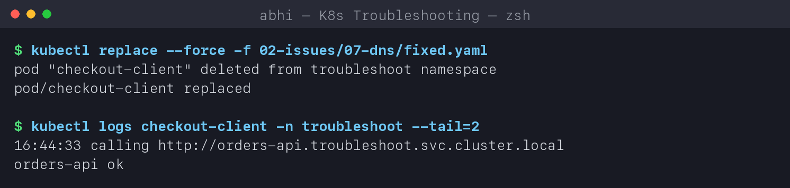

### Issue 8: Pod networking

```text
$ kubectl get pod ledger-api -n troubleshoot -o wide
NAME         READY   STATUS    RESTARTS   AGE   IP             NODE
ledger-api   1/1     Running   0          1s    10.244.1.182   abhi-devops-worker

$ kubectl exec netshoot -n troubleshoot -- curl -s -m 3 http://10.244.1.182:8000 || echo 'connection failed from another Pod'
command terminated with exit code 7
connection failed from another Pod

$ kubectl exec ledger-api -n troubleshoot -- python3 -c "import urllib.request; print(urllib.request.urlopen('http://127.0.0.1:8000').status)"    # works from inside
200

$ kubectl exec netshoot -n troubleshoot -- nc -zv -w 2 10.244.1.182 8000
nc: connect to 10.244.1.182 port 8000 (tcp) failed: Connection refused

$ kubectl debug ledger-api -n troubleshoot -q --image=nicolaka/netshoot:v0.13 --profile=general -- ss -lntp
$ kubectl logs ledger-api -n troubleshoot -c <debugger container>
State  Recv-Q Send-Q Local Address:Port Peer Address:PortProcess
LISTEN 0      5          127.0.0.1:8000      0.0.0.0:*

$ kubectl replace --force -f 02-issues/08-pod-networking/fixed.yaml
pod/ledger-api replaced

$ kubectl exec netshoot -n troubleshoot -- curl -s -m 3 -o /dev/null -w 'HTTP %{http_code} from 10.244.1.183\n' http://10.244.1.183:8000
HTTP 200 from 10.244.1.183
```

**Investigation:** the Pod is Running and Ready and answers **inside itself**, but another Pod
gets `Connection refused` - not a timeout - so the packet reaches the Pod and nothing is
listening on that interface. The `python` image has no `ss`, so I attached an **ephemeral debug
container** with `kubectl debug` (it shares the Pod's network namespace) and `ss -lntp` proved
it: the server listens on `127.0.0.1:8000` only.
**Root cause:** bind address. **Fix:** `--bind 0.0.0.0`.
`Connection refused` = reached, nothing listening; a **timeout** would instead point at a
NetworkPolicy, the CNI, or a wrong IP.

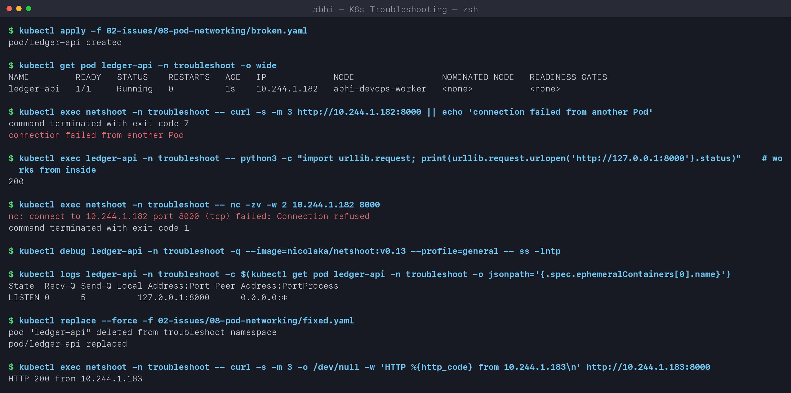

### Issue 9: Configuration error

```text
$ kubectl get pod billing-api -n troubleshoot
NAME          READY   STATUS                       RESTARTS   AGE
billing-api   0/1     CreateContainerConfigError   0          10s

$ kubectl describe pod billing-api -n troubleshoot | grep -E 'Warning' | tail -1
  Warning  Failed  9s (x2 over 10s)  kubelet  Error: couldn't find key log_level in ConfigMap troubleshoot/billing-config

$ kubectl get configmap billing-config -n troubleshoot -o jsonpath='{.data}'
{"CURRENCY":"INR","LOG_LEVEL":"info"}

$ kubectl replace --force -f 02-issues/09-configuration/fixed.yaml
configmap/billing-config replaced
pod/billing-api replaced

$ kubectl logs billing-api -n troubleshoot
billing-api log_level=info currency=INR
```

**Root cause:** ConfigMap keys are case-sensitive - the Pod asked for `log_level`, the
ConfigMap has `LOG_LEVEL`. The container is never even created. The same error appears for a
missing Secret or Secret key. (Marking the reference `optional: true` would hide the error but
start the app without the value - usually worse.)

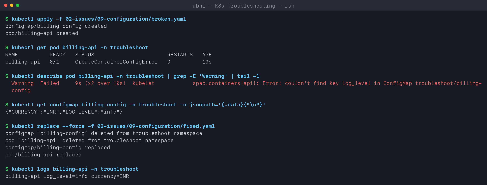

### Bonus - Issue 10: OOMKilled

```text
$ kubectl get pod image-resizer -n troubleshoot
NAME            READY   STATUS      RESTARTS   AGE
image-resizer   0/1     OOMKilled   0          15s

$ kubectl get pod image-resizer -n troubleshoot -o jsonpath='reason={...terminated.reason} exitCode={...terminated.exitCode}'
reason=OOMKilled exitCode=137

$ kubectl replace --force -f 02-issues/10-oomkilled/fixed.yaml
pod/image-resizer replaced

$ kubectl get pod image-resizer -n troubleshoot
NAME            READY   STATUS      RESTARTS   AGE
image-resizer   0/1     Completed   0          15s

$ kubectl logs image-resizer -n troubleshoot
resized batch using 150 MiB
```

Exit code **137 = 128 + 9 (SIGKILL)**: the kernel killed the process for exceeding its 32Mi
memory limit. Raising the limit to 256Mi let the job complete.

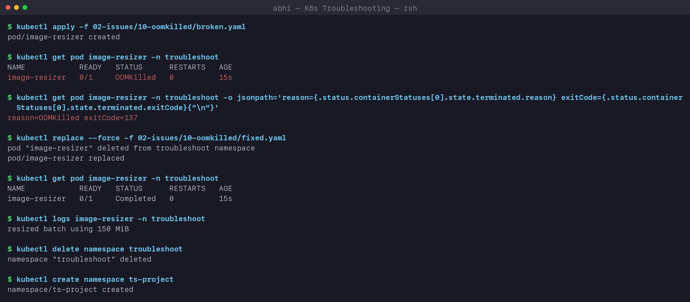

---

## Task 3: Mini project - troubleshooting challenge

Deploy -> observe -> break -> investigate -> root cause -> fix -> verify, on a 2-replica nginx
app ([03-mini-project/](03-mini-project)).

### Deploy and check the healthy app

```text
$ kubectl get pods,svc -n ts-project -o wide
NAME                                       READY   STATUS    RESTARTS   AGE    IP             NODE
pod/troubleshooting-app-59d4957864-7g7jn   1/1     Running   0          116s   10.244.1.174   abhi-devops-worker
pod/troubleshooting-app-59d4957864-m4czt   1/1     Running   0          116s   10.244.1.173   abhi-devops-worker

NAME                              TYPE        CLUSTER-IP     EXTERNAL-IP   PORT(S)   AGE    SELECTOR
service/troubleshooting-service   ClusterIP   10.96.44.154   <none>        80/TCP    116s   app=troubleshooting-app

$ kubectl exec troubleshooting-app-59d4957864-7g7jn -n ts-project -- curl -s localhost | grep -o '<title>.*</title>'
<title>Welcome to nginx!</title>

$ kubectl describe service troubleshooting-service -n ts-project | grep -E 'Selector|TargetPort|Endpoints'
Selector:                 app=troubleshooting-app
TargetPort:               80/TCP
Endpoints:                10.244.1.173:80,10.244.1.174:80
```

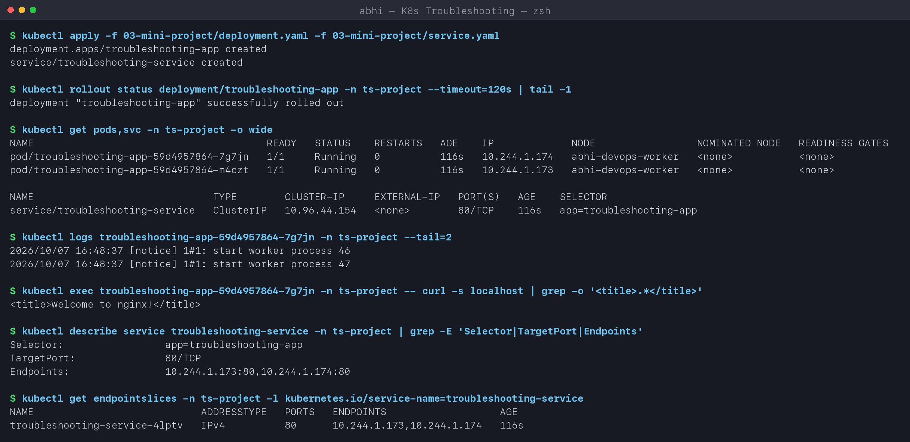

### The broken Pod

```text
$ kubectl get pod project-broken-pod -n ts-project
NAME                 READY   STATUS             RESTARTS   AGE
project-broken-pod   0/1     ImagePullBackOff   0          30s

$ kubectl describe pod project-broken-pod -n ts-project | sed -n '/^Events/,$p'
  Normal   Scheduled  30s               default-scheduler  Successfully assigned ts-project/project-broken-pod to abhi-devops-worker
  Normal   BackOff    22s               kubelet            Back-off pulling image "nginx:this-tag-does-not-exist"
  Warning  Failed     22s               kubelet            Error: ImagePullBackOff
  Normal   Pulling    9s (x2 over 29s)  kubelet            Pulling image "nginx:this-tag-does-not-exist"
  Warning  Failed     3s (x2 over 23s)  kubelet            Failed to pull image "nginx:this-tag-does-not-exist": ...
           unexpected status from HEAD request to https://registry-1.docker.io/v2/library/nginx/manifests/this-tag-does-not-exist: 429 Too Many Requests
  Warning  Failed     3s (x2 over 23s)  kubelet            Error: ErrImagePull

$ kubectl replace --force -f 03-mini-project/fixed-pod.yaml
pod/project-broken-pod replaced

$ kubectl get pod project-broken-pod -n ts-project
NAME                 READY   STATUS    RESTARTS   AGE
project-broken-pod   1/1     Running   0          1s
```

| Question | Answer |
|---|---|
| 1. What is the Pod status? | `ImagePullBackOff` (alternating with `ErrImagePull`) |
| 2. What is the actual error? | `Failed to pull image "nginx:this-tag-does-not-exist"` - and on my run Docker Hub answered **`429 Too Many Requests`** |
| 3. Which command found the reason? | `kubectl describe pod project-broken-pod` -> Events |
| 4. What is wrong with the image? | the tag `this-tag-does-not-exist` does not exist in the `nginx` repository |
| 5. How would you fix it? | use a real tag (`nginx:1.27`) - [fixed-pod.yaml](03-mini-project/fixed-pod.yaml) |

**A real-world twist:** after all the pulls in this lab, Docker Hub rate-limited my machine,
so the registry answered `429` *before* it could say "not found". Two problems were stacked:
the wrong tag (the real bug) and the anonymous pull rate limit (an environment problem). Lesson:
read the exact error, not just the status. In production the fix for 429s is authenticated
pulls (`imagePullSecrets`), a pull-through cache, or a private registry such as GHCR/ECR.

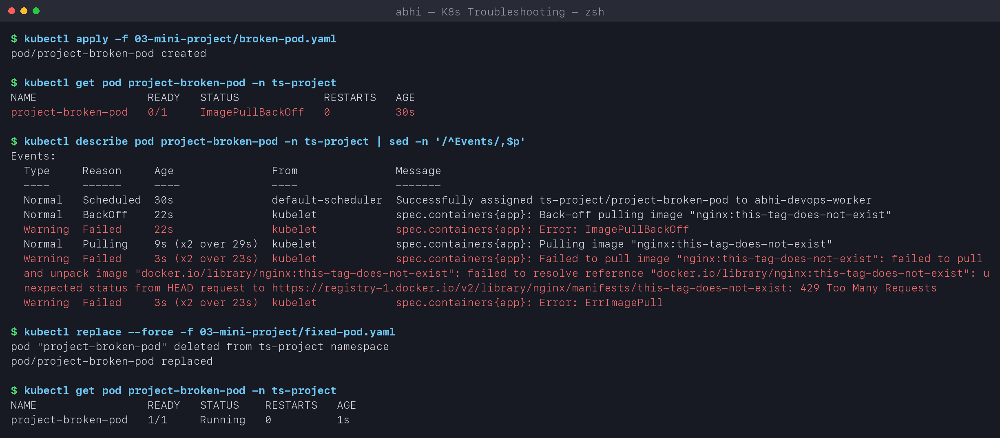

### The Service selector problem

```text
$ kubectl apply -f 03-mini-project/service-broken.yaml
service/troubleshooting-service configured

$ kubectl get endpointslices -n ts-project -l kubernetes.io/service-name=troubleshooting-service
NAME                            ADDRESSTYPE   PORTS     ENDPOINTS   AGE
troubleshooting-service-4lptv   IPv4          <unset>   <unset>     2m28s

$ kubectl exec troubleshooting-app-59d4957864-7g7jn -n ts-project -- curl -s -m 3 troubleshooting-service || echo 'curl failed: exit' $?
command terminated with exit code 7
curl failed: exit 7

$ kubectl get pods -n ts-project --show-labels
NAME                                   READY   STATUS    RESTARTS   AGE     LABELS
project-broken-pod                     1/1     Running   0          1s      <none>
troubleshooting-app-59d4957864-7g7jn   1/1     Running   0          2m28s   app=troubleshooting-app,pod-template-hash=59d4957864
troubleshooting-app-59d4957864-m4czt   1/1     Running   0          2m28s   app=troubleshooting-app,pod-template-hash=59d4957864

$ kubectl describe service troubleshooting-service -n ts-project | grep Selector
Selector:                 app=wrong-app

$ kubectl apply -f 03-mini-project/service.yaml
service/troubleshooting-service configured

$ kubectl get endpointslices -n ts-project -l kubernetes.io/service-name=troubleshooting-service
NAME                            ADDRESSTYPE   PORTS   ENDPOINTS                   AGE
troubleshooting-service-4lptv   IPv4          80      10.244.1.173,10.244.1.174   2m32s

$ kubectl exec troubleshooting-app-59d4957864-7g7jn -n ts-project -- curl -s troubleshooting-service | grep -o '<title>.*</title>'
<title>Welcome to nginx!</title>

$ kubectl exec troubleshooting-app-59d4957864-7g7jn -n ts-project -- getent hosts troubleshooting-service.ts-project.svc.cluster.local
10.96.44.154    troubleshooting-service.ts-project.svc.cluster.local
```

Selector `app=wrong-app`, Pod label `app=troubleshooting-app` -> no endpoints -> curl fails
even though every Pod is healthy and DNS still resolves the ClusterIP. Restoring the selector
brought the endpoints back. (`project-broken-pod` has no labels, so it is correctly *not* an
endpoint.)

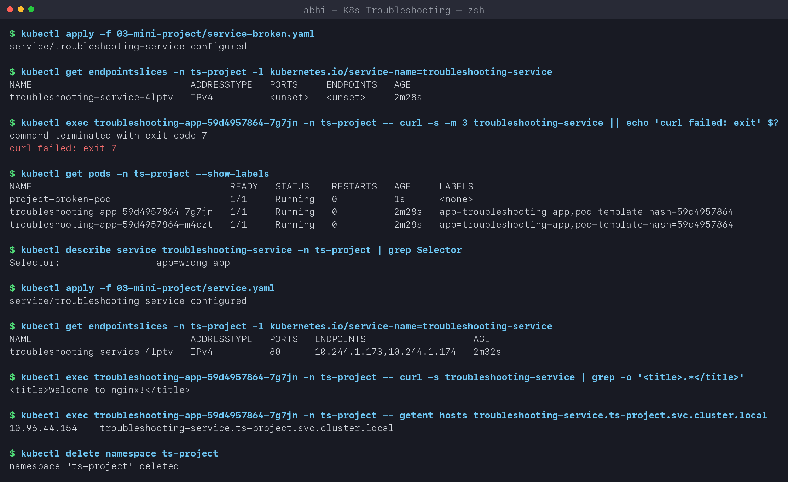

### Troubleshooting table

| Problem | What I saw | Command I used | Root cause | Fix |
|---|---|---|---|---|
| **Broken Pod** | `ImagePullBackOff` / `ErrImagePull` | `kubectl describe pod project-broken-pod` | image tag does not exist (plus a Docker Hub 429) | `nginx:1.27` |
| **Service problem** | curl exit 7, EndpointSlice `<unset>` | `get endpointslices`, `describe service`, `get pods --show-labels` | selector `app=wrong-app` matches no Pod | selector `app=troubleshooting-app` |
| **Image problem** | `Failed to pull image ... 429 Too Many Requests` | `describe pod` Events | anonymous Docker Hub pull rate limit | authenticated pulls / registry cache / GHCR |

### README questions

1. **What does `kubectl get` tell us?** The current summary state of objects - name, READY
   count, STATUS, RESTARTS, AGE (and IP/node with `-o wide`). It is the quick "what is wrong".
2. **`get` vs `describe`?** `get` is one line per object; `describe` is everything about one
   object, including its **Events** - the "why".
3. **Why `kubectl logs`?** To see what the application itself printed - stack traces, missing
   config, connection errors. Kubernetes cannot know why an app exited 1; the logs can.
4. **When `kubectl exec`?** To test from inside the Pod: DNS (`nslookup`), connectivity
   (`curl`), files, env vars - "does it work from where the app sits?"
5. **`CrashLoopBackOff`?** The container starts and keeps exiting; the kubelet restarts it with
   an increasing delay (up to 5 min). Cause is in the app: logs + exit code.
6. **`ImagePullBackOff`?** The image could not be pulled and the kubelet is waiting before
   retrying: wrong name/tag, missing registry auth, registry unreachable or rate-limited.
7. **Why `Pending`?** The scheduler cannot place it: not enough CPU/memory, taints,
   node selectors/affinity, or an unbound PVC.
8. **Why can a Service have no endpoints?** Its selector matches no Pods, or the matching Pods
   are not Ready (readiness probe failing).
9. **Selector vs labels?** A Service sends traffic to every **Ready** Pod whose labels contain
   **all** of the Service's selector key/values. Mismatch = no endpoints.
10. **What is Kubernetes DNS?** CoreDNS running in `kube-system`, reachable at the `kube-dns`
    ClusterIP. Every Service gets `<service>.<namespace>.svc.cluster.local`; Pods get search
    domains so short names work inside the same namespace.

## Key learnings

- Status tells **what**; Events (`describe`) tell **why**; logs tell what the **app** thinks.
- `Connection refused` vs `timeout`, and `NXDOMAIN` vs `timeout`, point to completely
  different layers - read the exact error.
- Most "Service is broken" problems are label/selector or port mismatches - check the
  EndpointSlice first.
- `kubectl debug` gives me tools inside a Pod whose image has none.
- Pod specs are mostly immutable - fix the YAML and `replace --force` (or let the Deployment roll).
