# Monitoring, Observability & GitOps - Homework

**Name:** Abhi Gandhi
**Enrollment Number:** 24bcs10397

Session 20 on my local 2-node `abhi-devops` kind cluster. I set up a full monitoring stack
(Prometheus, Alertmanager, Grafana, Loki), traced a two-service app with OpenTelemetry and
Jaeger, and deployed an app with Argo CD straight from this GitHub repo. Every terminal output
below is copied from my run of [run-labs.sh](run-labs.sh), and the browser screenshots are of
the real UIs on the same cluster.

```bash
./run-labs.sh                  # replays everything (monitoring, observability, gitops)
./run-labs.sh monitoring       # or one part at a time
./run-labs.sh observability
./run-labs.sh gitops           # note: this part commits + pushes to the repo and reverts it
```

| Task | Where |
|---|---|
| 1. Monitoring - metrics, logs, alerts, CPU, memory, application health | [Task 1](#task-1-monitoring) + [01-monitoring/](01-monitoring) |
| 2. Observability - three pillars, why, tools, Kubernetes observability | [Task 2](#task-2-observability) + **[02-observability/README.md](02-observability/README.md)** |
| 3. GitOps with Argo CD - Git as source of truth, reconciliation, self-heal, rollback | [Task 3](#task-3-gitops-with-argo-cd) + [03-gitops/](03-gitops) |

## Folder structure

```text
Monitoring Observability and GitOps/
├── README.md
├── run-labs.sh                         # replays every command in this README
├── 01-monitoring/
│   ├── kube-prometheus-values.yaml     # Helm values: Prometheus, Alertmanager, Grafana (+ Loki/Jaeger data sources)
│   ├── loki-values.yaml                # Loki single-binary
│   ├── alloy-values.yaml               # Grafana Alloy DaemonSet that ships container logs to Loki
│   ├── demo-app.yaml                   # podinfo frontend + backend, Services, ServiceMonitor
│   ├── traffic.yaml                    # steady background traffic
│   ├── load-spike.yaml                 # Job: 3-minute burst of traffic (fires an alert)
│   ├── cpu-hog.yaml                    # Pod that burns CPU (fires an alert)
│   ├── alert-rules.yaml                # PrometheusRule with 5 alerts
│   ├── grafana-dashboard.yaml          # my Grafana dashboard as a ConfigMap
│   ├── promql.sh                       # run a PromQL query from the terminal
│   ├── logql.sh                        # run a LogQL query against Loki
│   └── alerts.sh                       # list rules / alerts from Prometheus and Alertmanager
├── 02-observability/
│   ├── README.md                       # Task 2 documentation
│   ├── jaeger.yaml                     # Jaeger v2 (OTLP receiver + UI)
│   └── traces.sh                       # print a trace from the Jaeger API as a span tree
├── 03-gitops/
│   ├── argocd-values.yaml              # Helm values for Argo CD
│   ├── argocd-application.yaml         # the Argo CD Application (points at this repo)
│   └── app/                            # <- the desired state Argo CD syncs
│       ├── namespace.yaml
│       ├── configmap.yaml
│       ├── deployment.yaml
│       └── service.yaml
└── screenshots/                        # k20-* terminal shots, ui-* browser shots
```

What runs where:

| Namespace | What | Installed with |
|---|---|---|
| `monitoring` | Prometheus Operator, Prometheus, Alertmanager, Grafana, kube-state-metrics, node-exporter (kube-prometheus-stack 92.1.0), Loki 3.6, Alloy | Helm |
| `observability` | podinfo-frontend, podinfo-backend, Jaeger 2.11, traffic generator, alert test workloads | `kubectl apply` |
| `argocd` | Argo CD v3.5.4 (chart argo-cd 10.10.0) | Helm |
| `gitops-demo` | `guestbook` app | **Argo CD**, from Git |

I reached the UIs with `kubectl port-forward` on ports 8090 (Prometheus), 8091 (Grafana),
8092 (Alertmanager), 8093 (Jaeger) and 8094 (Argo CD).

---

## Task 1: Monitoring

### 1.1 Install the monitoring stack

**kube-prometheus-stack** bundles the Prometheus Operator, Prometheus, Alertmanager, Grafana
(with ~25 ready-made Kubernetes dashboards), kube-state-metrics and node-exporter. My
[values file](01-monitoring/kube-prometheus-values.yaml) keeps it light for a laptop and
changes three important things:

- kind runs etcd, the scheduler, controller-manager and kube-proxy bound to `127.0.0.1`, so
  Prometheus can never scrape them. I disabled those jobs instead of living with red targets.
- `serviceMonitorSelectorNilUsesHelmValues: false` (and the same for rules) - by default
  Prometheus only picks up ServiceMonitors carrying the Helm release label; with this it
  picks up mine from any namespace.
- Grafana gets two extra data sources, Loki and Jaeger, so all three pillars are in one UI.

For logs I added **Loki** (single binary, filesystem storage) and **Grafana Alloy** as a
DaemonSet (with a toleration so it also runs on the control-plane node).

```text
$ helm upgrade --install monitoring prometheus-community/kube-prometheus-stack --version 92.1.0 -n monitoring --create-namespace -f 01-monitoring/kube-prometheus-values.yaml --wait --timeout 10m | head -4
Release "monitoring" has been upgraded. Happy Helming!
NAME: monitoring
LAST DEPLOYED: Wed Oct  7 23:59:13 2026
NAMESPACE: monitoring

$ helm list -n monitoring
NAME      	NAMESPACE 	REVISION	STATUS  	CHART                       	APP VERSION
alloy     	monitoring	3       	deployed	alloy-1.13.0                	v1.20.0
loki      	monitoring	2       	deployed	loki-7.3.0                  	3.6.12
monitoring	monitoring	3       	deployed	kube-prometheus-stack-92.1.0	v0.94.1
```

(It says "upgraded" because `run-labs.sh` uses `helm upgrade --install`, which is safe to
re-run; the first install was the same command.)

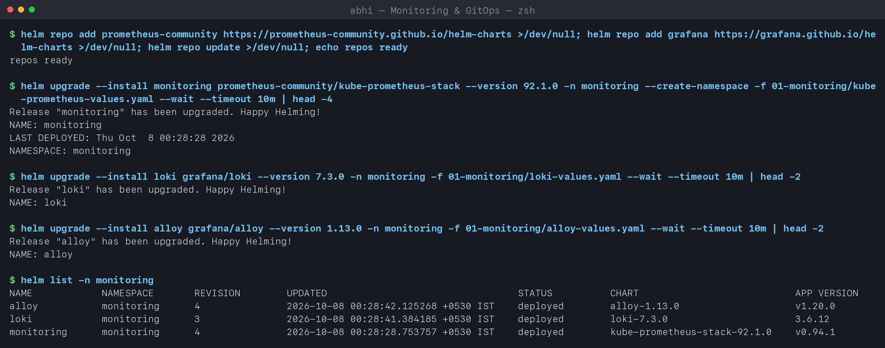

```text
$ kubectl get pods -n monitoring -o wide | awk '{print $1, $2, $3, $7}' | column -t
NAME                                                    READY  STATUS   NODE
alertmanager-monitoring-kube-prometheus-alertmanager-0  2/2    Running  abhi-devops-worker
alloy-w6ntm                                             2/2    Running  abhi-devops-control-plane
alloy-zz6j6                                             2/2    Running  abhi-devops-worker
loki-0                                                  1/1    Running  abhi-devops-worker
monitoring-grafana-7bd989fcfb-284v6                     3/3    Running  abhi-devops-worker
monitoring-kube-prometheus-operator-66bcbd7f6-t8gsn     1/1    Running  abhi-devops-worker
monitoring-kube-state-metrics-78fd56fc4b-xc79z          1/1    Running  abhi-devops-worker
monitoring-prometheus-node-exporter-sk7c6               1/1    Running  abhi-devops-control-plane
monitoring-prometheus-node-exporter-tdhft               1/1    Running  abhi-devops-worker
prometheus-monitoring-kube-prometheus-prometheus-0      2/2    Running  abhi-devops-worker
```

The operator also installs CRDs (`servicemonitors`, `prometheusrules`, `alertmanagerconfigs`,
...), which is what makes monitoring config declarative YAML.

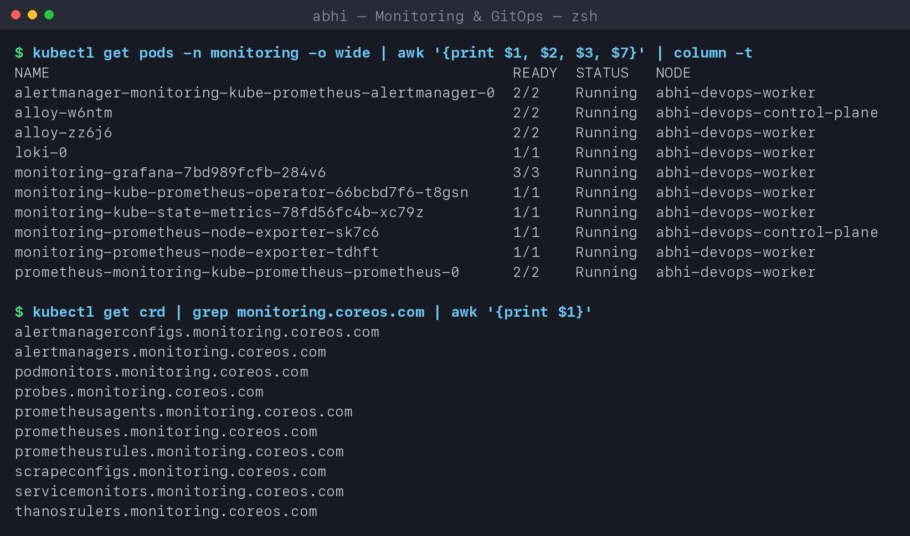

### 1.2 Demo app with metrics

The app is **podinfo** (`ghcr.io/stefanprodan/podinfo:6.15.0`) deployed twice:
`podinfo-frontend` calls `podinfo-backend` on every `POST /echo`. The backend adds a random
20-200 ms delay so latency is interesting. Both expose Prometheus metrics on `/metrics`, have
liveness/readiness probes, log JSON, and send OpenTelemetry traces (Task 2). A small `traffic`
Deployment sends about 2 requests/s, and one **ServiceMonitor** tells Prometheus to scrape
every Service labelled `app=podinfo`:

```yaml
apiVersion: monitoring.coreos.com/v1
kind: ServiceMonitor
metadata:
  name: podinfo
  namespace: observability
spec:
  selector:
    matchLabels: {app: podinfo}
  endpoints:
    - port: http
      path: /metrics
      interval: 15s
```

```text
$ kubectl get deploy,svc,servicemonitor -n observability
NAME                               READY   UP-TO-DATE   AVAILABLE   AGE
deployment.apps/jaeger             1/1     1            1           26m
deployment.apps/podinfo-backend    2/2     2            2           26m
deployment.apps/podinfo-frontend   2/2     2            2           26m
deployment.apps/traffic            1/1     1            1           11m

NAME                       TYPE        CLUSTER-IP      EXTERNAL-IP   PORT(S)                       AGE
service/jaeger             ClusterIP   10.96.208.210   <none>        16686/TCP,4317/TCP,4318/TCP   26m
service/podinfo-backend    ClusterIP   10.96.56.155    <none>        9898/TCP                      26m
service/podinfo-frontend   ClusterIP   10.96.115.166   <none>        9898/TCP                      26m

NAME                                           AGE
servicemonitor.monitoring.coreos.com/podinfo   26m
```

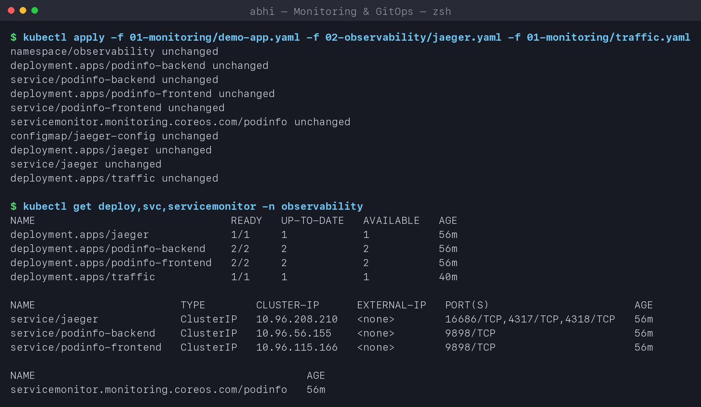

This is what Prometheus actually scrapes - plain text counters and histograms:

```text
$ kubectl -n observability exec deploy/traffic -- curl -s http://podinfo-frontend:9898/metrics | grep -E '^http_requests_total|^http_request_duration_seconds_count' | head -6
http_request_duration_seconds_count{method="GET",path="healthz",status="200"} 249
http_request_duration_seconds_count{method="GET",path="metrics",status="200"} 166
http_request_duration_seconds_count{method="GET",path="readyz",status="200"} 250
http_request_duration_seconds_count{method="GET",path="root",status="200"} 1963
http_request_duration_seconds_count{method="GET",path="version",status="200"} 1
http_request_duration_seconds_count{method="POST",path="echo",status="200"} 8141
```

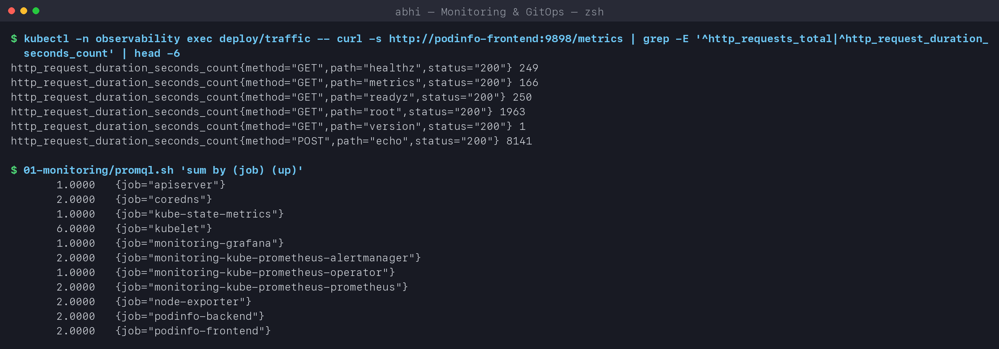

### 1.3 Targets are UP

To query Prometheus from the terminal I wrote [promql.sh](01-monitoring/promql.sh). It sends
the query through the Kubernetes API server proxy
(`/api/v1/namespaces/monitoring/services/http:...:9090/proxy/api/v1/query`), so it needs no
port-forward.

```text
$ 01-monitoring/promql.sh 'up{namespace="observability"}' | sed 's/endpoint="http", //; s/, namespace="observability"//'
       1.0000   {container="podinfo", instance="10.244.1.220:9898", job="podinfo-frontend", pod="podinfo-frontend-64b656b9d8-6lv4v", service="podinfo-frontend"}
       1.0000   {container="podinfo", instance="10.244.1.221:9898", job="podinfo-frontend", pod="podinfo-frontend-64b656b9d8-559wn", service="podinfo-frontend"}
       1.0000   {container="podinfo", instance="10.244.1.233:9898", job="podinfo-backend", pod="podinfo-backend-86859f656d-8mbhl", service="podinfo-backend"}
       1.0000   {container="podinfo", instance="10.244.1.234:9898", job="podinfo-backend", pod="podinfo-backend-86859f656d-p5ssx", service="podinfo-backend"}

$ 01-monitoring/promql.sh 'count(up == 1)'; 01-monitoring/promql.sh 'count(up == 0)'
      22.0000   {}
  (no data - empty result)
```

All 22 targets are up and none are down. `up` is the simplest health metric there is: 1 if
the last scrape worked, 0 if it failed.

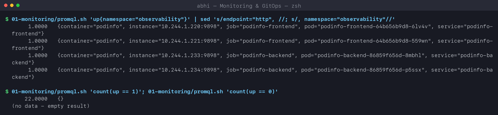

The same thing in the Prometheus UI (Status -> Target health), filtered to podinfo - the
operator turned my ServiceMonitor into the scrape pool `serviceMonitor/observability/podinfo/0`:

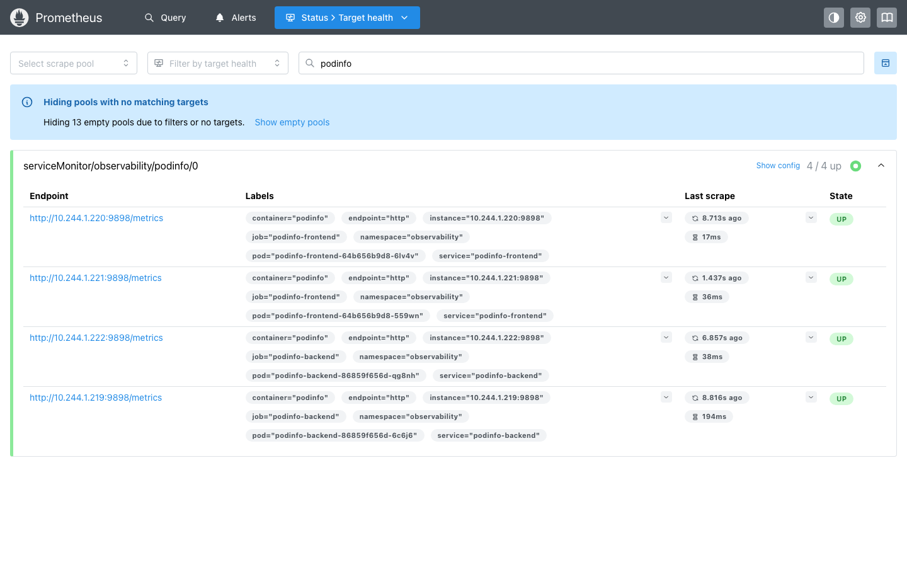

### 1.4 Application metrics: request rate and latency

`http_requests_total` is a **counter** (it only goes up), so I always wrap it in `rate()` to
get requests per second. Latency comes from the **histogram** buckets via `histogram_quantile`.

```text
$ 01-monitoring/promql.sh 'sum by (service) (rate(http_requests_total{namespace="observability"}[1m]))'
       2.0891   {service="podinfo-backend"}
       3.6448   {service="podinfo-frontend"}

$ 01-monitoring/promql.sh 'histogram_quantile(0.95, sum by (service, le) (rate(http_request_duration_seconds_bucket{namespace="observability", path="echo"}[2m])))'
       0.2360   {service="podinfo-backend"}
       0.2369   {service="podinfo-frontend"}
```

The p95 of ~236 ms matches the backend's random 20-200 ms delay landing in the 0.25 s bucket,
and the frontend's latency is almost identical to the backend's - so the frontend spends
nearly all of its time waiting on the backend (Task 2's trace proves this).

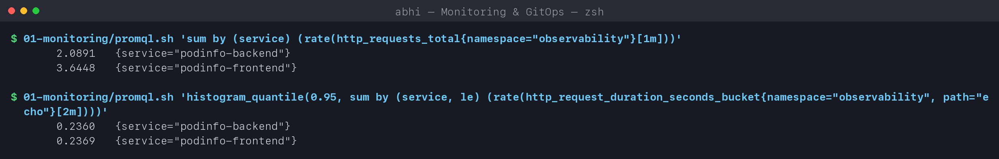

### 1.5 CPU and memory utilization

Two sources for the same numbers: `kubectl top` (metrics-server, live only) and PromQL on the
kubelet's cAdvisor metrics (stored, so I can graph history and alert on it).

```text
$ kubectl top pods -n observability
NAME                                CPU(cores)   MEMORY(bytes)
jaeger-78997f4bcc-nksvr             11m          191Mi
podinfo-backend-86859f656d-8mbhl    5m           29Mi
podinfo-backend-86859f656d-p5ssx    3m           26Mi
podinfo-frontend-64b656b9d8-559wn   6m           34Mi
podinfo-frontend-64b656b9d8-6lv4v   6m           35Mi
traffic-7747c9dd96-24kdz            21m          2Mi

$ 01-monitoring/promql.sh 'sum by (pod) (rate(container_cpu_usage_seconds_total{namespace="observability", container!=""}[2m]))'
       0.0121   {pod="jaeger-78997f4bcc-nksvr"}
       0.0041   {pod="podinfo-backend-86859f656d-8mbhl"}
       0.0022   {pod="podinfo-backend-86859f656d-p5ssx"}
       0.0051   {pod="podinfo-frontend-64b656b9d8-559wn"}
       0.0051   {pod="podinfo-frontend-64b656b9d8-6lv4v"}
       0.0184   {pod="traffic-7747c9dd96-24kdz"}

$ 01-monitoring/promql.sh 'sum by (pod) (container_memory_working_set_bytes{namespace="observability", container!=""})' bytes
    191.5 MiB   {pod="jaeger-78997f4bcc-nksvr"}
     29.0 MiB   {pod="podinfo-backend-86859f656d-8mbhl"}
     26.8 MiB   {pod="podinfo-backend-86859f656d-p5ssx"}
     34.1 MiB   {pod="podinfo-frontend-64b656b9d8-559wn"}
     35.7 MiB   {pod="podinfo-frontend-64b656b9d8-6lv4v"}
      2.7 MiB   {pod="traffic-7747c9dd96-24kdz"}
```

The two sources agree (5m vs 0.0041 cores, 29Mi vs 29.0 MiB). I used `container!=""` to skip
the Pod-level aggregate series cAdvisor also exports, otherwise every Pod would be counted
twice. Working set is the memory number the kernel's OOM killer looks at, which is why it is
the one to watch.

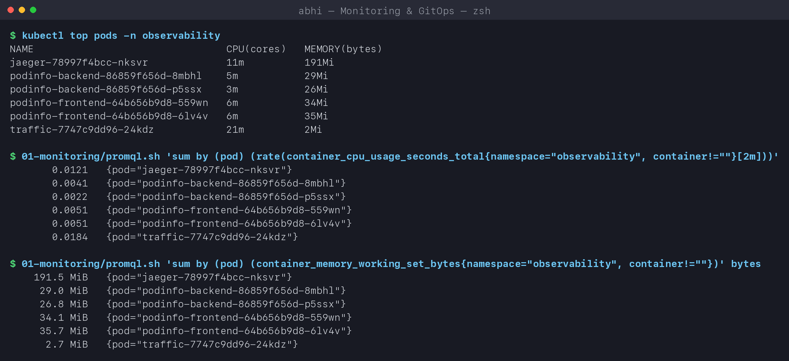

Node level, from node-exporter:

```text
$ kubectl top nodes
NAME                        CPU(cores)   CPU(%)   MEMORY(bytes)   MEMORY(%)
abhi-devops-control-plane   419m         2%       2461Mi          10%
abhi-devops-worker          667m         4%       4098Mi          17%

$ 01-monitoring/promql.sh '100 * (1 - avg by (instance) (rate(node_cpu_seconds_total{mode="idle"}[2m])))' percent
     19.2 %   {instance="172.19.0.2:9100"}
     19.0 %   {instance="172.19.0.3:9100"}

$ 01-monitoring/promql.sh '100 * (1 - sum by (instance) (node_memory_MemAvailable_bytes) / sum by (instance) (node_memory_MemTotal_bytes))' percent
     44.3 %   {instance="172.19.0.2:9100"}
     44.3 %   {instance="172.19.0.3:9100"}
```

Here the two sources **disagree**, and the reason was interesting: kind "nodes" are Docker
containers on one Docker Desktop VM, so node-exporter sees the whole VM (all containers,
including other clusters running on my laptop), while `kubectl top` only counts what the
kubelet attributes to that node. Both nodes even report the same 44.3% memory - it is the
same VM.

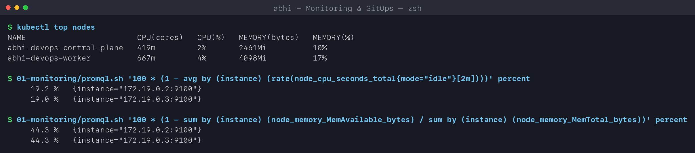

CPU per pod over time in the Prometheus graph view (the green line at 0.2 cores is the
`cpu-hog` Pod from 1.9, the bump around 18:43 is the load spike from 1.10):

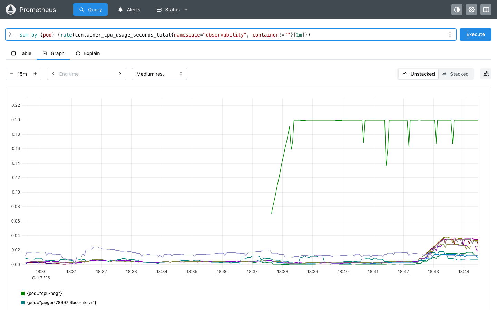

### 1.6 Application health

Health is checked at three levels: the probes Kubernetes runs, the app's own health
endpoints, and Kubernetes object state from kube-state-metrics.

```text
$ kubectl describe pod -n observability -l tier=backend | grep -E '^Name:|Liveness|Readiness'
Name:             podinfo-backend-86859f656d-8mbhl
    Liveness:   http-get http://:http/healthz delay=0s timeout=1s period=10s #success=1 #failure=3
    Readiness:  http-get http://:http/readyz delay=0s timeout=1s period=10s #success=1 #failure=3
Name:             podinfo-backend-86859f656d-p5ssx
    Liveness:   http-get http://:http/healthz delay=0s timeout=1s period=10s #success=1 #failure=3
    Readiness:  http-get http://:http/readyz delay=0s timeout=1s period=10s #success=1 #failure=3

$ kubectl -n observability exec deploy/traffic -- sh -c 'curl -s -w " %{http_code}\n" http://podinfo-backend:9898/healthz; curl -s -w " %{http_code}\n" http://podinfo-backend:9898/readyz'
{
  "status": "OK"
} 200
{
  "status": "OK"
} 200

$ 01-monitoring/promql.sh 'sum by (deployment) (kube_deployment_status_replicas_available{namespace="observability"})'
       1.0000   {deployment="jaeger"}
       2.0000   {deployment="podinfo-backend"}
       2.0000   {deployment="podinfo-frontend"}
       1.0000   {deployment="traffic"}
```

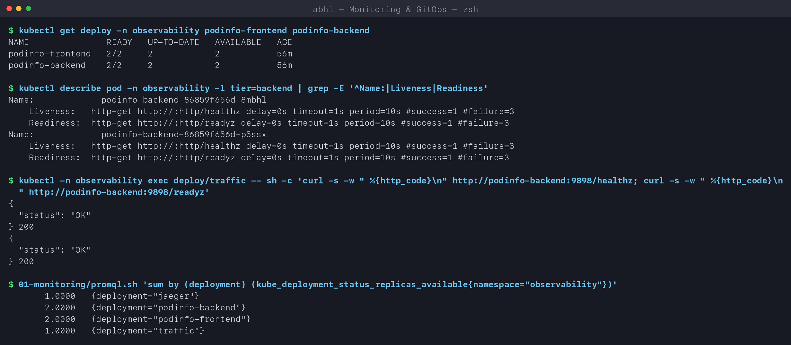

### 1.7 Logs

**With kubectl.** podinfo logs one JSON line per request at debug level. `--prefix` shows
which Pod each line came from, and because the logs are structured I can count by message:

```text
$ kubectl logs -n observability -l tier=backend --prefix --tail=2 | cut -c1-190
[pod/podinfo-backend-86859f656d-8mbhl/podinfo] {"level":"debug","ts":"2026-10-07T18:59:13.818Z","caller":"http/logging.go:35","msg":"request started","proto":"HTTP/1.1","
[pod/podinfo-backend-86859f656d-8mbhl/podinfo] {"level":"debug","ts":"2026-10-07T18:59:14.500Z","caller":"http/logging.go:35","msg":"request started","proto":"HTTP/1.1","
[pod/podinfo-backend-86859f656d-p5ssx/podinfo] {"level":"debug","ts":"2026-10-07T18:59:14.607Z","caller":"http/logging.go:35","msg":"request started","proto":"HTTP/1.1","
[pod/podinfo-backend-86859f656d-p5ssx/podinfo] {"level":"debug","ts":"2026-10-07T18:59:14.721Z","caller":"http/logging.go:35","msg":"request started","proto":"HTTP/1.1","

$ kubectl logs -n observability deploy/podinfo-frontend --since=1m | grep -o '"msg":"[^"]*"' | sort | uniq -c | sort -rn
Found 2 pods, using pod/podinfo-frontend-64b656b9d8-6lv4v
 116 "msg":"request started"
  54 "msg":"payload received from backend"
```

Note the `Found 2 pods, using pod/...` line: `kubectl logs deploy/x` only reads **one** Pod.
That is exactly the limitation central logging solves.

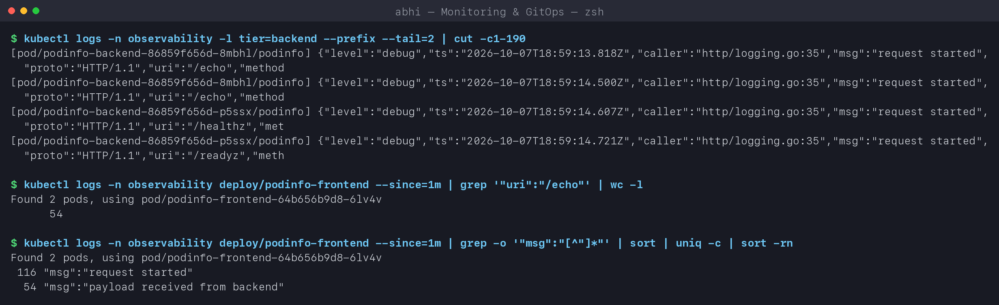

**With Loki.** Alloy tails every container's log file on each node, attaches `namespace`,
`pod`, `container`, `app` and `tier` labels, and pushes to Loki. [logql.sh](01-monitoring/logql.sh)
queries Loki the same way promql.sh queries Prometheus:

```text
$ 01-monitoring/logql.sh '{namespace="observability", tier="backend"} |= "/echo"' 4 | cut -c1-200
00:29:12 podinfo-backend-86859f656d-8mbhl   {"level":"debug","ts":"2026-10-07T18:59:12.576Z","caller":"http/logging.go:35","msg":"request started","proto":"HTTP/1.1","uri":"/echo","method":"POST
00:29:13 podinfo-backend-86859f656d-8mbhl   {"level":"debug","ts":"2026-10-07T18:59:13.143Z",...
00:29:14 podinfo-backend-86859f656d-8mbhl   {"level":"debug","ts":"2026-10-07T18:59:14.500Z",...

$ 01-monitoring/logql.sh 'sum by (namespace) (count_over_time({namespace=~".+"}[5m]))'
       352   {namespace="argocd"}
         2   {namespace="gitops-demo"}
       246   {namespace="kube-system"}
       447   {namespace="monitoring"}
      2242   {namespace="observability"}
```

The second query turns logs into a metric (log lines per namespace in the last 5 minutes) -
handy for spotting a Pod that suddenly gets noisy.

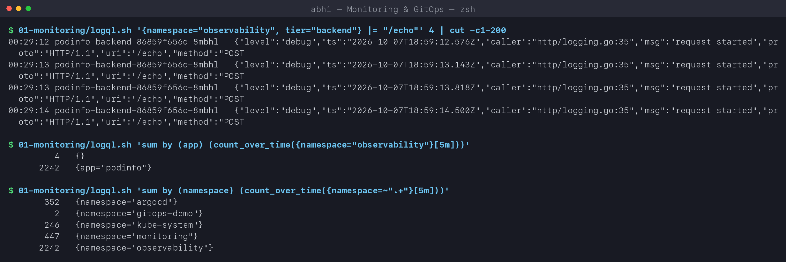

The same stream in Grafana Explore with the Loki data source (log volume histogram on top,
parsed JSON fields below - note the `trace_id` field, used in Task 2):

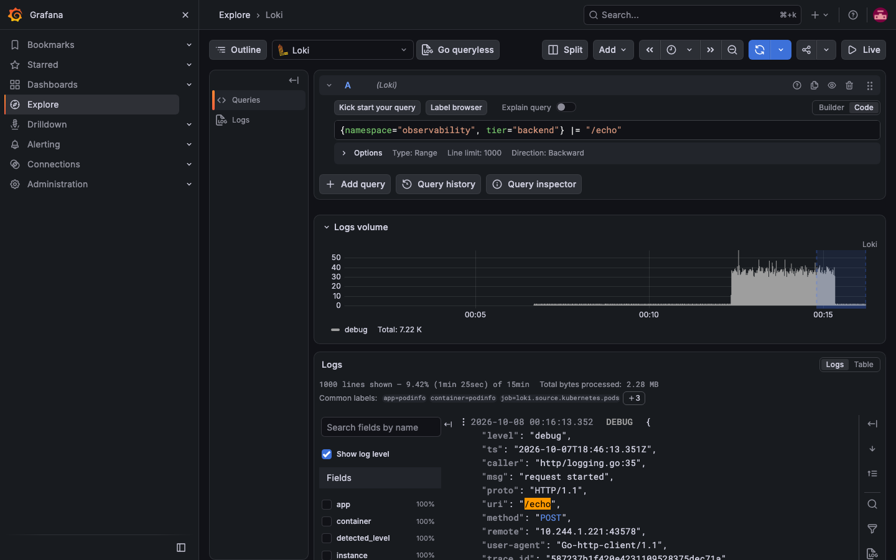

### 1.8 Alert rules

[alert-rules.yaml](01-monitoring/alert-rules.yaml) is a `PrometheusRule` with five alerts:

| Alert | Expression (short) | for | Severity |
|---|---|---|---|
| `PodinfoDeploymentDown` | `kube_deployment_status_replicas_available{deployment=~"podinfo-.*"} == 0` | 30s | critical |
| `PodinfoTargetMissing` | `absent(up{service="podinfo-backend"} == 1)` | 30s | critical |
| `ContainerHighCPU` | CPU usage / CPU limit > 0.8 | 1m | warning |
| `ContainerHighMemory` | working set / memory limit > 0.8 | 2m | warning |
| `PodinfoHighRequestRate` | `sum by (service) (rate(http_requests_total[1m])) > 20` | 30s | info |

The `for:` clause means the condition has to stay true for that long - the alert goes
**inactive -> pending -> firing**, which filters out one-scrape blips.

```text
$ kubectl get prometheusrule -n observability
NAME             AGE
podinfo-alerts   41m

$ 01-monitoring/alerts.sh rules
observability.resources  ContainerHighCPU         for=60s  state=inactive health=ok
observability.resources  ContainerHighMemory      for=120s  state=inactive health=ok
podinfo.health           PodinfoDeploymentDown    for=30s  state=inactive health=ok
podinfo.health           PodinfoTargetMissing     for=30s  state=inactive health=ok
podinfo.traffic          PodinfoHighRequestRate   for=30s  state=inactive health=ok

$ 01-monitoring/alerts.sh prometheus
  no pending/firing alerts in namespace observability
```

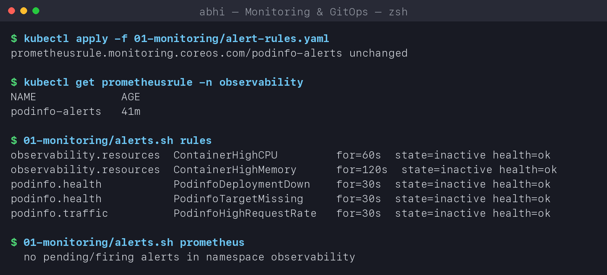

### 1.9 Making alerts fire

**Alert 1 - the app goes down.** I scaled the backend to 0:

```text
$ kubectl scale deploy podinfo-backend -n observability --replicas=0
deployment.apps/podinfo-backend scaled

$ 01-monitoring/alerts.sh prometheus     # 'pending' = condition true, waiting for the for: 30s window
PodinfoDeploymentDown    pending  critical podinfo-backend                    since 18:59:41  value=0.00

$ 01-monitoring/alerts.sh prometheus
PodinfoDeploymentDown    firing   critical podinfo-backend                    since 18:59:41  value=0.00
PodinfoTargetMissing     firing   critical                                    since 18:59:56  value=1.00

$ 01-monitoring/alerts.sh alertmanager
PodinfoTargetMissing     active  critical Prometheus cannot scrape any podinfo-backend Pod
PodinfoDeploymentDown    active  critical podinfo-backend has no available replicas
```

Prometheus evaluates the rules; Alertmanager receives the firing alerts and is the part that
would route them to Slack/email/PagerDuty (and group, deduplicate and silence them).

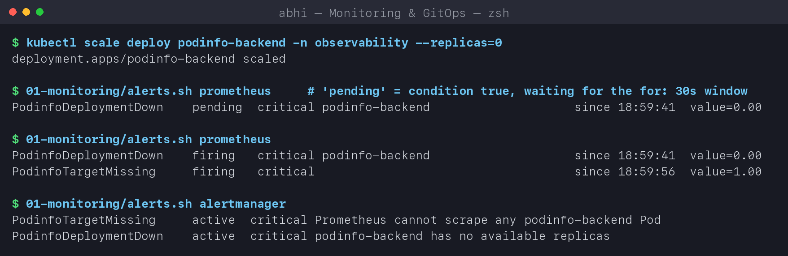

The Prometheus Alerts page at the same moment, with the rule expanded:

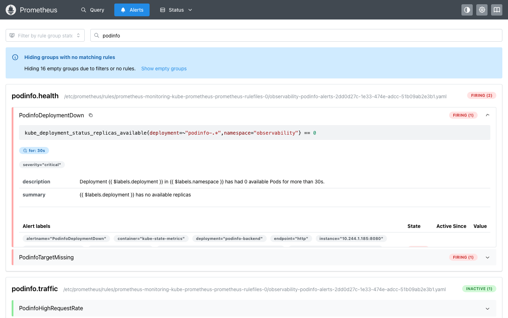

Scaling back resolves both:

```text
$ kubectl scale deploy podinfo-backend -n observability --replicas=2
deployment.apps/podinfo-backend scaled

$ kubectl get deploy podinfo-backend -n observability
NAME              READY   UP-TO-DATE   AVAILABLE   AGE
podinfo-backend   2/2     2            2           58m

$ 01-monitoring/alerts.sh prometheus
  no pending/firing alerts in namespace observability
```

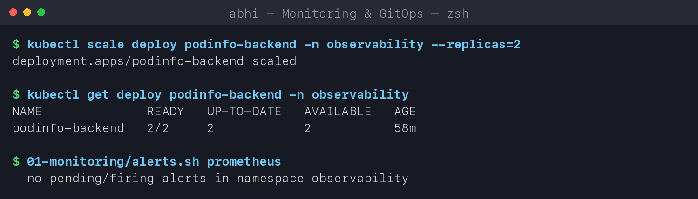

**Alert 2 - high CPU.** [cpu-hog.yaml](01-monitoring/cpu-hog.yaml) is a busybox busy loop
with a 200m CPU limit, so it sits at 100% of its limit:

```text
$ kubectl apply -f 01-monitoring/cpu-hog.yaml
pod/cpu-hog created

$ kubectl top pod cpu-hog -n observability
NAME      CPU(cores)   MEMORY(bytes)
cpu-hog   201m         0Mi

$ 01-monitoring/promql.sh 'sum by (pod) (rate(container_cpu_usage_seconds_total{namespace="observability", pod="cpu-hog", container!=""}[1m])) / 0.2 * 100' percent
    100.0 %   {pod="cpu-hog"}

$ 01-monitoring/alerts.sh prometheus
CPUThrottlingHigh        pending  info     cpu-hog                            since 19:01:25  value=0.99
ContainerHighCPU         firing   warning  cpu-hog                            since 19:02:50  value=1.00
InfoInhibitor            firing   none                                        since 19:01:34  value=1.00
```

My `ContainerHighCPU` fired, and so did the stack's built-in `CPUThrottlingHigh` (the kernel
is throttling the container because it keeps hitting its limit).

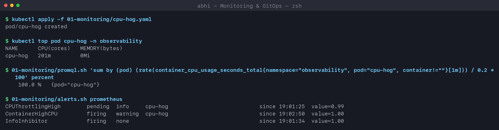

**Alert 3 - traffic spike.** [load-spike.yaml](01-monitoring/load-spike.yaml) is a Job with 4
parallel curl loops for 3 minutes:

```text
$ kubectl apply -f 01-monitoring/load-spike.yaml
job.batch/load-spike created

$ 01-monitoring/promql.sh 'sum by (service) (rate(http_requests_total{namespace="observability"}[1m]))'
      35.9321   {service="podinfo-backend"}
      38.2440   {service="podinfo-frontend"}

$ 01-monitoring/alerts.sh prometheus
CPUThrottlingHigh        pending  info     cpu-hog                            since 19:01:25  value=1.00
PodinfoHighRequestRate   firing   info     podinfo-frontend                   since 19:04:31  value=38.35
PodinfoHighRequestRate   firing   info     podinfo-backend                    since 19:04:31  value=35.93

$ 01-monitoring/alerts.sh alertmanager
PodinfoHighRequestRate   suppressed info     podinfo-backend is serving 35.93 req/s
InfoInhibitor            suppressed none     Info-level alert inhibition.
PodinfoHighRequestRate   suppressed info     podinfo-frontend is serving 38.35 req/s
```

Something I did not expect: Alertmanager marked my info alerts **suppressed**. The
kube-prometheus-stack ships an inhibition rule plus an `InfoInhibitor` alert whose job is to
silence `severity=info` alerts so they never page anyone - info alerts are meant for
dashboards only. In my first run (before `InfoInhibitor` had started firing) the same alerts
showed as `active`, which is what the Alertmanager screenshot below shows. So severity labels
are not cosmetic; they decide routing.

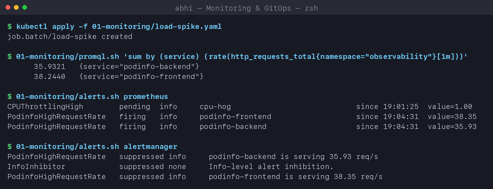

Alertmanager UI filtered to my namespace, from that first run (the high request rate alerts
and the CPU alert together):

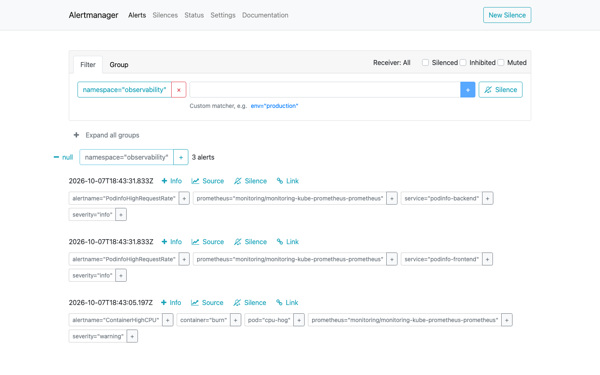

### 1.10 Grafana dashboards

My dashboard is stored as a ConfigMap labelled `grafana_dashboard: "1"`. Grafana's sidecar
container watches for that label in all namespaces and loads the JSON automatically - so the
dashboard is code, versioned in Git, not something clicked together by hand.

```text
$ kubectl get configmap -A -l grafana_dashboard=1 | grep -E '^(NAMESPACE|observability)'
NAMESPACE       NAME                                                           DATA   AGE
observability   podinfo-dashboard                                              1      47m

$ kubectl logs -n monitoring deploy/monitoring-grafana -c grafana-sc-dashboard --tail=200 | grep -i podinfo | tail -2 | cut -c1-170
{"time": "2026-10-07T18:23:21.311596+00:00", "level": "INFO", "msg": "Writing /tmp/dashboards/podinfo-dashboard.json (ascii)"}
{"time": "2026-10-07T18:45:14.834607+00:00", "level": "INFO", "msg": "Writing /tmp/dashboards/podinfo-dashboard.json (ascii)"}
```

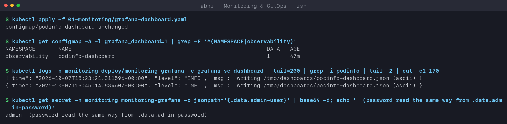

The dashboard (last 45 minutes): health stats on top (available replicas, targets up, firing
alerts - red because the CPU alert was firing), request rate with the two load spikes, p95
latency, CPU per Pod with the cpu-hog plateau at 0.2 cores, memory per Pod, and the live
Loki log panel at the bottom. Panels 1-7 come from Prometheus, the last one from Loki:

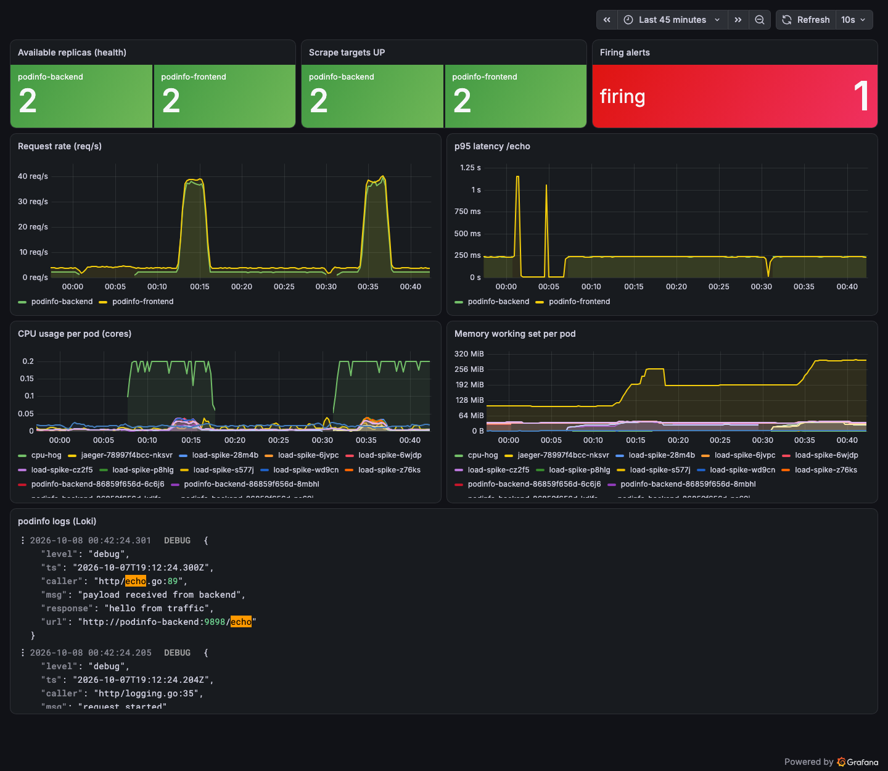

And one of the built-in dashboards that came with the chart, "Kubernetes / Compute Resources
/ Namespace (Pods)" for my namespace. It compares usage against **requests and limits**, which
shows the cpu-hog at 400% of its request and 100% of its limit, and Jaeger using 463% of its
memory request:

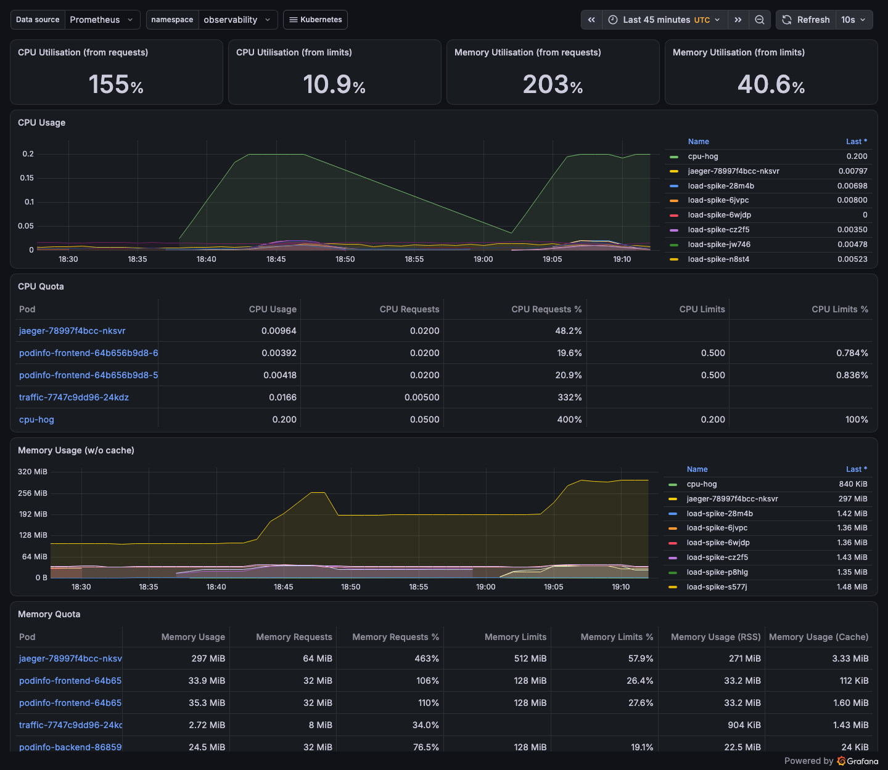

**What I understood:** monitoring is a pipeline - exporters and apps expose numbers,
Prometheus scrapes and stores them, rules turn them into alerts, Alertmanager decides who
gets told, and Grafana shows it all. With the Prometheus Operator every step of that pipeline
(what to scrape, what to alert on, what to draw) is a Kubernetes YAML object.

---

## Task 2: Observability

The written part (what each pillar is, why observability is needed, common tools, and how
observability works in Kubernetes) is in **[02-observability/README.md](02-observability/README.md)**.
Below is the hands-on part: tracing, and using all three pillars together.

### 2.1 Tracing setup

podinfo is instrumented with the OpenTelemetry SDK. Setting `--otel-service-name` turns it on
and the standard `OTEL_EXPORTER_OTLP_ENDPOINT` env var tells it where to send spans. The
receiver is **Jaeger v2** ([jaeger.yaml](02-observability/jaeger.yaml)), which is built on the
OpenTelemetry Collector and accepts OTLP on port 4317.

```text
$ kubectl -n observability get deploy podinfo-frontend -o jsonpath='{range .spec.template.spec.containers[0].command[*]}{@}{"\n"}{end}' | grep -E 'otel|backend'
--otel-service-name=podinfo-frontend
--backend-url=http://podinfo-backend:9898/echo

$ kubectl -n observability get deploy podinfo-frontend -o jsonpath='{range .spec.template.spec.containers[0].env[*]}{.name}={.value}{"\n"}{end}' | grep OTEL
OTEL_EXPORTER_OTLP_ENDPOINT=http://jaeger.observability:4317
OTEL_EXPORTER_OTLP_INSECURE=true

$ 02-observability/traces.sh services
podinfo-frontend
podinfo-backend
jaeger
```

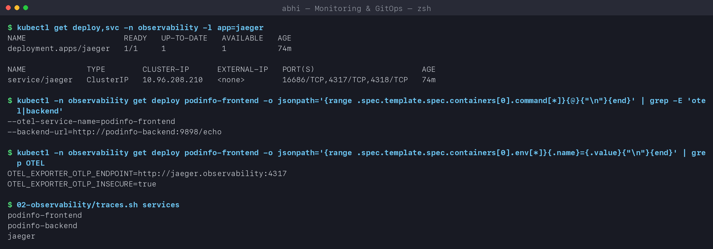

**A problem I hit:** the first time, both podinfo Pods logged
`unknown service opentelemetry.proto.collector.logs.v1.LogsService` every second. podinfo
exports OTLP **logs** as well as traces, but Jaeger only stores traces. Setting
`OTEL_LOGS_EXPORTER=none` did nothing (podinfo does not read it), so I gave Jaeger its own
config with an extra `logs` pipeline that uses the `nop` exporter - it accepts the logs and
drops them. The errors stopped and traces kept working.

### 2.2 One request across two services

[traces.sh](02-observability/traces.sh) fetches a trace from the Jaeger API and prints it as a
tree:

```text
$ 02-observability/traces.sh latest podinfo-frontend 'POST /echo'
traceID 0f95efb748b17bee1205d23cdd9c78ab  spans=9  services=['podinfo-backend', 'podinfo-frontend']
podinfo-frontend  POST /echo                   start=+   0.00ms  dur=  78.69ms  200
  podinfo-frontend  echoHandler                  start=+   0.05ms  dur=  78.58ms
    podinfo-frontend  HTTP POST                    start=+   0.17ms  dur=  78.38ms  202
      podinfo-backend   POST /echo                   start=+   0.61ms  dur=  77.60ms  202
        podinfo-backend   echoHandler                  start=+  78.08ms  dur=   0.10ms
    podinfo-frontend  http.getconn                 start=+   0.19ms  dur=   0.01ms
    podinfo-frontend  http.headers                 start=+   0.22ms  dur=   0.01ms
    podinfo-frontend  http.send                    start=+   0.23ms  dur=   0.03ms
    podinfo-frontend  http.receive                 start=+  78.39ms  dur=   0.14ms
```

Reading it: the frontend's outgoing `HTTP POST` became the parent of the backend's
`POST /echo` - the trace context crossed the network in the `traceparent` header. Almost the
entire 78 ms is the gap between the backend receiving the request (+0.61 ms) and its
`echoHandler` starting (+78.08 ms): that is the random delay. Metrics told me "p95 is ~236 ms",
the trace tells me exactly **where** those milliseconds go.

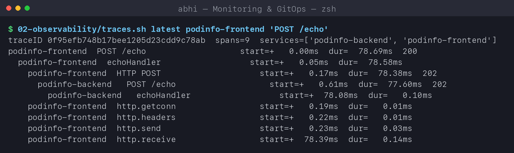

The same kind of trace in the Jaeger UI - the search page (one dot per request, 9 spans
across 2 services each):

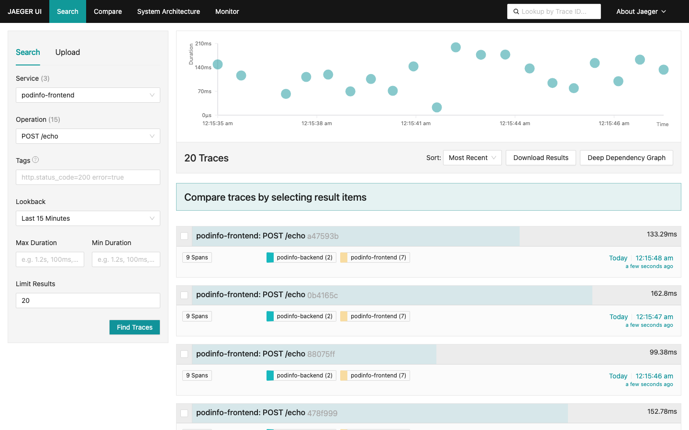

and one trace's timeline, where the backend's long wait before its tiny handler span is
obvious at a glance:

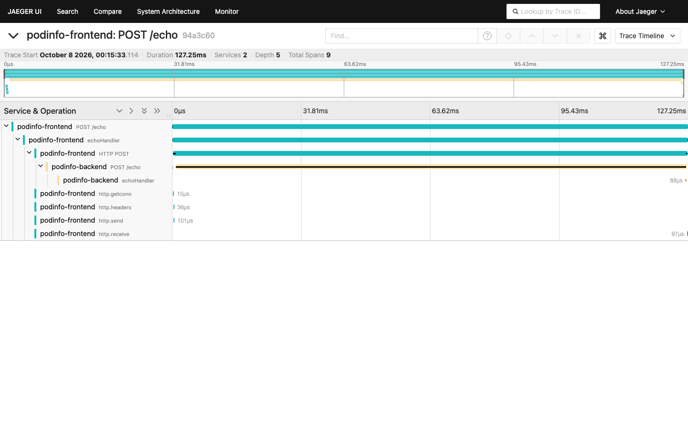

### 2.3 The three pillars together

This is the workflow I would actually use while debugging: start from a log line, jump to its
trace, check the metric for scale.

```text
$ kubectl logs -n observability -l tier=backend --since=2m --tail=-1 | grep 64c3f43e4a41349eb4950328b22ff6aa | grep -oE '"(ts|msg|uri|method|trace_id)":"[^"]*"' | paste -sd' ' -    # 1) a LOG line carries the trace_id
"ts":"2026-10-07T19:16:57.762Z" "msg":"request started" "uri":"/echo" "method":"POST" "trace_id":"64c3f43e4a41349eb4950328b22ff6aa"

$ 02-observability/traces.sh trace 64c3f43e4a41349eb4950328b22ff6aa    # 2) the same id opens the TRACE in Jaeger
traceID 64c3f43e4a41349eb4950328b22ff6aa  spans=9  services=['podinfo-backend', 'podinfo-frontend']
podinfo-frontend  POST /echo                   start=+   0.00ms  dur= 126.07ms  200
  podinfo-frontend  echoHandler                  start=+   0.14ms  dur= 125.88ms
    podinfo-frontend  HTTP POST                    start=+   0.33ms  dur= 125.51ms  202
      podinfo-backend   POST /echo                   start=+   0.87ms  dur= 124.68ms  202
        podinfo-backend   echoHandler                  start=+ 125.39ms  dur=   0.12ms
    podinfo-frontend  http.getconn                 start=+   0.42ms  dur=   0.05ms
    podinfo-frontend  http.headers                 start=+   0.55ms  dur=   0.04ms
    podinfo-frontend  http.send                    start=+   0.61ms  dur=   0.06ms
    podinfo-frontend  http.receive                 start=+ 125.70ms  dur=   0.13ms

$ 01-monitoring/promql.sh 'sum by (service) (rate(http_request_duration_seconds_count{namespace="observability", path="echo"}[1m]))'    # 3) METRICS show the volume
       1.5999   {service="podinfo-backend"}
       1.5555   {service="podinfo-frontend"}
```

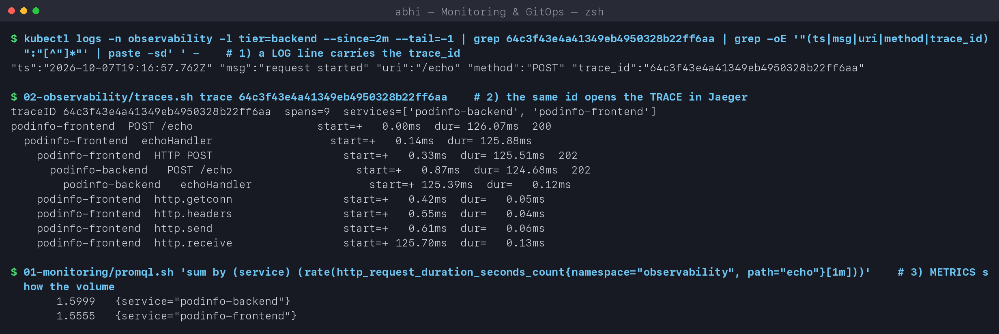

A gotcha I hit here: my first version used `kubectl logs -l tier=backend --since=5m` and
found nothing. With a label selector `kubectl logs` defaults to `--tail=10` per Pod even when
`--since` is given, so I had to add `--tail=-1`.

**What I understood:** each pillar answers a different question and none is enough alone.
The `trace_id` that podinfo writes into every log line is what links logs to traces, and the
shared Kubernetes labels (`namespace`, `pod`, `app`) link metrics to logs.

---

## Task 3: GitOps with Argo CD

### 3.1 The idea

**GitOps** means the desired state of the system is declared in Git, and an agent running
**inside** the cluster continuously makes the cluster match Git.

| Principle | What it means | In my demo |
|---|---|---|
| **Git as the source of truth** | The repo, not someone's laptop or a CI job, defines what should run. Every change is a commit (reviewed, audited, revertible). | [03-gitops/app/](03-gitops/app) in this repo |
| **Declarative configuration** | Describe *what* you want (3 replicas of image X), not the commands to get there. | plain Kubernetes YAML |
| **Pull, not push** | The cluster pulls from Git; CI never needs cluster credentials. | Argo CD polls GitHub every 60s |
| **Continuous reconciliation** | A control loop compares desired (Git) and live (cluster) state forever, and fixes any difference - including manual changes (drift). | `automated` + `selfHeal` + `prune` |

GitOps workflow:

```text
 developer --commit/PR--> Git repo (main) <---- poll every 60s ---- Argo CD (in cluster)
                                                                      | compare desired vs live
                                                                      | OutOfSync -> sync (kubectl apply)
                                                                      v
                                                         Kubernetes: namespace gitops-demo
   kubectl edit / scale (drift) ---------------------------------->  ^ selfHeal puts it back
   rollback = git revert -> commit -> same loop
```

Compared to the CI/CD pipelines from earlier sessions (where the pipeline runs
`kubectl apply`), with GitOps the pipeline's job ends at "update the YAML in Git"; deployment
is done by the cluster itself, and the cluster keeps correcting itself afterwards.

### 3.2 Install Argo CD

Installed with Helm ([argocd-values.yaml](03-gitops/argocd-values.yaml): no Dex/SSO, no
notifications, plain HTTP behind my port-forward, Git polling every 60s instead of 120s).

```text
$ helm upgrade --install argocd argo/argo-cd --version 10.10.0 -n argocd --create-namespace -f 03-gitops/argocd-values.yaml --wait --timeout 10m | head -4
Release "argocd" has been upgraded. Happy Helming!
NAME: argocd
LAST DEPLOYED: Thu Oct  8 00:42:26 2026
NAMESPACE: argocd

$ kubectl get pods -n argocd
NAME                                               READY   STATUS      RESTARTS   AGE
argocd-application-controller-0                    1/1     Running     0          79m
argocd-applicationset-controller-5c9d6d98c-8z7h4   1/1     Running     0          79m
argocd-redis-757969f6f8-zz698                      1/1     Running     0          79m
argocd-redis-secret-init-54nh9                     0/1     Completed   0          5s
argocd-repo-server-5c7897fbdc-dv2k4                1/1     Running     0          79m
argocd-server-678f8dc669-whkbm                     1/1     Running     0          79m

$ argocd login --username admin --password "$(kubectl -n argocd get secret argocd-initial-admin-secret -o jsonpath='{.data.password}' | base64 -d)" 2>&1 | tail -1
Context 'port-forward' updated

$ argocd version 2>/dev/null | grep -E '^argocd|argocd-server'
argocd: v3.5.4+d6d5b24.dirty
argocd-server: v3.5.4
```

- **repo-server** clones Git and renders manifests, **application-controller** is the
  reconciliation loop, **server** is the API/UI.

**A problem I hit:** `argocd login` through a normal `kubectl port-forward` failed with
`connection reset by peer` and killed the port-forward each time. The CLI talks gRPC over
HTTP/2 and that connection kept getting reset (plain HTTP/1.1 like the web UI and `curl`
worked fine). The fix was to let the CLI open its own port-forward:
`ARGOCD_OPTS="--port-forward --port-forward-namespace argocd --plaintext"`, which is what
`run-labs.sh` exports.

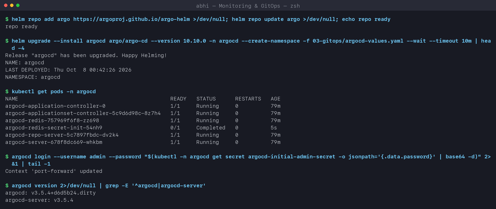

### 3.3 The Application - initial sync

[argocd-application.yaml](03-gitops/argocd-application.yaml) points Argo CD at **this GitHub
repo**. The path contains spaces (`Monitoring Observability and GitOps/...`); I tested this
first and Argo CD handles it without any escaping.

```yaml
spec:
  project: default
  source:
    repoURL: https://github.com/AbhiGandhi02/Devops-Assignment.git
    targetRevision: main
    path: Monitoring Observability and GitOps/03-gitops/app   # spaces in the path work fine
  destination:
    server: https://kubernetes.default.svc
    namespace: gitops-demo
  syncPolicy:
    automated:
      prune: true      # delete resources that were removed from Git
      selfHeal: true   # undo manual changes made with kubectl
    syncOptions:
      - CreateNamespace=true
```

```text
$ kubectl get ns gitops-demo
Error from server (NotFound): namespaces "gitops-demo" not found

$ kubectl apply -f 03-gitops/argocd-application.yaml
application.argoproj.io/guestbook created
```

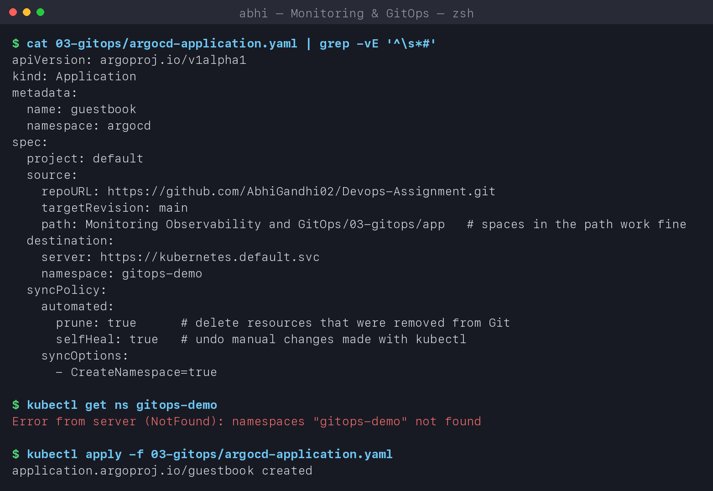

I only applied the Application object. Everything else came from Git:

```text
$ argocd app get guestbook | grep -vE '^(Server|URL|Target|Repo|SyncWindow|Sync Policy|Path|Project|Namespace|Name):'
Source:
- Repo:             https://github.com/AbhiGandhi02/Devops-Assignment.git
  Target:           main
  Path:             Monitoring Observability and GitOps/03-gitops/app
Sync Status:        Synced to main (a7b8d50)
Health Status:      Healthy

GROUP  KIND        NAMESPACE    NAME              STATUS   HEALTH   HOOK  MESSAGE
       Namespace   gitops-demo  gitops-demo       Running  Synced         namespace/gitops-demo created
       ConfigMap   gitops-demo  guestbook-config  Synced                  configmap/guestbook-config created
       Service     gitops-demo  guestbook         Synced   Healthy        service/guestbook created
apps   Deployment  gitops-demo  guestbook         Synced   Healthy        deployment.apps/guestbook created
       Namespace                gitops-demo       Synced

$ kubectl get deploy,svc,cm -n gitops-demo
NAME                        READY   UP-TO-DATE   AVAILABLE   AGE
deployment.apps/guestbook   2/2     2            2           3s

NAME                TYPE        CLUSTER-IP      EXTERNAL-IP   PORT(S)   AGE
service/guestbook   ClusterIP   10.96.117.109   <none>        80/TCP    3s

NAME                         DATA   AGE
configmap/guestbook-config   2      3s
configmap/kube-root-ca.crt   1      3s
```

`a7b8d50` is simply the newest commit on `main` at that moment (classmates' agents push to the
same repo); Argo CD always tracks the tip of the branch, and my folder in it.

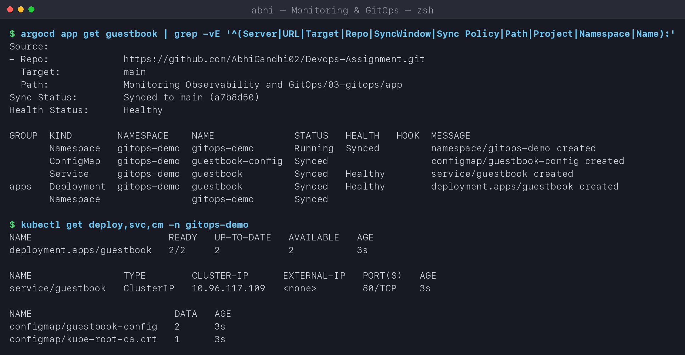

The application tree in the Argo CD UI (Application -> Namespace/ConfigMap/Service/
Deployment -> ReplicaSet -> 2 Pods, all Synced and Healthy):

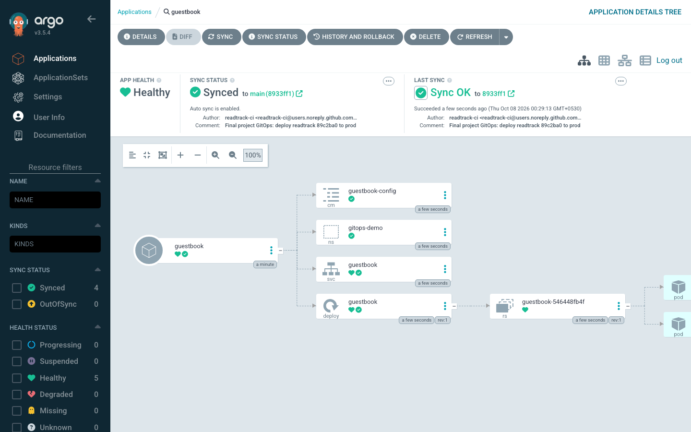

### 3.4 Change Git -> cluster follows

I changed the Deployment in Git (2 -> 3 replicas and message v1 -> v2), committed and pushed.
**No** `kubectl` and **no** `argocd sync`:

```text
$ git diff -U0 -- 03-gitops/app/deployment.yaml | grep -E '^[-+] '
-  replicas: 2
+  replicas: 3
-              value: "Deployed by Argo CD from Git - v1"
+              value: "Deployed by Argo CD from Git - v2"

$ git commit -q -m 'GitOps demo: scale guestbook to 3 replicas and bump message to v2' -- 03-gitops/app/deployment.yaml && push_main && git log -1 --oneline
f51850c GitOps demo: scale guestbook to 3 replicas and bump message to v2

$ wait_argo_rev f51850c51506440510a6f9afac1a30f490cfbc64
Argo CD synced main@f51850c (contains f51850c) after 84s - no manual sync command
```

84 seconds = up to 60s polling interval + some jitter + the rollout.

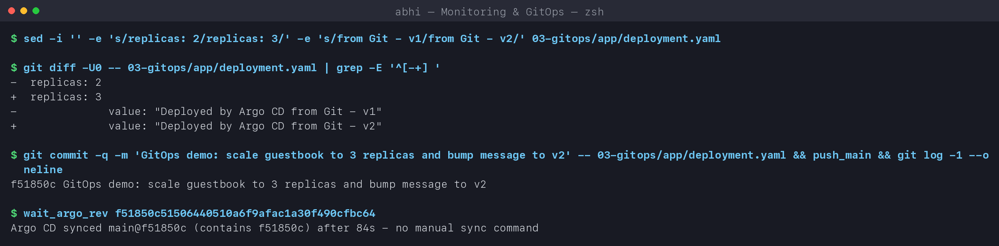

```text
$ kubectl get deploy guestbook -n gitops-demo
NAME        READY   UP-TO-DATE   AVAILABLE   AGE
guestbook   3/3     3            3           93s

$ kubectl -n gitops-demo exec deploy/guestbook -- curl -s localhost:9898 | grep message
  "message": "Deployed by Argo CD from Git - v2",

$ argocd app history guestbook
SOURCE  https://github.com/AbhiGandhi02/Devops-Assignment.git
ID      DATE                           REVISION
0       2026-10-08 00:42:36 +0530 IST  main (a7b8d50)
1       2026-10-08 00:43:56 +0530 IST  main (f51850c)
```

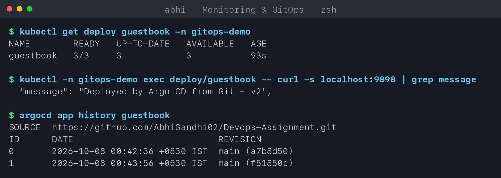

The UI after the change: synced to my commit `f51850c` (author and message shown), a new
ReplicaSet with 3 Pods, and the old ReplicaSet scaled to 0:

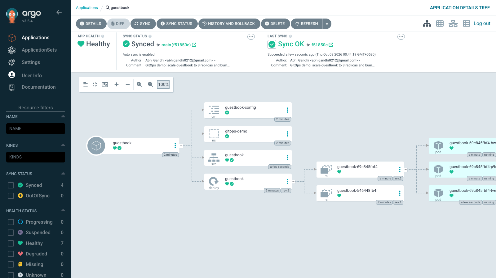

### 3.5 Drift -> self-heal

Now the opposite: change the cluster by hand and see Git win.

```text
$ kubectl scale deploy guestbook -n gitops-demo --replicas=6    # manual change = drift from Git
deployment.apps/guestbook scaled

$ kubectl get deploy guestbook -n gitops-demo
NAME        READY   UP-TO-DATE   AVAILABLE   AGE
guestbook   3/6     3            3           94s

$ kubectl get deploy guestbook -n gitops-demo    # Argo CD reverted it to the 3 in Git
NAME        READY   UP-TO-DATE   AVAILABLE   AGE
guestbook   3/3     3            3           102s

$ kubectl delete svc guestbook -n gitops-demo
service "guestbook" deleted from gitops-demo namespace

$ kubectl get svc guestbook -n gitops-demo    # deleted resource re-created from Git
NAME        TYPE        CLUSTER-IP     EXTERNAL-IP   PORT(S)   AGE
guestbook   ClusterIP   10.96.27.195   <none>        80/TCP    7s
```

Within 8 seconds the extra replicas were gone and the deleted Service was back (with a new
ClusterIP - it is a brand new object, created from the YAML in Git). Self-heal reacts to
cluster **events** (Argo CD watches the resources), so it is much faster than the 60s Git poll.

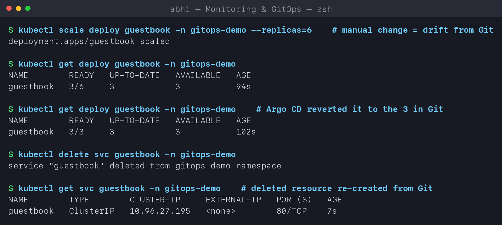

Argo CD's own events show each correction as an automated sync:

```text
$ kubectl get events -n argocd --field-selector involvedObject.name=guestbook --sort-by=.lastTimestamp -o custom-columns=REASON:.reason,MESSAGE:.message | tail -6
ResourceUpdated      Updated sync status: OutOfSync -> Synced
ResourceUpdated      Updated health status: Progressing -> Healthy
OperationStarted     Initiated automated sync to 'f51850c51506440510a6f9afac1a30f490cfbc64'
ResourceUpdated      Updated sync status: Synced -> OutOfSync
OperationCompleted   Partial sync operation to f51850c51506440510a6f9afac1a30f490cfbc64 succeeded
ResourceUpdated      Updated sync status: OutOfSync -> Synced
```

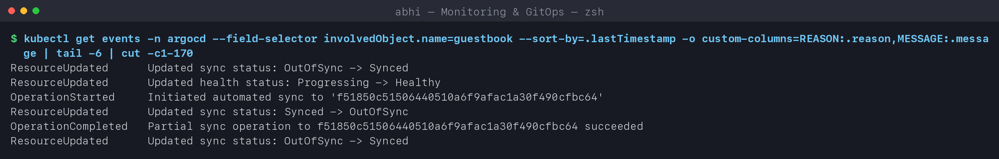

### 3.6 Rollback = git revert

In GitOps a rollback is just another commit. I reverted my change commit and pushed:

```text
$ git revert --no-edit f51850c51506440510a6f9afac1a30f490cfbc64 >/dev/null && push_main && git log -1 --oneline
7d4b10b Revert "GitOps demo: scale guestbook to 3 replicas and bump message to v2"

$ wait_argo_rev 7d4b10b32a82fa31e9f9a7bd7fdd0d993ad22eb6
Argo CD synced main@7d4b10b (contains 7d4b10b) after 80s - no manual sync command

$ kubectl get deploy guestbook -n gitops-demo
NAME        READY   UP-TO-DATE   AVAILABLE   AGE
guestbook   2/2     2            2           3m16s

$ kubectl -n gitops-demo exec deploy/guestbook -- curl -s localhost:9898 | grep message
  "message": "Deployed by Argo CD from Git - v1",

$ argocd app history guestbook
SOURCE  https://github.com/AbhiGandhi02/Devops-Assignment.git
ID      DATE                           REVISION
0       2026-10-08 00:42:36 +0530 IST  main (a7b8d50)
1       2026-10-08 00:43:56 +0530 IST  main (f51850c)
2       2026-10-08 00:45:40 +0530 IST  main (7d4b10b)

$ argocd app list | cut -c1-120
NAME              CLUSTER                         NAMESPACE    PROJECT  STATUS  HEALTH   SYNCPOLICY  CONDITIONS  REPO
argocd/guestbook  https://kubernetes.default.svc  gitops-demo  default  Synced  Healthy  Auto-Prune  <none>      https:/
```

Back to 2 replicas and v1, and both the change and the undo are permanently visible in `git
log` and in Argo CD's history. Argo CD also has a "Rollback" button, but with auto-sync on it
would be overwritten by Git on the next poll - the correct GitOps rollback is in Git.

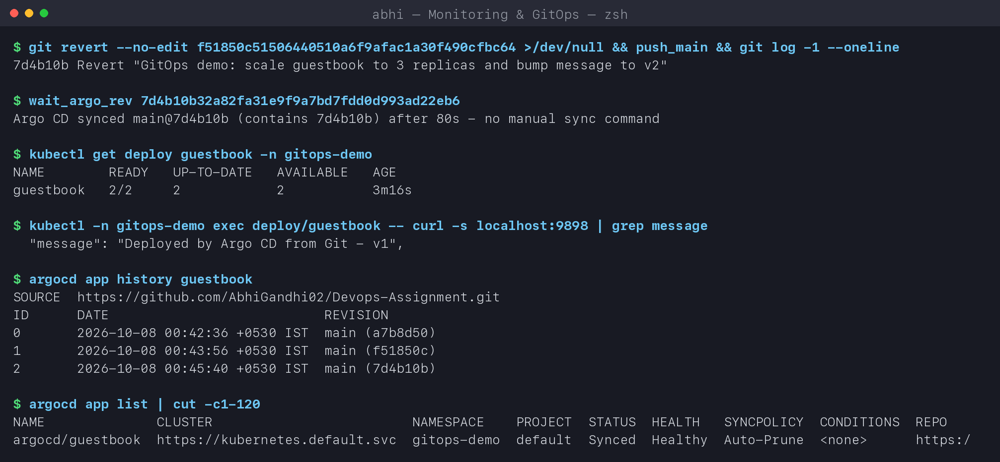

History and rollback panel in the UI (each entry is a Git revision, all "Initiated by:
automated sync policy"):

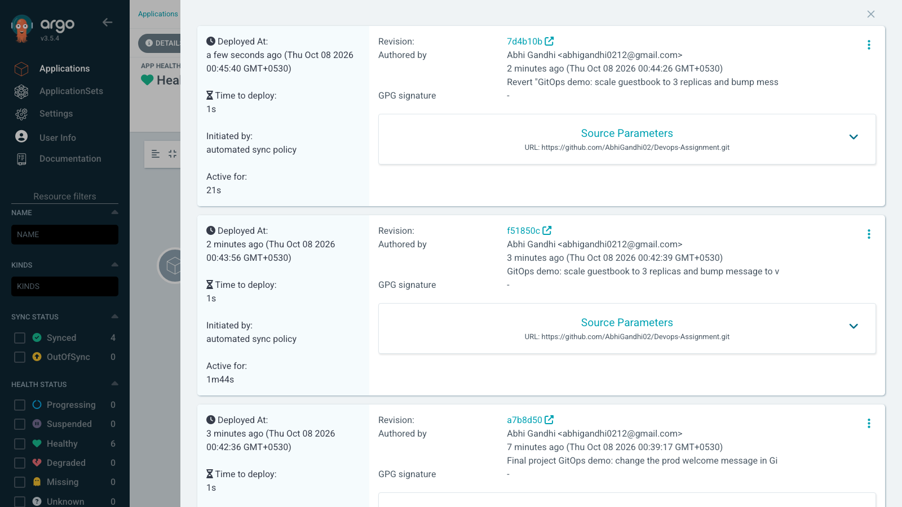

**Two bugs I had to fix in my own script** (both visible as extra commits in the repo's
history, `248ea39`/`0a37940` and `10436c8`/`f5fb525`, from my earlier attempts):

1. My first `wait_argo_rev` waited for Argo CD's synced revision to **equal** my commit. But
   another student's commit landed on `main` right after my revert, Argo CD synced *that*
   (which already contains my revert), and my loop waited forever. The fix: wait until the
   synced revision **contains** my commit (`git merge-base --is-ancestor`). With a shared
   repo "is my change deployed?" means "is my commit an ancestor of what is deployed?".
2. The next attempt printed `2/2` and `v1` right after a "synced" message, because Argo CD
   updates `status.sync.revision` before the sync operation has finished applying. The fix:
   also wait for `status.operationState.phase == Succeeded` for that revision, then
   `kubectl rollout status`.

**What I understood:** with GitOps the cluster is an output of Git, not something people
edit. Deploying, scaling and rolling back are all commits; anything done by hand is treated
as drift and undone. It also gives an audit trail for free - every change has an author, a
message and a revert.

---

## Clean up

Everything I created lives in my own namespaces, so cleanup is:

```bash
argocd app delete guestbook -y                      # cascade delete: Argo CD removes gitops-demo too
helm uninstall argocd -n argocd
kubectl delete -f 01-monitoring/demo-app.yaml       # observability namespace + app
helm uninstall alloy loki monitoring -n monitoring
```

## Key learnings

- **Monitoring tells me something is wrong; observability lets me find out why.** Metrics
  for alerting and trends, logs for the detail of one event, traces for where time goes
  across services. The `trace_id` inside log lines is what connects them.
- **`rate()` on counters, `histogram_quantile()` on histograms**, and `container!=""` when
  summing cAdvisor metrics, or every Pod is counted twice.
- **Use `for:` on alerts** so a single bad scrape doesn't page anyone, and remember severity
  labels drive routing - the stack's `InfoInhibitor` silenced my `info` alert in Alertmanager.
- `absent()` only copies labels from a plain selector; on a comparison it returns no labels,
  so I had to add the `namespace` label to that rule myself.
- **Probe, metric, and alert are three views of health**: probes act (restart / stop
  traffic), kube-state-metrics reports, and rules alert.
- Inside kind, node-exporter sees the whole Docker VM, so node numbers don't match
  `kubectl top` - always know what a metric is actually measuring.
- **Everything as code**: ServiceMonitors, PrometheusRules and Grafana dashboards are YAML
  objects, so they can live in Git and be deployed by Argo CD like the app itself.
- **GitOps = Git is the source of truth + continuous reconciliation.** Argo CD pulls from
  Git (no cluster credentials in CI), `selfHeal` undoes drift in seconds, `prune` removes what
  was deleted from Git, and a rollback is a `git revert`.
- In a shared repo, "deployed" means "my commit is an ancestor of the synced revision",
  not "the synced revision equals my commit".
