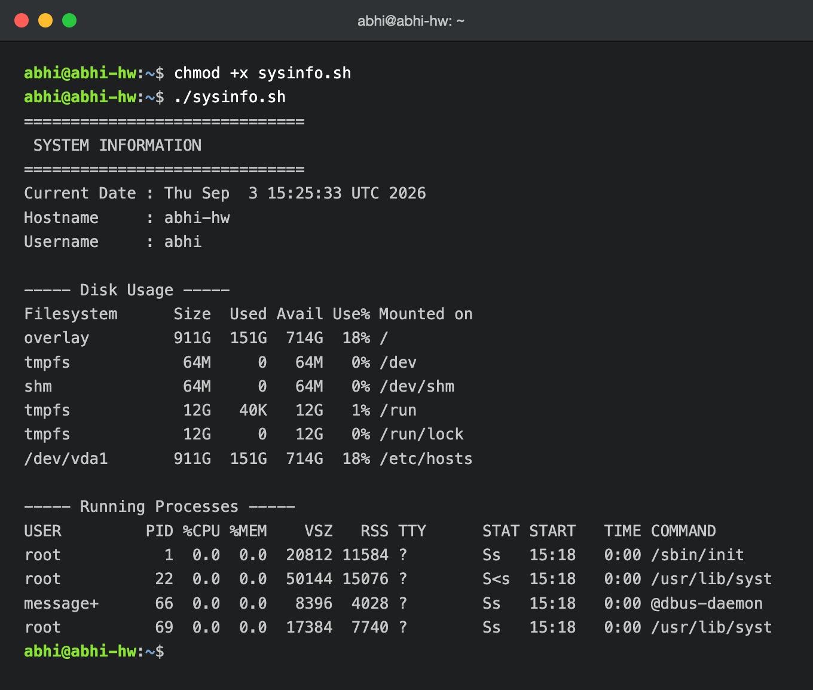
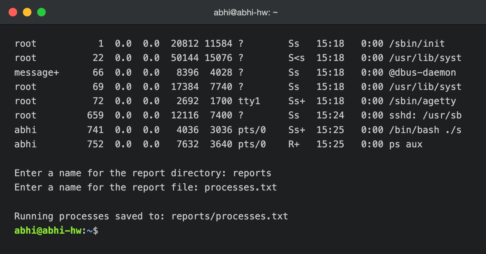
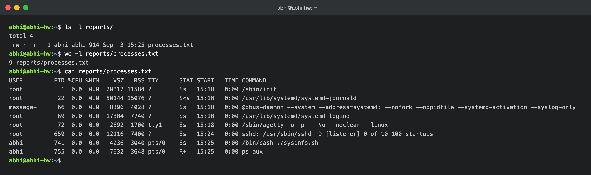

# System Information Script

A shell script that prints basic system information, takes input from the user, creates a directory and file, and saves the running processes into that file using output redirection.

## What the script does
- Prints the current date
- Prints the hostname
- Prints the username
- Prints the disk usage
- Prints the running processes
- Uses variables to store and reuse data
- Takes user input using `read -p`
- Creates a directory using `mkdir`
- Creates a file using `touch`
- Saves the running processes into the file using `>` output redirection

## Commands used
`mkdir`, `touch`, `echo`, `df`, `ps`, `read -p`, variables, `>` output redirection

## The script (sysinfo.sh)
```bash
#!/bin/bash
# System Information Script

# Store data in variables
CURRENT_DATE=$(date)
HOST_NAME=$(hostname)
USER_NAME=$(whoami)

echo "=============================="
echo " SYSTEM INFORMATION"
echo "=============================="

echo "Current Date : $CURRENT_DATE"
echo "Hostname     : $HOST_NAME"
echo "Username     : $USER_NAME"

echo ""
echo "----- Disk Usage -----"
df -h

echo ""
echo "----- Running Processes -----"
ps aux

# Take input from the user
read -p "Enter a name for the report directory: " DIR_NAME
read -p "Enter a name for the report file: " FILE_NAME

# Create directory and file
mkdir -p "$DIR_NAME"
touch "$DIR_NAME/$FILE_NAME"

# Store running processes in the file using output redirection
ps aux > "$DIR_NAME/$FILE_NAME"

echo ""
echo "Running processes saved to: $DIR_NAME/$FILE_NAME"
```

## How to run
```bash
chmod +x sysinfo.sh
./sysinfo.sh
```

## Sample output
```
==============================
 SYSTEM INFORMATION
==============================
Current Date : Thu Sep  3 15:25:33 UTC 2026
Hostname     : abhi-hw
Username     : abhi

----- Disk Usage -----
Filesystem      Size  Used Avail Use% Mounted on
overlay         911G  151G  714G  18% /
tmpfs            64M     0   64M   0% /dev/shm

----- Running Processes -----
USER         PID %CPU %MEM    VSZ   RSS TTY      STAT START   TIME COMMAND
root           1  0.0  0.0  20812 11584 ?        Ss   15:18   0:00 /sbin/init
abhi         741  0.0  0.0   4036  3036 pts/0    Ss+  15:25   0:00 /bin/bash ./sysinfo.sh
...

Enter a name for the report directory: reports
Enter a name for the report file: processes.txt

Running processes saved to: reports/processes.txt
```

## Result
After running, a `reports/` directory is created containing `processes.txt`, which holds the full `ps aux` output captured with `>` redirection.

## Screenshots

Script run showing the current date, hostname, username, disk usage, and running processes:



End of the process list, the `read -p` input prompts, and the confirmation that the file was saved:



Contents of the created file, confirming the running processes were saved with `>` redirection:


