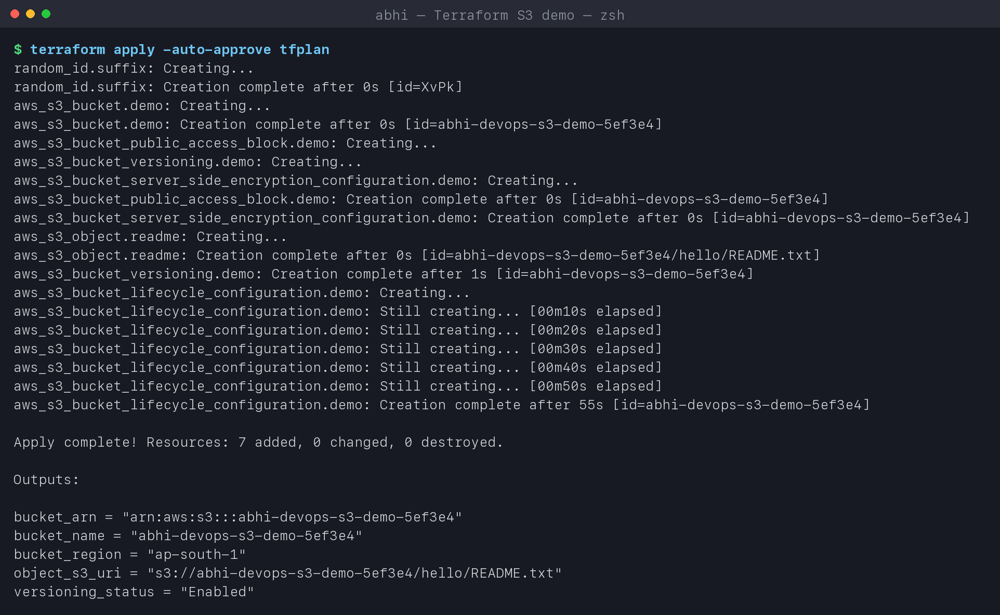

# Terraform & Infrastructure as Code - Homework

**Name:** Abhi Gandhi
**Enrollment Number:** 24bcs10397

| Task | Deliverable |
|---|---|
| 1. Terraform S3 demo - `init`, `fmt`, `validate`, `plan`, `apply`, `show`, `output`, `destroy` | **[terraform-s3-demo/README.md](terraform-s3-demo/README.md)** |
| 2. AWS services research | [01-iam](aws-services/01-iam/README.md) - [02-ec2](aws-services/02-ec2/README.md) - [03-s3](aws-services/03-s3/README.md) - [04-vpc](aws-services/04-vpc/README.md) - [05-dynamodb-rds](aws-services/05-dynamodb-rds/README.md) |

```text
Terraform and Infrastructure as Code/
├── terraform-s3-demo/
│   ├── main.tf  variables.tf  outputs.tf  provider.tf  terraform.tfvars
│   └── README.md            # full workflow with outputs and screenshots
├── aws-services/
│   ├── 01-iam/README.md     # governance
│   ├── 02-ec2/README.md     # compute
│   ├── 03-s3/README.md      # storage
│   ├── 04-vpc/README.md     # networking
│   └── 05-dynamodb-rds/README.md   # databases
├── screenshots/
└── run-labs.sh              # replays the whole Terraform workflow
```

## What Infrastructure as Code means

Infrastructure is described in **version-controlled text files** instead of being clicked
together in a console. The same code always produces the same infrastructure, every change is
reviewed like application code, and `terraform destroy` removes everything it created.

| Concept | In my S3 demo |
|---|---|
| **Provider** - plugin that talks to an API | `hashicorp/aws ~> 6.0`, `hashicorp/random` |
| **Resource** - one piece of infrastructure | 7 resources: bucket, versioning, encryption, public-access block, lifecycle, object, random suffix |
| **Variable** - input | `bucket_prefix` (with validation), `environment`, `owner`, `use_localstack` |
| **Output** - value printed after apply | `bucket_name`, `bucket_arn`, `object_s3_uri` |
| **State** - Terraform's memory of real IDs | `terraform.tfstate` (local; a team would use an S3 backend with locking) |
| **Plan** - diff between code and reality | `Plan: 7 to add, 0 to change, 0 to destroy.` |
| **Dependency graph** | implicit via references (`aws_s3_bucket.demo.id`) + explicit `depends_on` |
| **Declarative** | I describe the end state; Terraform works out create/update/delete order |

The demo ran on **LocalStack** (local AWS API emulator) because my AWS credentials were not
usable; the README explains how the same code targets real AWS with one variable.


