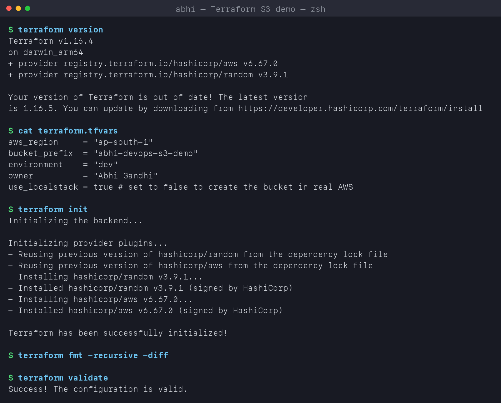
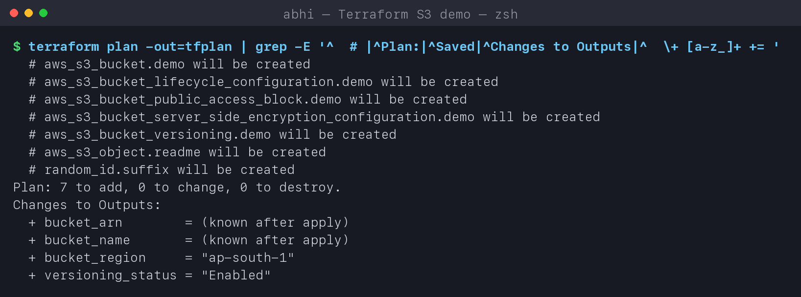
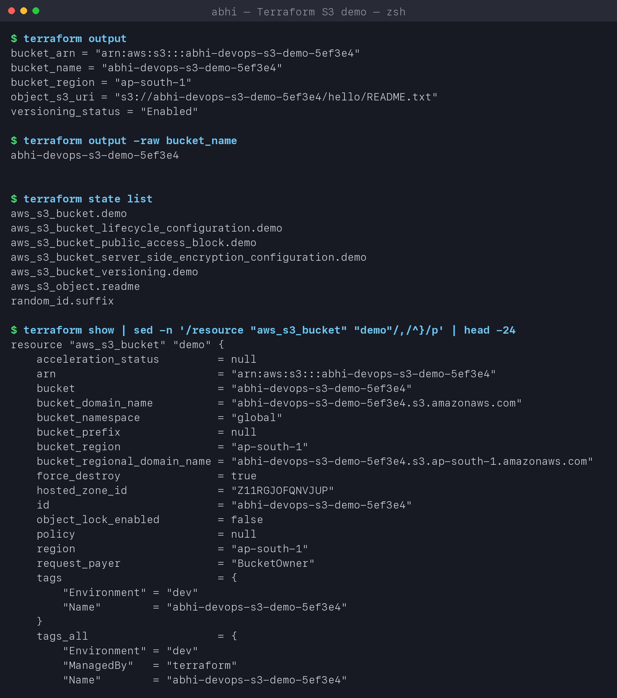
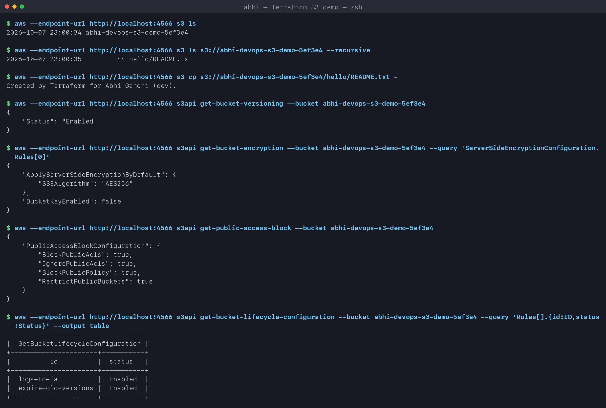
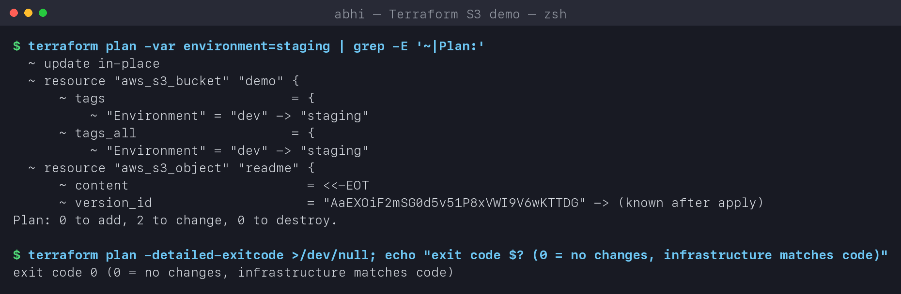
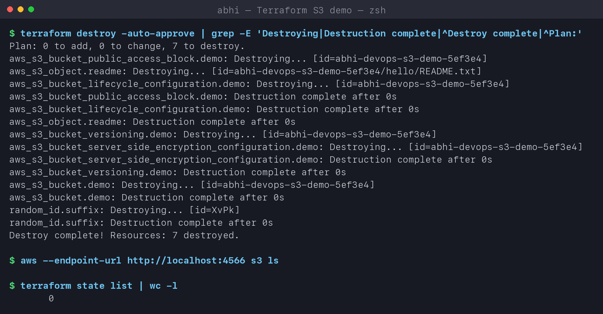

# Terraform S3 Demo

**Name:** Abhi Gandhi
**Enrollment Number:** 24bcs10397

Creates a production-style **private, encrypted, versioned S3 bucket** with Terraform and walks
through the complete workflow: `init -> fmt -> validate -> plan -> apply -> show -> output -> destroy`.

> **Where it ran:** my AWS credentials were not usable for this homework, so I ran every
> command against **LocalStack 4.12**, a local emulator of the AWS APIs running in Docker.
> Terraform, the AWS provider and the AWS CLI make exactly the same API calls; only the
> endpoint is `http://localhost:4566`. Setting `use_localstack = false` in `terraform.tfvars`
> sends the same code to real AWS with no other change (see [Running against real AWS](#running-against-real-aws)).

## Project structure

```text
terraform-s3-demo/
├── provider.tf          # terraform block, required providers, AWS provider (+ LocalStack switch), default tags
├── variables.tf         # inputs with types, defaults and validation
├── main.tf              # bucket + versioning + encryption + public-access block + lifecycle + one object
├── outputs.tf           # bucket name, ARN, region, versioning, object URI
├── terraform.tfvars     # my values
├── .terraform.lock.hcl  # pinned provider versions (committed on purpose)
└── README.md
```

| File | Key points |
|---|---|
| [provider.tf](provider.tf) | `aws ~> 6.0`, `random ~> 3.6`; `default_tags` puts Project/Session/Owner/ManagedBy on **every** resource; a `dynamic "endpoints"` block switches to LocalStack |
| [variables.tf](variables.tf) | `bucket_prefix` has a **validation** rule (3-40 lowercase chars); `use_localstack` is a `bool` |
| [main.tf](main.tf) | S3 settings are separate resources in AWS provider v4+: `aws_s3_bucket_versioning`, `..._server_side_encryption_configuration`, `..._public_access_block`, `..._lifecycle_configuration` |
| [outputs.tf](outputs.tf) | values printed after apply and readable with `terraform output` |

**What gets created (7 resources):**

| Resource | Why |
|---|---|
| `random_id.suffix` | bucket names are global across every AWS account - a random suffix avoids clashes |
| `aws_s3_bucket.demo` | the bucket `abhi-devops-s3-demo-<hex>` |
| `aws_s3_bucket_versioning` | keep old versions of every object (undo overwrites/deletes) |
| `aws_s3_bucket_server_side_encryption_configuration` | encrypt at rest with SSE-S3 (AES256) |
| `aws_s3_bucket_public_access_block` | all four "block public" switches on - the bucket can never become public |
| `aws_s3_bucket_lifecycle_configuration` | `logs/` -> STANDARD_IA after 30 days; old versions expire after 30 days |
| `aws_s3_object.readme` | one object, so there is something to read back |

## The workflow

All commands are replayed by [../run-labs.sh](../run-labs.sh). LocalStack was started with:

```bash
docker run -d --name localstack -p 4566:4566 localstack/localstack:4.12
```

### 1. terraform init / fmt / validate

```text
$ terraform version
Terraform v1.16.4
on darwin_arm64
+ provider registry.terraform.io/hashicorp/aws v6.67.0
+ provider registry.terraform.io/hashicorp/random v3.9.1

$ cat terraform.tfvars
aws_region     = "ap-south-1"
bucket_prefix  = "abhi-devops-s3-demo"
environment    = "dev"
owner          = "Abhi Gandhi"
use_localstack = true # set to false to create the bucket in real AWS

$ terraform init
Initializing the backend...
Initializing provider plugins...
- Reusing previous version of hashicorp/random from the dependency lock file
- Reusing previous version of hashicorp/aws from the dependency lock file
- Installing hashicorp/random v3.9.1...
- Installed hashicorp/random v3.9.1 (signed by HashiCorp)
- Installing hashicorp/aws v6.67.0...
- Installed hashicorp/aws v6.67.0 (signed by HashiCorp)

Terraform has been successfully initialized!

$ terraform fmt -recursive -diff

$ terraform validate
Success! The configuration is valid.
```

| Command | What it does |
|---|---|
| `init` | downloads the providers into `.terraform/`, sets up the backend (local state here). "Reusing previous version ... from the dependency lock file" = the exact versions pinned in `.terraform.lock.hcl` |
| `fmt` | rewrites files in canonical style; **no output = already formatted** (`-check` makes CI fail instead) |
| `validate` | checks syntax, types and references **without** calling AWS |



### 2. terraform plan

```text
$ terraform plan -out=tfplan      (filtered to the summary lines)
  # aws_s3_bucket.demo will be created
  # aws_s3_bucket_lifecycle_configuration.demo will be created
  # aws_s3_bucket_public_access_block.demo will be created
  # aws_s3_bucket_server_side_encryption_configuration.demo will be created
  # aws_s3_bucket_versioning.demo will be created
  # aws_s3_object.readme will be created
  # random_id.suffix will be created
Plan: 7 to add, 0 to change, 0 to destroy.
Changes to Outputs:
  + bucket_arn        = (known after apply)
  + bucket_name       = (known after apply)
  + bucket_region     = "ap-south-1"
  + versioning_status = "Enabled"
```

`plan` compares **code vs state vs real infrastructure** and prints the difference without
changing anything. `-out=tfplan` saves it, so `apply` executes exactly what was reviewed.
`(known after apply)` = values AWS only decides at creation time (the random name, the ARN).



### 3. terraform apply

```text
$ terraform apply -auto-approve tfplan
random_id.suffix: Creating...
random_id.suffix: Creation complete after 0s [id=XvPk]
aws_s3_bucket.demo: Creating...
aws_s3_bucket.demo: Creation complete after 0s [id=abhi-devops-s3-demo-5ef3e4]
aws_s3_bucket_public_access_block.demo: Creating...
aws_s3_bucket_versioning.demo: Creating...
aws_s3_bucket_server_side_encryption_configuration.demo: Creating...
aws_s3_bucket_public_access_block.demo: Creation complete after 0s [id=abhi-devops-s3-demo-5ef3e4]
aws_s3_bucket_server_side_encryption_configuration.demo: Creation complete after 0s [id=abhi-devops-s3-demo-5ef3e4]
aws_s3_object.readme: Creating...
aws_s3_object.readme: Creation complete after 0s [id=abhi-devops-s3-demo-5ef3e4/hello/README.txt]
aws_s3_bucket_versioning.demo: Creation complete after 1s [id=abhi-devops-s3-demo-5ef3e4]
aws_s3_bucket_lifecycle_configuration.demo: Creating...
aws_s3_bucket_lifecycle_configuration.demo: Still creating... [00m10s elapsed]
...
aws_s3_bucket_lifecycle_configuration.demo: Creation complete after 55s [id=abhi-devops-s3-demo-5ef3e4]

Apply complete! Resources: 7 added, 0 changed, 0 destroyed.

Outputs:

bucket_arn = "arn:aws:s3:::abhi-devops-s3-demo-5ef3e4"
bucket_name = "abhi-devops-s3-demo-5ef3e4"
bucket_region = "ap-south-1"
object_s3_uri = "s3://abhi-devops-s3-demo-5ef3e4/hello/README.txt"
versioning_status = "Enabled"
```

**Dependency graph in action:** `random_id` first, then the bucket (its name needs the
suffix), then the four bucket settings **in parallel**. The lifecycle rule waited for
versioning because of the explicit `depends_on` - a noncurrent-version rule on an unversioned
bucket would be rejected. The object waited for encryption (`depends_on`) so it is written
encrypted. The 55s is the AWS provider waiting for the lifecycle configuration to become
consistent, the same as on real S3.


### 4. terraform output, state and show

```text
$ terraform output
bucket_arn = "arn:aws:s3:::abhi-devops-s3-demo-5ef3e4"
bucket_name = "abhi-devops-s3-demo-5ef3e4"
bucket_region = "ap-south-1"
object_s3_uri = "s3://abhi-devops-s3-demo-5ef3e4/hello/README.txt"
versioning_status = "Enabled"

$ terraform output -raw bucket_name
abhi-devops-s3-demo-5ef3e4

$ terraform state list
aws_s3_bucket.demo
aws_s3_bucket_lifecycle_configuration.demo
aws_s3_bucket_public_access_block.demo
aws_s3_bucket_server_side_encryption_configuration.demo
aws_s3_bucket_versioning.demo
aws_s3_object.readme
random_id.suffix

$ terraform show | sed -n '/resource "aws_s3_bucket" "demo"/,/^}/p' | head -24
resource "aws_s3_bucket" "demo" {
    arn                         = "arn:aws:s3:::abhi-devops-s3-demo-5ef3e4"
    bucket                      = "abhi-devops-s3-demo-5ef3e4"
    bucket_regional_domain_name = "abhi-devops-s3-demo-5ef3e4.s3.ap-south-1.amazonaws.com"
    force_destroy               = true
    region                      = "ap-south-1"
    tags                        = {
        "Environment" = "dev"
        "Name"        = "abhi-devops-s3-demo-5ef3e4"
    }
    tags_all                    = {
        "Environment" = "dev"
        "ManagedBy"   = "terraform"
        "Name"        = "abhi-devops-s3-demo-5ef3e4"
        ...
```

`terraform.tfstate` is Terraform's record of what it created (resource -> real ID). `show`
prints it in readable form. Note `tags_all` = my resource `tags` **merged with** the provider's
`default_tags`. `-raw` prints a bare string, handy in scripts (`$(terraform output -raw bucket_name)`).



### 5. Verify with the AWS CLI

```text
$ aws --endpoint-url http://localhost:4566 s3 ls
2026-10-07 23:00:34 abhi-devops-s3-demo-5ef3e4

$ aws --endpoint-url http://localhost:4566 s3 cp s3://abhi-devops-s3-demo-5ef3e4/hello/README.txt -
Created by Terraform for Abhi Gandhi (dev).

$ aws ... s3api get-bucket-versioning --bucket abhi-devops-s3-demo-5ef3e4
{ "Status": "Enabled" }

$ aws ... s3api get-bucket-encryption --bucket abhi-devops-s3-demo-5ef3e4 --query 'ServerSideEncryptionConfiguration.Rules[0]'
{ "ApplyServerSideEncryptionByDefault": { "SSEAlgorithm": "AES256" }, "BucketKeyEnabled": false }

$ aws ... s3api get-public-access-block --bucket abhi-devops-s3-demo-5ef3e4
{ "PublicAccessBlockConfiguration": { "BlockPublicAcls": true, "IgnorePublicAcls": true,
                                      "BlockPublicPolicy": true, "RestrictPublicBuckets": true } }

$ aws ... s3api get-bucket-lifecycle-configuration --bucket abhi-devops-s3-demo-5ef3e4 --query 'Rules[].{id:ID,status:Status}' --output table
+----------------------+-----------+
|          id          |  status   |
+----------------------+-----------+
|  logs-to-ia          |  Enabled  |
|  expire-old-versions |  Enabled  |
+----------------------+-----------+
```

Every setting in the code is really present on the bucket.



### 6. Changing the code, and checking for drift

```text
$ terraform plan -var environment=staging | grep -E '~|Plan:'
  ~ update in-place
  ~ resource "aws_s3_bucket" "demo" {
      ~ tags                        = {
          ~ "Environment" = "dev" -> "staging"
  ~ resource "aws_s3_object" "readme" {
      ~ content                       = <<-EOT
Plan: 0 to add, 2 to change, 0 to destroy.

$ terraform plan -detailed-exitcode >/dev/null; echo "exit code $?"
exit code 0 (0 = no changes, infrastructure matches code)
```

Changing one variable gives a precise **in-place update** (`~`) of just the two resources that
use it - nothing is recreated. `-detailed-exitcode` returns 0 (no diff), 1 (error) or 2 (diff),
which CI can use to detect **drift** (someone changed the bucket by hand in the console).



### 7. terraform destroy

```text
$ terraform destroy -auto-approve | grep -E 'Destroying|Destruction complete|^Destroy complete|^Plan:'
Plan: 0 to add, 0 to change, 7 to destroy.
aws_s3_bucket_public_access_block.demo: Destroying... [id=abhi-devops-s3-demo-5ef3e4]
aws_s3_object.readme: Destroying... [id=abhi-devops-s3-demo-5ef3e4/hello/README.txt]
aws_s3_bucket_lifecycle_configuration.demo: Destroying... [id=abhi-devops-s3-demo-5ef3e4]
...
aws_s3_bucket.demo: Destroying... [id=abhi-devops-s3-demo-5ef3e4]
aws_s3_bucket.demo: Destruction complete after 0s
random_id.suffix: Destroying... [id=XvPk]
random_id.suffix: Destruction complete after 0s
Destroy complete! Resources: 7 destroyed.

$ aws --endpoint-url http://localhost:4566 s3 ls

$ terraform state list | wc -l
       0
```

Destroy walks the graph **in reverse**: settings and the object first, the bucket after them,
the random suffix last. `force_destroy = true` lets Terraform empty the bucket first; without
it, deleting a non-empty bucket fails (a good safety net in production).



## Running against real AWS

```bash
aws configure                      # or export AWS_PROFILE=...
sed -i '' 's/use_localstack = true/use_localstack = false/' terraform.tfvars
terraform init && terraform plan -out=tfplan && terraform apply tfplan
aws s3 ls                          # no --endpoint-url
terraform destroy
```

Minimum IAM permissions: `s3:CreateBucket`, `s3:DeleteBucket`, `s3:Put*`/`s3:Get*` for the
bucket configuration and objects, `s3:ListBucket`. Cost: an empty bucket and one 44-byte
object are effectively free.

## Command summary

| Command | Purpose |
|---|---|
| `terraform init` | download providers, set up backend |
| `terraform fmt` | format code |
| `terraform validate` | static check, no API calls |
| `terraform plan -out=tfplan` | preview and save the changes |
| `terraform apply tfplan` | make exactly the saved changes |
| `terraform show` / `state list` | inspect what Terraform manages |
| `terraform output [-raw name]` | read outputs |
| `terraform destroy` | delete everything in the state |
